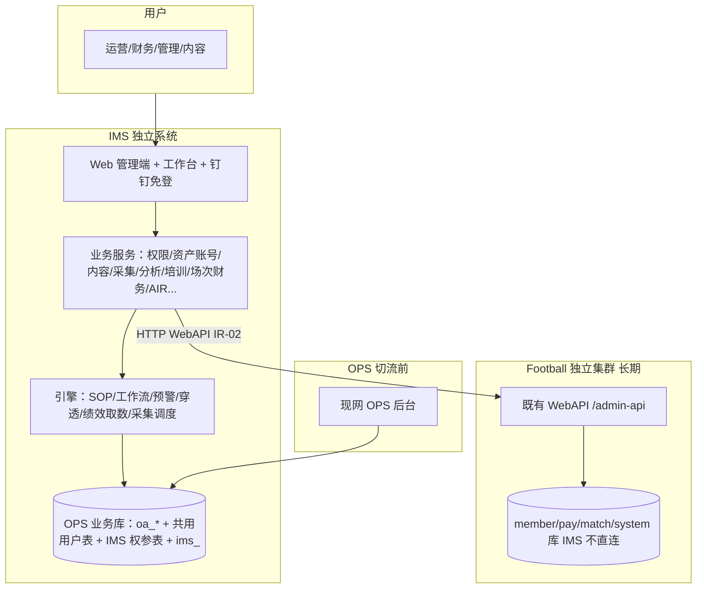

# 神鱼体育 一体化管理系统（IMS）完整产品需求文档

> **文档定位**：IMS **整系统 SSOT 需求**（独立完备系统）。在原 IMS 三期 PRD（V1/V2/V3）与模块 20 AIR PRD 之上，**并入运营数据平台（OPS）M0～M10 全部功能**，并规定与 Football 的边界。  
> **建设铁律**：见 §1.3；切流见 `产品规划/ADR-IMS-001-双轨共享OPS业务库.md`。  
> **字段级细节**：未改写的交互/字段仍以原文档为准——V1/V2/V3 各章 5.x、OPS 各 `PRD-M*`、AIR PRD；**冲突时以本文为准**。  
> **版本**：v2.6.35 ｜ 2026-10-05 ｜ 状态：**开工冻结**（含技术栈 + OPS 并入 UX 以现网为准 · **范围冻结 ADR-IMS-006**）  
> **业务叙事 SSOT**：`产品PRD/IMS-业务用户故事.md`（端到端用户故事 + 用例映射；本文仍为 FR/IA SSOT）  
> **技术栈**：`产品规划/ADR-IMS-009-Python与本地用户.md`（Python + 本地用户；前端仍轻量 Vue；**不用芋道**）  
> **并入 UX**：`产品规划/ADR-IMS-003-OPS并入交互以OPS-UX为准.md`（完整原型 **不是** M2/M6/M8/M10 实现蓝本）

## 版本历史

| 版本 | 日期 | 说明 |
|------|------|------|
| v2.6.35 | 2026-10-05 | **后端改为 Python，用户改为 IMS 本地管理**（ADR-IMS-009）：① 实现语言由 Go/sqlc 改为 **Python 3.11 + FastAPI + SQLAlchemy 2 + Alembic**，API 与 Worker 两个进程；前端仍为 Vue 3 轻量壳；② **用户主数据 = `ims_sys_user`**，IMS 内完整管理，钉钉 SSO 按手机号命中本地用户；③ 上线一次性导入 Football/OPS 用户并**保留来源主键**，之后运行时不读、不写 Football 用户；④ Football HTTP 仅保留方案、订单、赛程等业务调用；⑤ 开发计划见《IMS-Python完整开发计划-20261005.md》 |
| v2.6.34 | 2026-10-05 | **AIR 语义检索移出范围 + 直播数据源定为 `live_room` + 全局分页规范**：① **AIR 知识库正式移出语义检索**（KNOW-003 检索、KB-001 RAGFlow、`experts.assemble.knowledge_context`、错误码 5007/5008 **全部移除**，不再是「延后」），范围锁定为**文件管理**；② **直播数据源确定**——单场「直播数据」Tab 全部字段取 **`live_room` DB 只读**（房间：id/author_id/昵称/头像/live_id/名称/封面/状态 1~5/横竖屏/公开付费加密/起止时间/观看回放推流地址；计数：预约/点赞/`viewer_count`），**不再等待 Football metrics OpenAPI**；③ **《全局开发规范》§2.5 新增前端分页强制条款**——所有管理/列表页必须有分页组件；④ 关系断点 B1–B11 处置决策已确认（详见《IMS-关系断点处置方案-20261005.md》）|
| v2.6.33 | 2026-10-05 | **内容生产导航收敛**（用户决策）：① **「SOP审核」独立子菜单移除** —— SOP 模板**不需要审核**，模板保存后可直接启用/停用；原「待审核任务」Tab / 审核通过 / 驳回 / `sop/review` 端点 / `contentSopReview` 菜单一并下线；② **「全部任务」独立子菜单移除** —— `contentTaskAll` 删除，「全部任务」保留为 **「我的任务」页内 Tab**（我的任务 / 全部任务切换，与 OPS `task/index.vue` 一致），「执行」入口仍仅在「我的任务」；③ 内容生产子菜单由 9 项收为 **§15 表的 7 项**（SOP管理/计划管理/工作任务登记/我的任务/内容管理/公推模板库/内容审核），**与 §15 / §5.5 原表一致**（原型此前多挂 2 项，本次回正）；④ 规格侧：CONTENT-OPS 页面规格侧栏说明 + SOP 操作序列订正，HOME 首页待办去「SOP审核」 |
| v2.6.32 | 2026-10-04 | **AIR 知识库收敛为「文件管理期」（不做检索）**：① **KNOW-003 知识检索** 与 **KB-001 RAGFlow 自建底座** 标注 **延后至检索期**，本期不做搜索/向量化；② 知识底座由「P0 直上 RAGFlow」改为 **IMS 服务端文件目录（新增 **KB-003**，`KbProvider=LOCAL`）**，检索底座选型留待检索期专项 ADR（不预先锁定）；③ §20 知识库信息架构去 **RAGFlow 底座健康卡**，形态 = 库内两级分类树 + 条目表格 + 文件管理（新增/分类管理/上传/从系统转入/审批/授权）；④ **FR-AIR-017/019 订正**（去 `knowledge.search` 语义与 RAGFlow 向量化表述）、**FR-AIR-020 新增**（文件管理期不做检索）；⑤ **AC-AIR-018 订正**、**AC-AIR-019 新增**；⑥ MCP 工具 **6→4**（去 `knowledge.search`/`knowledge.get`，`experts.assemble` 的 `knowledge_context` 本期恒为空数组）；⑦ 规格侧：AIR 页面规格 P3、AIR API 契约（去 `ragflow-check`/`ragflow-health` 端点与检索工具，`ims_kb_doc` 增 `file_key/file_size/content_type`，状态机去 `PARSING`）。**知识域 53→51 端点，AIR 总 51→47** |
| v2.6.31 | 2026-10-04 | **AIR 知识库开放 + 知识分类管理 + 系统资料转入 + 手动上传**：① §20 AIR 主导航由三叶扩为 **四叶**——**知识库**（`/ims/air/kb` · `airKb`）**由 Deferred 改 In Scope**（Key 管理 / 审计监控 仍 Deferred）；② 新增 **知识分类管理**（**库内两级树**：知识库 → 分类/目录，条目挂分类；新增表 `ims_kb_category`）；③ 新增 **系统资料转入**——支持把系统 **培训资料（TRAIN-001）/ 绩效考核模板（PERF）/ 内容记录（CONTENT）** 按 **条目勾选** 转入知识库（720px 抽屉向导，转经入库审批）；④ 新增 **手动上传资料** = **文件 + URL + 粘贴文本** 三方式；⑤ 新增 **FR-AIR-017～019** + **AC-AIR-016～018**，订正 FR-AIR-014/015、AC-AIR-014/015；⑥ 规格侧：AIR 页面规格 P3 扩充（分类/转入/上传）、AIR API 契约 §2.3 知识域扩端点 + 数据表。**知识域 43→53 端点** |
| v2.6.30 | 2026-10-04 | **查询工具 IA 改造：管理优先（列表 + 抽屉向导）**：① §17c 页面形态改「**默认落地 = 查询模板列表** + 新增/编辑 **720px 抽屉 6 步向导**（选类型→基本信息→配置载荷→展示与来源→预览试跑→完成）+ **执行解耦为执行视图**」；旧「查询配置 \| 查询记录」两 L1 Tab **废弃**；② **已发布模板编辑 = 直接改**（PUT 覆盖已发布版本，不另存草稿）；③ FR-QT-002/008/009/011 重写 + **新增 FR-QT-012**（执行与配置解耦）；④ AC-QT-002/006/008 订正 + **新增 AC-QT-009/010**；⑤ 规格侧：QT 页面规格 §0.1/§1/§2/§3.1/§4/§5/§6 + QT API 契约 §3.1「UI 载体」注记。**接口（run / template CRUD / menu-seed）路径与语义不变** |
| v2.6.29 | 2026-10-04 | **查询工具 / 预览与下钻 / 穿透查询 三需求一致性订正**（审查《查询工具与下钻穿透-一致性与完整性审查-2026-10-04》）：① §17c 模式表补 **DRILL 加层 allowlist**、**DRILL run 依赖 P2 多层 JOIN（P0 降级 stub）**、**TRACE 由 QT 服务端一次 run 代行（DC 契约不扩 pathSteps）**、**`queryCostMs` 口径（TRACE 取末步、非相加）**；② **FR-QT-004 去掉「深度」**（`pathSteps[]` 唯一权威 · depth 由步数推导）；③ FR-QT-003/005 同步；④ 规格侧订正：QT 页面规格 §4 类型 `trace.depth`→`pathSteps[]`（D7）+ §0.1 边界（C1）+ §5 U5 口径（D5）；QT API 契约 §2.2 **消除 §2.2↔§3.2 自相矛盾（C2）** + §2.3 D1/D3 + §3.2 D5；DC 契约 §2.1.2 **单步入参（D2）**；DC/BI 页面规格 **路由前缀统一 `/ims/*`（D6）** 并修 P4 路由/菜单矛盾 |
| v2.6.28 | 2026-10-04 | **权限模型收敛（ADR-IMS-008）**：① **角色（SYS-002）= 权限唯一载体** —— 吸收原 AUTH-003 岗位模板的权限明细（功能点/**菜单权限码 R/W/D** + **数据范围 `dataScope`** + 钉钉岗位绑定），消除「角色菜单权限码」与「岗位模板功能点 R/W/D」**两套并行矩阵**；② **岗位模板（AUTH-003）降级为「岗位 → 角色 自动供给规则」**（保留版本管理与审计 · 原 POS-R2）；③ **钉钉同步岗位无对应角色时自动建角色**（采纳）＋ 护栏：**fail-closed 空权限** / `source=DINGTALK_AUTO` / `PENDING_CONFIG` / 进 R1 待办 / 1:1 唯一 / 幂等 / 归档 / 审计；④ 用户权限判定只走**角色并集**；⑤ 岗位编码 `dict_position`/`positionCode` 仍为外部契约不变。落在 §4.1/§4.2 订正 + §01 AUTH-003 重定义 + FR/AC-AUTH-019~022 |
| v2.6.26 | 2026-10-03 | **17b 报表设计升级为三栏可拖拽设计器**（对标 `DW-PRD-Phase1.md` §9.9 + `DW-UI-Prototype-Phase1.html` `bi-designer`/`bi-list`/`bi-publish`）：① P1 自助报表设计器由「行/列/值/筛选**表单式** + 静态画布预览」升级为 **三栏自由拖拽画布**（左：数据集/字段/**组件库四类 21 组件**；中：画布 40px 栅格 + **图层面板**；右：**属性三区** 基础/数据源/交互）；② 新增 **组件级数据源 + 动态参数 `${compId.field}`**、**组件联动（含循环依赖检测）**、**跳转四类目标**、**自动刷新 ≥30s**；③ 报表管理列表补 **分类树 + 卡片/列表双视图 + 自动缩略图 + 复制 + 导入导出 JSON 模板 + 分类管理**；④ P3 订阅与分享新增 **发布管理 Tab**（发布链接 **密码 + 有效期 7~30 天 + 版本快照 + 访问统计**）；⑤ **原 non-goal 三项（50 组件自由拖拽画布 / 发布链接密码有效期 / 导入导出 JSON）改判为已采纳**，落点 17b（BI0 规格 §DW 借鉴落地同步订正）；⑥ 全屏大屏多终端（PC/TV/移动）。验收：原型断言全绿 · 113 页 0 错误。详见《BI-数据分析-页面规格》§10 |
| v2.6.25 | 2026-10-03 | **DW（Lite DW）借鉴落地**：数据决策四域（指标管理 / 自定义查询 / 标准报表 / 指标分析）按 `参考文件/DW-PRD-Phase1.md` §9.7~§9.9 + `DW-UI-Prototype-Phase1.html` 对标修正 — ① 八张标准报表 **逐张差异化**（KPI/明细列/图表）并补 **统一筛选条**（IP 组树+平台+日期范围+**时间维度 DAY/WEEK/MONTH**）+ 导出 PDF；② 指标管理补 **分类 / 计算频率** 列与表单字段（分类树/结果历史/调度仍 **non-goal**）；③ 自定义查询补 **分组 / 排序 / 结果行数限制 + SQL 复制**，结果图表 Tab 真渲染；④ 指标分析 **趋势 Tab 真图表**；⑤ 大屏配置 widget 覆盖 **KPI/STAT/CHART/LIST** 四类。验收：原型断言 **78/78** · 113 页 0 错误；详见《BI0-指标查询报表-页面规格》§DW 借鉴落地 |
| v2.6.24 | 2026-10-03 | **CONTENT 计划管理** 去掉「营销计划 1:1 SOP」区（CONTENT-101 并入 CONTENT-100 · SOP 管理）；计划管理仅保留 **计划向导/列表**（CONTENT-102，P-M2-011）；对齐 `UX-M2` §9（无营销计划区）；原型 `contentPlanTab` 同步 |
| v2.6.23 | 2026-10-02 | **QT MenuSeed**：FR-QT-007/010 设计+原型 **In Scope**（`menu-seed` API + 原型侧栏 mock）；生产 `system_menu` seed 归实现切片，**非**文档缺口 |
| v2.6.22 | 2026-10-02 | **OPS Vue 已检入 wd**：原型 `contentPlan`/`collectTask`/`contentLayout` 对齐 `plan/index.vue` · `collect/task.vue` · `layout-template/index.vue` 行内状态机；四域页面规格 §操作序列 修正「本地缺失」为真实路径；详见各 `*-页面规格.md` §操作序列 |
| v2.6.21 | 2026-10-02 | **OPS 实现对照**：内容/采集/竞品/BI0 四域补 Vue+Controller+API 索引（规格 §OPS 前后端对照）；竞品作品「全部」对齐 IMS BFF 读库；采集任务补 启动/停止；自定义查询删除仍为 OPS 前端演示 |
| v2.6.20 | 2026-10-01 | **《IMS-业务用户故事》v1.1**：L3 全量 87 条（分册 A～F + QT 专册）；`IMS-故事用例对照核验-20261001.md`；各模块 `TESTCASES-IMS-*` 按故事 ID 补 P0 |
| v2.6.19 | 2026-10-01 | **CONTENT** 任务执行全页、amphipoda 玩法区、审核 LayoutViewer 只读、附件上传 IMS API、OPS→IMS 对照 — 《CONTENT-OPS并入补充-*》+ ADR-IMS-003 §5 |
| v2.6.18 | 2026-10-01 | QT **B2 同步 run**；CONTENT IMS API canonical；**SYS-008 租户套餐** + ADR-IMS-007；DC-002 菜单 **利润反查** `/ims/fin/profit-trace` |
| v2.6.17 | 2026-10-01 | **拍板包**：ADR-006 范围冻结；ADR-005 绩效状态；ADR-004 AI 出卷；REPORT 去重键+1127 级联；COMP 作品 ALL=IMS 读库；CORP `dict_asset_type`；QT MenuSeed In Scope；《IMS-技术设计总册-20261001》 |
| v2.6.16 | 2026-10-01 | 查询工具 UX 修正：L1 仅 **查询配置 \| 查询记录**；DRAFT/PUBLISHED 为 **同一列表 status + 筛选**（非两个 Tab）；FR-QT-008～010 + AC-QT-006/007 对齐 |
| v2.6.15 | 2026-09-30 | 查询工具 **模板闭环**：页顶 Tab **查询配置 \| 已保存 \| 已发布**；草稿/已发布列表 **执行·编辑·发布/取消发布·删除**（对齐 bi0Query 我的查询）；FR-QT-008～011 + AC；API 契约 §3.1 增补 unpublish/delete |
| v2.6.14 | 2026-09-30 | 用户走查 **#18**：**数据分析** 新增 L3 **查询工具**（`/ims/analysis/query-tool` · QT-001）；P0 模式 **DRILL + TRACE**（**FLAT 默认隐藏**）；保留自定义查询/预览与下钻/穿透查询/组织人效；FR-QT-001～007 + AC；规格《QT-查询工具-*》 |
| v2.6.27 | 2026-10-04 | 用户走查 **#21**（报表域 IA 重构）：① 「**标准报表**」更名「**报表中心**」（`bi0Report`，勿与 17b「报表管理」混淆）；② **报表管理 + 报表设计合并为单菜单** —— 侧栏「**数据报表**」仅两叶（报表管理 `biList` / 报表中心 `bi0Report`），**报表设计 `biDesign` 转隐藏路由**（`/ims/bi/report/designer`），编辑/新增报表由「报表管理」进入设计器；③ **大屏归为报表类型** —— `bi0Screen`「大屏配置」独立菜单**退役**（归一化到 `biList`），新建时以 `reportType` pills 选 **报表/大屏**（大屏 = `dashboard`）；**发布去向二选一** —— 发布到**报表中心**或**单独发布为菜单**（写 `sys_menu` + `ims_report_menu`）；④ 自定义查询结果「**图表展示**」Tab 修复：**执行抽屉与内联页双容器重绘** + 图表类型 **柱/折/饼** 切换（补 `bi0SvgLine` 折线图、`bi0-chart-stage` 容器） |
| v2.6.13 | 2026-09-30 | 用户走查 #17（深化）：**数据决策** 下 **四 L2** — **数据报表 / 数据指标 / 数据分析 / 预警中心**；标准报表+大屏入报表组；自定义查询+穿透+组织人效（页内三 Tab）入分析组；预警处置记录合入实时预警 Tab；兼容 `bi0Standard`/`bi0ScreenConfig`/`go('bi0'|'bi'|'eff'|'alert'|…)`；详见 §17 导航总表 v2 |
| v2.6.12 | 2026-09-30 | 用户走查 #17：**数据决策** 组 IA 重组 — **指标报表 / 自助分析 / 穿透查询 / 组织人效 / 预警中心** 五 L1；前四组除 DC 外可展开 L2 叶子（废止 bi0/bi/eff/alert 单页 Tab）；bi 场次/作品 Tab、eff IP 组 Tab 迁出；详见 §数据决策组 与《IMS-数据决策-IA梳理与重组-20260930》 |
| v2.6.11 | 2026-09-30 | 用户走查 #15：**系统与权限** L1 下 **权限管理 / 系统管理** 可展开 L2（`nav-sub-g`）+ L3 叶子；废止单页 `auth`/`sys` Tab 混排；`go('auth'|'sys')` 兼容重定向；**不出** 租户套餐/独立数据权限 L3（无 IMS SSOT） |
| v2.6.10 | 2026-09-30 | 用户走查 #14：**AI 资源中心** 侧栏仅保留 **技能库 / 专家库 / 模型与提示词**；**知识库、Key 管理、审计监控** 本期 **Out of Scope**（不出菜单、不新开切片）；《IMS-模块20-AI资源中台PRD》与 AIR 页面/API 规格 **保留** 全文，标 **Deferred** |
| v2.6.9 | 2026-09-30 | 用户走查 #10（续）：**09 数据上报** 填报单须 **AuthorSelect（作者）+ AccountSelect（平台账号）** 必填；与 MEET 日报分离不变；作者 SSOT=`author_user.id`（ADR-051），账号 SSOT=M4 `oa_account` |
| v2.6.8 | 2026-09-29 | 用户走查 #13：**数据决策** 侧栏 L1 由「数据中心」改为 **「穿透查询」**（模块 12 · DC 不变），**仅 DC-001**；废止原型「数据同步 / 数据字典」Tab；DC-002/003 能力保留、**菜单迁出**（见 §12） |
| v2.6.7 | 2026-09-29 | 用户走查 #12：**绩效考核** 可展开二级目录（考核方案 / **执行考核** / 考核结果 + 在线考试第四叶）；主路径对齐 OPS M3；状态机与 IMS PERF-002 **BLOCKED** 见《PERF-绩效考核-API契约》§3 |
| v2.6.6 | 2026-09-29 | 用户走查 #11：**培训管理** 可展开二级目录（培训资料库 / 学习任务 / 完成率统计）；学习任务关联资料库多选 + **AI 生成试卷**（产品能力 · API **BLOCKED** 见 ADR-IMS-004） |
| v2.6.5 | 2026-09-29 | 用户走查 #10：**日报中心**（03 MEET 日报域）与 **数据上报**（09 REPORT）拆为协同组下两个可展开二级目录；废止单页混 Tab |
| v2.6.4 | 2026-09-29 | 用户走查 #9：**竞品库**并入 **日常运营 → 竞品分析**（第三叶）；废止 **数据决策** 下独立「竞品库」顶级 |
| v2.6.3 | 2026-09-29 | 用户走查 #8：一级 **公司资产**（账号/资源/设备 L2 + 14 个 L3 路由）；废止「资源与账号」四顶级 |
| v2.6.2 | 2026-09-29 | 用户走查 #7：日常运营新增侧栏 **内部分析**（内部作品/内部账号 + Tab）；MON 仅 IP 主题/行业 |
| v2.6.1 | 2026-09-29 | 用户走查 #6：日常运营新增侧栏 **竞品分析**（竞品作品/竞品账号 + Tab）；外部 M7 从作品监测拆出 |
| v2.6 | 2026-09-29 | OPS 并入模块交互以现网 UX 为准；完整原型 bi0/content/collect 不可验收 |
| v2.5 | 2026-09-29 | 冻结实现栈：Go + sqlc + 轻量 Vue；AI/jingcai 允许 Python 旁路进程 |
| v2.4 | 2026-09-29 | 开工冻结：V1 全做完；IMS 自建钉钉组织同步；SSO 必须绑手机；加列人工运维；ROI 与场次利润两菜单 |
| v2.2 | 2026-09-29 | 共用用户主键、DDL 只增不减、参数改则同步（已被 v2.3 切流口径覆盖双写部分） |
| v2.0 | 2026-09-28 | 首版完整 IMS：合并原 IMS 20 模块 + OPS 全量 + Football WebAPI 边界 |

## 依据文档

| 类型 | 文档 |
|------|------|
| 业务叙事 | **`IMS-业务用户故事.md`**（谁如何走完闭环；映射 `delivery/TESTCASES-IMS-*`） |
| 原 IMS | `IMS第一期PRD-V1.md`、`IMS第二期PRD-V2.md`、`IMS第三期PRD-V3.md`、`IMS-模块20-AI资源中台PRD-V1.md` |
| 规划 | `IMS产品规划-整体版-v4.md`、`IMS附录-OPS与Football迁移升级边界.md`、`ADR-IMS-001`、`ADR-IMS-002`、`ADR-IMS-003`、`ADR-IMS-008` |
| OPS | `docs/product/PRD-业务版-v9.2.md` 及 PRD-M0～M10 |
| 规范 | `共享技术规范-数据库与API.md`、`共享技术规范-分期技术约束.md`（Feign/`@DS`/芋道运行时 **作废**，改 ADR-IMS-001/002） |

---

# 1. 产品概述

## 1.1 背景

神鱼体育同时存在三套能力：

- **Football**：会员、作者方案、比赛、支付订单、营销 IM、C 端；后台用户体系在 `shenyu-system`。
- **OPS（运营数据平台）**：以 IP 组为核心，已实现账号资产、内容 SOP/任务、采集监测、指标查询、账号 ROI、系统参数等（PRD v9.2）。
- **IMS（规划）**：钉钉 SSO、账号领用归还、直播场次台账、培训会议、工作流、场次财务、穿透查询、AI 中台等。

原 IMS PRD 将 06/07/08/16/17/18/19 记为「已完成」，实际宿主是 **OPS 进程 + Football 登录**。本文件规定：**IMS 作为另一套独立应用** 承接运营管理；**现网 OPS 继续跑到 IMS 验收通过，然后切 IMS、停 OPS**；**Football 长期保留**，只通过 HTTP 提供交易/分发数据。

## 1.2 产品定位

IMS 是神鱼体育 **唯一运营与一体化管理后台**：

| 对象 | 价值 |
|------|------|
| 管理层 | 人岗权、资产账号、直播场次、成本利润、人效一屏可溯 |
| 运营/内容/财务 | 日常工作全部在 IMS 完成，无需再进 OPS |
| 系统 | 独立应用与网关；业务数据用现网 OPS 库（不搬库）；Football 为外部数据源 |

**不做**：C 端 App/H5 会员交易、Football 方案前台阅读、支付清结算引擎（仍在 Football，IMS 用 WebAPI 读或约定写回）。

## 1.2.1 业务用户故事（叙事 SSOT）

功能清单与 FR/AC 以本文各章为准；**端到端业务怎么跑**（配置→发布→使用→撤销等）见 **`产品PRD/IMS-业务用户故事.md`（v1.1 索引 + 分册 `IMS-业务用户故事-*.md` + QT 专册）**。验收叙述用例在 `一体化管理/delivery/TESTCASES-IMS-*.md`，与故事 ID 一一引用。

## 1.3 建设铁律（BR 级强制）

| 编号 | 铁律 | 需求含义 |
|------|------|----------|
| **IR-01** | IMS 独立系统 | 独立**应用**、网关 `/admin-api/ims/`。业务数据源 = **现网 OPS 库**，不复制业务表。 |
| **IR-02** | Football 仅 HTTP | 复用现网已验证路径（见 `FB-Football-WebAPI适配.md`）。禁止 OpenFeign、JDBC `@DS` 连 member/pay/match/system。 |
| **IR-03** | 切流停 OPS | M0～M10 在 IMS 内完整提供。**禁止调用 OPS HTTP**。IMS 验收通过后 **停 OPS**，无长期双写。 |
| **IR-04** | 表结构只扩展 | 可加列，禁止删列/减字段。新建用 `ims_*`。 |
| **IR-05** | 功能完备 | 运营闭环不依赖 Football 后台。 |
| **IR-06** | 用户主键连续 | 登录与 `oa_*` 人员 FK = **`ims_sys_user.id`**（ADR-IMS-009）。上线导入 Football/OPS 用户时保留来源主键。SSO 必须已绑定手机，按 `mobile` 命中本地用户。角色菜单参数 IMS 自管。 |

## 1.4 核心业务规则（汇总）

原 V1 BR-001～018、V2 BR-101～117、V3 BR-201～214、AIR 成功指标 **全部继承**，冲突时 IR-* 优先。补充：

| 编号 | 名称 | 规则 |
|------|------|------|
| BR-301 | WebAPI 超时 | 调用 Football 默认 5s，可配置；失败重试≤3，写操作须幂等键 |
| BR-302 | 营收口径 | 账号 ROI 营收来自 `page-for-ops`（**authorId**）；场次利润来自下播 GMV。**两个菜单分开展示**，禁止混在一个未标注数字里 |
| BR-308 | SSO 绑手机 | 钉钉换票后须能用手机号命中 `ims_sys_user`；未绑手机不得进入 IMS |
| BR-303 | 内容同步 | IMS 保存内容成功后异步调 Football WebAPI 写方案；删除草稿须调删除/下架 API，失败进补偿队列 |
| BR-304 | 采集归属 | 采集任务、登录凭据、作品明细仍在 **现网 OPS 业务库**（IMS 直连该库，不经 OPS 服务）；平台侧若只在 Football 有数则 WebAPI 拉取落该库 |
| BR-305 | 权限四级 | 全部 / 本部门 / IP 组 / 仅本人（沿用 OPS BR-006），与钉钉部门映射后仍生效 |
| BR-306 | 敏感加密 | 证件号、手机号、Cookie、采集密码 AES-256（沿用 OPS） |
| BR-307 | 业务错误 | 并入模块业务错误码保持 1500～1504 语义或映射到 IMS 5xxx，前端提示不倒退 |

## 1.5 范围总表

**在范围内**

- 原 IMS 01～20 全部功能点（含 AIR 20 点）
- 原 OPS：首页、运营（IP 组/作者/账号粉丝作品分析/人效）、内容（SOP/计划/任务/工作任务/内容/AI/排版/模板库/知识库）、绩效模板执行、账号资产六实体、账号成本与 ROI、指标/8 张报表/自定义查询/大屏、作品监测、采集配置、系统参数字典日志消息、采集任务与质量
- 运营 **用户表与 OPS 共用**；角色菜单字典参数在 IMS **自管**；业务字典值域与现网兼容
- Football WebAPI 适配：方案、赛程、订单汇总、作者只读、可选直播房间查询

**范围外**

- Football 会员增长、优惠券、C 端支付收银台、营销 IM 会话、比赛赛程主数据维护（IMS 只读）
- 独立做第二套账号登记（必须并入 OPS M4 后扩展）

---

# 2. 产品逻辑架构

| 层 | 职责 |
|----|------|
| 表现层 | IMS 后台（钉钉 SSO）；切流前 OPS 仍为生产入口 |
| 业务服务 | IMS 内实现 OPS 功能 + 新建服务，**无 OPS Client** |
| 集成层 | `FootballWebApiClient`（HTTP），超时/鉴权/幂等/审计 |
| 数据层 | **业务表 = 现网 OPS 库**（共享、只扩展）；IMS SYS 自管表；禁止 JDBC 连 Football 库 |

---

# 3. 功能架构

## 3.1 模块全景（建设类型）

| 编号 | 模块 | 来源 | 建设类型 | 期次 |
|------|------|------|----------|------|
| 00 | 首页工作台 | OPS M0 + AUTH-004 | 并入+扩展 | V1 |
| 01 | 权限与系统管理 | 共用用户表 + 钉钉 SSO；角色菜单参数 IMS 自建 | 用户共享 + SYS 分管 | V1 |
| 06 | 证件档案 | IMS CERT + OPS 实名人 | 并入+扩展 | V1 |
| 07 | 资产管理 | IMS ASSET + OPS 公司/手机/卡 | 并入+扩展 | V1 |
| 08 | 账号管理 | IMS ACCT + OPS 平台/个人账号 | 并入+扩展 | V1 |
| 19a | IP 组 | OPS M1 / IMS 19 已有部分 | 并入 | V1 |
| 10 | 直播管理 | IMS LIVE 新建 | 新建 | V1 |
| 15 | 内容生产 | OPS M2 并入 + IMS CONTENT 升级 | 并入+扩展 | V1 |
| 16 | 数据采集 | OPS M8/M10 | 并入 | V1 |
| 18 | 作品监测 | OPS M7 | 并入 | V1 |
| 17a | 指标与自定义查询 | OPS M6 已有 | 并入 | V1 |
| 02 | 培训管理 | IMS TRAIN | 新建 | V2.1 |
| 03 | 会议日报 | IMS MEET | 新建 | V2.1 |
| 09 | 数据上报 | IMS REPORT | 新建 | V2.1 |
| 14 | 工作流 | IMS FLOW | 新建（不替代 SOP） | V2.1 |
| 20 | AI 资源中台 | AIR + OPS AI 配置收编 | 新建+收编 | V2.2 |
| 05 | 绩效考试 | IMS PERF + OPS M3 | 并入+扩展 | V2.3 |
| 13 | 预警中心 | IMS ALERT + OPS 通知/监测规则 | 新建框架+并入规则 | V2.3 |
| 11 | 场次财务 | IMS FIN | 新建 | V3 先行 |
| 08b | 账号财务 | OPS M5 | 并入 | V1（与账号同期） |
| 04 | 竞品管理 | IMS COMP（流程）+ OPS 外部监测（数据） | 新建流程+并入监测 | V3 |
| 12 | 穿透查询 | IMS DC | 新建查询层（侧栏 L1 名；原「数据中心」） | V3 |
| 17b | 自助报表/下钻/订阅 | IMS BI 增量 | 新建 | V3 |
| 19b | 人员归属与人效盘点 | IMS EFF + OPS 人效 | 并入+扩展 | V3 |

## 3A. 功能点清单（完整）

> API 统一前缀 `/admin-api/ims/`。并入 OPS 的路径可保留原资源名（如 `/ops/content` 迁为 `/ims/content`），**禁止运行时打到 OPS 服务**。

### 00 首页 HOME

| 编号 | 名称 | P | 说明 |
|------|------|---|------|
| HOME-001 | 运营仪表盘 | P0 | IP 组筛选、核心指标、图表、待办、快捷入口（OPS M0） |
| AUTH-004 | 个人工作台 | P0 | 数据卡片 + **待办中心** + **消息中心**（首页各预览 10 条，「查看更多」进二级列表）；不含快捷入口（快捷入口保留在 HOME-001 运营看板） |

### 01 权限与系统管理 AUTH / SYS

| 编号 | 名称 | P | 说明 |
|------|------|---|------|
| AUTH-001 | 钉钉 SSO | P0 | 扫码/免登换 IMS Token；**须绑定手机** |
| AUTH-002 | 组织架构同步 | P0 | **IMS 自建**钉钉事件+全量对账，不依赖 Football 通讯录产品 |
| AUTH-003 | 岗位-角色供给规则 | P0 | **ADR-IMS-008**：原「岗位模板（岗位-权限矩阵）」→ **岗位 → 角色 自动供给规则**（保留版本）；权限明细迁入 **SYS-002 角色** |
| SYS-001 | 用户管理 | P0 | **共用运营用户表**；钉钉/手机对齐；部门树 |
| SYS-002 | 角色权限 | P0 | **角色 = 权限唯一载体**（ADR-IMS-008）：角色-菜单权限码 **+ 功能点 R/W/D + 数据范围 + 钉钉岗位绑定**；兼容 `ops:*` 权限码 |
| SYS-003 | 菜单管理 | P0 | IMS 菜单树（原运营菜单迁入） |
| SYS-004 | 字典管理 | P0 | 系统字典+业务字典合并 |
| SYS-005 | 系统参数 | P0 | key 不改（含 jingcai 开关、审核角色、钉钉、AIR 白名单） |
| SYS-006 | 操作/登录日志 | P0 | 新日志写 IMS |
| SYS-007 | 消息通知 | P1 | 站内信+钉钉；事件去重 |
| SYS-008 | 租户套餐 | P0 | 租户列表 + 分配套餐；对齐 OPS FR-M9-003 · ADR-IMS-007 |

### 06 证件 CERT + 实名人

| 编号 | 名称 | P |
|------|------|---|
| MASTER-001 | 实名人 CRUD（含中介人、加密证件） | P0 |
| CERT-001 | 档案存储与索引 | P0 |
| CERT-002 | 到期预警 T-30/T-7/T-0 | P0 |
| CERT-003 | 分级水印 | P0 |

### 07 资产 ASSET + 公司/设备

| 编号 | 名称 | P |
|------|------|---|
| MASTER-002 | 公司管理（公众号容量） | P0 |
| MASTER-003 | 手机设备管理 | P0 |
| MASTER-004 | 手机卡管理 | P0 |
| ASSET-001 | 正向穿透 | P0 |
| ASSET-002 | 反向穿透 | P0 |
| ASSET-003 | 登记关联校验 | P1 |

### 08 账号 ACCT

| 编号 | 名称 | P |
|------|------|---|
| MASTER-005 | 平台账号 CRUD（强关联选择器：公司/实名人/手机/IP 组） | P0 |
| MASTER-006 | 个人账号（企微/个微）及三方关联 | P0 |
| ACCT-001～005 | 领用/流转收回/离职归还/冲话费/时间线 | P0/P1 同 V1 |

### 19a IP 组 IPG

> **交互 SSOT**：OPS `UX-M1` P-M1-001、`PRD-M1` FR-M1-001～006；IMS 页面规格 `产品规格/V1/IPG-IP组运营-页面规格.md`；ADR-IMS-003。

| 编号 | 名称 | P |
|------|------|---|
| IPG-001 | IP 大组/小组树 CRUD（左树右详情：基本信息 / 成员管理 / 关联作者 / 统计；组内账号 Tab 与 OPS 对齐） | P0 |
| IPG-002 | 成员与岗位分配（`dict_position`） | P0 |
| IPG-003 | 账号绑定 IP 组（仅小组） | P0 |
| IPG-004 | 作者管理（独立列表 + 组内关联作者） | P0 |
| IPG-005 | 账号/粉丝/作品/内部内容分析（含补录） | P0 |

### 08b 账号财务 COST（OPS M5，V1 必有）

| 编号 | 名称 | P |
|------|------|---|
| COST-001 | 采购成本与过程成本 | P0 |
| COST-002 | 账号/IP 组/公司/人员 ROI（营收走 Football 订单 WebAPI） | P0 |

### 10 直播 LIVE（新表 · **场次中心 IA**）

**主维度 = 直播场次**（`ims_live_session` / `session_code`），非账号列表或分散台账页。默认入口：**场次列表 → 单场详情**（Tab：基本信息｜直播数据｜风控登记｜下播与 GMV｜关联资产/告警摘要）。

LIVE-001～004 能力均 **挂接到单场详情或从场次列表下钻**，另保留待录入督办队列（LIVE-002）、风险告警（LIVE-003）、台账导出/历史补录（LIVE-004）为二级菜单。

Football 直播间 **数据源确定（v2.6.34）**：IMS 维护场次主数据 + 可空 `football_room_id`（= Football **`live_room.id`**）；**单场「直播数据」Tab 全部字段直连只读 `live_room`**（ADR-IMS-001 共用业务库，**不用 Feign/HTTP**）——房间字段：`id`、`author_id`（含作者昵称/头像）、外部直播间号 `live_id`、名称、封面、**状态（1 未开始 / 2 直播中 / 3 已结束 / 4 过期 / 5 暂停）**、横竖屏、公开/付费/加密、开始与结束时间、观看/回放/推流地址；计数：预约人数、点赞数、**观看人数 `viewer_count`**。**不再等待 Football metrics OpenAPI**，无需 `metrics` HTTP；下播录入与 `ims_live_data_snapshot` 承载手工/COLLECT 与 GMV。M6 作者×日期时长聚合与单场 Tab **无关**（见 `FB-Football-WebAPI适配.md` §2）。

场次 ID 规则 BR-011。FK 使用 **并入后账号原主键**。

### 15 内容 CONTENT（OPS M2 并入 + IMS 升级）

**信息架构（v2.6+）**：内容域采用 **侧栏二级目录「内容生产」+ 子菜单**（独立路由），与 **10 直播管理** 在「日常运营」下并列，**禁止**将 SOP/计划/任务/内容/模板/审核挂在直播模块或直播 Tab 下；**禁止**单页多 Tab 叠放 OPS 主路径与 IMS ComfyUI/选题/发布轨。对齐 `UX-M2-内容生产.md` + amphipoda 增量 + 工作任务 PRD。交互 SSOT：**ADR-IMS-003**。**API/写 SSOT（2026-10-01）**：IMS 表 + **`/admin-api/ims/content/**`**；OPS `/oa/*`、`/ops/content/*` 仅 UX/迁移参照（见 CONTENT-OPS 补充契约）。

| 子菜单（IMS 导航） | 编号 | P |
|-------------------|------|---|
| SOP管理 | CONTENT-100、CONTENT-001 | P0 |
| 计划管理 | CONTENT-102 | P0 |
| 工作任务登记 | CONTENT-104、CONTENT-105 | P0 |
| 我的任务 | CONTENT-103 | P0 |
| 内容管理 | CONTENT-106、107、109、110；**内嵌** CONTENT-004 AI 视频脚本/成片 | P0 |
| 公推模板库 | CONTENT-107（模板 CRUD） | P0 |
| 内容审核 | CONTENT-005 | P0 |

| 编号 | 名称 | P | 来源 | 导航 |
|------|------|---|------|------|
| CONTENT-100 | SOP 模板 DAG/并行/节点类型/文档类型/营销计划绑定 | P0 | OPS ADR-074 | SOP管理 |
| CONTENT-102 | 计划管理（计划向导/列表） | P0 | OPS | 计划管理 |
| CONTENT-103 | 任务管理与完成门禁 | P0 | OPS ADR-079 | 我的任务 |
| CONTENT-104 | 工作任务登记/合并执行/确认出任务/撤回 | P0 | OPS ADR-074/075/077 | 工作任务登记 |
| CONTENT-105 | 自动建草稿；jingcai 是否自动生成由参数控制 | P0 | OPS | 工作任务登记 |
| CONTENT-106 | 内容 CRUD、玩法/matchScheme、审核提交 | P0 | OPS | 内容管理 |
| CONTENT-005 | 在线审核（可配置级数） | P0 | OPS+IMS | 内容审核 |
| CONTENT-001 | 执行标准级 SOP（节点标准+交付物+质量清单） | P0 | IMS 升级 | SOP管理 |
| CONTENT-002 | 选题计划 | P1 | IMS | 不出主导航 |
| CONTENT-003 | AI 辅助脚本 | P1 | IMS/OPS | 内嵌内容管理（AI 视频脚本） |
| CONTENT-004 | AI 短视频生成 | P0 | IMS | 内嵌内容管理（非独立 ComfyUI 主导航） |
| CONTENT-006 | 发布归档 | P0 | IMS | 不出主导航（P2/SOP 发布节点） |
| CONTENT-107 | AI 语义排版/一键排版/公推模板库 | P0 | OPS | 内容管理 + 公推模板库 |
| CONTENT-108 | 内容知识库 | P1 | OPS | 不出主导航（或 AIR 知识库域） |
| CONTENT-109 | Football 方案同步（WebAPI） | P0 | 替代原 Feign | 内容管理 |
| CONTENT-110 | 删除内容同步下架/删草稿（WebAPI） | P0 | 补原缺口 | 内容管理 |

#### OPS 实现对照（内容生产 · 2026-10-02）

运营在 IMS 侧栏走完的路径与现网 OPS 一致：**工作任务登记** → 矩阵 **确认出任务** → **我的任务** 点 **执行** → 全页填写/关联内容 → **提交审核** → **内容审核** 通过 → 任务 **完成**（ADR-079）。按钮与状态以 `football-front/.../views/ops/production/**` 为准；API 索引见《CONTENT-OPS并入补充-页面规格/API契约》§OPS 前后端对照（runtime：`/admin-api/ops/content|task|work-task|sop|plan/*`，Controller 如 `ProductionContentController` · `TaskController` · `WorkTaskController`）。

### 16 采集 COLLECT + CFG

**侧栏「日常运营 → 数据采集」**为可展开二级目录（同 15 内容生产 · ADR-IMS-003），子菜单 **优先用户走查五项**：

| 子菜单 | FR/页面 | OPS SSOT |
|--------|---------|----------|
| 采集任务 | COLLECT-001 | UX-M10 P-M10-001/002 |
| 采集日志 | COLLECT-002 | UX-M10 P-M10-003 |
| 竞品账号配置 | COLLECT-003a | UX-M8 外部账号 |
| 竞品关键字配置 | COLLECT-003b | UX-M8 关键词 |
| 元数据维护 | COLLECT-004 | UX-M8 元数据（**主导航在数据采集**；BI0 仅消费映射） |
| 阈值规则 | COLLECT-005 | UX-M8 阈值（**预警中心 / 作品监测**只读引用，不重复配阈值） |

**凭证铁律（ADR-047）**：抖音/快手/视频号等平台账号 Cookie、Collector bind 仅在 **08 账号管理 · 详情 · 采集 Tab** 维护；外部账号配置行与内部企微/奥创页 **禁止** 嵌 Cookie。

**非主导航（仍并入 IMS）**：数据质量与手工补录（日志页入口）、租户采集凭账号（竞品账号配置页 · ADR-052）、外部 HTTP 数据源、企微/奥创内部例外、订单 WebAPI 拉单（禁止 JDBC Football 订单库 · 1243）。

任务、配置、质量、明细 **直连现网 OPS 业务表**；加列须兼容 OPS。

#### OPS 实现对照（数据采集 · 2026-10-02）

**采集任务**页：工具栏 **确保统一/外部统一任务**，表格行 **启动 · 停止 · 立即执行 · 日志**；非统一任务可编辑/删除，统一任务仅 **成员/外部成员**（`collect/task.vue` · `CollectTaskController` · `/admin-api/ops/collect/task/**`）。**采集日志**看 `typeResults` 追溯 PARTIAL（`collect/log.vue`）。外部账号/关键词/阈值/元数据分别对应 `ExternalCollectConfig.vue` · `ThresholdConfig.vue` · `MetadataManage.vue` 与 `/admin-api/ops/config/**`、`/ops/metadata/**`。详见《COLLECT-数据采集-页面规格》§OPS 前后端对照。

### 18 监测 MON + 内部分析 + 竞品分析

**侧栏「日常运营 → 内部分析」**（与 15/16 同 `nav-sub-g` 模式，用户走查 #7）：

| 子菜单 | 路由 | Tab | OPS SSOT |
|--------|------|-----|----------|
| 内部作品 | `/ims/int-analysis/work` | 全部 · 爆款 · 低分 | M1 内部内容 + 作品分析爆款列（低分 Tab **TBD**，见 INT 规格） |
| 内部账号 | `/ims/int-analysis/account` | 全部 · 高粉 · 低粉 | M1 账号分析 + M7 高/低粉监测 |

**侧栏「日常运营 → 竞品分析」**（用户走查 #6；**#9 并入竞品库**）：

| 子菜单 | 路由 | Tab / 形态 | SSOT |
|--------|------|------------|------|
| 竞品作品 | `/ims/comp-analysis/work` | 全部 · 爆款 · 低分 | OPS M7 · UX-M7（爆款/低分 = `MonitorController`；**全部** = IMS BFF 读 `oa_external_work`，见 COMP API §1.1） |
| 竞品账号 | `/ims/comp-analysis/account` | 全部 · 高粉 · 低粉 | OPS M7 · UX-M7 |
| **竞品库** | `/ims/comp-analysis/library` | 卡片库 + 审核入库（BR-202） | V3 **COMP-003** 资产库；《COMP-竞品管理-*》API **不变** |

**导航合并口径（#9）**：IMS **仅合并侧栏 IA**——M7 只读监测（作品/账号）与 V3 资产库（`ims_comp_*` / `/admin-api/comp/asset/*`）**后端 API 仍分离**；BFF 可同域不同前缀，禁止为合并菜单发明统一 CRUD。**数据决策** 组 **不再** 出现独立「竞品 / 竞品库」顶级。

**V3 未入本组菜单（仍有效）**：COMP-001 月度提交、COMP-002 审核工作台 — 路由 `/comp/analysis/submit`、`/comp/audit`；入口含 **工作台待办**、绩效 BR-206，**不**与 M7 监测页混 Tab。

**18 作品监测**（同级单页）：仅 **IP 主题 / 行业**（UX-M7）；内部作品/账号见 **内部分析**，外部竞品见 **竞品分析**。阈值只读 **16 数据采集 → 阈值规则**。**16 → 竞品账号配置** 仍为采集配置，非分析菜单。

#### OPS 实现对照（竞品分析 · 2026-10-02）

**竞品作品** Tab 爆款/低分分别对接 `HotWorksAnalysis.vue` / `LowScoreAnalysis.vue` → `GET /admin-api/ops/monitor/hit/list` · `low-score/list`；**竞品账号** Tab 对接 `HighFansAccountAnalysis.vue` 等 → `high-follower/list` · `low-follower/list` · `external/list`（`MonitorController` · `monitor.ts`）。页内 **导出/详情** 只读，配置跳转 **数据采集 → 竞品账号/关键词**。**竞品库**仍为 V3 `/comp/asset/*`，无 OPS M7 Controller。见《COMP-竞品分析-页面/API契约》§OPS 前后端对照。

### 公司资产 CORP（用户走查 #8）

**侧栏一级组「公司资产」**（废止原 **资源与账号** 下的 master / acct / asset / cert 四顶级；**08b 账号财务** 仍在 **财务** 组）。

| L2 | L3 子菜单 | 路由 | SSOT |
|----|-----------|------|------|
| 账号管理 | 公众号 · 视频号 · 抖音 · 快手 · 小红书 | `/ims/corp/account/{platform}` | UX-M4 P-M4-008/009 + `platformType` 固定筛选 |
| 资源管理 | 公司 · 实名人 · 手机卡 · 证件 | `/ims/corp/resource/*` | M4 P-M4-001～006 + CERT P1 |
| 设备管理 | 办公设备 · 直播设备 · 手机设备 | `/ims/corp/device/*` | ASSET-001（办公/直播 **BLOCKED** 类型字典）+ M4 手机 P-M4-005 |

**凭证铁律（ADR-047，走查 #8 重申）**：抖音/快手/视频号等 **采集 Tab** 仅在 **公司资产 → 账号管理 → 对应平台叶 · 详情**；**禁止**与 **16 数据采集 · 竞品账号配置** 或账号详情外泄 Tab 合并。

**规格**：《CORP-公司资产-页面规格.md》《CORP-公司资产-API契约.md》；虚拟资产 VA-MAINT 字段扩展 **不** 改变本走查菜单树。

**走查 #8 开放问题（切片前须确认）**

| # | 问题 | 默认假设（未确认前 BLOCKED） |
|---|------|------------------------------|
| Q1 | 个人账号 / 企微 / 服务号 / B 站 / 斗鱼 是否增加 L3 或收入某平台叶？ | 仅走查五平台 + 个人账号仍 **MASTER-006** 隐藏路由 |
| Q2 | 办公设备 vs 直播设备 vs「拍摄设备」如何映射 `dict_asset_type`？ | **✅ 2026-10-01**：`OFFICE` · 直播叶 `LIVE`+`SHOOT` · SYS-004 字典 SSOT |
| Q3 | ACCT-001～004（领用/流转/冲话费）主导航是否恢复二级流程页？ | **✅ 2026-10-01**：账号详情与资产详情 **双向** 跳转 `/ims/account/apply` 等（无独立 L3 菜单） |
| Q4 | 证件：独立 P-R4 vs 仅实名人/公司详情 Tab（VA P-VA-M-008）？ | **独立 P-R4** 为索引入口，详情 Tab 为补充 |
| Q5 | IMS 菜单权限码 `ims:corp:*` 与 OPS `ops:account:*` 映射表 | 待 SYS-003 seed ADR |

### 17a 分析 BI0

指标管理/分析、8 张标准报表、自定义查询发布、数据大屏：并入 OPS M6。漏斗、总体财务分析 P1。

**信息架构（走查 #17 · v2.6.13）**：**数据决策 → 数据指标** 为可展开 L2（对齐《BI0-指标查询报表-页面规格》§0.1），废止原型 **单页五 Tab**。

| L3 子菜单 | 路由 | 功能点 |
|-----------|------|--------|
| 指标管理 | `/ims/bi/metric` | FR-M6-001 · P1 |
| 指标分析 | `/ims/bi/metric-analysis` | FR-M6-001 · P2 |

**域外同模块路由（入其他 L2）**：报表中心 `/ims/bi/report`（原「标准报表」）→ **§17b 数据报表**；自定义查询 `/ims/bi/query` → **§17 数据分析**。**大屏**（`reportType=DASHBOARD`）无独立菜单，随报表管理/设计器；`/ims/bi/screen-config` 深链归一化到报表管理（v2.6.27 退役独立「大屏配置」菜单）。

#### OPS 实现对照（数据指标/报表/查询 · 2026-10-02）

**指标管理** CRUD + SQL **试算**（`MetricManage.vue` → `MetricController` `/ops/metric/*`）。**标准报表**入口为 `DataReport.vue` 八卡片 + 各 `Report*.vue` 子页（`ReportController` `/ops/report/*`）。**自定义查询**双 Tab：内联 **执行/保存** + 我的查询 **执行/编辑/发布**（`CustomQuery.vue` → `CustomQueryController` `/ops/query/*`；**删除**按钮 OPS 前端暂无 DELETE 端点）。**大屏** `ScreenConfig.vue` / `DataScreenFullscreen.vue` → `DashboardConfigController` · `DashboardController`。见《BI0-指标查询报表-页面/API契约》§OPS 前后端对照。

**深链兼容**：`go('bi0')` → **指标管理**（`bi0Metric`）；`go('bi0Standard')` → `bi0Report`（**报表中心**）；`go('bi0ScreenConfig')`/`go('bi0Screen')` → `biList`（v2.6.27 归一化到报表管理，大屏为报表类型）。P3i/P3j/k 漏斗 **不单独升 L3**（IA 文档 Q1）。

**走查 #17 深化**：四能力边界见《IMS-数据决策-四能力设计分析-20260930.md》；原型 id 对标见《…-产品逻辑与原型对标-20260930.md》。

**DW 借鉴落地（v2.6.25 · 2026-10-03）**：对标 `参考文件/DW-PRD-Phase1.md` §9.7~§9.9 与 `DW-UI-Prototype-Phase1.html`，本期**采纳**以下项（实现仍以 OPS UX-M6 为 SSOT，DW 仅借结构不搬 API）：

| 落地项 | DW 参照 | IMS 采纳点 | IMS 裁剪 |
|--------|---------|-----------|----------|
| 指标定义增强 | `mt-list` / `mt-form` §9.7.1 | 列表补 **分类** / **计算频率** 列；Drawer 补 **指标分类**、**计算频率** 字段（单位原已有） | **分类树** / **结果历史查询** / **计算调度** 仍 **non-goal**（无指标结果库） |
| 查询配置完整度 | `qy-editor` §9.8.1~9.8.2 | 补 **分组 GROUP BY / 排序 ORDER BY / 结果行数 LIMIT（默认 1000 · 上限 10 万）** 区 + **SQL 复制**；结果图表 Tab 真渲染 | **模板库** / **定时计划** 仍 non-goal（用「保存 + 发布」替代） |
| 标准报表差异化 | `mt-result` / `qy-editor` 三层结构 | 八 slug **逐张差异化**（KPI 汇总卡 → 图表 → 明细表）；补 **统一筛选条**（IP 组树 / 平台字典 / 日期范围 / **时间维度 DAY·WEEK·MONTH**）；导出 **Excel + PDF** | 不引入 DW 报表目录卡片视图（IMS 八卡片入口已定） |
| 指标分析出图 | `mt-result` 折线 | **趋势 Tab 真 SVG 图表**（柱状，按指标着色），替换原渐变占位块 | 图表仍由 run 结果前端制图，**非**独立 drag 设计器 |
| 大屏 widget 类型 | `bi-list` dashboard §9.9.5 | 配置区覆盖 **KPI（≤6）/ STAT / CHART / LIST** 四类 widget，每类数据源 **BUILTIN / METRIC / 已发布 QUERY** 三选一 | 17a 大屏仍为 **模板 + widget 表单**；DW **组件自由拖拽画布** / 发布链接密码 → **v2.6.26 改判采纳**，落点 **17b 报表设计**（见 §17b FR-BI-020~031） |

> **v2.6.26 补充**：上表为 **17a（V1 数据指标/标准报表/大屏）** 的借鉴范围。**DW §9.9 的报表设计器链路**（三栏拖拽 / 组件库 / 发布链接密码有效期 / 导入导出 JSON / 分类树缩略图 / 全屏大屏）**整体采纳并落于 §17b 报表设计**，详见 §17b 的 FR-BI-020~031 与《BI-数据分析-页面规格》§10。

### 02 培训 TRAIN-001～004

原 V2 + 走查 #11。**IMS 自建**（`ims_train_*`）；**OPS / football-front 无培训模块**（无现网 API SSOT，实现以《TRAIN-培训管理-*》为准）。

**信息架构（走查 #11）**：侧栏 **培训管理** 为可展开 L2（对齐 V2 页面规格 P1～P3），废止原型内「培训计划 + 学习任务」单页双 Tab（线下报名计划 **Out of Scope**，未写入 V2 PRD）。

| 侧栏（协同与成长） | 路由 | 功能点 | API SSOT |
|-------------------|------|--------|----------|
| **培训管理**（可展开 L2） | 见下表 | TRAIN-001～003；TRAIN-004 仅 UX | `TRAIN-培训管理-API契约.md` · `/admin-api/ims/train/*` |

| L3 子菜单 | 路由 | 功能点 |
|-----------|------|--------|
| 培训资料库 | `/ims/train/material` | TRAIN-001 岗位资料库（按 **岗位** 分类树 + 资料 CRUD/版本/周更率 BR-101） |
| 学习任务 | `/ims/train/task` | TRAIN-002 资料多选关联、指派、DURATION/QUIZ 确认 |
| 完成率统计 | `/ims/train/stat` | TRAIN-003 完成率看板 BR-102 |

**岗位 SSOT（资料库 / 按岗位指派）**：`positionCode` 来自 **AUTH-003 岗位-角色供给规则（岗位编码）** 与 OPS **`dict_position` / IPG-002** 对齐；人员 FK 为 **`ims_sys_user.id`**（ADR-IMS-009）。禁止手输岗位编码。**ADR-IMS-008**：岗位编码语义不变（仅其权限明细迁入角色）。

**TRAIN-004 AI 自动生成培训试卷（走查 #11 增量）**

| 编号 | 名称 | P | 说明 |
|------|------|---|------|
| TRAIN-004 | AI 从已选资料生成 QUIZ 试卷 | P1 | **已批准**（ADR-IMS-004 · 2026-10-01）：单选+判断 · 同步 `POST …/quiz/ai-generate` · 向导采纳写入 `quiz` |

**FR（走查 #11 增量）**

| 编号 | 需求 |
|------|------|
| FR-TRAIN-011 | 培训资料库按岗位（岗位 → 类别）维护 DOC/VIDEO/LINK 资料，发布后对学员可见（TRN-M-R1） |
| FR-TRAIN-012 | 创建学习任务时必须从资料库多选 **已发布** 资料（`materialIds`），支持按人/按岗位指派 |
| FR-TRAIN-013 | QUIZ 任务支持 **AI 生成试卷** 向导：选资料 → 参数（题量/题型/难度）→ 异步生成预览 → 采纳/编辑后绑定任务 |
| FR-TRAIN-014 | AI 生成结果须标记 `source=AI_DRAFT`、记录引用的 `materialIds` 与模型/提示词版本（审计，切片前字段待 ADR-004 冻结） |

**AC（走查 #11 增量）**

| 编号 | 验收 |
|------|------|
| AC-TRAIN-011 | 侧栏可见「培训资料库 / 学习任务 / 完成率统计」三叶；路由与《TRAIN-培训管理-页面规格》P1～P3 一致 |
| AC-TRAIN-012 | 学习任务创建抽屉：未选资料不可提交；资料选择器仅列出 `PUBLISHED` 且展示岗位 tag |
| AC-TRAIN-013 | 「AI 生成试卷」打开 ≥3 步向导（非单 toast）；生成后可预览题目并 **采纳到问卷编辑器** 或丢弃 |
| AC-TRAIN-014 | 在 ADR-004 未 ✅ 前，前端不得调用臆造 REST；联调占位为 Mock + 契约 TODO 节 |

**OPS 映射**：无。PERF 在线考试（PERF-003）为独立域，**不**替代 TRAIN QUIZ；若未来共用 AIR 技能，须经 AIR 配置项登记，禁止复制 Key。

**深链兼容**：`go('train')` → **培训资料库**（`trainMaterial`）；废止「培训计划」Tab 作为 SSOT。

**走查 #11 开放问题（切片前须确认）**

| # | 问题 | 默认假设（未确认前 BLOCKED） |
|---|------|------------------------------|
| Q1 | 岗位字典唯一 SSOT：`dict_position` vs AUTH-003 岗位模板 vs 钉钉职务 | **AUTH-003 + dict_position** 并集去重；IMS seed 提供 code→name |
| Q2 | AI 试卷题型与分值 | **✅ 2026-10-01**：单选 + 判断；ADR-IMS-004 |
| Q3 | 资料正文如何送入模型 | **✅ v1**：服务端文件目录/链接直读；无 digest 表 |
| Q4 | AI 生成 API | **✅ 2026-10-01**：`POST …/train/quiz/ai-generate` **同步**；契约 §2.4 |

### 03 会议 / 日报 MEET-001～004

原 V2。**信息架构（走查 #10）**：模块 03 在侧栏拆为 **两个入口**——**会议**（MEET-004 纪要）与 **日报中心**（MEET-001～003），禁止与 09 混在同一页 Tab。

| 侧栏（协同与成长） | 路由前缀 | 功能点 | API SSOT |
|-------------------|----------|--------|----------|
| **会议** | `/ims/meet/minutes` | MEET-004 会议纪要、行动项 | `MEET-会议日报管理-API契约.md` · `/admin-api/ims/meet/minutes/*` |
| **日报中心**（可展开 L2） | `/ims/meet/daily/*`、`/ims/meet/stat` | MEET-001 提交 · MEET-002 审阅 · MEET-003 提交率 | 同上 · `/admin-api/ims/meet/daily/*`、`/meet/review/*`、`/meet/stat/*` |

**日报中心 L3 子菜单（原型与实现一致）**：我的日报 · 团队日报 · 待我审阅 · 提交率统计（对应页面规格 P1/P2/P3；P1 提交页为二级路由，从工作台待办进入）。

**深链兼容**：历史单页 `report`（误挂 09 编号、内含日报 Tab）→ `go('report')` 重定向 **我的日报**（`dailyMine`）；日报待办来源文案统一为「日报中心」。

### 09 数据上报 REPORT-001～004

原 V2。**与 03 日报语义分离**：结构化模板填报、勾稽校验、填报单审核、完成率（BR-106）；**不是** MEET 三段式工作日报。

| 侧栏（协同与成长） | 路由 | 功能点 | API SSOT |
|-------------------|------|--------|----------|
| **数据上报**（可展开 L2） | 见下表 | REPORT-001～004 | `REPORT-数据上报-API契约.md` · `/admin-api/ims/report/*` |

| L3 子菜单 | 路由 | 功能点 |
|-----------|------|--------|
| 上报模板 | `/ims/report/template` | REPORT-001 |
| 填报单管理 | `/ims/report/submission` | REPORT-002/003 |
| 完成率统计 | `/ims/report/stat` | REPORT-004 |

**OPS 映射**：OPS 无同名「日报中心/数据上报」菜单；并入后 **IMS 新建** `ims_daily_*`（日报）与 `ims_report_*`（模板填报单），与 OPS M6 **标准报表 RPT-001～008**（只读查询）无 API 混用。绩效取数仍分别引用 MEET 提交率与 REPORT 完成率（V2 PRD 5.x）。**OPS 现网数据上报/标准报表均无「作者×账号」填报归因字段**——本约束为 IMS REPORT 增量，不得回退为文本手填。

**归因字段（走查 #10 续 · 强关联选择器）**

| 字段 | 组件 | SSOT / API | 必填 | 说明 |
|------|------|------------|------|------|
| `authorId` | `<AuthorSelect />` | `author_user.id`（ADR-051）；列表 SSOT：`GET /admin-api/ims/ip-group/author/page`（切片前可复用 OPS 作者管理等价接口） | 是 | **哪个作者**；禁止 `<UserSelect />` 或昵称手填 |
| `accountId` | `<AccountSelect />` | M4 `oa_account.id`；`docs/engineering/API-M4-账号管理.md` 选择器约定 | 是 | **哪个账号**；选作者后 **级联过滤** 该作者所属 SMALL IP 组已绑账号（对齐 OPS IP 组作业习惯） |

落点：P2 填报页固定「归因上下文」区（动态 `fieldsSchema` 之上）；P3 列表/详情/审核抽屉只读展示 `authorName` + `accountLabel`；P1 模板 `fieldsSchema.fieldType` 可含 `AUTHOR`/`ACCOUNT`（与固定区语义一致，禁止同键重复）。

**FR（走查 #10 续 · REPORT）**

| 编号 | 需求 |
|------|------|
| FR-REPORT-011 | 每条填报单（含草稿）须绑定 `authorId` + `accountId`，提交前不可为空 |
| FR-REPORT-012 | 作者变更时清空并 reload 账号下拉；账号选项限于作者 IP 组账号池 |
| FR-REPORT-013 | 模板设计器支持字段类型 `AUTHOR` / `ACCOUNT`（渲染为对应选择器，默认必填） |
| FR-REPORT-014 | 审核/完成率/列表可按作者、账号筛选（P3/P4 QueryBar） |

**AC（走查 #10 续 · REPORT）**

| 编号 | 验收 |
|------|------|
| AC-REPORT-011 | P2 填报页可见 AuthorSelect + AccountSelect，未选时「提交填报」拦截（1001） |
| AC-REPORT-012 | 选作者后 AccountSelect 选项变化且不含其他作者组账号（原型级联可演示） |
| AC-REPORT-013 | `POST /admin-api/ims/report/submit` 请求体含 `authorId`、`accountId`；响应 VO 回显名称 |
| AC-REPORT-014 | 跨租户或停用作者/账号提交返回 1501/1504；作者与账号无 IP 组共池关系返回 1127 |

**走查 #10 续 · 阻塞**

| # | 问题 | 处置 |
|---|------|------|
| Q1 | OPS 无 REPORT 模块；作者→账号列表无单一现网 HTTP（需 IP 组 `{groupId}/accounts` + 作者 `ip_group_id` 组合） | 前端级联 **可落地**；专用 `GET .../authors/{id}/accounts` **BLOCKED** 至 IPG/REPORT 切片 ADR |
| Q2 | RPT-T-R3 去重键 | **✅ 2026-10-01 冻结**：模板 + 周期 + 填报人 + 作者 + 账号（1123） |

**阻塞**：无新增 OpenAPI（除上表 Q1/Q2）；若 BFF 需合并待办卡片，须 **MEET 审阅队列** 与 **REPORT 审核队列** 分事件类型，禁止单接口混返回（待 FLOW-004 工作台聚合规格补全前，前端分调两契约已列接口）。

### 14 工作流 FLOW-001～004

原 V2。**CONTENT-100 SOP 继续作为内容域引擎**；FLOW 用于培训/上报/领用等通用审批。工作台统一待办。

### 20 AIR（AI 资源中心）

长期能力：SKILL/EXPERT/KNOW/KEY/MCP/KB 共 23 点，详见《IMS-模块20-AI资源中台PRD-V1》。OPS 的 AI 模型、提示词配置 **收编为 AIR 连接器/配置项**（模型与提示词页），禁止两套 Key。

> **本期范围（v2.6.34）**：知识库为 **文件管理**——交付库/分类/条目元数据/入库审批/授权/系统资料转入/手动上传（文件·URL·文本）；**语义检索（KNOW-003）与 RAGFlow 底座（KB-001）已移出范围（不做）**，正文存 **IMS 服务端文件目录（KB-003，`KbProvider=LOCAL`）**。

**信息架构（走查 #14 → v2.6.31 订正）**：侧栏 L1 **「AI 资源中心」** 本期 **四叶**（技能库 / 专家库 / **知识库** / 模型与提示词）；交互 SSOT：**ADR-IMS-003** + 《AIR-AI资源中台-页面规格》（Key 管理 / 审计监控 仍标本期不交付）。

| 侧栏（AI 资源中心） | 路由（原型键） | 功能点 | 本期 |
|---------------------|----------------|--------|------|
| 技能库 | `/ims/air/skill` · `airSkill` | SKILL-001～004 | **In Scope** |
| 专家库 | `/ims/air/expert` · `airExpert` | EXPERT-001～003 | **In Scope** |
| **知识库** | `/ims/air/kb` · `airKb` | KNOW-001/002/004/005/006、**KB-002/003**（KNOW-003 检索、KB-001 RAGFlow **已移除**） | **In Scope（仅文件管理）**：不做检索 |
| 模型与提示词 | 收编 OPS 配置 · `airCfg` | M8 模型/提示词连接器（无第二套 Key） | **In Scope** |
| Key 管理 | `/ims/air/key` · `airKey` | KEY-001～004、MCP-002 | **Deferred** |
| 审计监控 | `/ims/air/log` · `airLog` | MCP-003、审计/用量（底座巡检取消） | **Deferred** |

**知识库信息架构（v2.6.34 · 仅文件管理）**：知识库页 = **左侧「知识库 → 分类/目录」两级树**（库内两级树模型，表 `ims_kb_category`）+ 右侧知识条目表格；页顶工具条 **新增知识库 · 分类管理 · 上传资料 · 从系统转入**。**本期不做检索**——无底座健康卡、无检索入口，正文存 IMS 服务端文件目录（`file_key`），审批通过即 `PUBLISHED`。

**FR（走查 #14 增量 → v2.6.31/v2.6.32 订正）**

| 编号 | 需求 |
|------|------|
| FR-AIR-014 | 主导航展示上表 **四叶**（技能库/专家库/知识库/模型与提示词）；Key 管理/审计监控本期不出菜单 |
| FR-AIR-015 | 旧路由或消息 `go('airKey'|'airLog')` 须 **重定向** 至技能库（或等价首页），不得 404；`go('airKb')` 本期 **直达知识库** |
| FR-AIR-016 | Deferred 能力（Key/审计）不得在本期 Slice 新增 OpenAPI；恢复菜单时以 AIR PRD P0/P1 批次为准 |
| FR-AIR-017 | **知识分类管理**：每个知识库按 **库内两级树**（知识库 → 分类/目录）维护分类；支持分类 **新增/重命名/排序/删除**；知识条目可归入某分类；删除含条目的分类须二次确认或改挂根；分类路径用于**模块内条目筛选**（`categoryId` 入参） |
| FR-AIR-018 | **系统资料转入知识库**：支持从系统 **培训资料（TRAIN-001 培训资料库）/ 绩效考核模板（PERF 考核方案）/ 内容记录（CONTENT 内容管理）** 转入知识库；转入走 **720px 抽屉向导**（① 选来源模块 → ② 按条目勾选，支持关键词/分类筛选与全选当页 → ③ 选目标知识库 + 目标分类 + 密级 → ④ 提交入库），转文档 `sourceType` 记 `TRAIN`/`PERF`/`CONTENT` 并回写 `sourceRef` 溯源 |
| FR-AIR-019 | **手动上传资料**：知识库支持 **文件上传（PDF/DOCX/MD/HTML/Excel）/ URL 导入 / 粘贴文本** 三种方式；上传后按目标库密级默认值进入 **入库审批（KNOW-002）**，**审批通过后正文写入 IMS 服务端文件目录（`file_key`）即 `PUBLISHED`**（本期不做解析/向量化） |
| FR-AIR-020 | **仅文件管理，不做检索**：知识库不提供全文/向量检索（**KNOW-003 已移出范围**）、不引入 RAGFlow 等底座（**KB-001 已移出范围**）、不做文档解析与向量化；正文存 IMS 服务端文件目录，密级照常维护。领域模型与 `KnowledgeProvider` 抽象（KB-002）保留 |

**AC（走查 #14 增量 → v2.6.31/v2.6.32 订正）**

| 编号 | 验收 |
|------|------|
| AC-AIR-014 | 完整原型侧栏「AI 资源中心」**4 项**；技能/专家/知识库/模型与提示词页可打开 |
| AC-AIR-015 | 无侧栏死链；`go('airKey'|'airLog')` 重定向无控制台报错；`go('airKb')` 直达知识库页 |
| AC-AIR-016 | 知识库页左侧为「知识库 → 分类」两级树；分类抽屉可新增/重命名/删除；点选分类联动右侧条目过滤 |
| AC-AIR-017 | 「从系统转入」打开 ≥4 步抽屉向导（非单 toast）：来源模块（培训资料/绩效考核模板/内容记录）→ 条目多选 → 目标库+分类+密级 → 提交；提交后条目进入「入库审批中」 |
| AC-AIR-018 | 「上传资料」抽屉含 **文件 / URL / 文本** 三方式切换；三种方式均写入目标库并进入入库审批态，**审批通过即发布，无解析/向量化中间态** |
| AC-AIR-019 | 知识库页 **无检索入口 / 无底座健康卡**；页面无「检索」「RAGFlow」相关按钮或文案；知识条目可浏览/下载/管理 |

### 05 绩效 PERF

PERF-001～004 原 V2（V2 剔除竞品提交率）。**PLUS：OPS M3 考核模板 / 考核执行 / 绩效结果并入**（订单归因 FR-M3-004 仍为独立菜单，不在走查 #12 范围）。

**信息架构（走查 #12）**：侧栏 **绩效考核** 为可展开 L2，废止单页 Tab「考核方案 | 考核结果」跳过执行态。交互 SSOT：**ADR-IMS-003** + `UX-M3-绩效核算.md` + `PRD-M3-绩效核算.md`。

| 侧栏（协同与成长） | 路由 | 功能点 | API SSOT |
|-------------------|------|--------|----------|
| **绩效考核**（可展开 L2） | 见下表 | FR-M3-001～003 + PERF-003 考试 | 《PERF-绩效考核-API契约》OPS `/ops/perf/*`；IMS `/admin-api/ims/perf/calc|rank|exam/*` |

| L3 子菜单 | 路由 | 功能点 |
|-----------|------|--------|
| 考核方案 | `/ims/perf/scheme` | FR-M3-001 模板/指标权重（对齐 OPS 考核模板） |
| **执行考核** | `/ims/perf/execution` | FR-M3-002 创建 → 自动算分 → 人工调整 → 确认 |
| 考核结果 | `/ims/perf/result` | FR-M3-003 历史结果 + PERF-004 排名/预警 |
| 在线考试 | `/ims/perf/exam` | PERF-003（IMS 自建，**不**替代 TRAIN QUIZ） |

**FR（走查 #12 增量）**

| 编号 | 需求 |
|------|------|
| FR-PERF-011 | 侧栏顺序：考核方案 → 执行考核 → 考核结果 |
| FR-PERF-012 | 方案页「发起考核」进入 P2 并关联方案（非 toast） |
| FR-PERF-013 | P2 支持创建考核、算分、指标调整、确认；确认后可跳转 P3 |
| FR-PERF-014 | 同周期同员工不可重复考核（BR-031） |

**AC（走查 #12 增量）**

| 编号 | 验收 |
|------|------|
| AC-PERF-011 | 侧栏可见三叶主路径 + 路由与《PERF-绩效考核-页面规格》P1～P3 一致 |
| AC-PERF-012 | 执行考核页含活动周期列表与评分/确认 Drawer（完整交互，非 toast） |
| AC-PERF-013 | 创建考核请求字段与 OPS `POST /ops/perf/record/create` 一致 |
| AC-PERF-014 | 状态展示对齐 OPS 四态；后端统一状态机 **BLOCKED** 直至 ADR 冻结 §契约 3 |

**OPS 映射**：现网 `/ops/performance/perf-template` · `perf-execution` · `perf-result`（见 `docs/product/delivery/ROUTE-线上地址索引.md`）。

**深链兼容**：`go('perf')` → **考核方案**（`perfScheme`）。

**走查 #12 阻塞**

| # | 问题 | 处置 |
|---|------|------|
| Q1 | OPS 单条考核 vs IMS 月度 `calc/run` 是否双轨长期并存 | **BLOCKED** · 切片前 ADR |
| Q2 | 绩效状态映射 | **✅ 2026-10-01** · ADR-IMS-005 · 《PERF-绩效考核-API契约》§3 |
| Q3 | P3 列表首屏调用 OPS `perfResult` 还是 IMS `calc/{period}` | 原型双按钮说明；实现 **TBD** |

### 13 预警 ALERT-001～004

框架+升级+去重。首批规则：证件到期、账号未归还、采集失败、直播风险、内容审核待办。FIN 成本未录入随 11 启用。

**信息架构（走查 #17 · v2.6.13）**：**数据决策 → 预警中心** 可展开 L2，侧栏 **两叶**；废止单页四 Tab。

| L3 子菜单 | 路由 | 功能点 |
|-----------|------|--------|
| 预警规则 | `/ims/alert/rule` | ALERT-001 · P1 |
| 实时预警 | `/ims/alert/event` | ALERT-002/003 处置 · P2（页内 Tab：**实时预警 / 处置记录 / 去重合并**） |

**边界**：**COLLECT-005 阈值** 仍在 **数据采集** 配置；本模块只读引用 + 告警实例。**深链**：`go('alert')` → **实时预警**（`alertLive`）；`go('alertHistory'|'alertDedup')` → `alertLive` 对应 Tab。

### 11 场次财务 FIN-001～004 + DC-002 菜单

原 V3。与 COST 并存，报表标注「场次」vs「账号」。

| L3 | 路由 | 说明 |
|----|------|------|
| 成本核算等（FIN-001～005 页） | `/ims/fin/*` | 见《FIN-财务核算-页面规格》 |
| **利润反查**（DC-002） | **`/ims/fin/profit-trace`** | API **`/admin-api/ims/dc/profit-trace/*`** · perm **`ims:fin:profit-trace:query`** |

### 04 竞品 COMP-001～003

提交流程 + 资产库（**侧栏竞品库**见 §18 **竞品分析 → 竞品库**；提交/审核见工作台）。数据可引用 MON 外部账号与 M7 外部监测。上线后启用 BR-206。

### 12 穿透查询 DC-001（走查 #13）

**信息架构（v2.6.13）**：**数据决策 → 数据分析 → 穿透查询**（模块 12 · code `DC` 不变）；路由 `/ims/dc/trace`；**页内无 Tab**（#13 不变）。只读消费 IMS 聚合层，不建第二套主数据。

**交互（产品期望）**：先选 **源头（六种 entryType）**，再沿 **关联关系** 逐层下钻（面包屑可回退）；**关系图 + 明细表** 同屏（分栏或切换，对齐《DC-数据中心-页面规格》P1）。**OPS「线索挖掘」**：仓库内 **无** 对应 PRD/UX/API 文档 — UX 以 DC 规格 + 现网 API 契约为准，**禁止**发明 graph 专用接口。

**能力迁出（仍有效，不在本 L1 下）**

| 原能力 | 编号 | 新入口（走查 #13 暂定） |
|--------|------|-------------------------|
| 利润反查 | DC-002 | **11 场次财务 → 利润反查** · `/ims/fin/profit-trace` · **`ims:fin:profit-trace:query`** |
| 全链路经营看板 | DC-003 | **数据报表 → 大屏**（报表类型 `DASHBOARD`，v2.6.27 #21 无独立菜单）/ 自定义查询数据集（BR-210 新鲜度同 DC） |
| 聚合层同步运维 | — | **16 数据采集** 运维视图（非分析菜单） |
| 主外键 / 场次 ID 字典 | DM | **数据模型** `/ims/model` 或运维文档（非穿透页 Tab） |

**废止（原型）**：「数据中心」下单页三 Tab（穿透查询 / 数据同步 / 数据字典）。

**FR（走查 #13）**

| 编号 | 需求 |
|------|------|
| FR-DC-011 | 侧栏仅一项「穿透查询」；`go('dc')` 直达 P1 |
| FR-DC-012 | 源头选择器 + 关联步骤面包屑 + 图/表/分栏三态 |
| FR-DC-013 | 图节点点击联动列表高亮；场次行开明细抽屉（`GET /dc/trace/detail/{sessionCode}`） |
| FR-DC-014 | 每次查询展示 `queryCostMs`；>3000ms 橙色（BR-205） |

**AC（走查 #13）**

| 编号 | 验收 |
|------|------|
| AC-DC-011 | 侧栏无「数据同步 / 数据字典 / 利润反查 / 看板」子项 |
| AC-DC-012 | 选源头后画布与列表同步刷新（非 confirm+toast 伪交互） |
| AC-DC-013 | 面包屑回退后图/表与当前焦点一致 |

**走查 #13 阻塞**

| # | 问题 | 处置 |
|---|------|------|
| Q1 | OPS「线索挖掘」交互 SSOT | **BLOCKED** — 仓库无文档；以 DC-001 + `/dc/trace/*` 为准 |
| Q2 | DC-002 在 11 财务下的子菜单名与路由 | **✅ 2026-10-01**：L3 **利润反查** · `/ims/fin/profit-trace` |
| Q3 | DC-003 与 BI0 大屏是否合并为一入口 | 默认 **BI0 承载**，DC dashboard API 复用 |

### 17b BI 增量 BI-001～003

自助报表、下钻、订阅。建在 17a 之上。

**信息架构（走查 #21 · v2.6.27）**：**数据决策 → 数据报表** 可展开 L2，**仅两叶**（报表管理 / 报表中心），**报表设计转隐藏路由**（原独立菜单取消，编辑/新增报表时进入）。

| 叶序 | L3 子菜单 | 路由 | 功能点 |
|------|-----------|------|--------|
| ① | 报表管理 | `/ims/bi/report/list` | 报表/大屏**统一目录**（分类树 + 卡片/列表双视图 + 缩略图）；**编辑/新增报表 → 进入报表设计器**；行操作含 复制报表 / 导出模板 JSON / 删除 / 发布 |
| ② | 报表中心 | `/ims/bi/report` | FR-M6-002 · M6 八张**标准报表**（原菜单名「标准报表」，v2.6.27 **更名「报表中心」**，勿与「报表管理」混淆）；原型键 `bi0Report`（`bi0Standard` 兼容） |
| — | 报表设计（**隐藏路由**） | `/ims/bi/report/designer` | BI-001 · P1（v2.6.26 三栏自由拖拽设计器）；**不出侧栏**，由报表管理 [+ 新建报表] / [编辑] 进入；原型键 `biDesign` |
| — | 大屏（**报表类型，无独立菜单**） | `/ims/bi/screen/:id` | 大屏 = `reportType = DASHBOARD`，在报表管理中新建/编辑；原型键 `bi0Screen`/`bi0ScreenConfig` 归一化到 `biList`（v2.6.27 独立菜单**退役**） |

**报表类型（v2.6.27 采纳 DW §9.9.1）**：新建/编辑报表时以 **报表类型** 二选一 —— **报表 `REPORT`** / **大屏 `DASHBOARD`**；二者**共用同一设计器与发布链路**，大屏仅默认走全屏暗色展示（P5 全屏 / FR-BI-030）。

**发布去向（v2.6.27 · 发布抽屉 ①）**：发布时二选一 —— ① **发布到报表中心**（作为报表/大屏条目进入「报表管理」目录，按可见范围授权，**不改动系统菜单**）；② **单独发布为菜单**（在侧栏写入**独立菜单入口**，写 `sys_menu` + `ims_report_menu` 关联报表与菜单，可单独授权角色；报表下线/删除时菜单自动置灰）。

**数据分析组（同 PRD §17）**：**查询工具** `/ims/analysis/query-tool`（走查 #18 · QT-001）、自定义查询 `/ims/bi/query`、预览与下钻 `/ims/bi/report/preview`、穿透查询 `/ims/dc/trace`、组织人效（页内 Tab：归属/盘点/看板）。BI-003 订阅与分享 **无侧栏**（路由保留 · `go('biShare')` → 报表管理，页内三 Tab：我的订阅/分享链接/**发布管理**）。

**废止（原型）**：`bi` 内 **场次明细**（→ 穿透查询 / 11 财务）、**作品监测**（→ **18** / 内部分析 / 竞品分析）。**深链**：`go('bi')` → **报表管理**（`biList`）；`go('biSession')` → `dc`；`go('biWorks')` → `mon`。

#### 报表设计器（v2.6.26 · DW 借鉴升级）

> **对标**：`参考文件/DW-PRD-Phase1.md` §9.9.1~§9.9.5 + `DW-UI-Prototype-Phase1.html`（`bi-list`/`bi-designer`/`bi-preview`/`bi-publish`/`bi-categories`/`biFullscreen`）。**借结构、不搬 API**（DW FastAPI/TSQL/`dw_report*` 不映射；IMS 落库 `ims_` 前缀新表）。

| 编号 | 需求（FR） |
|------|-----------|
| FR-BI-020 | 报表设计器为 **三栏布局**：左栏（数据集选择 + 字段列表 + **组件库**）· 中栏（**自由拖拽画布** + **图层面板**）· 右栏（**属性面板**）；布局模式 `layoutMode` 支持 **FREE（自由拖拽，默认）** 与 **GRID（行/列/值/筛选四区派生）** |
| FR-BI-021 | **组件库四类共 21 组件**：图表 11（KPI/柱/折线/饼/环形/雷达/漏斗/散点/数据表/明细表/富文本）· 查询条件 5（日期范围/单选/多选/文本/数值区间）· 容器 3（分组/卡片/Tab）· 交互 3（按钮/跳转链接/联动触发件）；组件从库拖入画布，可在画布内拖动定位（40px 栅格吸附）、选中、删除；**最小尺寸 80×80px** |
| FR-BI-022 | **图层面板**按 z-index 排序展示画布组件，与画布**双向选中**；支持顶栏 **撤销**（栈式回退最近增删改） |
| FR-BI-023 | **属性面板三区**（选中组件时）：① 基础属性（标题/坐标/尺寸/字号/对齐/主色，改动**实时**反映画布）· ② 数据源配置（来源 DATASET_FIELD/REPORT_DATA/STATIC/COMP_OUTPUT/CALC；字段+聚合；**动态参数 `${compId.field}`**）· ③ 交互配置（联动/跳转/刷新）；**未选中组件时显示报表级属性**（名称/可见范围/分类/标签） |
| FR-BI-024 | **组件级数据源与取数**：画布内每个组件按自身数据源**独立取数**（`POST /ims/bi/report/query` 携带 compId）；组件可声明 **输出参数** 供下游 `${compId.field}` 引用；**自动刷新间隔最小 30 秒** |
| FR-BI-025 | **组件联动**：触发方式 **点击/选择/范围** → 目标组件多选；支持 **A→B→C 链式**；发布前须通过 **循环依赖检测**（有向无环图），闭环则阻断并提示 |
| FR-BI-026 | **组件跳转**：四类目标——其他报表 / 下钻详情页（DC-001）/ 来源模块详情 / 外部链接（须命中**域名白名单**）；支持源字段→目标参数映射 |
| FR-BI-027 | **报表管理列表**：左栏 **分类树**（全部/运营（日报·周报·大屏）/内容/财务/未分类，两级）+ **卡片/列表双视图** + **自动缩略图**；行操作含 **复制报表**、**导出模板 JSON**、**删除**（有活跃订阅须先取消） |
| FR-BI-028 | **导入/导出 JSON 模板**：列表页 [导入模板] 上传 `*.json` → 校验结构后新建报表；数据源引用跨环境失效时 **黄条警告但允许导入**（导入后置空待配）；行 [导出模板 JSON] 下载报表定义 |
| FR-BI-029 | **发布链路**（P3 发布管理 Tab + **五段式发布抽屉**）：① **发布去向**（**发布到报表中心** / **单独发布为菜单**；后者写 `sys_menu` + `ims_report_menu`，可单独授权角色，报表下线/删除时菜单自动置灰）· ② 访问方式（分享链接 / 免登录 SSO）· ③ 可见范围与权限 · ④ 访问控制（**密码** + **有效期 7~30 天**）· ⑤ 展示与刷新（设备 PC/TV/移动、自动刷新 ≥30s、**发布版本快照**）；发布记录展示 **访问次数**、状态（ACTIVE/EXPIRED/REVOKED） |
| FR-BI-030 | **全屏大屏多终端**：暗色全屏页支持 PC 1920×1080 / TV 4K / 移动端；KPI ≤6 + 图表/列表 |
| FR-BI-031 | **权限继承不突破**：发布/分享链接打开后，访问者仍按自身角色**行级双重过滤**（创建者 ∩ 查看者，BR-212/BIR-R1）；含成本/利润数据的发布须 **R4 审批**（BIS-R3），链接有效期 7~30 天（1197） |
| FR-BI-032 | **报表管理 / 报表设计合并为单菜单 + 报表类型**（v2.6.27 走查 #21）：侧栏「数据报表」**仅两叶**（报表管理 `biList` / 报表中心 `bi0Report`）；**报表设计 `biDesign` 转隐藏路由**（编辑/新增报表进入）；新建/编辑时以 **报表类型** 选 **报表 `REPORT`** / **大屏 `DASHBOARD`**，二者共用同一设计器与发布链路；**「大屏配置」独立菜单退役**（`bi0Screen` 归一化到 `biList`） |

| 编号 | 验收（AC） |
|------|-----------|
| AC-BI-020 | 设计器渲出三栏（左 198px / 中画布 / 右 272px）；`layoutMode` 可 FREE/GRID 切换且不丢数据源配置 |
| AC-BI-021 | 组件库可见 **21** 项，均 `draggable`；拖入画布后组件落在落点、尺寸 ≥80×80、越界被夹取 |
| AC-BI-022 | 画布组件可鼠标拖动位移并吸附；图层面板项数 = 画布组件数；顶栏撤销可回退上一次增删 |
| AC-BI-023 | 选中组件后右栏出现 **三区**（📝 基础属性 / 📊 数据源配置 / 🔗 交互配置）；修改坐标/标题后画布 DOM **即时**变化；未选中时显示报表级属性 |
| AC-BI-024 | 数据源配置可选已登记指标（metricCode）；动态参数以 `${compId.field}` 呈现并带 ⚡ 标；刷新间隔 <30 被拒 |
| AC-BI-025 | 联动抽屉可选触发方式与多目标；构造 A→B→C→A 时确认被禁用并提示循环 |
| AC-BI-026 | 跳转抽屉四类目标可选；外部链接非白名单域名被拒 |
| AC-BI-027 | 列表页分类树 ≥8 项、卡片视图有缩略图 SVG、卡片/列表视图可切换；行操作含复制与导出模板 |
| AC-BI-028 | 导入 JSON 弹窗展示组件数/数据源引用数；数据源失效时出现黄条警告且可继续导入 |
| AC-BI-029 | 发布抽屉含 **① 发布去向（报表中心/菜单）+ ②~⑤ 四段（共五段）**；选「单独发布为菜单」时出现菜单配置（名称/父级/图标/排序/授权角色，写 `sys_menu`）；有效期越界（<7 或 >30）红字；发布记录表 ≥12 列且含密码/有效期/快照/访问次数 |
| AC-BI-030 | 全屏页存在且 KPI ≥6、SVG 图表 ≥2；设备切换不改变组件数据源 |
| AC-BI-031 | 分享/发布链接打开后页面展示"按您的数据权限过滤"；含敏感数据发布 → PENDING_APPROVAL + 1196 |
| AC-BI-032 | 侧栏「数据报表」= **2 叶**（报表管理/报表中心）；`go('bi0Screen')`/`go('bi0ScreenConfig')` → **报表管理**；报表管理 [+ 新建报表] 抽屉含 **报表类型 pills（报表/大屏）**，选「大屏」建出 `reportType=DASHBOARD` 并进入设计器 |

**规格**：《BI-数据分析-页面规格》§10（DW 借鉴落地 14 项 + 3 项仍 non-goal）；《BI-数据分析-API契约》（1191~1197 错误码段）。

### 19b 人效 EFF-001～002

人员归属、人效盘点。IP 组用 19a，不重建。

**信息架构（走查 #17 · v2.6.13）**：**数据决策 → 数据分析 → 组织人效** **单叶**；路由前缀 `/ims/eff/*`；**页内 Tab**（归属关系 / 人效盘点 / 人效看板）。废止 **IP 组管理 Tab**（SSOT = **日常运营 · 19a IP 组**）。

**深链**：`go('eff')` → **组织人效** 默认 **人效看板 Tab**；`go('effRelation'|'effInventory'|'effBoard')` → 同页对应 Tab；`go('effIpg')` → `ipg`。

### 17c 查询工具 QT-001（走查 #18 · v2.6.14）

**信息架构**：**数据决策 → 数据分析 → 查询工具**；路由 `/ims/analysis/query-tool`（**列表为默认落地**）；执行页 `/ims/analysis/query-tool/run/{templateCode}`；与 **自定义查询** 并列，**不合并** M6 L3。

**页面形态（2026-10-04 · 管理优先）**：默认 = **查询模板列表**（工具栏 + 表格 + 行操作 + 空态）；**新增/编辑 = 720px 抽屉 6 步向导**（① 选类型 DRILL/TRACE ② 基本信息 ③ 配置载荷 ④ 展示与来源 ⑤ 预览试跑 ⑥ 完成）；**执行解耦为执行视图**（列表行内「执行」）。**已发布模板编辑 = 直接改**（`PUT` 覆盖已发布版本，不另存草稿）。旧「查询配置 \| 查询记录」两 L1 Tab **废弃**。

**产品心智**：结构化 **多模式分析**（模板 + 统一结果壳）；**自定义查询** = 轻量 ad-hoc 与发布数据集（M6 不变）。方案 SSOT：《IMS-查询工具-三模式统一引擎-产品方案-20260930》（选项 A · #18 已采纳）。

**P0 模式**：向导第①步 **分级下钻 DRILL** + **穿透 TRACE** 二选一；**平铺 FLAT** **默认隐藏**（避免与 `/ims/bi/query` 重叠，产品方案 Q5），**不出现在选类型**。

| 模式 | P0 配置 | P0 运行 |
|------|---------|---------|
| DRILL | 实体（COLLECT 只读）+ 层级步骤 + Join 边预览（**allowlist**：仅 COLLECT 注册 JoinEdge 维度链，禁自由拼实体） | **`POST …/query-tool/run`** 同步逐级执行（无 1262 job）；**多层 JOIN 引擎为 P2 依赖切片，前此 run 降级单层 + stub** |
| TRACE | pathSteps[] + 入口 | **同上 run**；**服务端一次 run 内 for 循环逐步调用 DC Service 方法**（前端只调一次、不逐步 POST、不轮询） |
| FLAT | **不出选类型** | P1 编排 M6 `builderConfig` |

> **运行时要点（2026-10-04 订正）**：① **TRACE 由 QT 服务端代行**跨层穿透，**DC 契约不扩 `pathSteps`**（DC 页直调仍为前端逐步单步）；② **`queryCostMs` 口径**：DRILL = 本次 run 总耗时，**TRACE = 取末步单次、非各步相加**（对齐 BR-205 P95<3s）；③ **DRILL ≠ 预览与下钻**（BI P2 报表式维度下钻），不合并 L3。

**元数据**：只读 COLLECT P4m 已映射实体；1261 → 链 `/ims/collect/metadata`（与 BI0 P4 一致）。

**FR（走查 #18）**

| 编号 | 需求 |
|------|------|
| FR-QT-001 | 侧栏 **数据分析** 含 L3「查询工具」；路由 `/ims/analysis/query-tool` |
| FR-QT-002 | 页面 **默认落地 = 查询模板列表**（管理优先）；模式 **DRILL \| TRACE** 通过 **向导第①步选类型** 决定；P0 **无 FLAT** |
| FR-QT-003 | DRILL：实体选择器 + 层级配置 + 展示列；只读 COLLECT `entity/{code}/fields`；**加层仅限 COLLECT 注册 JoinEdge 维度链（allowlist）** |
| FR-QT-004 | TRACE：六种 entryType + **呈现（分栏/图/表）**；**`pathSteps[]` 为唯一穿透链权威**（depth 由步数推导 · 非固定 depth 下拉）；运行时编排 DC 契约（不发明 graph API）；**跨层由 QT 服务端一次 run 代行，DC 契约不扩参** |
| FR-QT-005 | 统一 **QueryResultPanel**：结果 **列表 \| 图表**；展示 `queryCostMs`——DRILL = run 总耗时，**TRACE = 取末步单次（非各步相加）**，>3000ms 橙色（对齐 BR-205 P95<3s） |
| FR-QT-006 | 模板 **DRAFT 保存** + **`POST …/query-tool/run` 同步执行**（§QT API B2/§3.2） |
| FR-QT-007 | **发布为数据分析 L3 菜单**（MenuSeed）— Spec §3.3 + 原型 `queryToolMenuSeedAttach` **已闭环**；生产 DB 写入 = 实现 |
| FR-QT-008 | **默认落地 = QueryTemplate 列表**（`templates[]`）；列含 **类型**（DRILL/TRACE）、**状态**（DRAFT/PUBLISHED）、更新时间、**菜单路径**；qbar 筛选 **名称/状态/模式**；**去 L1 Tab 化**（旧「查询配置 \| 查询记录」两 Tab 废弃）；形态对齐 BI0「我的查询」 |
| FR-QT-009 | 列表同行操作：**执行 · 编辑 · 发布/取消发布 · 发布到侧栏/撤销侧栏 · 删除**；删除须 ConfirmDialog |
| FR-QT-010 | 已发布行展示 **菜单路径**（未挂菜单 / MenuSeed 已挂 L3）；发布/撤销侧栏 = `POST/DELETE menu-seed` |
| FR-QT-011 | **「+ 新增查询模板」打开 720px 抽屉向导**（6 步：选类型→基本信息→配置载荷→展示与来源→预览试跑→完成）；**编辑**直接落 `step=2`；**已发布模板编辑 = 直接改**（PUT 覆盖，不另存草稿）；第⑤步试跑复用 QueryResultPanel；切换 DRILL/TRACE **不清空** 对侧草稿 |
| FR-QT-012 | **执行与配置解耦**：列表行内「执行」→ **执行视图**（`/ims/analysis/query-tool/run/{templateCode}`），复用 QueryResultPanel；顶部「← 返回模板列表」 |

**AC（走查 #18 + 模板闭环）**

| 编号 | 验收 |
|------|------|
| AC-QT-001 | 侧栏 **5 叶**（含查询工具）；自定义查询 L3 **仍存在** |
| AC-QT-002 | P0 仅 DRILL/TRACE 两种类型；向导选类型 **无 FLAT**；**默认落地为模板列表**（非配置面板） |
| AC-QT-003 | 未映射实体提示 1261 并可链 COLLECT 元数据维护 |
| AC-QT-004 | TRACE 执行请求体形状与《DC-数据中心-API契约》§2.1.2 一致（**单步入参，不扩 pathSteps**） |
| AC-QT-005 | 结果区具备列表与图表 Tab，样式与 BI0 自定义查询结果壳 **同族** |
| AC-QT-006 | 列表行 **编辑** → 打开 **720px 抽屉向导**（直接落 `step=2`）回填配置 |
| AC-QT-007 | 同一列表行：草稿 **发布** → status=PUBLISHED；已发布 **取消发布** → DRAFT（非切换 Tab） |
| AC-QT-008 | **删除** 需确认；**执行** 从列表行进入 **执行视图** 并出结果/mock |
| AC-QT-009 | 「+ 新增查询模板」→ 向导 6 步可走通（选类型→基本信息→配置载荷→展示与来源→预览试跑→完成）；第③步 TRACE 未配置关联边时拦截 |
| AC-QT-010 | **已发布模板编辑 = 直接改**：向导保存后 `PUT` 覆盖已发布版本，**不**新建 DRAFT 副本 |

**规格**：《QT-查询工具-页面规格》· 《QT-查询工具-API契约》；摘要 `IMS-模块-查询工具-PRD摘要.md`。

### 数据决策组导航总表（走查 #17 · #18 · v2.6.14）

| 侧栏 L2（组内顺序） | 模块 | L3 形态 | SSOT 文档 |
|--------------------|------|---------|-----------|
| 数据报表 | 17b BI + M6 报表/大屏 | 4 叶 | 《BI-数据分析-页面规格》· 《BI0-指标查询报表-页面规格》P3/P5b |
| 数据指标 | 17a BI0 | 2 叶 | 《BI0-指标查询报表-页面规格》· UX-M6 |
| 数据分析 | 17b BI + 12 DC + 19b EFF + M6 查询 + **QT** | **5 叶**（EFF 页内 3 Tab） | 《QT-查询工具-*》· 《BI-数据分析》· 《DC-数据中心》· 《EFF-组织人效》· BI0 P4 |
| 预警中心 | 13 ALERT | 2 叶（实时预警页内 3 Tab） | 《ALERT-预警中心-页面规格》 |

重叠矩阵、迁移映射、BLOCKED 见 `产品规划/IMS-数据决策-IA梳理与重组-20260930.md` **§3 v2**。

---

# 4. 目标用户与权限

## 4.1 角色（合并）

| 角色 | 来源 | 说明 |
|------|------|------|
| 系统管理员 | 双方 | 全局配置、用户角色、采集、AIR 运维 |
| 行政管理员 | IMS | 证件、组织、离职归还主责 |
| 运营管理者 | 双方 | 全局运营、SOP、IP 组 |
| 运营组长 | OPS | 本组任务、审核、工作任务登记 |
| 运营人员/创作者 | OPS | 本组数据、内容执行 |
| 审核人员 | 双方 | 内容审核 |
| 财务 | 双方 | 账号成本、场次成本、ROI |
| 数据分析师 | OPS | 指标、查询、监测 |
| AI 资产管理员 | AIR R11 | 技能知识 Key |
| 外协 | IMS R10 | 仅被指派任务 |

数据范围：**全部 / 本部门 / IP 组 / 仅本人**（=`ALL` / `DEPT` / `IP_GROUP` / `SELF`；「本部门」不含下级，见 BR-305）。

**权限模型（ADR-IMS-008 · 2026-10-04）**：**角色 = 权限的唯一载体**。角色吸收原 AUTH-003 岗位模板的权限明细 —— ① **菜单/按钮权限码**（兼容 `ops:*`）；② **功能点 R/W/D**；③ **数据范围 `dataScope`**（**全部 / 本部门 / IP 组 / 仅本人** = `ALL` / `DEPT` / `IP_GROUP` / `SELF`；**「本部门」不含下级**，见 BR-305）。**消除原「角色勾权限码」与「岗位模板勾功能点 R/W/D」两套并行矩阵**。

**岗位模板（AUTH-003）降级为「岗位 → 角色 自动供给规则」**：声明「某**钉钉岗位** → 授予某**角色**（+ 可选附加角色）」，**保留版本管理与审计**（原 POS-R2：变更生成新版本、已套用用户不自动变更）。**钉钉同步岗位**时，若无对应角色 → **自动建角色**（护栏 §4.2）；用户权限最终判定只走**角色并集**。

**岗位编码仍为外部契约**：`dingtalkPosition` / `positionCode` 与 **`dict_position`** / OPS `IPG-002` 对齐，供培训域「岗位资料库 / 按岗位指派」当 SSOT（§02 禁止手输岗位编码）；**不因本次收敛改名或废弃岗位**。

## 4.2 权限矩阵原则

- 原 V1 §4.2 矩阵对 AUTH/ASSET/ACCT/CERT/LIVE/CONTENT 增量功能 **继续有效**；**勾选载体统一为角色**（ADR-IMS-008）。
- 并入的 MASTER/IPG/COST/COLLECT/MON/BI0/HOME：沿用 OPS 各 PRD 角色×能力表，角色改挂 IMS 角色。
- 无权限：按钮禁用 + 明确文案（沿用 OPS）。
- **用户可挂多角色，权限取并集**（沿用 OPS FR-M9-001 `roleIds` 多选）。

### 4.2.1 钉钉岗位自动供给角色（ADR-IMS-008）

钉钉同步到「无对应角色」的岗位时，**自动建角色**；以下护栏为**强制**：

| # | 护栏 | 规则 |
|---|------|------|
| G1 | **fail-closed** | 自动角色权限为**空集**；**绝不**「无角色即放行」，默认拒绝 |
| G2 | **来源标记** | `source = DINGTALK_AUTO`（手工 = `MANUAL`），UI 展示来源角标 |
| G3 | **待配置状态** | `status = PENDING_CONFIG`；配置权限后方转 `ENABLED` |
| G4 | **进待办** | 推「新岗位 X 已自动建角色，请配置权限」到 **AUTH-004 待办中心**（R1） |
| G5 | **1:1 唯一** | 一钉钉岗位 → 至多一自动角色（沿用 POS-R1） |
| G6 | **幂等** | 以 `dingtalkPosition` 唯一键 upsert；重复同步不重建、不覆盖已配置权限 |
| G7 | **回收** | 岗位消失且角色无在用用户 → 归档（沿用 POS-R3） |

**FR / AC（AUTH）**

| 编号 | 需求 |
|------|------|
| FR-AUTH-019 | 角色为权限唯一载体：角色可配 菜单权限码 + 功能点 R/W/D + 数据范围 + 钉钉岗位绑定 |
| FR-AUTH-020 | 岗位模板为「岗位→角色 自动供给规则」，保留版本；编辑生成新版本，已套用用户不自动变更 |
| FR-AUTH-021 | 钉钉岗位同步时，无对应角色 → 按 §4.2.1 护栏自动建角色（空权限 + 待办） |
| FR-AUTH-022 | 用户权限 = 所挂角色并集；无角色不放行 |

| 编号 | 验收 |
|------|------|
| AC-AUTH-019 | 角色详情含权限码 + R/W/D + dataScope + 钉钉岗位；保存后用户权限按并集生效 |
| AC-AUTH-020 | 岗位模板页可授予角色（不勾权限矩阵）；版本 +1；已套用用户权限不变 |
| AC-AUTH-021 | 新钉钉岗位同步 → 生成 `PENDING_CONFIG` 空权限角色 + R1 待办；重复同步幂等 |
| AC-AUTH-022 | 无角色用户访问受限功能被**拒绝**（fail-closed） |

---

# 5. 功能详细设计（差异与并入要点）

> 原 IMS 5.x 未列出的字段、校验、页面规格 **继续有效**。本章只写 **并入/冲突/集成** 必须写清的需求。

## 5.1 权限与系统管理

1. 人员主键 = IMS **`ims_sys_user.id`**（ADR-IMS-009）。IMS 内完整管理用户。上线可一次性导入 Football/OPS 用户并保留来源主键。运行时不读、不写 Football 用户。
2. **登录不复用 Football 社交登录**。本地账号密码与 IMS 自建钉钉 SSO 并存；钉钉换票后必须能用手机号命中本地用户，命不中不签发。AUTH-002 组织同步写入本地用户。角色/菜单/字典/参数 IMS 自建。
3. 业务 dictValue 与现网兼容。
4. SYS-005 含 jingcai 等 key；切流后只在 IMS 改。
5. 现网表 DDL 只加不减；加列脚本由 IMS 提供，**人工运维窗口**执行。
6. **租户隔离 + 套餐（2026-10-01）**：全业务表 `tenant_id`；**SYS-008** 租户套餐管理；套餐/租户 SSOT = `system_tenant` / `system_tenant_package`（ADR-IMS-007）。

## 5.2 主数据（公司/实名人/设备/账号/IP 组）

1. 选择器强制关联（OPS 铁律：禁止手输强关联 ID），后端校验 1500/1501/1502/1504。
2. 穿透 ASSET-001/002 的节点 ID 即上述原主键。
3. 领用/归还为 **从表**，不改账号主表主键。
4. IP 组两级（大组/小组）规则沿用 M1；数据权限按组过滤。

## 5.3 账号成本 COST

1. 购买成本一条 + 过程成本多条，类型/经办人沿用 M5。
2. ROI = 营收 / 成本；营收 = Football **订单 WebAPI** 按账号汇总（可落 IMS 日汇总表，非 Football 原表）。
3. 与 FIN 场次利润 **分两个菜单**；COST 为账号 ROI，FIN 为场次（V3 先行时上）。禁止混在一个未经标注的数字里。

## 5.4 直播场次 LIVE（场次中心）

1. **信息架构**：一级菜单「直播管理」默认 **场次列表**（`/ims/live/sessions`）；行点击或 [详情] 进入单场详情（抽屉 ≥90% 或独立路由），内 Tab：**基本信息**（账号/实名人/设备/计划与实际时间）、**直播数据**（**`live_room` 只读**：状态 1~5 / 横竖屏 / 公开付费加密 / 起止时间 / 观看·回放·推流地址 + **预约人数 / 点赞 / `viewer_count`** + IMS 快照 + 手工补录入口）、**风控登记**（LIVE-001 五类检查与放行/审批留痕）、**下播与 GMV**（LIVE-002 九项指标与核准/更正）、**关联**（资产穿透、告警摘要链至 LIVE-003）。
2. **写路径**：场次创建/编辑/取消/开播确认走 IMS `/admin-api/ims/live/*`；**读 Football 直播间基本信息** 为 **`live_room` DB 只读**（见 LIVE API §2.1）；其它 Football 能力仍 HTTP Client；失败记补偿不回滚 IMS 主数据（BR-303）。
3. **业务规则**：沿用 V1——开播校验证件锁定、账号领用状态、未放行不可开播；下播 GMV 供 FIN；历史场次可后补并标「系统前数据」。
4. **Football 边界（v2.6.34）**：「从 Football 同步」= 重读 **`live_room` 基本信息与计数**；**直播数据 Tab 取值全部来自该只读表**（含 `viewer_count`/点赞/预约），**不再依赖 metrics OpenAPI**；GMV 仍由下播录入（LIVE-002）承载。

## 5.5 内容生产

1. **导航**：侧栏「日常运营」下 **15 内容生产** 为可展开二级目录，子菜单见上表（SOP 管理、计划管理、工作任务登记、我的任务、内容管理、公推模板库、内容审核）；**10 直播管理** 仅承载场次列表/督办/告警及单场详情 Tab，不得承载内容生产子页。
2. **先接现网内容表**（SOP/计划/任务/工作任务/内容/审核/AI/排版/模板），再加 CONTENT-001 执行标准列/从表与 CONTENT-004 ComfyUI。不复制内容库。
3. jingcai：参数 true 时确认登记后异步生成；false 只建草稿，支持重试生成。
4. matchScheme、documentType、execution_group 等 **原列保留**。
5. CONTENT-109：HTTP 调用 Football 现网文章写接口；无则补 OpenAPI，仍禁止 RPC。
6. CONTENT-110：逻辑删草稿必须调 Football 删除或下架；已上架或有订单则下架/断映射并审计。
7. 14 工作流 **不替换** SOP 引擎。
8. **Footnote**：运行时 **禁止** 网关 1:1 暴露 OPS content；共享库读 `oa_*` 仍遵守 ADR-001 + **tenant_id** 过滤。
9. **页级规格（2026-10-01）**：任务执行 `/ims/content/task/:id/execute`、内容玩法区、审核只读抽屉 — 字段/按钮/状态见《CONTENT-OPS并入补充-页面规格.md》；API 见补充契约（含 OPS→IMS 对照、附件上传关闭 BLK-M2-007 产品侧）。

## 5.6 采集与监测与分析

1. **导航**：侧栏 **16 数据采集** 子菜单见 §16 表；「外部采集配置」拆为 **竞品账号配置**、**竞品关键字配置** 两页，禁止单页混 Tab。**元数据维护**归属数据采集；**数据分析 · 查询工具 / 自定义查询** 只读消费已映射实体（COLLECT P4m）。
2. 配置+任务+质量+明细 **直连现网表**，加列须兼容 OPS。
3. 快手/抖音/公众号等登录凭据仍 AES 存在 **现网采集/账号相关列**（不另建密钥库份）；**不在** COLLECT 内部配置页维护平台 Cookie。
4. **阈值规则**在数据采集维护；ALERT `COLLECT_ERROR` 与 **内部分析 / 竞品分析** 爆款/低分/高低粉 **引用** 同一阈值配置。
5. 8 张标准报表、自定义查询、大屏并入后权限走 BR-305。
6. 外部监测数据作为 V3 **04 竞品管理**资产库的数据来源之一；**竞品分析**菜单 = M7 只读消费（作品/账号）+ V3 **竞品库**叶（资产 CRUD/审核展示）；V3 月度提交/审核工作台 **不在** 本组三级菜单。

## 5.7 V2 管理闭环（02/03/09/14/05/13/20）

需求内容 **整章继承 V2 PRD + AIR PRD**。约束：

- 绩效自动取数优先 IMS 内表（培训、日报、上报、任务、采集指标、OPS 考核指标）。
- 预警中心收口原散落告警。
- AIR 复用 IMS 用户与部门，收编 OPS 模型/提示词。

## 5.8 V3 决策层（11/04/12/17b/19b）

继承 V3 PRD。约束：

- 12 只读 IMS 库，不读 Football 库；需要订单时经 WebAPI 进汇总表再穿透。
- 17b 建在已并入的指标/自定义查询之上。
- 19b 人效基于 IPG + 任务 + COST/FIN。
- **数据决策侧栏**以走查 **#17** **四 L2** 为准（v2.6.13；#9 竞品不在本组）；实现交互 **M6 仍以 OPS UX 为准**（ADR-IMS-003）。

---

# 6. 关键业务流程

## 6.1 人员入职

钉钉入职事件 → AUTH-002 开通用户 → **AUTH-003 岗位供给规则授予角色**（无对应角色则按 ADR-IMS-008 自动建空权限角色 + 待办）→ 工作台可见 → 培训任务自动派发（V2）。

## 6.2 资产账号上架（OPS 初始化升级）

公司 → IP 组 → 手机/卡 → 实名人/证件 → 平台账号绑定 → 领用（ACCT-001）→ 采集登录配置 → 成本录入。

## 6.3 工作任务与内容

登记（赛事/营销计划/直播）→ 确认 → 按 SOP 出任务 → 参数控制是否 jingcai → 编辑/排版/审核 → WebAPI 同步 Football 方案 → 发布归档 → 采集效果。

## 6.4 开播到场次利润（V1+V3）

风控登记（LIVE-001）→ 开播 → 下播录入（LIVE-002）→ 48h 内 FIN 成本 → 利润与分成 → 数据中心反查。

## 6.5 日常分析

采集入库 → 监测爆款低分 → 自定义查询/报表/大屏 →（V3）自助报表订阅。

---

# 7. 数据需求

## 7.1 原则

1. **不搬 OPS 业务库**。IMS 数据源指向现网 OPS 库；表名、主键、列语义保持；然后 ALTER 加列或加从表。
2. 新建：`ims_live_*`、`ims_train_*`、`ims_meet_*`、`ims_flow_*`、`ims_fin_*`（场次）、AIR 表、`ims_dc_*` 预计算、**IMS SYS 表**（可同实例）。
3. 外键不建物理约束（沿用原 IMS 规范），应用层校验。
4. `tenant_id` 保留；可空 `entity_id` 预留多主体。
5. 每张主表逻辑删除、审计字段沿用 OPS 习惯（`deleted` + 审计列）；**实现不依赖芋道 BaseDO**。

## 7.2 数据范围（无「业务全量迁库」主路径）

| 共用、不复制 | 现网 OPS 业务：主数据、IP 组、SOP/任务/内容、采集配置与明细、指标查询、监测规则、账号成本 |
| IMS 自建 | **用户主表 `ims_sys_user`**、角色菜单字典参数、钉钉映射、岗位-角色供给规则（AUTH-003）；直播/培训等新表。用户可从上线导入包灌入，之后只在 IMS 改 |
| 不连库 | Football 方案正文、订单明细、比赛、会员；IMS 只存外键/日汇总，经 WebAPI |
| 可后补 | 历史直播场次（新表） |
| 不迁 | 历史场次利润分成（FIN 从 0 记账） |

双轨期一致性靠 **同一行数据**，不以 ETL 对账替代。加列脚本须可在 OPS 仍运行时执行（可空/默认值）。

## 7.3 与 Football 的数据关系

| IMS 存储 | Football | 同步 |
|----------|----------|------|
| `author_article_id` | 方案 PK | WebAPI 写/查 |
| 订单日汇总表（可选） | pay 订单 | WebAPI 拉 |
| 赛程缓存（可选） | match | WebAPI 拉 |
| `football_room_id` | 直播房间 | 可选 WebAPI |

---

# 8. API 规范

## 8.1 IMS 自身

- 前缀 `/admin-api/ims/`
- REST、分页 `pageNo/pageSize`、响应 `{code,msg,data}`
- 认证：IMS Token（SSO 换发）
- 写接口支持 `client_token` 幂等
- 错误码：沿用 IMS 5xxx + 并入模块 1500～1504 映射表，见 [错误码映射表（附录）](../产品规格/错误码映射表-附录.md)

## 8.2 调用 Football（IR-02）

| 项 | 要求 |
|----|------|
| 协议 | HTTPS WebAPI，优先现网管理接口 |
| 封装 | 仅 IMS 内 `FootballWebApiClient`，禁止业务 Service 直接散落 URL |
| 鉴权 | 应用级 Token 或约定网关头；密钥只放 IMS 配置 |
| 禁止 | Feign 接口、RPC、JDBC 连 Football 库 |
| 缺口 | 先列现网 API 对照表；不足再申请 Football **OpenAPI**，仍为 HTTP |

## 8.3 作废

原 ADR-050 运行时 `@DS("member")`、OPS `MemberArticle` Feign **不适用于 IMS 目标态**。

---

# 9. 非功能与约束

| 项 | 指标 |
|----|------|
| SSO 成功率 | > 99.5%（BR-001/002） |
| 权限同步 | < 5 分钟 |
| 穿透 P95 | < 3 秒 |
| 报表 10 万行 | < 30 秒或异步导出 |
| 采集及时率 | > 95%（沿用 OPS） |
| WebAPI 依赖 | Football 不可用时：内容保存成功、同步进补偿；ROI 营收显示「数据延迟」不得写脏 |
| 安全 | 租户隔离、AES、审计、证件水印 |
| **可用** | IMS 与 OPS 进程独立；切流前加列走人工运维窗口 |

分期技术约束中与「同库/@DS」冲突的条款以本文为准。

---

# 10. 分期与验收（在原三期上周次上叠加并入）

| 阶段 | 周次 | 必须交付 |
|------|------|----------|
| **V1 基座+OPS 功能并入** | 第 1～14 周 | **完整交付**（见 ADR-IMS-001 §5）：SYS+SSO+钉钉组织同步、主数据、IP 组、COST（独立 ROI 菜单）、内容全链路、采集监测、指标/HOME、LIVE、Football 方案 HTTP |
| **V2 管理闭环** | 第 15～27 周 | TRAIN/MEET/REPORT/FLOW；AIR；PERF（含 OPS 考核）；ALERT |
| **V3 决策** | 第 28～42 周 | FIN 先行；DC/BI 增量/COMP/EFF |

**V1 增加验收（相对原 V1）**

- OPS 并入模块在 IMS 可完成原试运行六条；切流前 OPS 仍可打开作对照，**不作为 IMS 运行时依赖**。
- 零 Feign / 零直连 Football 库。**允许** IMS 数据源指向 OPS 业务库。
- 加列：脚本可回滚；人工运维执行后 OPS 回归绿。
- SSO：未绑手机的本地用户不得登录 IMS。

原 V1/V2/V3 验收指标（SSO、留痕率、培训完成率等） **继续作为该期验收**。

---

# 11. 附录

## 11.1 OPS 模块 → IMS 功能编号

| OPS | IMS |
|-----|-----|
| M0 | HOME-001 |
| M1 | IPG-* + 部分 MON/BI |
| M2 | CONTENT-100～110 + CONTENT-001～006 |
| M3 | 并入 PERF |
| M4 | MASTER-* + CERT 实名人 |
| M5 | COST-* |
| M6 | BI0 + 17a |
| M7 | MON-* |
| M8 | COLLECT 配置 CFG |
| M9 | SYS-* |
| M10 | COLLECT 任务与质量 |

## 11.2 原 PRD 引用（字段级）

开发切片时：主数据/内容/采集/分析 **先读 OPS `PRD-M*` 与 `UX-M*`**（ADR-IMS-003），增量读 IMS V1 5.x（领用、穿透、场次）；完整 HTML 原型对这几域 **仅菜单归属**。培训至人效读 V2/V3/AIR。

## 11.3 Football WebAPI 对照

以 `产品规格/V1/FB-Football-WebAPI适配.md` 为 SSOT（2026-09-29 按现网 OPS 源码填写）。摘要：

| 能力 | 路径 | 缺口 |
|------|------|------|
| 方案创建/更新 | `POST/PUT /rpc-api/member/article/create|update` | 无 |
| 下架 | `POST .../status-change` status=0 | **无物理删除**；IMS 删草稿=下架 |
| 订单 | `POST /rpc-api/pay/order/page-for-ops` | 过滤键为 **authorId** |
| 用户 | 不调用。用户在 IMS 本地表 | 上线导入保留来源主键；运行时见 ADR-IMS-009 |
| 选赛 | `GET /admin-api/match/jc-match/list-by-date` | 无 |

---

**文档状态**：v2.6.35。技术栈与用户主数据以 ADR-IMS-009 为准。并入域（指标/内容/采集）须先按 OPS UX 修订 IMS 页面规格并重做原型闭环，**禁止**按当前完整原型开写这些域。培训（02 TRAIN）走查 #11 已更新 IA 与 TRAIN-004 占位；AI 资源中心走查 #14 已收窄主导航，知识库 v2.6.31 恢复、v2.6.32 收敛为**文件管理期**（不做检索）；内容生产走查 v2.6.33 收为 **7 子菜单**（SOP 审核移除、「全部任务」并入「我的任务」页内 Tab）；AI 试卷 API 见 ADR-IMS-004 **BLOCKED**。权限模型收敛见 **ADR-IMS-008**（角色=权限唯一载体；岗位模板→岗位-角色供给规则）。
