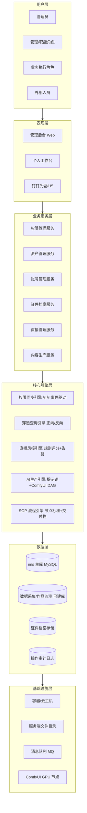
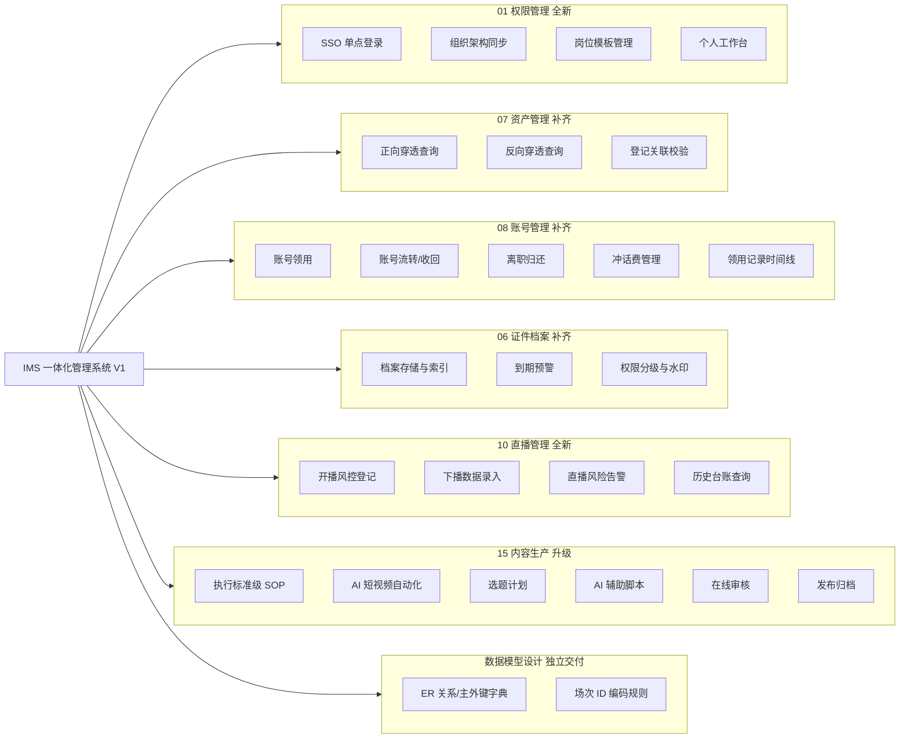
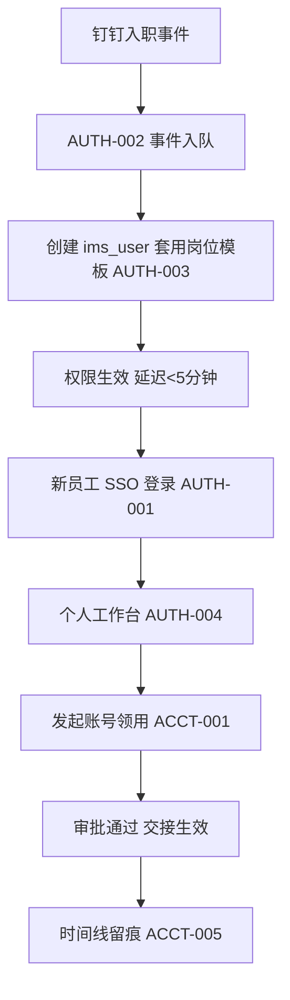
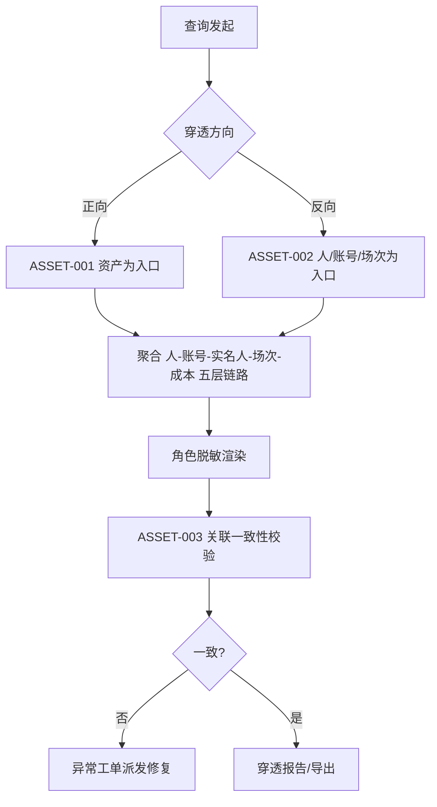
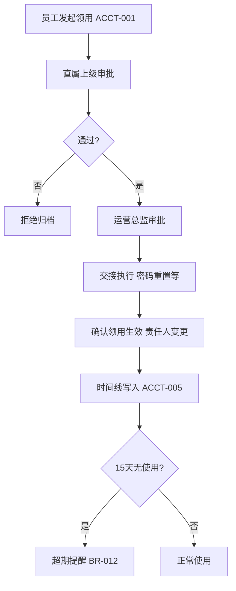
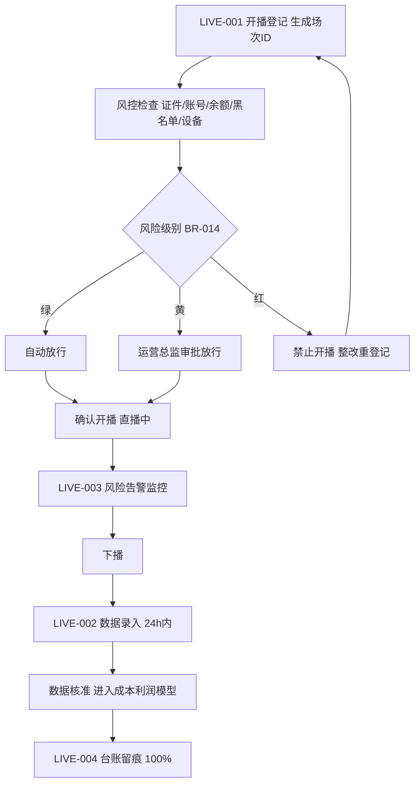
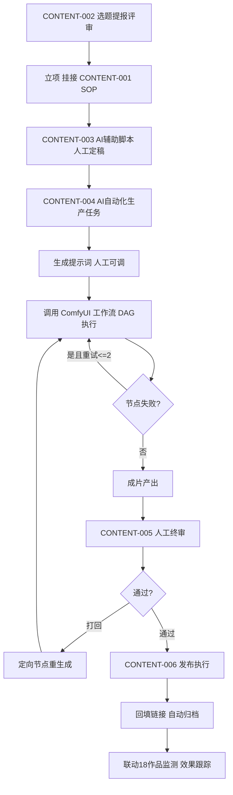

# 神鱼体育 一体化管理系统（IMS）第一期（V1）产品需求文档

> **文档用途**：开发就绪 PRD（Product Requirement Document），供架构、开发、测试直接依据实施。
> **覆盖范围**：IMS 第一期（V1）全部产品功能——01 权限管理（新建）、07 资产管理（补齐）、08 账号管理（补齐）、06 证件档案（补齐）、10 直播管理（新建）、15 内容生产（升级）、数据模型设计（独立交付物）。
> **分期口径**：V1 = 第 1~14 周（12~14 周，P0 全量）。第 7 章数据库设计概要、第 8 章 API 路径规范由架构师负责撰写，本版预留章节号。
> **依据文档**：《IMS 一体化管理系统需求说明书》、运营数据平台 PRD v9.2（格式样例）、《IMS 三期总体规划》。
> **周次格式约定**：全文周次统一使用波浪号格式（如"第 1~14 周"、"第 5~9 周"）。

## 版本历史

| 版本 | 日期 | 更新内容 | 更新人 |
|------|------|----------|--------|
| V1.0 | 2025-06-10 | 初稿：基于 IMS 需求说明书与三期规划，完成 V1（第 1~14 周）产品部分全部章节 | 许清楚（Xu·产品经理） |
| v1.1.0 | 2026-09-14 | 嵌入架构师第 7/8 章（数据库设计概要与 API 路径规范）及 V1 期架构技术约束（9A 章），形成开发就绪完整版 | 齐活林（汇编） |
| v1.2.0 | 2026-09-28 | 2026-09-19 规划重排落地：7.1 表分类补 AI 资源中台 12 张表（V2.2 批次，表结构 V1 预留）、8.3 预留 /air/* 与 /ims/mcp 网关路由；错误码补 5007/5008；11 财务核算移 V3 后三期总表口径对齐 | 齐活林（汇编） |
| v1.2.1 | 2026-10-02 | OPS 并入主路径：**操作序列** SSOT 写入《CONTENT-OPS并入补充》《COLLECT》《COMP》《BI0》页面规格 §操作序列；完整原型 `IMS-完整系统-UI原型.html` 对齐 SOP 审核/工作任务/内容状态机/采集 run/指标·查询 mock 状态（非 toast-only） | 齐活林（汇编） |
| v1.2.2 | 2026-10-05 | 内容生产导航收敛（对应完整 PRD v2.6.33）：**移除「SOP审核」子菜单**（SOP 模板不需要审核，`contentSopReview` 已删）；**移除「全部任务」子菜单**（`contentTaskAll` 已删，改为「我的任务」页内 Tab）；内容生产子菜单收为 §15 表 7 项 | 齐活林（汇编） |

> **v1.2.1 走查入口**：内容生产 → `CONTENT-OPS并入补充-页面规格.md` §操作序列；数据采集/竞品/BI0 见各模块页面规格同名章节；交互演示打开 `一体化管理/UI原型/IMS-完整系统-UI原型.html`。  
> **v1.2.2 起**：SOP 审核与独立「全部任务」菜单已下线，内容生产子菜单以 §15 表 7 项为准（详见 v2.6.33）。

---

## 目录

1. 产品概述
   - 1.1 产品背景
   - 1.2 产品定位
   - 1.3 核心业务规则表
2. 产品逻辑架构
3. 功能架构
   - 3A. 产品功能点列表
4. 目标用户与权限矩阵
5. 功能详细设计（开发功能点级别）
6. 业务流程总览
7. 数据库设计概要
8. API 路径规范
9. 架构技术约束（9A）与非功能性需求
10. 附录
11. 分期与验收

---

# 1. 产品概述

## 1.1 产品背景

神鱼体育是直播电商+短视频双主业公司，业务横跨账号运营、达人合作、直播带货、短视频内容生产多个环节，人员流动频繁、账号与资产规模持续增长。公司已启动一体化管理系统（IMS）建设并完成部分模块：

**已建/在建现状**（现网已有实现；依 ADR-IMS-001/006，由 IMS **等价接管**——**表结构沿用（只加列）+ 共享读写 + 不缩小功能**，**非「OPS 已有、IMS 不建」**）：
- 16 数据采集：现网已有实现，IMS 等价接管
- 18 作品监测：现网已有实现，IMS 等价接管
- 07 资产登记：部分完成（基础登记）
- 08 账号登记：部分完成（基础登记）
- 06 证件录入：部分完成（基础录入）
- 17 指标管理 + 自定义查询：部分完成
- 19 IP 组管理：部分完成

**当前存在的编号问题**（P-01 起）：

| 编号 | 问题描述 | 影响 |
|------|----------|------|
| P-01 | 无统一 SSO 与权限体系，各系统独立账号、离职后权限回收滞后，存在数据泄露风险 | 安全风险高，审计不合规 |
| P-02 | 资产（设备等）与账号、实名人、成本之间的关联关系割裂，无法正向/反向穿透查询，资产去向与责任人不清 | 资产盘点困难，责任无法追溯 |
| P-03 | 账号领用、流转、离职归还、冲话费等流程全部线下/口头执行，无线上记录与时间线 | 账号归属混乱、纠纷无凭据、话费成本失控 |
| P-04 | 证件（身份证等）纸质/分散存储，无到期预警，无水印防泄露机制 | 合规风险，证件过期导致开播/实名中断 |
| P-05 | 直播场次无开播前风控登记、无下播数据结构化录入，风险事件无法预警，历史台账缺失 | 直播风险不可控，经营分析无数据 |
| P-06 | 内容生产依赖个人经验，无标准 SOP，无 AI 辅助，选题/脚本/审核/发布链路割裂 | 产能低、质量不稳定、无法规模化 |
| P-07 | 各模块主数据口径不一致（账号、资产、实名人、场次、成本各自编码），无法进行利润核算 | 经营决策缺数据支撑 |

**不做的后果**：若 V1 不落地，权限回收滞后带来的安全合规风险将持续放大；账号资产归属纠纷与话费成本黑洞无法治理；直播风险事件无法事前拦截；内容产能无法支撑业务扩张，一期数据模型缺失将使后续二期、三期建设反复返工。

## 1.2 产品定位

IMS 是神鱼体育**唯一的一体化管理中台**，定位为"账号—资产—人—场次—内容"五要素全生命周期管理平台：

- **对管理层**：提供资产完整率、账号线上化、直播风险、内容产能的全局视图与利润核算基础。
- **对运营/直播/内容团队**：提供从入职开通、账号领用、开播登记、内容生产到离职归还的一站式线上流程。
- **对系统本身**：以钉钉为唯一组织/权限同步源，以数据模型（ER+主外键字典）为地基，支撑二期（进阶运营）、三期（智能分析）演进。

**V1 原则**：
1. 流程先线上化、数据先留痕（先有台账再有分析）；
2. 已完成模块（16/18 及 07/08/06/17/19 已有部分）由 IMS **等价接管**：**表结构沿用（只加列，IR-04）+ 共享读写（ADR-IMS-001）+ 不缩小已列功能点（ADR-IMS-006）**，按 IMS 交互 SSOT（ADR-IMS-003）补全读写与权限闭环；**不重复建库、不另起主键**；
3. 钉钉为唯一组织/权限同步源，SSO + 事件驱动（入职/调岗/离职自动开权限）；
4. 数据模型先行：账号—资产—实名人—场次—成本—利润 ER 关系作为独立交付物，先于功能开发评审。

## 1.3 核心业务规则表

| 编号 | 名称 | 描述 | 计算公式 |
|------|------|------|----------|
| BR-001 | 权限同步延迟 | 钉钉人事事件（入职/调岗/离职）到 IMS 权限生效/失效的延迟 | 同步延迟 = IMS 权限变更时间 − 钉钉事件时间；目标 < 5 分钟 |
| BR-002 | SSO 登录成功率 | 通过钉钉 SSO 登录 IMS 的成功比率 | 成功率 = 成功次数 / 总尝试次数；目标 > 99.5% |
| BR-003 | 资产关联完整率 | 已登记资产中，关联到责任人/账号/编号的完整比率 | 完整率 = 关联字段齐全的资产数 / 资产总数；目标 > 98% |
| BR-004 | 账号领用线上化率 | 账号领用、流转、归还全流程线上化的比率 | 线上化率 = 线上流程单数 / 应发生流程单总数；目标 = 100% |
| BR-005 | 证件数字化率 | 已数字化（拍照/扫描入库）证件占应入库证件比率 | 数字化率 = 已入库证件数 / 应入库证件数；目标 > 95% |
| BR-006 | 直播台账留痕率 | 开播场次完成风控登记并留存台账的比率 | 留痕率 = 已登记场次数 / 实际开播场次数；目标 = 100% |
| BR-007 | 下播录入完整率 | 下播后完整录入 GMV/时长/观众数等必填项的场次比率 | 完整率 = 必填项齐全场次数 / 当日下播场次数；目标 > 95% |
| BR-008 | 内容标准化覆盖率 | 纳入执行标准级 SOP 管理的内容生产占比 | 覆盖率 = SOP 管理内容数 / 内容生产总数；目标 > 90% |
| BR-009 | 一次审核通过率 | 内容提交审核后首次即通过的比例 | 一次通过率 = 首审通过数 / 提审总数；目标 > 70% |
| BR-010 | ComfyUI 链路跑通 | AI 短视频自动化生产至少跑通 1 条完整链路 | 达标条件 = 标准/内容要求→提示词→ComfyUI 工作流→人工终审→发布归档，全链贯通 ≥ 1 条 |
| BR-011 | 场次 ID 编码规则 | 直播场次唯一标识编码 | 场次 ID = `IMS` + `yyyyMMdd`（8 位日期）+ `3 位平台码` + `4 位当日序列`（如 IMS20250610DYS0001，共 19 位），全局唯一、不可变更（编码方案详见第 7 章 7.4.3） |
| BR-012 | 领用超期自动提醒 | 账号领用后连续 N 天无使用记录自动提醒责任人 | 提醒条件：领用后 N=15 天无登录/开播记录 |
| BR-013 | 证件到期预警 | 证件到期前分级预警 | T−30 天黄色预警、T−7 天红色预警、T−0 天锁定不可用于新场次登记 |
| BR-014 | 直播风险分级 | 开播风控登记的风险评分 | 风险分 = Σ(各风控项权重分)；≥70 红色（禁止开播整改）、40~69 黄色（需审批放行）、<40 绿色（正常开播） |
| BR-015 | 离职归还强制闭环 | 离职事件触发后，名下账号/资产/证件归还全部完成方可关闭权限 | 闭环条件 = 离职归还单全部完成 AND 钉钉离职生效；未闭环前账号/资产处于冻结态 |
| BR-016 | 多主体字段预留 | 账号/资产/成本等主数据表预留主体扩展字段 | 每张主表含 `tenant_id`/`entity_id`（可空），V1 默认单主体值 1，二期多主体启用 |
| BR-017 | 冲话费账实核对 | 冲话费记录与平台后台消费的月度核对 | 差异率 = \|冲话费总额 − 平台实际消费\| / 平台实际消费；月度核对差异率 < 2% |
| BR-018 | 资产登记关联校验 | 反向穿透查询时校验登记数据一致性 | 校验通过率 = 关联一致记录数 / 抽样记录数；目标 > 98%，不一致进入异常工单 |

---

# 2. 产品逻辑架构

## 2.1 六层架构图



## 2.2 各层职责表

| 层 | 职责 | V1 关键内容 |
|----|------|-------------|
| 用户层 | 触达系统的 10 类角色（见第 4 章），含外协人员 | 钉钉账号映射 IMS 角色 |
| 表现层 | 管理后台 Web + 个人工作台 + 钉钉免登 H5 | SSO 免登、待办、预警消息推送 |
| 业务服务层 | 六大业务域服务化封装 | 权限/资产/账号/证件/直播/内容 |
| 核心引擎层 | 跨域通用能力引擎 | 钉钉事件同步、穿透查询、风控评分、AI 提示词→ComfyUI 调度、SOP 引擎 |
| 数据层 | ims_ 前缀主库 + 已建采集/监测库 + 档案存储 + 审计 | ims_ 表设计（第 7 章架构师产出） |
| 基础设施层 | 容器、服务端文件目录（证件/视频）、MQ（事件驱动）、GPU 节点（ComfyUI 工作流执行） | 证件水印、视频产出物存储 |

---

# 3. 功能架构

## 3.1 模块图



## 3.2 模块清单表

| 模块编号 | 模块名称 | 建设类型 | V1 交付内容 | 关联已建系统 |
|----------|----------|----------|-------------|--------------|
| 01 | 权限管理 | 全新 | SSO、组织架构同步、岗位模板、个人工作台 | 钉钉（唯一同步源） |
| 07 | 资产管理 | 补齐 | 正向/反向穿透查询、登记关联校验 | 已有资产登记 |
| 08 | 账号管理 | 补齐 | 领用、流转/收回、离职归还、冲话费、时间线 | 已有账号登记 |
| 06 | 证件档案 | 补齐 | 存储与索引、到期预警、权限分级与水印 | 已有证件录入 |
| 10 | 直播管理 | 全新（由二期移回） | 开播风控登记、下播录入、风险告警、历史台账 | — |
| 15 | 内容生产 | 升级 | SOP、AI 自动化（ComfyUI）、选题、AI 脚本、审核、发布归档 | 已有 18 作品监测 |
| DM | 数据模型设计 | 独立交付物 | ER、主外键字典、多主体预留、场次 ID 编码 | 全部模块 |

## 3.3 关键流程贯穿表

| 流程 | 贯穿模块 | 触发 | 结果 |
|------|----------|------|------|
| 入职开权限 | 01→08/06/07 | 钉钉入职事件 | 岗位模板自动开权限、可领用账号/资产 |
| 账号领用 | 08→01→07 | 员工发起 | 领用单审批、账号责任人变更、时间线更新 |
| 资产穿透 | 07→08→DM | 查询发起 | 正向（资产→责任人/账号）、反向（人/账号→资产） |
| 直播场次 | 10→06→08→07 | 开播前登记 | 场次 ID 生成、风控放行、下播录入、台账留痕 |
| 内容生产 | 15→DM | 选题立项 | SOP 节点执行、AI 生成、人工终审、发布归档 |
| 离职归还 | 01→08→07→06 | 钉钉离职事件 | 归还单闭环、权限关闭、账号/资产冻结解除 |

## 3A. 产品功能点列表

### 3A.1 功能编号体系

| 前缀 | 业务域 | 示例 |
|------|--------|------|
| AUTH- | 01 权限管理 | AUTH-001 |
| ASSET- | 07 资产管理 | ASSET-001 |
| ACCT- | 08 账号管理 | ACCT-001 |
| CERT- | 06 证件档案 | CERT-001 |
| LIVE- | 10 直播管理 | LIVE-001 |
| CONTENT- | 15 内容生产 | CONTENT-001 |
| DM- | 数据模型设计 | DM-001 |

### 3A.2 各业务域功能点明细表

**01 权限管理（AUTH）**

| 编号 | 名称 | 章节 | 优先级 | API 前缀 |
|------|------|------|--------|----------|
| AUTH-001 | 单点登录（SSO） | 5.1 | P0 | /admin-api/ims/auth/sso |
| AUTH-002 | 组织架构同步（事件驱动） | 5.2 | P0 | /admin-api/ims/auth/org |
| AUTH-003 | 岗位模板管理 | 5.3 | P0 | /admin-api/ims/auth/position |
| AUTH-004 | 个人工作台 | 5.4 | P0 | /admin-api/ims/auth/workbench |

**07 资产管理（ASSET）**

| 编号 | 名称 | 章节 | 优先级 | API 前缀 |
|------|------|------|--------|----------|
| ASSET-001 | 正向穿透查询 | 5.5 | P0 | /admin-api/ims/asset/forward |
| ASSET-002 | 反向穿透查询 | 5.6 | P0 | /admin-api/ims/asset/reverse |
| ASSET-003 | 登记数据关联校验 | 5.7 | P1 | /admin-api/ims/asset/verify |

**08 账号管理（ACCT）**

| 编号 | 名称 | 章节 | 优先级 | API 前缀 |
|------|------|------|--------|----------|
| ACCT-001 | 账号领用 | 5.8 | P0 | /admin-api/ims/account/apply |
| ACCT-002 | 账号流转/收回 | 5.9 | P0 | /admin-api/ims/account/transfer |
| ACCT-003 | 离职归还 | 5.10 | P0 | /admin-api/ims/account/return |
| ACCT-004 | 冲话费管理 | 5.11 | P1 | /admin-api/ims/account/recharge |
| ACCT-005 | 领用记录时间线 | 5.12 | P0 | /admin-api/ims/account/timeline |

**06 证件档案（CERT）**

| 编号 | 名称 | 章节 | 优先级 | API 前缀 |
|------|------|------|--------|----------|
| CERT-001 | 档案存储与索引 | 5.13 | P0 | /admin-api/ims/cert/archive |
| CERT-002 | 到期预警 | 5.14 | P0 | /admin-api/ims/cert/expire |
| CERT-003 | 权限分级与水印 | 5.15 | P0 | /admin-api/ims/cert/security |

**10 直播管理（LIVE）**

| 编号 | 名称 | 章节 | 优先级 | API 前缀 |
|------|------|------|--------|----------|
| LIVE-001 | 开播风控登记 | 5.16 | P0 | /admin-api/ims/live/register |
| LIVE-002 | 下播数据录入 | 5.17 | P0 | /admin-api/ims/live/report |
| LIVE-003 | 直播风险告警 | 5.18 | P0 | /admin-api/ims/live/alarm |
| LIVE-004 | 历史台账查询 | 5.19 | P1 | /admin-api/ims/live/ledger |

**15 内容生产（CONTENT）**

| 编号 | 名称 | 章节 | 优先级 | API 前缀 |
|------|------|------|--------|----------|
| CONTENT-001 | 执行标准级 SOP | 5.20 | P0 | /admin-api/ims/content/sop |
| CONTENT-002 | 选题计划 | 5.21 | P1 | /admin-api/ims/content/topic |
| CONTENT-003 | AI 辅助脚本 | 5.22 | P1 | /admin-api/ims/content/script |
| CONTENT-004 | AI 短视频自动化生产 | 5.23 | P0 | /admin-api/ims/content/ai-production |
| CONTENT-005 | 在线审核 | 5.24 | P0 | /admin-api/ims/content/review |
| CONTENT-006 | 发布归档 | 5.25 | P0 | /admin-api/ims/content/publish |

**数据模型设计（DM）**

| 编号 | 名称 | 章节 | 优先级 | 交付物 |
|------|------|------|--------|--------|
| DM-001 | ER 关系与主外键字典 | 第 7 章引用（架构师落地） | P0 | ER 图 + 字典文档 |
| DM-002 | 多主体字段预留规范 | 第 7 章引用 | P0 | 规范文档 |
| DM-003 | 场次 ID 编码规则 | BR-011 | P0 | 编码规则文档 |

### 3A.3 功能点统计

| 业务域 | 功能点数 | P0 | P1 |
|--------|----------|----|----|
| 01 权限管理 | 4 | 4 | 0 |
| 07 资产管理 | 3 | 2 | 1 |
| 08 账号管理 | 5 | 4 | 1 |
| 06 证件档案 | 3 | 3 | 0 |
| 10 直播管理 | 4 | 3 | 1 |
| 15 内容生产 | 6 | 4 | 2 |
| 数据模型（独立交付物） | 3 | 3 | 0 |
| **合计** | **28** | **23** | **5** |

---

# 4. 目标用户与权限矩阵

## 4.1 角色清单（10 类，依据 IMS 需求说明书）

| # | 角色 | 说明 |
|---|------|------|
| R1 | 系统管理员 | IMS 平台全量管理与运维 |
| R2 | 行政管理员 | 资产、证件、离职归还主责 |
| R3 | 财务管理员 | 冲话费、成本、利润核算 |
| R4 | 运营总监 | 账号、直播、内容全局管理 |
| R5 | 直播运营 | 直播场次登记与录入 |
| R6 | 短视频运营 | 选题、脚本、发布执行 |
| R7 | 主播/达人 | 个人账号、直播执行视角 |
| R8 | 内容审核员 | 内容终审与质量把关 |
| R9 | 数据分析师 | 全域查询（脱敏敏感字段） |
| R10 | 外协人员（剪辑/投流等） | 受限工作台，仅被指派任务 |

权限标记：**R**=查看，**W**=编辑/提交，**D**=删除/终审；括号内为数据范围限定。

## 4.2 角色×功能矩阵

| 功能点 | R1 系统管理员 | R2 行政 | R3 财务 | R4 运营总监 | R5 直播运营 | R6 短视频运营 | R7 主播 | R8 审核员 | R9 数据分析师 | R10 外协 |
|--------|------|------|------|------|------|------|------|------|------|------|
| AUTH-001 SSO | R/W | R/W | R/W | R/W | R/W | R/W | R/W | R/W | R/W | R/W（受限登录） |
| AUTH-002 组织同步 | R/W/D（全量） | R（本部门） | — | R（全量） | — | — | — | — | — | — |
| AUTH-003 岗位模板 | R/W/D（全量） | R | — | R | — | — | — | — | — | — |
| AUTH-004 个人工作台 | R/W（全量可查） | R/W（本人） | R/W（本人） | R/W（本人+下属） | R/W（本人） | R/W（本人） | R/W（本人） | R/W（本人） | R/W（本人） | R/W（仅被指派任务） |
| ASSET-001 正向穿透 | R（全量） | R/W（全量） | R（全量） | R（全量） | R（关联账号资产） | — | — | — | R（全量，成本脱敏） | — |
| ASSET-002 反向穿透 | R（全量） | R/W（全量） | R（全量） | R（全量） | R（本人负责） | — | — | — | R（全量，成本脱敏） | — |
| ASSET-003 关联校验 | R/W/D（全量） | R/W（全量） | — | R | — | — | — | — | R | — |
| ACCT-001 账号领用 | R/W/D（全量） | R | — | R/W/D（全量） | W（本人发起） | W（本人发起） | W（本人发起） | — | R（全量，密码脱敏） | — |
| ACCT-002 流转/收回 | R/W/D（全量） | R | — | R/W/D（全量） | W（经手发起） | — | — | — | R（脱敏） | — |
| ACCT-003 离职归还 | R/W/D（全量） | R/W/D（全量主责） | R | R | R（涉及账号） | — | — | — | R | — |
| ACCT-004 冲话费管理 | R（全量） | — | R/W/D（全量） | R（全量） | — | — | — | — | R（全量） | — |
| ACCT-005 领用时间线 | R（全量） | R（全量） | R | R（全量） | R（本人相关） | R（本人相关） | R（本人相关） | — | R（脱敏） | — |
| CERT-001 档案存储与索引 | R/W/D（全量） | R/W（全量主责） | — | R（索引，不见原图） | — | — | R（本人证件） | — | R（索引脱敏） | — |
| CERT-002 到期预警 | R/W（全量） | R/W/D（全量） | — | R（全量） | R（涉及本人） | — | R（本人） | — | R | — |
| CERT-003 权限分级与水印 | R/W/D（全量） | R（本级别内） | — | — | — | — | — | — | — | — |
| LIVE-001 开播风控登记 | R/W/D（全量） | — | — | R/W/D（全量审批） | R/W（本人场次） | — | R/W（本人场次） | — | — | — |
| LIVE-002 下播数据录入 | R（全量） | — | R（GMV/成本） | R/W（全量） | R/W（本人场次） | — | W（本人场次） | — | R（全量） | — |
| LIVE-003 风险告警 | R/W/D（全量规则） | R | — | R/W（全量规则） | R（本人场次） | — | R（本人场次） | — | R | — |
| LIVE-004 历史台账查询 | R（全量） | R | R（财务字段） | R（全量） | R（本人场次+团队） | — | R（本人场次） | — | R（全量） | — |
| CONTENT-001 执行标准级 SOP | R/W/D（全量） | — | — | R/W（全量） | R（直播 SOP） | R/W（视频 SOP） | R | — | — | R（被指派 SOP） |
| CONTENT-002 选题计划 | R（全量） | — | — | R/W/D（全量） | R（直播选题） | R/W（本人选题） | W（可提报） | — | R | — |
| CONTENT-003 AI 辅助脚本 | R（全量） | — | — | R（全量） | R/W | R/W（本人） | — | — | — | — |
| CONTENT-004 AI 短视频自动化 | R/W/D（全量） | — | — | R/W（全量） | — | R/W（本人任务） | — | — | — | W（被指派环节） |
| CONTENT-005 在线审核 | R（全量） | — | — | R（全量） | — | R（提交） | — | R/W/D（终审主责） | — | — |
| CONTENT-006 发布归档 | R/W/D（全量） | — | — | R/W（全量） | — | R/W（执行发布） | — | R | R | — |
| DM 数据模型交付物 | R/W/D（全量） | — | R（成本利润模型） | R | — | — | — | — | R | — |

---

# 5. 功能详细设计（开发功能点级别）

> 本章共 25 个功能点（第 5.1~5.25 节），补齐类功能点头部标注"现状"行。

## 5.1 权限管理 - 单点登录（SSO）

**功能编号**：AUTH-001
**优先级**：P0
**对应表**：`ims_sso_token`、`ims_user`
**对应API**：`/admin-api/ims/auth/sso/*`

### 5.1.1 功能描述

以钉钉为唯一身份源，实现 IMS 单点登录。核心能力：
1. 钉钉扫码/免登（OAuth2 授权码模式）换取 IMS 会话；
2. JWT 会话签发与校验，支持 Web 与 H5 双端；
3. 登录审计（成功/失败/异常地点）；
4. SSO 登录成功率 > 99.5%（BR-002）。

### 5.1.2 数据结构

| 字段 | 类型 | 说明 |
|------|------|------|
| id | BIGINT PK | 主键 |
| user_id | BIGINT | 关联 ims_user.id |
| dingtalk_union_id | VARCHAR(64) | 钉钉 UnionId（唯一索引） |
| access_token | VARCHAR(512) | 加密存储 |
| refresh_token | VARCHAR(512) | 加密存储 |
| expires_at | DATETIME | 过期时间 |
| login_ip | VARCHAR(45) | 登录 IP |
| login_device | VARCHAR(128) | 设备标识 |
| status | TINYINT | 0 无效 / 1 有效 |
| created_at / updated_at | DATETIME | 创建/更新时间 |

### 5.1.3 业务规则

- AUTH-R1：钉钉 UnionId 与 ims_user 一一绑定，离职用户 UnionId 自动失效（联动 AUTH-002）；
- AUTH-R2：JWT 有效期 2 小时，Refresh Token 7 天；
- AUTH-R3：同一账号并发会话数 ≤ 3，超出踢出最早会话；
- AUTH-R4：登录失败连续 5 次锁定 15 分钟。

### 5.1.4 操作流程

1. 用户访问 IMS 入口 → 跳转钉钉授权页（或 H5 内免登）；
2. 钉钉返回授权码，IMS 后端换 union_id；
3. 校验 ims_user 状态有效 → 签发 JWT；
4. 前端携带 JWT 访问，网关统一鉴权；
5. 审计日志落库。

### 5.1.5 权限说明

- **查看/使用**：全部 10 类角色（外协人员受限登录，仅工作台）
- **配置**（登录策略、锁定阈值）：仅 R1 系统管理员

### 5.1.6 API 设计

| 方法 | 路径 | 说明 |
|------|------|------|
| GET | `/admin-api/ims/auth/sso/redirect` | 获取钉钉授权跳转地址 |
| POST | `/admin-api/ims/auth/sso/callback` | 授权码换 JWT 会话 |
| POST | `/admin-api/ims/auth/sso/refresh` | 刷新 Token |
| POST | `/admin-api/ims/auth/sso/logout` | 注销会话 |

## 5.2 权限管理 - 组织架构同步（事件驱动）

**功能编号**：AUTH-002
**优先级**：P0
**对应表**：`ims_org_sync_event`、`ims_department`、`ims_user`
**对应API**：`/admin-api/ims/auth/org/*`

### 5.2.1 功能描述

钉钉为唯一组织/权限同步源，事件驱动同步入职/调岗/离职。核心能力：
1. 订阅钉钉通讯录事件（入职/离职/部门变更/岗位变更）；
2. 全量对账任务（每日凌晨）兜底增量事件丢失；
3. 入职 → 按岗位模板自动开通权限（联动 AUTH-003）；
4. 离职 → 触发归还闭环（联动 ACCT-003）并冻结账号；
5. 同步延迟 < 5 分钟（BR-001）。

### 5.2.2 数据结构

| 字段 | 类型 | 说明 |
|------|------|------|
| id | BIGINT PK | 主键 |
| event_type | VARCHAR(32) | hire / transfer / resign / dept_change |
| dingtalk_event_id | VARCHAR(64) | 去重唯一键 |
| union_id / user_id | VARCHAR(64) / BIGINT | 事件主体 |
| before_dept / after_dept | VARCHAR(128) | 变更前后部门 |
| sync_status | TINYINT | 0 待处理 / 1 成功 / 2 失败重试 |
| synced_at | DATETIME | 同步完成时间 |
| payload | JSON | 事件原文 |

### 5.2.3 业务规则

- ORG-R1：事件幂等处理（按 dingtalk_event_id 去重）；
- ORG-R2：同步失败自动重试 3 次，仍失败告警管理员；
- ORG-R3：调岗事件保留原权限 24 小时缓冲，随后切换新岗位模板权限；
- ORG-R4：离职事件先冻结（不可登录业务模块），归还闭环（BR-015）完成后彻底关闭。

### 5.2.4 操作流程

1. 钉钉人事操作触发事件推送（或定时拉取）；
2. 事件入 `ims_org_sync_event`，去重后分发处理；
3. 入职：创建 ims_user + 套用岗位模板 → 权限生效；
4. 调岗：更新部门 + 切换模板；
5. 离职：冻结 → 生成离职归还单 → 闭环后关闭；
6. 每日全量对账，差异生成修正工单。

### 5.2.5 权限说明

- **查看**：R1 系统管理员（全量）、R2 行政（本部门）、R4 运营总监（全量）
- **配置/手动触发对账**：仅 R1
- 新增/编辑/删除（事件处理配置）：仅 R1

### 5.2.6 API 设计

| 方法 | 路径 | 说明 |
|------|------|------|
| POST | `/admin-api/ims/auth/org/event` | 接收钉钉通讯录事件回调 |
| GET | `/admin-api/ims/auth/org/users` | 组织人员列表（含同步状态） |
| POST | `/admin-api/ims/auth/org/reconcile` | 手动触发全量对账 |
| GET | `/admin-api/ims/auth/org/events` | 同步事件查询 |
| GET | `/admin-api/ims/auth/org/sync-metrics` | 同步延迟统计（BR-001） |

## 5.3 权限管理 - 岗位-角色供给规则

> ⚠️ **已被 ADR-IMS-008 取代（2026-10-04）**：本节原「岗位模板 = 岗位-权限矩阵」的**权限明细（`perm_detail` 功能点 R/W/D、`dataScope`）已迁入 SYS-002 角色**（角色 = 权限唯一载体）；AUTH-003 降级为「岗位 → 角色 自动供给规则」。下表保留为历史设计，**实现以 ADR-IMS-008 + 《AUTH-权限管理-页面规格》P3 为准**。

**功能编号**：AUTH-003
**优先级**：P0
**对应表**：`ims_position_template`、`ims_position_template_perm`
**对应API**：`/admin-api/ims/auth/position/*`

### 5.3.1 功能描述

将岗位 × 功能权限（第 4 章矩阵）固化为模板，入职/调岗自动套用。核心能力：
1. 模板 CRUD（岗位名称、映射角色、功能点权限集）；
2. 模板版本管理（变更留版本，历史用户不受影响，新套用走新版本）；
3. 模板与钉钉岗位字段映射；
4. 模拟某用户权限预览（变更前 Diff）。

### 5.3.2 数据结构

| 字段 | 类型 | 说明 |
|------|------|------|
| id | BIGINT PK | 主键 |
| template_name | VARCHAR(64) | 模板名称（如"直播运营岗"） |
| dingtalk_position | VARCHAR(64) | 对应钉钉岗位 |
| version | INT | 版本号 |
| status | TINYINT | 0 停用 / 1 启用 |
| perm_detail | JSON | 功能点权限集（编号→R/W/D） |
| created_by / created_at | VARCHAR(64) / DATETIME | 创建人/时间 |

### 5.3.3 业务规则

- POS-R1：一个钉钉岗位只能绑定一个启用版本模板；
- POS-R2：模板变更生成新版本，已套用用户不自动变更，需调岗或手动刷新；
- POS-R3：删除模板需先确认无在用用户。

### 5.3.4 操作流程

1. 管理员创建模板 → 勾选功能点权限 → 保存版本；
2. 绑定钉钉岗位字段；
3. 入职/调岗事件自动套用（AUTH-002 联动）；
4. 权限变更前可预览 Diff，确认后生效。

### 5.3.5 权限说明

- **查看**：R1、R2（只读）、R4（只读）
- **新增/编辑/删除**：仅 R1

### 5.3.6 API 设计

| 方法 | 路径 | 说明 |
|------|------|------|
| GET | `/admin-api/ims/auth/position/templates` | 模板列表 |
| POST | `/admin-api/ims/auth/position/template` | 新建模板 |
| PUT | `/admin-api/ims/auth/position/template/{id}` | 编辑（生成新版本） |
| DELETE | `/admin-api/ims/auth/position/template/{id}` | 删除模板 |
| POST | `/admin-api/ims/auth/position/preview` | 模拟用户权限 Diff 预览 |

## 5.4 权限管理 - 个人工作台

**功能编号**：AUTH-004
**优先级**：P0
**对应表**：`ims_todo_task`、`ims_message_notify`
**对应API**：`/admin-api/ims/auth/workbench/*`

### 5.4.1 功能描述

登录后的统一首页。核心能力：
1. 待办中心：领用审批、归还单、审核任务、证件预警、直播告警统一待办；
2. 消息通知：站内信 + 钉钉工作通知推送；
3. 我的数据卡片：我名下账号/资产/证件/场次一览；
4. 快捷入口：按角色权限动态渲染常用功能。

### 5.4.2 数据结构

| 字段 | 类型 | 说明 |
|------|------|------|
| id | BIGINT PK | 主键 |
| user_id | BIGINT | 待办归属人 |
| task_type | VARCHAR(32) | approval / return / review / cert_expire / live_alarm |
| ref_type / ref_id | VARCHAR(32) / BIGINT | 关联单据类型与 ID |
| title / content | VARCHAR(256) / TEXT | 标题/内容 |
| status | TINYINT | 0 待处理 / 1 已处理 / 2 已过期 |
| deadline | DATETIME | 截止时间 |
| created_at | DATETIME | 创建时间 |

### 5.4.3 业务规则

- WB-R1：待办按 deadline 升序，逾期红色高亮并升级推送；
- WB-R2：钉钉推送去重：同一待办最多推送 3 次（创建/临期/逾期）；
- WB-R3：外协人员工作台仅显示被指派任务。

### 5.4.4 操作流程

1. 用户 SSO 登录 → 进入工作台；
2. 系统按权限渲染待办与数据卡片；
3. 点击待办跳转对应模块处理，处理完成后待办自动闭环。

### 5.4.5 权限说明

- **查看/编辑**：全部角色（仅本人数据；管理角色可查下属，见 4.2 矩阵）
- **待办配置（推送规则）**：R1

### 5.4.6 API 设计

| 方法 | 路径 | 说明 |
|------|------|------|
| GET | `/admin-api/ims/auth/workbench/dashboard` | 工作台聚合数据 |
| GET | `/admin-api/ims/auth/workbench/todos` | 待办列表 |
| PUT | `/admin-api/ims/auth/workbench/todos/{id}` | 处理/关闭待办 |
| GET | `/admin-api/ims/auth/workbench/messages` | 消息列表 |

## 5.5 资产管理 - 正向穿透查询

**功能编号**：ASSET-001
**优先级**：P0
**对应表**：`ims_asset`（已有登记，补查询）、`ims_asset_trace`
**对应API**：`/admin-api/ims/asset/forward/*`
**现状**：✅ 已完成（资产登记）——本次仅补齐穿透查询能力

### 5.5.1 功能描述

从资产出发正向穿透：资产 → 责任人 → 名下账号 → 实名人 → 使用场次 → 关联成本。核心能力：
1. 资产详情聚合页（一屏穿透五层关联）；
2. 支持按资产编号/类型/责任人筛选；
3. 穿透链路可视化（关系图）；
4. 导出穿透报告（PDF）。

### 5.5.2 数据结构

| 字段 | 类型 | 说明 |
|------|------|------|
| id | BIGINT PK | 主键 |
| trace_type | VARCHAR(16) | forward / reverse |
| asset_id | BIGINT | 资产 ID |
| node_chain | JSON | 穿透节点链（人/账号/实名人/场次/成本） |
| query_user_id | BIGINT | 查询人（审计） |
| created_at | DATETIME | 查询时间 |

### 5.5.3 业务规则

- ASSET-F-R1：穿透最多 5 层（资产→人→账号→场次→成本），单次查询耗时 < 3 秒；
- ASSET-F-R2：敏感字段（成本金额、实名人证件号）按角色脱敏；
- ASSET-F-R3：每次穿透查询记录审计（谁查了什么）。

### 5.5.4 操作流程

1. 选择资产（搜索或列表进入）；
2. 系统实时聚合关联链路并渲染关系图；
3. 点击节点下钻查看明细；
4. 可选导出穿透报告。

### 5.5.5 权限说明

- **查看**：R1（全量）、R2（全量）、R3（全量，只读）、R4（全量）、R5（关联账号资产）、R9（全量，成本脱敏）
- **新增/编辑/删除**：本功能为查询类，无写操作

### 5.5.6 API 设计

| 方法 | 路径 | 说明 |
|------|------|------|
| GET | `/admin-api/ims/asset/forward/detail/{assetId}` | 资产穿透详情（聚合） |
| GET | `/admin-api/ims/asset/forward/trace/{assetId}` | 穿透链路关系图数据 |
| GET | `/admin-api/ims/asset/forward/export/{assetId}` | 导出穿透报告 |

## 5.6 资产管理 - 反向穿透查询

**功能编号**：ASSET-002
**优先级**：P0
**对应表**：`ims_asset`、`ims_account`、`ims_user`、`ims_asset_trace`
**对应API**：`/admin-api/ims/asset/reverse/*`
**现状**：✅ 已完成（资产登记）——本次仅补齐穿透查询能力

### 5.6.1 功能描述

从人/账号/场次反向穿透到资产。核心能力：
1. 按责任人查询名下全部资产（含历史领用已归还）；
2. 按账号查询绑定设备/物料资产；
3. 按场次 ID 查询该场次涉及资产；
4. 反向结果与登记数据做关联校验（联动 ASSET-003）。

### 5.6.2 数据结构

复用 `ims_asset_trace`（trace_type=reverse），查询入口维度字段：

| 字段 | 类型 | 说明 |
|------|------|------|
| entry_type | VARCHAR(16) | person / account / session |
| entry_id | BIGINT | 入口实体 ID |

### 5.6.3 业务规则

- ASSET-B-R1：反向查询结果区分"在用/已归还/已报废"三种资产状态；
- ASSET-B-R2：离职人员反向查询结果默认冻结态展示，归还闭环后正常；
- ASSET-B-R3：查询性能：万级资产量下 < 2 秒。

### 5.6.4 操作流程

1. 选择入口（人员/账号/场次 ID）；
2. 系统反向聚合资产清单与状态；
3. 触发关联校验（可选），不一致项标红；
4. 导出结果。

### 5.6.5 权限说明

- **查看**：R1（全量）、R2（全量）、R3（只读全量）、R4（全量）、R5（本人负责）、R9（全量，成本脱敏）
- **写操作**：无（查询类功能）

### 5.6.6 API 设计

| 方法 | 路径 | 说明 |
|------|------|------|
| GET | `/admin-api/ims/asset/reverse/by-person/{userId}` | 按人反查资产 |
| GET | `/admin-api/ims/asset/reverse/by-account/{accountId}` | 按账号反查资产 |
| GET | `/admin-api/ims/asset/reverse/by-session/{sessionId}` | 按场次反查资产 |
| GET | `/admin-api/ims/asset/reverse/export` | 导出反查结果 |

## 5.7 资产管理 - 登记数据关联校验

**功能编号**：ASSET-003
**优先级**：P1
**对应表**：`ims_asset_verify_task`
**对应API**：`/admin-api/ims/asset/verify/*`
**现状**：✅ 已完成（资产登记）——本次仅补齐关联校验

### 5.7.1 功能描述

对登记数据进行一致性校验，保障资产关联完整率 > 98%（BR-003、BR-018）。核心能力：
1. 定时校验任务（资产↔账号↔责任人↔场次关联字段一致性）；
2. 差异清单生成与异常工单派发；
3. 修复闭环跟踪（指定责任人限期修复）；
4. 校验指标看板（完整率、一致率趋势）。

### 5.7.2 数据结构

| 字段 | 类型 | 说明 |
|------|------|------|
| id | BIGINT PK | 主键 |
| batch_no | VARCHAR(32) | 校验批次号 |
| verify_type | VARCHAR(32) | asset_account / asset_person / asset_session |
| total_count / error_count | INT | 校验总数/异常数 |
| error_detail | JSON | 异常明细（记录 ID + 不一致字段） |
| task_status | TINYINT | 0 待派发 / 1 修复中 / 2 已闭环 |
| owner_user_id | BIGINT | 修复责任人 |

### 5.7.3 业务规则

- VERIFY-R1：每周一凌晨全量校验 + 每日增量校验；
- VERIFY-R2：异常工单 3 个工作日内闭环，逾期升级部门负责人；
- VERIFY-R3：校验一致率纳入 BR-018 指标统计。

### 5.7.4 操作流程

1. 定时任务执行校验；
2. 生成批次报告与异常清单；
3. 派发工单至责任部门/责任人；
4. 修复后复审 → 闭环 → 指标看板更新。

### 5.7.5 权限说明

- **查看**：R1、R2、R4、R9
- **新增/编辑**：R1、R2（派发工单）
- **删除（异常记录归档）**：R1

### 5.7.6 API 设计

| 方法 | 路径 | 说明 |
|------|------|------|
| POST | `/admin-api/ims/asset/verify/run` | 手动触发校验 |
| GET | `/admin-api/ims/asset/verify/batches` | 校验批次列表 |
| GET | `/admin-api/ims/asset/verify/errors` | 异常明细 |
| PUT | `/admin-api/ims/asset/verify/task/{id}` | 工单状态流转 |
| GET | `/admin-api/ims/asset/verify/metrics` | 完整率/一致率指标 |

## 5.8 账号管理 - 账号领用

**功能编号**：ACCT-001
**优先级**：P0
**对应表**：`ims_account_apply`、`ims_account`
**对应API**：`/admin-api/ims/account/apply/*`
**现状**：✅ 已完成（账号登记）——本次仅补齐领用流程

### 5.8.1 功能描述

账号领用全流程线上化（BR-004 线上化率 = 100%）。核心能力：
1. 员工发起领用申请（选择账号池账号、填写用途、期限）；
2. 审批流（直属上级 → 运营总监）；
3. 领用生效后账号责任人变更、密码/验证方式交接记录；
4. 领用超期未使用提醒（BR-012）。

### 5.8.2 数据结构

| 字段 | 类型 | 说明 |
|------|------|------|
| id | BIGINT PK | 主键 |
| apply_no | VARCHAR(32) | 申请单号（AP+日期+流水） |
| account_id | BIGINT | 领用账号 |
| applicant_user_id | BIGINT | 申请人 |
| purpose | VARCHAR(256) | 用途说明 |
| plan_start / plan_end | DATETIME | 计划使用起止 |
| approver_user_id | BIGINT | 审批人 |
| apply_status | TINYINT | 0 待审批 / 1 已领用 / 2 拒绝 / 3 已归还 |
| handover_detail | JSON | 交接记录（密码重置、绑定手机等） |
| tenant_id / entity_id | BIGINT | 多主体预留（BR-016） |

### 5.8.3 业务规则

- APP-R1：一个账号同一时间仅一个责任人（领用生效即变更）；
- APP-R2：审批超 24 小时未处理，工作台升级提醒；
- APP-R3：领用生效后 15 天无使用记录触发提醒（BR-012）；
- APP-R4：账号密码不在系统明文存储，交接记录只存"已重置"事实。

### 5.8.4 操作流程

1. 员工工作台发起领用 → 填写表单；
2. 审批流逐级处理；
3. 审批通过 → 管理员/申请人执行交接（重置密码等）→ 确认领用生效；
4. 责任人变更写入 `ims_account`，时间线更新（ACCT-005）。

### 5.8.5 权限说明

- **查看**：R1、R4、R9（密码脱敏）、R5/R6/R7（本人申请）
- **新增（发起）**：R5、R6、R7（本人）
- **编辑**：R1、R4（审批操作）
- **删除**：仅 R1（逻辑删除）

### 5.8.6 API 设计

| 方法 | 路径 | 说明 |
|------|------|------|
| POST | `/admin-api/ims/account/apply` | 发起领用申请 |
| GET | `/admin-api/ims/account/apply/list` | 申请单列表 |
| GET | `/admin-api/ims/account/apply/{id}` | 申请详情 |
| PUT | `/admin-api/ims/account/apply/{id}/approve` | 审批（通过/拒绝） |
| PUT | `/admin-api/ims/account/apply/{id}/confirm` | 交接确认生效 |

## 5.9 账号管理 - 账号流转/收回

**功能编号**：ACCT-002
**优先级**：P0
**对应表**：`ims_account_transfer`
**对应API**：`/admin-api/ims/account/transfer/*`
**现状**：✅ 已完成（账号登记）——本次仅补齐流转/收回

### 5.9.1 功能描述

账号在人员间流转与管理员主动收回。核心能力：
1. 流转单：原责任人 → 新责任人（附交接说明）；
2. 收回单：管理员将账号收回账号池（冻结态）；
3. 流转原因分类（调岗/离职前置/违规/业务调整）；
4. 流转后自动联动资产绑定关系提示（是否同步转资产）。

### 5.9.2 数据结构

| 字段 | 类型 | 说明 |
|------|------|------|
| id | BIGINT PK | 主键 |
| transfer_no | VARCHAR(32) | 流转单号（TR+日期+流水） |
| account_id | BIGINT | 账号 |
| from_user_id / to_user_id | BIGINT | 原/新责任人（收回单 to_user 为空） |
| transfer_type | TINYINT | 1 流转 / 2 收回 |
| reason_type | VARCHAR(32) | 原因分类 |
| remark | VARCHAR(512) | 交接说明 |
| status | TINYINT | 0 待确认 / 1 生效 / 2 撤销 |
| created_at / effective_at | DATETIME | 创建/生效时间 |

### 5.9.3 业务规则

- TRF-R1：流转需新责任人确认后生效（防错领）；
- TRF-R2：收回后账号进入"账号池-冻结"态，不可直接领用，需管理员解冻；
- TRF-R3：所有流转/收回计入时间线（ACCT-005）。

### 5.9.4 操作流程

1. 发起流转单（选账号、新旧责任人、原因）；
2. 新责任人确认 → 生效；
3. 系统变更责任人、更新时间线；
4. 可选同步提示资产绑定转移。

### 5.9.5 权限说明

- **查看**：R1、R4、R9（脱敏）、R5（本人经手）
- **新增**：R4、R5（经手发起）
- **编辑**：R1、R4
- **删除/撤销**：R1、R4

### 5.9.6 API 设计

| 方法 | 路径 | 说明 |
|------|------|------|
| POST | `/admin-api/ims/account/transfer` | 发起流转/收回 |
| GET | `/admin-api/ims/account/transfer/list` | 流转单列表 |
| PUT | `/admin-api/ims/account/transfer/{id}/confirm` | 新责任人确认 |
| PUT | `/admin-api/ims/account/transfer/{id}/revoke` | 撤销流转单 |

## 5.10 账号管理 - 离职归还

**功能编号**：ACCT-003
**优先级**：P0
**对应表**：`ims_return_order`、`ims_return_item`
**对应API**：`/admin-api/ims/account/return/*`
**现状**：✅ 已完成（账号登记）——本次仅补齐离职归还闭环

### 5.10.1 功能描述

钉钉离职事件自动触发归还闭环（BR-015）。核心能力：
1. 离职事件自动生成归还单（汇总名下账号、资产、证件）；
2. 归还项逐项确认（账号收回/转交、资产归还、证件归还）；
3. 未闭环前账号/资产冻结、IMS 登录受限；
4. 归还闭环 → 联动 AUTH-002 关闭权限。

### 5.10.2 数据结构

| 字段 | 类型 | 说明 |
|------|------|------|
| id | BIGINT PK | 主键 |
| return_no | VARCHAR(32) | 归还单号（RT+日期+流水） |
| user_id | BIGINT | 离职人 |
| dingtalk_resign_date | DATE | 离职生效日 |
| status | TINYINT | 0 进行中 / 1 已闭环 / 2 异常挂起 |
| closed_at | DATETIME | 闭环时间 |

`ims_return_item`：id、return_order_id、item_type（account/asset/cert）、item_id、item_status（0 待归还/1 已归还/2 转交/3 争议）、handler_user_id、remark。

### 5.10.3 业务规则

- RET-R1：离职生效日 D+0 自动生成归还单；
- RET-R2：D+7 未闭环，账号/资产冻结并升级行政负责人；
- RET-R3：闭环条件 = 全部 item 状态 ∈ {已归还, 转交}（BR-015）；
- RET-R4：争议项走异常流程，行政管理员裁决。

### 5.10.4 操作流程

1. 钉钉离职事件 → 自动生成归还单；
2. 行政管理员核对清单 → 逐项处理确认；
3. 账号收回/转交、资产归还入库、证件回收；
4. 全部闭环 → 权限关闭 → 归还单归档。

### 5.10.5 权限说明

- **查看**：R1、R2、R3（只读）、R4、R5（涉及账号只读）、R9
- **新增（生成归还单）**：R1、R2（手动补建）
- **编辑（处理归还项）**：R2（主责）、R1
- **删除**：R1（归档删除）

### 5.10.6 API 设计

| 方法 | 路径 | 说明 |
|------|------|------|
| POST | `/admin-api/ims/account/return/generate` | 生成离职归还单（事件触发/手动） |
| GET | `/admin-api/ims/account/return/list` | 归还单列表 |
| GET | `/admin-api/ims/account/return/{id}` | 归还单详情（含明细） |
| PUT | `/admin-api/ims/account/return/item/{itemId}` | 处理归还项 |
| PUT | `/admin-api/ims/account/return/{id}/close` | 归还闭环（校验 BR-015） |

## 5.11 账号管理 - 冲话费管理

**功能编号**：ACCT-004
**优先级**：P1
**对应表**：`ims_recharge_record`
**对应API**：`/admin-api/ims/account/recharge/*`
**现状**：✅ 已完成（账号登记）——本次仅补齐冲话费记录与核对

### 5.11.1 功能描述

账号话费/流量/投流余额的充值记录与核对。核心能力：
1. 充值记录登记（账号、金额、充值渠道、凭证截图）；
2. 月度账实核对（充值记录 vs 平台后台消费，BR-017 差异率 < 2%）；
3. 余额预警（低于阈值提醒财务）；
4. 按账号/部门/月份成本汇总。

### 5.11.2 数据结构

| 字段 | 类型 | 说明 |
|------|------|------|
| id | BIGINT PK | 主键 |
| account_id | BIGINT | 账号 |
| amount | DECIMAL(12,2) | 充值金额 |
| channel | VARCHAR(32) | 充值渠道 |
| voucher_url | VARCHAR(512) | 凭证文件地址 |
| recharge_date | DATE | 充值日期 |
| verify_status | TINYINT | 0 未核对 / 1 一致 / 2 差异 |
| verify_diff | DECIMAL(12,2) | 差异金额 |
| operator_user_id | BIGINT | 操作人 |
| tenant_id / entity_id | BIGINT | 多主体预留 |

### 5.11.3 业务规则

- RC-R1：每月 5 日前完成上月账实核对；
- RC-R2：差异率 ≥ 2% 生成财务核查工单（BR-017）；
- RC-R3：充值金额 > 5000 元需附件凭证必填。

### 5.11.4 操作流程

1. 财务登记充值记录（附凭证）；
2. 月度核对任务拉取平台消费数据比对；
3. 差异项生成核查工单；
4. 汇总报表输出成本视图。

### 5.11.5 权限说明

- **查看**：R1、R3、R4、R9
- **新增/编辑**：R3（主责）
- **删除**：R3、R1（逻辑删除）

### 5.11.6 API 设计

| 方法 | 路径 | 说明 |
|------|------|------|
| POST | `/admin-api/ims/account/recharge` | 登记充值记录 |
| GET | `/admin-api/ims/account/recharge/list` | 充值记录列表 |
| PUT | `/admin-api/ims/account/recharge/{id}` | 编辑记录 |
| POST | `/admin-api/ims/account/recharge/verify` | 触发月度核对 |
| GET | `/admin-api/ims/account/recharge/summary` | 成本汇总报表 |

## 5.12 账号管理 - 领用记录时间线

**功能编号**：ACCT-005
**优先级**：P0
**对应表**：`ims_account_timeline`
**对应API**：`/admin-api/ims/account/timeline/*`
**现状**：✅ 已完成（账号登记）——本次仅补齐时间线视图

### 5.12.1 功能描述

账号全生命周期事件时间线视图。核心能力：
1. 时间线聚合：登记 → 每次领用/流转/收回 → 冲话费 → 离职归还 → 注销；
2. 事件卡片展示（单据类型、操作人、时间、备注）；
3. 点击事件卡片跳转原单据；
4. 时间线导出（账号交接凭证 PDF）。

### 5.12.2 数据结构

| 字段 | 类型 | 说明 |
|------|------|------|
| id | BIGINT PK | 主键 |
| account_id | BIGINT | 账号 |
| event_type | VARCHAR(32) | register / apply / transfer / return / recharge / freeze / unfreeze / cancel |
| ref_no / ref_id | VARCHAR(32) / BIGINT | 关联单据 |
| operator_user_id | BIGINT | 操作人 |
| event_time | DATETIME | 事件时间 |
| snapshot | JSON | 事件时账号状态快照（责任人等） |

### 5.12.3 业务规则

- TL-R1：时间线事件只增不改（审计不可篡改）；
- TL-R2：单据操作事务内同步写入时间线（保证不丢事件）；
- TL-R3：事件按时间倒序展示，支持时间区间过滤。

### 5.12.4 操作流程

1. 打开账号详情 → 时间线 Tab；
2. 浏览全量事件（可按类型筛选）；
3. 点击卡片跳转单据详情；
4. 按需导出交接凭证。

### 5.12.5 权限说明

- **查看**：R1、R2、R4、R9（脱敏）、R5/R6/R7（本人相关账号）
- **写操作**：无（系统自动写入）

### 5.12.6 API 设计

| 方法 | 路径 | 说明 |
|------|------|------|
| GET | `/admin-api/ims/account/timeline/{accountId}` | 账号时间线 |
| GET | `/admin-api/ims/account/timeline/{accountId}/export` | 导出交接凭证 PDF |
| GET | `/admin-api/ims/account/timeline/events` | 事件明细查询（分页筛选） |

## 5.13 证件档案 - 档案存储与索引

**功能编号**：CERT-001
**优先级**：P0
**对应表**：`ims_cert_archive`
**对应API**：`/admin-api/ims/cert/archive/*`
**现状**：✅ 已完成（证件录入）——本次仅补齐档案化存储与索引

### 5.13.1 功能描述

证件（身份证、护照等）电子档案集中存储与检索。核心能力：
1. 扫描件/照片上传至服务端文件目录（加密桶）；
2. 档案索引：证件类型、持有人、证件号（加密+掩码索引）、有效期；
3. 按持有人/类型/有效期检索；
4. 数字化率统计（BR-005 目标 > 95%）。

### 5.13.2 数据结构

| 字段 | 类型 | 说明 |
|------|------|------|
| id | BIGINT PK | 主键 |
| holder_user_id | BIGINT | 持有人（内部） |
| holder_name | VARCHAR(64) | 持有人姓名（外协人员无内部账号时） |
| cert_type | VARCHAR(16) | idcard / passport / other |
| cert_no_encrypted | VARCHAR(256) | 证件号 AES-256 加密存储 |
| cert_no_hash | CHAR(64) | SHA-256 哈希（用于等值检索索引） |
| file_url | VARCHAR(512) | 服务端文件目录地址（私有桶） |
| issue_date / expire_date | DATE | 签发/有效期 |
| status | TINYINT | 0 待审 / 1 生效 / 2 即将到期 / 3 已过期 / 4 已回收 |
| uploaded_by | BIGINT | 上传人 |
| created_at | DATETIME | 入库时间 |

### 5.13.3 业务规则

- CERT-A-R1：证件号 AES-256 加密存储，检索走 hash 索引（非明文）；
- CERT-A-R2：原文件存储于私有加密桶，访问需签名 URL（60 秒有效）；
- CERT-A-R3：一人一类型证件仅一份有效档案，重复上传走"换证"流程；
- CERT-A-R4：上传后需行政管理员审核生效。

### 5.13.4 操作流程

1. 上传证件扫描件 + 填写元信息；
2. 系统加密证件号、生成 hash 索引、文件入加密桶；
3. 行政审核生效；
4. 档案可按索引检索（详情需权限分级控制，联动 CERT-003）。

### 5.13.5 权限说明

- **查看（索引）**：R1、R2（全量）、R4（索引无原图）、R7（本人）、R9（索引脱敏）
- **新增/编辑**：R2（主责）、R1
- **删除**：R1（逻辑删除+审计）

### 5.13.6 API 设计

| 方法 | 路径 | 说明 |
|------|------|------|
| POST | `/admin-api/ims/cert/archive/upload` | 上传证件档案 |
| GET | `/admin-api/ims/cert/archive/list` | 档案索引列表 |
| GET | `/admin-api/ims/cert/archive/{id}` | 档案详情（按权限分级返回） |
| PUT | `/admin-api/ims/cert/archive/{id}/review` | 档案审核 |
| GET | `/admin-api/ims/cert/archive/{id}/file-url` | 获取签名访问 URL |
| GET | `/admin-api/ims/cert/archive/digital-metrics` | 数字化率统计（BR-005） |

## 5.14 证件档案 - 到期预警

**功能编号**：CERT-002
**优先级**：P0
**对应表**：`ims_cert_archive`、`ims_cert_expire_log`
**对应API**：`/admin-api/ims/cert/expire/*`
**现状**：✅ 已完成（证件录入）——本次仅补齐到期预警

### 5.14.1 功能描述

证件到期分级预警（BR-013）。核心能力：
1. 定时扫描有效期，T−30 黄色 / T−7 红色 / T−0 锁定；
2. 预警推送：持有人 + 行政管理员（工作台 + 钉钉）；
3. 换证登记流程（新证上传替换旧证）；
4. 到期锁定联动：过期证件不可用于新直播场次登记（LIVE-001 校验）。

### 5.14.2 数据结构

| 字段 | 类型 | 说明 |
|------|------|------|
| id | BIGINT PK | 主键 |
| cert_id | BIGINT | 证件档案 ID |
| level | TINYINT | 1 黄色(T−30) / 2 红色(T−7) / 3 锁定(T−0) |
| notify_user_ids | JSON | 已通知人列表 |
| status | TINYINT | 0 预警中 / 1 已换证解除 / 2 已过期锁定 |
| created_at | DATETIME | 预警产生时间 |

### 5.14.3 业务规则

- CERT-E-R1：每日 08:00 扫描，当日命中即推送；
- CERT-E-R2：同一证件同级别预警不重复推送（升级才再推）；
- CERT-E-R3：锁定态证件在 LIVE-001 开播登记时强校验拦截。

### 5.14.4 操作流程

1. 定时扫描 → 生成/升级预警记录；
2. 推送持有人与行政；
3. 持有人换证上传 → 新证审核生效 → 旧证归档、预警解除；
4. 未处理到期 → 锁定，联动业务拦截。

### 5.14.5 权限说明

- **查看**：R1、R2、R4、R7（本人）、R9
- **新增/编辑（换证处理）**：R2（主责）、R1
- **删除**：R1

### 5.14.6 API 设计

| 方法 | 路径 | 说明 |
|------|------|------|
| GET | `/admin-api/ims/cert/expire/list` | 预警列表（分级） |
| POST | `/admin-api/ims/cert/expire/scan` | 手动触发扫描 |
| PUT | `/admin-api/ims/cert/expire/{id}/renew` | 换证登记 |
| GET | `/admin-api/ims/cert/expire/stats` | 预警统计看板 |

## 5.15 证件档案 - 权限分级与水印

**功能编号**：CERT-003
**优先级**：P0
**对应表**：`ims_cert_view_log`
**对应API**：`/admin-api/ims/cert/security/*`
**现状**：✅ 已完成（证件录入）——本次仅补齐分级与水印能力

### 5.15.1 功能描述

证件原图访问严格分级 + 动态水印防泄露。核心能力：
1. 三级访问：L1 索引可见不可看原图 / L2 查看加盲水印（查看人工号+姓名+时间） / L3 明文可见（仅系统管理员+行政审批）；
2. 动态盲水印叠加（不可截图去除的品牌溯源水印）；
3. 查看行为全量审计（谁、何时、看了哪份、几秒）。

### 5.15.2 数据结构

| 字段 | 类型 | 说明 |
|------|------|------|
| id | BIGINT PK | 主键 |
| cert_id | BIGINT | 证件档案 |
| viewer_user_id | BIGINT | 查看人 |
| view_level | TINYINT | 1 / 2 / 3 |
| watermark_text | VARCHAR(128) | 水印内容（工号+姓名+时间戳） |
| view_duration | INT | 查看时长（秒） |
| ip / device | VARCHAR(45) / VARCHAR(128) | 来源 |
| created_at | DATETIME | 查看时间 |

### 5.15.3 业务规则

- CERT-S-R1：默认所有人 L1；L2 需岗位模板配置；L3 仅 R1 + 行政管理员白名单；
- CERT-S-R2：L2 查看自动叠加水印，下载禁止（仅在线查看）；
- CERT-S-R3：每次原图访问生成审计记录，异常高频访问（1 小时 > 10 次）告警。

### 5.15.4 操作流程

1. 用户检索档案索引；
2. 点击查看 → 系统判定用户级别；
3. L2 走水印在线查看（计时）；L3 白名单校验后明文；
4. 审计落库。

### 5.15.5 权限说明

- **查看**：分级见 CERT-S-R1（矩阵见 4.2）
- **级别配置**：仅 R1
- **审计查询**：R1

### 5.15.6 API 设计

| 方法 | 路径 | 说明 |
|------|------|------|
| GET | `/admin-api/ims/cert/security/view/{certId}` | 分级查看（返回在线预览或拒绝） |
| PUT | `/admin-api/ims/cert/security/level-config` | 配置访问级别规则 |
| GET | `/admin-api/ims/cert/security/view-logs` | 查看审计日志 |
| GET | `/admin-api/ims/cert/security/risk-report` | 异常访问报告 |

## 5.16 直播管理 - 开播风控登记

**功能编号**：LIVE-001
**优先级**：P0
**对应表**：`ims_live_session`、`ims_live_risk_check`
**对应API**：`/admin-api/ims/live/register/*`

### 5.16.1 功能描述

开播前必须完成场次登记与风控检查（BR-006 留痕率 = 100%）。核心能力：
1. 场次登记：关联账号（08）、责任人、实名人、设备资产（07）、开播时间、直播平台、场次主题；
2. 场次 ID 生成（BR-011：`IMS` + yyyyMMdd（8 位）+ 3 位平台码 + 4 位当日序列，共 19 位，详见第 7 章 7.4.3）；
3. 风控检查项清单（证件有效性、账号状态、话费余额、黑名单词、设备归属）；
4. 风险评分与放行（BR-014：绿/黄/红三级）；
5. 黄/红级审批留痕。

### 5.16.2 数据结构

| 字段 | 类型 | 说明 |
|------|------|------|
| id | BIGINT PK | 主键 |
| session_code | VARCHAR(19) | 场次 ID（IMS20250610DYS0001，唯一） |
| account_id | BIGINT | 直播账号 |
| realname_person_id | BIGINT | 实名人 |
| responsible_user_id | BIGINT | 责任人（运营） |
| device_asset_ids | JSON | 设备资产 ID 列表 |
| platform | VARCHAR(32) | 直播平台 |
| topic | VARCHAR(256) | 直播主题 |
| plan_start_time | DATETIME | 计划开播时间 |
| session_status | TINYINT | 0 待风控 / 1 已放行 / 2 直播中 / 3 已下播 / 4 已取消 |
| risk_score | INT | 风险评分 |
| risk_level | TINYINT | 1 绿 / 2 黄 / 3 红 |
| approver_user_id | BIGINT | 放行审批人（黄/红级） |
| tenant_id / entity_id | BIGINT | 多主体预留 |

`ims_live_risk_check`：id、session_id、check_item（cert_valid/account_status/balance/blacklist/device_owner）、check_result、score_weight、checked_at。

### 5.16.3 业务规则

- LIVE-R1：未放行场次不可开播（系统侧强约束+管理约束）；
- LIVE-R2：实名人证件过期/锁定（CERT-002 联动）直接判红；
- LIVE-R3：风险评分规则（BR-014）：≥70 红、40~69 黄、<40 绿；
- LIVE-R4：场次 ID 全局唯一、生成后不可变更（BR-011，19 位 IMS 编码）；
- LIVE-R5：登记后取消需填写原因，留痕不删除。

### 5.16.4 操作流程

1. 直播运营发起场次登记（填全部关联项）；
2. 系统生成场次 ID；
3. 自动执行风控检查项 → 计算风险分与级别；
4. 绿色直接放行；黄色需运营总监审批；红色禁止开播、整改后重新登记；
5. 放行 → 状态"已放行"，等待开播确认。

### 5.16.5 权限说明

- **查看**：R1、R4、R5（本人场次）、R7（本人场次）、R9
- **新增**：R5、R7（本人）
- **编辑**：R5（本人，开播前）、R4（全量）
- **删除（取消）**：R4（审批）、R1（逻辑删除）

### 5.16.6 API 设计

| 方法 | 路径 | 说明 |
|------|------|------|
| POST | `/admin-api/ims/live/register` | 创建场次登记 |
| GET | `/admin-api/ims/live/register/{sessionCode}` | 场次详情 |
| PUT | `/admin-api/ims/live/register/{sessionCode}` | 编辑（开播前） |
| POST | `/admin-api/ims/live/register/{sessionCode}/risk-check` | 触发风控检查 |
| PUT | `/admin-api/ims/live/register/{sessionCode}/approve` | 黄级审批放行 |
| PUT | `/admin-api/ims/live/register/{sessionCode}/cancel` | 取消场次 |
| PUT | `/admin-api/ims/live/register/{sessionCode}/start` | 确认开播 |

## 5.17 直播管理 - 下播数据录入

**功能编号**：LIVE-002
**优先级**：P0
**对应表**：`ims_live_report`、`ims_live_cost`
**对应API**：`/admin-api/ims/live/report/*`

### 5.17.1 功能描述

下播后结构化录入经营数据（BR-007 完整率 > 95%）。核心能力：
1. 录入字段：实际时长、GMV、订单数、观看人数、峰值在线、涨粉数、退款额、投放成本（冲话费联动）；
2. 必填校验（关键指标缺一不可提交）；
3. 自动计算：客单价、UV 价值、投产比；
4. 录入超时提醒（下播后 24 小时内完成，超时督办）；
5. 数据进入利润核算模型（DM 联动）。

### 5.17.2 数据结构

| 字段 | 类型 | 说明 |
|------|------|------|
| id | BIGINT PK | 主键 |
| session_code | VARCHAR(16) | 场次 ID（唯一索引） |
| actual_start / actual_end | DATETIME | 实际起止 |
| duration_minutes | INT | 实际时长（分钟） |
| gmv / refund_amount | DECIMAL(12,2) | GMV / 退款 |
| order_count / viewer_count / peak_online / new_fans | INT | 订单/观看/峰值/涨粉 |
| ad_cost | DECIMAL(12,2) | 投放成本 |
| avg_order_value | DECIMAL(12,2) | 客单价（计算列：GMV/订单数） |
| roas | DECIMAL(8,2) | 投产比（GMV/总成本） |
| entry_user_id | BIGINT | 录入人 |
| entry_status | TINYINT | 0 草稿 / 1 已提交 / 2 已核准 |
| submitted_at | DATETIME | 提交时间 |

`ims_live_cost`：id、session_code、cost_type（ad/recharge/gift/sample）、amount、ref_record_id、remark。

### 5.17.3 业务规则

- LIVE-D-R1：下播状态后 24 小时内提交，超时工作台督办 + 指标统计扣分；
- LIVE-D-R2：必填项缺失不可提交（保障 BR-007）；
- LIVE-D-R3：提交后数据只读，修改走"更正单"（留痕）；
- LIVE-D-R4：自动指标四舍五入保留 2 位小数。

### 5.17.4 操作流程

1. 场次确认下播 → 状态"已下播"；
2. 责任人收到录入待办；
3. 填写下播数据（必填校验）；
4. 提交 → 自动计算衍生指标 → 状态"已提交"；
5. 运营总监/财务可核准（状态"已核准"）进入核算。

### 5.17.5 权限说明

- **查看**：R1、R4、R9（全量）、R3（GMV/成本字段）、R5（本人+团队）、R7（本人场次）
- **新增/编辑**：R5、R7（本人场次）
- **核准**：R4
- **更正/删除**：R1（留痕更正）

### 5.17.6 API 设计

| 方法 | 路径 | 说明 |
|------|------|------|
| POST | `/admin-api/ims/live/report/{sessionCode}` | 提交下播数据 |
| GET | `/admin-api/ims/live/report/{sessionCode}` | 报告详情 |
| PUT | `/admin-api/ims/live/report/{sessionCode}` | 编辑（未提交前） |
| POST | `/admin-api/ims/live/report/{sessionCode}/correction` | 提交更正单 |
| PUT | `/admin-api/ims/live/report/{sessionCode}/confirm` | 核准 |
| GET | `/admin-api/ims/live/report/pending` | 待录入/督办列表 |

## 5.18 直播管理 - 直播风险告警

**功能编号**：LIVE-003
**优先级**：P0
**对应表**：`ims_live_alarm_rule`、`ims_live_alarm_record`
**对应API**：`/admin-api/ims/live/alarm/*`

### 5.18.1 功能描述

直播期间与开播前的风险规则告警。核心能力：
1. 告警规则配置（阈值型/事件型：GMV 异常波动、场观骤降、话费即将耗尽、账号异常状态、违禁词命中）；
2. 实时/准实时判定（对接 16 数据采集已建能力的事件流）；
3. 告警分级（提示/警告/严重）推送责任人+运营总监（工作台+钉钉）；
4. 告警处置闭环（确认/处理/误报标记）。

### 5.18.2 数据结构

| 字段 | 类型 | 说明 |
|------|------|------|
| id | BIGINT PK | 主键 |
| rule_name | VARCHAR(64) | 规则名称 |
| rule_type | VARCHAR(32) | threshold / event |
| rule_expr | JSON | 规则表达式（指标/阈值/窗口） |
| level | TINYINT | 1 提示 / 2 警告 / 3 严重 |
| notify_users | JSON | 通知人（角色/具体人） |
| status | TINYINT | 0 停用 / 1 启用 |

`ims_live_alarm_record`：id、rule_id、session_code、alarm_level、alarm_content、occur_at、handle_status（0 未处理/1 已确认/2 已处理/3 误报）、handler_user_id、handle_remark。

### 5.18.3 业务规则

- ALM-R1：严重级告警 1 分钟内触达（钉钉+短信兜底）；
- ALM-R2：同一规则同场次 10 分钟内去重合并告警；
- ALM-R3：告警未处理 30 分钟升级推送运营总监；
- ALM-R4：规则热更新，无需重启。

### 5.18.4 操作流程

1. 管理员配置告警规则并启用；
2. 直播中数据流/事件流进入判定引擎；
3. 命中规则 → 生成告警记录 → 推送；
4. 责任人处置（确认/处理/误报）→ 闭环。

### 5.18.5 权限说明

- **查看**：R1、R4、R5（本人场次）、R7（本人场次）、R9、R2（只读）
- **新增/编辑/删除（规则）**：R1、R4
- **处置（记录）**：R5、R7（本人场次告警）、R4（全量）

### 5.18.6 API 设计

| 方法 | 路径 | 说明 |
|------|------|------|
| GET | `/admin-api/ims/live/alarm/rules` | 规则列表 |
| POST | `/admin-api/ims/live/alarm/rule` | 新建规则 |
| PUT | `/admin-api/ims/live/alarm/rule/{id}` | 编辑规则 |
| DELETE | `/admin-api/ims/live/alarm/rule/{id}` | 删除规则 |
| GET | `/admin-api/ims/live/alarm/records` | 告警记录列表 |
| PUT | `/admin-api/ims/live/alarm/record/{id}/handle` | 告警处置 |
| GET | `/admin-api/ims/live/alarm/stats` | 告警统计看板 |

## 5.19 直播管理 - 历史台账查询

**功能编号**：LIVE-004
**优先级**：P1
**对应表**：`ims_live_session`（含历史补录）、`ims_live_report`
**对应API**：`/admin-api/ims/live/ledger/*`

### 5.19.1 功能描述

直播场次全量台账查询与历史补录。核心能力：
1. 多维查询：场次 ID、时间区间、账号、责任人、平台、状态、风险级别；
2. 台账字段：登记信息+风控结果+下播数据+成本汇总一屏聚合；
3. 历史补录：对 V1 上线前未登记的历史场次补录（标记"补录"，不计入留痕率分母考核争议）；
4. 导出 Excel 台账。

### 5.19.2 数据结构

复用 `ims_live_session` + `ims_live_report`，补录标记字段：

| 字段 | 类型 | 说明 |
|------|------|------|
| is_supplement | TINYINT | 0 正常 / 1 历史补录 |
| supplement_reason | VARCHAR(256) | 补录说明 |
| supplement_operator | BIGINT | 补录人 |

### 5.19.3 业务规则

- LED-R1：补录场次必须有补录说明与审批（运营总监）；
- LED-R2：台账查询响应 < 3 秒（万级场次）；
- LED-R3：台账数据与 BR-006/BR-007 指标看板同源。

### 5.19.4 操作流程

1. 台账页多维筛选查询；
2. 点击场次查看穿透详情（联动 07 反向穿透）；
3. 历史补录：填写登记+数据+说明 → 审批入库；
4. 导出台账。

### 5.19.5 权限说明

- **查看**：R1、R2、R3（财务字段）、R4、R5（团队）、R7（本人）、R9
- **新增（补录）**：R4 发起、R4 审批
- **编辑（补录更正）**：R4、R1
- **删除**：R1

### 5.19.6 API 设计

| 方法 | 路径 | 说明 |
|------|------|------|
| GET | `/admin-api/ims/live/ledger/list` | 台账分页查询 |
| GET | `/admin-api/ims/live/ledger/{sessionCode}` | 台账聚合详情 |
| POST | `/admin-api/ims/live/ledger/supplement` | 历史补录提交 |
| PUT | `/admin-api/ims/live/ledger/supplement/{id}/approve` | 补录审批 |
| GET | `/admin-api/ims/live/ledger/export` | 导出 Excel 台账 |

## 5.20 内容生产 - 执行标准级 SOP

**功能编号**：CONTENT-001
**优先级**：P0
**对应表**：`ims_content_sop`、`ims_content_sop_node`
**对应API**：`/admin-api/ims/content/sop/*`
**现状**：✅ 已有内容生产基础能力（升级）——本次建设执行标准级 SOP

### 5.20.1 功能描述

将内容生产流程固化为"节点标准 + 交付物 + 质量清单"三级结构（BR-008 覆盖率 > 90%）。核心能力：
1. SOP 模板管理：节点序列（选题→脚本→拍摄/生成→剪辑→审核→发布）；
2. 每节点定义：执行标准说明、交付物要求（格式/规格）、质量检查清单（Checklist）；
3. 内容项目挂接 SOP → 节点流转自动带出标准与清单；
4. 质量清单逐项勾选留痕，未通过项打回上游节点。

### 5.20.2 数据结构

| 字段 | 类型 | 说明 |
|------|------|------|
| id | BIGINT PK | 主键 |
| sop_name | VARCHAR(64) | SOP 名称（如"带货短视频标准 SOP"） |
| content_type | VARCHAR(32) | 适用内容类型 |
| version | INT | 版本 |
| status | TINYINT | 0 停用 / 1 启用 |
| created_at | DATETIME | 创建时间 |

`ims_content_sop_node`：id、sop_id、node_order、node_name、standard_desc（执行标准）、deliverable_spec（交付物规格 JSON）、quality_checklist（质量清单 JSON）、owner_role（责任角色）、sla_hours（节点时效）。

### 5.20.3 业务规则

- SOP-R1：内容项目必须挂接启用版本 SOP 才可立项（保障 BR-008）；
- SOP-R2：节点完成需质量清单全通过 + 交付物上传；
- SOP-R3：SOP 变更新版本，进行中项目沿用旧版本完成；
- SOP-R4：节点超 SLA 自动督办并计入效率统计。

### 5.20.4 操作流程

1. 管理员/运营总监创建 SOP 模板与节点；
2. 内容项目立项时选择 SOP；
3. 项目按节点流转，每节点对照标准执行；
4. 上传交付物 + 勾选质量清单 → 节点通过 → 下一节点；
5. 未通过项打回，留痕。

### 5.20.5 权限说明

- **查看**：R1、R4、R6、R5（直播 SOP）、R7（只读）、R10（被指派 SOP）
- **新增/编辑/删除**：R1、R4
- **执行（节点流转）**：R6、R10（被指派）

### 5.20.6 API 设计

| 方法 | 路径 | 说明 |
|------|------|------|
| GET | `/admin-api/ims/content/sop/list` | SOP 列表 |
| POST | `/admin-api/ims/content/sop` | 创建 SOP（含节点） |
| PUT | `/admin-api/ims/content/sop/{id}` | 编辑（新版本） |
| DELETE | `/admin-api/ims/content/sop/{id}` | 删除 |
| GET | `/admin-api/ims/content/sop/{id}/nodes` | 节点详情 |
| POST | `/admin-api/ims/content/sop/node/{nodeId}/check` | 质量清单校验提交 |

## 5.21 内容生产 - 选题计划

**功能编号**：CONTENT-002
**优先级**：P1
**对应表**：`ims_content_topic`
**对应API**：`/admin-api/ims/content/topic/*`
**现状**：✅ 已有内容生产基础能力（升级）——本次建设选题计划

### 5.21.1 功能描述

选题的提报、评审与排期。核心能力：
1. 选题池：全员可提报（含主播）、来源标记（热点/达人/品牌/自主）；
2. 选题评审（运营总监审批立项，挂接 SOP 与排期）；
3. 选题与 18 作品监测已建数据联动（热点参考）；
4. 选题看板：状态分布、排期甘特视图。

### 5.21.2 数据结构

| 字段 | 类型 | 说明 |
|------|------|------|
| id | BIGINT PK | 主键 |
| topic_no | VARCHAR(32) | 选题编号（TP+日期+流水） |
| title / description | VARCHAR(256) / TEXT | 选题标题/描述 |
| source_type | VARCHAR(32) | hotspot / talent / brand / original |
| submitter_user_id | BIGINT | 提报人 |
| plan_publish_date | DATE | 计划发布日 |
| topic_status | TINYINT | 0 待评审 / 1 已立项 / 2 落选 / 3 已取消 |
| sop_id | BIGINT | 挂接 SOP |
| review_opinion | VARCHAR(512) | 评审意见 |

### 5.21.3 业务规则

- TOP-R1：选题立项必须指定计划发布日与 SOP；
- TOP-R2：落选选题归档保留（可复活重启）；
- TOP-R3：排期冲突（同账号同日超量）提示不阻断。

### 5.21.4 操作流程

1. 提报人填写选题；
2. 运营总监评审 → 立项/落选；
3. 立项后创建内容项目（挂 SOP、排期）；
4. 进入生产节点流转。

### 5.21.5 权限说明

- **查看**：R1、R4、R6、R9、R5（直播选题）
- **新增（提报）**：R6、R7、R5
- **编辑**：R4、R6（本人）
- **删除/评审立项**：R4

### 5.21.6 API 设计

| 方法 | 路径 | 说明 |
|------|------|------|
| POST | `/admin-api/ims/content/topic` | 提报选题 |
| GET | `/admin-api/ims/content/topic/list` | 选题列表 |
| PUT | `/admin-api/ims/content/topic/{id}` | 编辑选题 |
| PUT | `/admin-api/ims/content/topic/{id}/review` | 评审（立项/落选） |
| GET | `/admin-api/ims/content/topic/gantt` | 排期甘特数据 |

## 5.22 内容生产 - AI 辅助脚本

**功能编号**：CONTENT-003
**优先级**：P1
**对应表**：`ims_content_script`
**对应API**：`/admin-api/ims/content/script/*`
**现状**：✅ 已有内容生产基础能力（升级）——本次建设 AI 辅助脚本

### 5.22.1 功能描述

基于选题与 SOP 要求生成脚本初稿，人工编辑定稿。核心能力：
1. 输入：选题描述 + 内容要求 + 脚本类型（口播/剧情/带货话术）；
2. AI 生成脚本初稿（多版本候选）；
3. 在线编辑器人工润色（版本对比）；
4. 定稿脚本作为下游 AI 生产/拍摄节点的输入。

### 5.22.2 数据结构

| 字段 | 类型 | 说明 |
|------|------|------|
| id | BIGINT PK | 主键 |
| topic_id | BIGINT | 关联选题 |
| script_type | VARCHAR(32) | 口播 / 剧情 / 带货话术 |
| content | TEXT | 脚本内容（Markdown） |
| version | INT | 版本号 |
| ai_generated | TINYINT | 0 人工 / 1 AI 生成 |
| prompt_snapshot | TEXT | 生成提示词快照 |
| status | TINYINT | 0 草稿 / 1 定稿 |
| author_user_id | BIGINT | 编辑人 |

### 5.22.3 业务规则

- SCR-R1：AI 生成脚本必须人工编辑确认后才能定稿；
- SCR-R2：脚本历史版本可回溯，定稿版本锁定；
- SCR-R3：提示词快照留痕（可复现）。

### 5.22.4 操作流程

1. 选择选题 → 输入内容要求；
2. AI 生成候选脚本（2~3 版）；
3. 人工编辑合并润色；
4. 定稿锁定 → 传递下游节点。

### 5.22.5 权限说明

- **查看**：R1、R4、R6、R5（只读）
- **新增/编辑**：R6
- **删除**：R4、R1

### 5.22.6 API 设计

| 方法 | 路径 | 说明 |
|------|------|------|
| POST | `/admin-api/ims/content/script/generate` | AI 生成候选脚本 |
| GET | `/admin-api/ims/content/script/list` | 脚本列表 |
| PUT | `/admin-api/ims/content/script/{id}` | 编辑脚本 |
| PUT | `/admin-api/ims/content/script/{id}/finalize` | 定稿 |
| GET | `/admin-api/ims/content/script/{id}/versions` | 版本历史 |

## 5.23 内容生产 - AI 短视频自动化生产

**功能编号**：CONTENT-004
**优先级**：P0
**对应表**：`ims_ai_production_task`、`ims_ai_workflow_run`
**对应API**：`/admin-api/ims/content/ai-production/*`
**现状**：✅ 已有内容生产基础能力（升级）——本次建设 ComfyUI 自动化链路

### 5.23.1 功能描述

标准/内容要求 → 生成提示词 → 技能调用 ComfyUI 工作流 → 人工终审 → 发布归档（BR-010 至少跑通 1 条完整链路）。核心能力：
1. 生产任务创建：输入内容要求（选题/脚本/风格参数）；
2. 提示词工程：模板化生成文生图/图生视频提示词（可人工调整）；
3. ComfyUI 工作流调度：DAG 任务编排（分镜生成→视频合成→配音字幕→成片），任务队列+GPU 节点执行，失败重试；
4. 产出物管理：中间产物与成片存服务端文件目录，版本留痕；
5. 人工终审通过后移交发布（CONTENT-006）。

### 5.23.2 数据结构

| 字段 | 类型 | 说明 |
|------|------|------|
| id | BIGINT PK | 主键 |
| task_no | VARCHAR(32) | 任务编号（AIP+日期+流水） |
| topic_id / script_id | BIGINT | 关联选题/脚本 |
| requirement | TEXT | 内容要求 |
| prompt_final | TEXT | 最终提示词 |
| workflow_id | BIGINT | 关联 ComfyUI 工作流定义 |
| task_status | TINYINT | 0 待生成 / 1 生成中 / 2 待终审 / 3 终审通过 / 4 终审打回 / 5 失败 |
| output_file_url | VARCHAR(512) | 成片地址 |
| reviewer_user_id | BIGINT | 终审人 |
| created_by | BIGINT | 创建人 |

`ims_ai_workflow_run`：id、task_no、node_name、node_type（comfyui/llm/audio）、input/output_url、run_status、retry_count、started_at/finished_at、error_msg。

### 5.23.3 业务规则

- AIP-R1：提示词生成后可人工修改，修改留版本；
- AIP-R2：ComfyUI 节点失败自动重试 2 次，仍失败任务置失败并告警；
- AIP-R3：终审不通过可打回指定 DAG 节点重生成（非全链重跑）；
- AIP-R4：单任务全链路超时 60 分钟自动失败告警；
- AIP-R5：终审通过前成片不可发布（硬约束）。

### 5.23.4 操作流程

1. 运营创建生产任务（选题+内容要求+风格参数）；
2. 系统生成提示词 → 人工确认/调整；
3. 调度 ComfyUI 工作流 DAG 逐节点执行；
4. 成片产出 → 人工终审；
5. 通过 → 移交发布归档；打回 → 定向重生成。

### 5.23.5 权限说明

- **查看**：R1、R4、R6、R10（被指派任务）
- **新增（创建任务）**：R6、R10（被指派）
- **编辑（提示词/重试）**：R6、R1
- **删除**：R1、R4

### 5.23.6 API 设计

| 方法 | 路径 | 说明 |
|------|------|------|
| POST | `/admin-api/ims/content/ai-production/task` | 创建生产任务 |
| GET | `/admin-api/ims/content/ai-production/task/{taskNo}` | 任务详情（含 DAG 状态） |
| PUT | `/admin-api/ims/content/ai-production/task/{taskNo}/prompt` | 修改提示词 |
| POST | `/admin-api/ims/content/ai-production/task/{taskNo}/run` | 启动工作流 |
| PUT | `/admin-api/ims/content/ai-production/task/{taskNo}/review` | 人工终审 |
| POST | `/admin-api/ims/content/ai-production/task/{taskNo}/retry-node` | 打回指定节点重生成 |
| GET | `/admin-api/ims/content/ai-production/runs/{taskNo}` | DAG 节点执行记录 |

## 5.24 内容生产 - 在线审核

**功能编号**：CONTENT-005
**优先级**：P0
**对应表**：`ims_content_review`
**对应API**：`/admin-api/ims/content/review/*`
**现状**：✅ 已有内容生产基础能力（升级）——本次建设结构化在线审核

### 5.24.1 功能描述

内容（AI 成片与人工成片统一）在线审核（BR-009 一次通过率 > 70%）。核心能力：
1. 审核队列：按发布排期排序，超期高亮；
2. 审核维度：合规（广告法/平台规则）、质量清单（对照 SOP）、品牌一致性；
3. 审核结论：通过/打回（附具体未通过项，回到指定节点）/驳回终止；
4. 一次通过率统计与打回原因分析看板。

### 5.24.2 数据结构

| 字段 | 类型 | 说明 |
|------|------|------|
| id | BIGINT PK | 主键 |
| review_no | VARCHAR(32) | 审核单号（RV+日期+流水） |
| content_project_id | BIGINT | 内容项目 |
| reviewer_user_id | BIGINT | 审核人 |
| review_round | INT | 审核轮次（第几次提交） |
| checklist_result | JSON | 各检查项结论 |
| conclusion | TINYINT | 1 通过 / 2 打回 / 3 驳回终止 |
| reject_items | JSON | 未通过项明细 |
| first_pass | TINYINT | 是否一次通过（统计 BR-009） |
| reviewed_at | DATETIME | 审核时间 |

### 5.24.3 业务规则

- REV-R1：审核人不可为自己提交的内容审核（回避）；
- REV-R2：打回必须选择具体未通过项（结构化原因）；
- REV-R3：第 3 轮仍打回自动升级运营总监裁决；
- REV-R4：审核时效 SLA 12 小时，超时督办。

### 5.24.4 操作流程

1. 内容节点提交 → 进入审核队列；
2. 审核人在线预览 + 逐项勾选检查清单；
3. 出结论（通过/打回/驳回）；
4. 打回回到指定节点；通过进入发布准备。

### 5.24.5 权限说明

- **查看**：R1、R4、R8（队列）、R6（本人提交）
- **新增（审核记录由系统生成）**：自动
- **编辑（出审核结论）**：R8（主责终审）、R4（裁决）
- **删除**：R1

### 5.24.6 API 设计

| 方法 | 路径 | 说明 |
|------|------|------|
| GET | `/admin-api/ims/content/review/queue` | 审核队列 |
| GET | `/admin-api/ims/content/review/{reviewNo}` | 审核单详情 |
| PUT | `/admin-api/ims/content/review/{reviewNo}/conclusion` | 提交审核结论 |
| GET | `/admin-api/ims/content/review/first-pass-stats` | 一次通过率统计（BR-009） |
| GET | `/admin-api/ims/content/review/reject-analysis` | 打回原因分析 |

## 5.25 内容生产 - 发布归档

**功能编号**：CONTENT-006
**优先级**：P0
**对应表**：`ims_content_publish`、`ims_content_archive`
**对应API**：`/admin-api/ims/content/publish/*`
**现状**：✅ 已有内容生产基础能力（升级）——本次建设发布归档闭环

### 5.25.1 功能描述

审核通过内容的发布执行与归档。核心能力：
1. 发布计划：发布账号（08 联动）、发布时间、平台、文案/话题；
2. 发布执行：人工执行发布 + 回填发布链接（发布回执）；
3. 归档：成片源文件、脚本、审核记录、发布回执打包归档；
4. 归档内容联动 18 作品监测（已建）进入效果跟踪。

### 5.25.2 数据结构

| 字段 | 类型 | 说明 |
|------|------|------|
| id | BIGINT PK | 主键 |
| publish_no | VARCHAR(32) | 发布单号（PB+日期+流水） |
| content_project_id | BIGINT | 内容项目 |
| account_id | BIGINT | 发布账号 |
| platform | VARCHAR(32) | 发布平台 |
| plan_publish_at | DATETIME | 计划发布时间 |
| publish_url | VARCHAR(512) | 发布链接回执 |
| publish_status | TINYINT | 0 待发布 / 1 已发布 / 2 已归档 / 3 发布失败 |
| operator_user_id | BIGINT | 执行人 |
| archive_id | BIGINT | 归档包 ID |

`ims_content_archive`：id、archive_no、content_project_id、package_url（打包文件）、file_list（JSON：源片/脚本/审核单/回执）、archived_at。

### 5.25.3 业务规则

- PUB-R1：仅审核通过（CONTENT-005 结论=通过）内容可创建发布单；
- PUB-R2：发布后 24 小时内回填发布链接，超时督办；
- PUB-R3：发布链接回填后自动触发归档打包；
- PUB-R4：归档包保留期 ≥ 2 年，删除需 R1 审批。

### 5.25.4 操作流程

1. 创建发布计划（账号/时间/文案）；
2. 到期执行发布 → 回填链接；
3. 系统自动打包归档（源片+脚本+审核+回执）；
4. 联动作品监测进入效果跟踪。

### 5.25.5 权限说明

- **查看**：R1、R4、R6、R8（只读）、R9
- **新增/编辑**：R6（执行）、R4
- **删除**：R1（审批删除归档）

### 5.25.6 API 设计

| 方法 | 路径 | 说明 |
|------|------|------|
| POST | `/admin-api/ims/content/publish` | 创建发布单 |
| GET | `/admin-api/ims/content/publish/list` | 发布单列表 |
| PUT | `/admin-api/ims/content/publish/{id}/receipt` | 回填发布链接 |
| GET | `/admin-api/ims/content/publish/{id}/archive` | 归档包详情 |
| GET | `/admin-api/ims/content/publish/pending` | 待发布/待回填督办列表 |

---

# 6. 业务流程总览

## 6.1 入职权限开通过程



## 6.2 资产穿透查询流程



## 6.3 账号领用流程



## 6.4 直播场次全流程



## 6.5 内容生产 + ComfyUI 流程



---

# 7. 数据库设计概要

> 本章由架构师产出，源自《共享技术规范-数据库与API.md》第 7 章（三期共用总表，本 PRD 摘录与本期相关内容均适用；标注 V1/V2/V3 归属期次的表按本 PRD 期次交付）。

## 7.1 表分类（三期总表）

IMS 全量数据表按业务域分为 8 大类，统一使用 `ims_` 前缀体系（区别于系统级 `sys_` 前缀表；字段规范遵循《全局开发规范》§1/§7 与 **ADR-IMS-002（Go + sqlc）**，**不用芋道框架**）。

| 分类 | 表数量 | 表名前缀 | 说明 | 归属期次 |
|------|--------|----------|------|----------|
| 组织与权限 | 6 | `ims_auth_` / `ims_org_` | 钉钉同步映射、角色矩阵、数据权限（部门/可见域）、多主体预留 | V1 新建 |
| 资产管理 | 7 | `ims_asset_` | 资产台账、穿透层级、资产-实名人-账号关联 | V1 新建（现网已完成部分：表结构沿用 + 只加列，IMS 接管） |
| 账号管理 | 5 | `ims_account_` | 账号台账、领用/流转/归还、冲话费、时间线 | V1 新建（现网已完成部分：表结构沿用 + 只加列，IMS 接管） |
| 证件管理 | 4 | `ims_cert_` | 证件档案、存储索引、到期预警、水印分级 | V1 新建（现网已完成部分：表结构沿用 + 只加列，IMS 接管） |
| 直播管理 | 5 | `ims_live_` | 直播场次（含场次 ID 主表）、排期、人员、数据回流 | V1 新建（全新） |
| 内容生产 | 6 | `ims_content_` | SOP、生产任务、ComfyUI 工作流、AI 生产链、素材库 | V1 新建（全新） |
| 培训/会议/日报/上报 | 10 | `ims_train_` / `ims_meeting_` / `ims_report_` | 培训、会议、日报、数据上报 | V2 新建 |
| 工作流/绩效/预警 | 8 | `ims_flow_` / `ims_perf_` / `ims_alert_` | 工作流定义与实例、绩效取数、预警规则与事件 | V2 新建 |
| 财务核算 | 4 | `ims_finance_` | 成本/收入/利润/分成核算 | V3 新建（由 V2 移入，V3 先行批次交付） |
| AI 资源中台 | 12 | `ims_skill` 等 12 张（V2.2 批次） | 技能/专家/知识库/密钥/MCP 网关等 AIR 资源台账 | V2.2 批次（表结构 V1 数据库设计时一并预留） |
| 竞品/数据仓库/分析/人效 | 14 | `ims_comp_` / `ims_dws_` / `ims_analysis_` / `ims_eff_` | 竞品库、数仓分层表、自助报表、人员归属与人效盘点 | V3 新建 |
| **复用已完成模块** | — | `sys_*`、既有表 | 16 数据采集、18 作品监测**现网已有实现，IMS 等价接管**；07/08/06/17/19 部分完成的表**表结构沿用（只加列）+ 共享读写 + 能力接管** | **不新建表（能力 In Scope，V1 交付）** |

**等价接管约定**（**表结构沿用 + 共享读写 + 不缩小功能**；依 ADR-IMS-001/006）：

| 已完成模块 | 等价接管策略 |
|-----------|-------------|
| 16 数据采集 | 等价接管其采集结果表（**只加列**，不改既有列），V2 数据上报（09）与 V3 数据中心（12）在其上新增视图/同步任务（能力 In Scope） |
| 18 作品监测 | 等价接管监测指标（只读 + 只加列），V3 数据分析（17）经 `ims_analysis_` 层聚合，不回写既有列 |
| 07 资产（已建部分） | 既有台账表**表结构沿用（只加列）且由 IMS 接管读写**；V1 新增穿透层级表与关联表 |
| 08 账号（已建部分） | 既有账号表**表结构沿用（只加列）且由 IMS 接管读写**；V1 新增领用/流转/归还/冲话费/时间线表 |
| 06 证件（已建部分） | 既有档案表**表结构沿用（只加列）且由 IMS 接管读写**；V1 新增存储索引表、到期预警表、水印分级配置表 |
| 17 / 19（已建部分） | 表结构沿用（只加列）；V3 在其上补自助报表元数据表、订阅表、人员归属表，不破坏既有结构 |

## 7.2 核心表结构（三期核心表清单）

| 表名 | 说明 | 关键字段 | 归属期次 |
|------|------|----------|----------|
| `ims_auth_user_mapping` | 钉钉用户映射 | user_id(sys_user_id), dingtalk_user_id, union_id, dept_ids, sync_status, last_sync_time | V1 |
| `ims_sys_role` | 角色（**权限唯一载体** · ADR-IMS-008） | role_id, role_name, role_key, data_scope(ALL/DEPT/IP_GROUP/SELF), dingtalk_position(NULL 唯一), source(MANUAL/DINGTALK_AUTO), status(ENABLED/PENDING_CONFIG) | V1 |
| `ims_sys_role_menu` | 角色-菜单权限码 | role_id, menu_id, perm_code(兼容 `ops:*`) | V1 |
| `ims_role_perm_detail` | 角色 功能点×R/W/D 明细 | role_id, module_code, perm_code, perm_level(R/W/D/RW/RWD) | V1 |
| `ims_org_subject` | 多主体/租户预留表 | subject_id, subject_code, subject_name, status, is_default | V1（预留，不做功能） |
| `ims_asset_ledger` | 资产台账（现网既有表沿用 + 只加列，IMS 接管读写） | asset_id, asset_code, asset_type, spec, status, purchase_date, subject_id | V1 |
| `ims_asset_hierarchy` | 资产穿透层级 | asset_id, parent_asset_id, level, path | V1 |
| `ims_asset_bind` | 资产-账号-实名人关联 | bind_id, asset_id, account_id, verified_person_id, bind_type, bind_status, effective_time | V1 |
| `ims_account_ledger` | 账号台账 | account_id, platform, account_no, nickname, status, owner_person_id, subject_id | V1 |
| `ims_account_flow` | 领用/流转/归还记录 | flow_id, account_id, from_person_id, to_person_id, flow_type, flow_time, remark | V1 |
| `ims_account_charge` | 冲话费记录 | charge_id, account_id, amount, payer, voucher_url, charge_time | V1 |
| `ims_account_timeline` | 账号时间线（事件流） | event_id, account_id, event_type, event_time, event_detail(JSON), operator_id | V1 |
| `ims_cert_archive` | 证件档案 | cert_id, cert_no, cert_type, owner_person_id, valid_from, valid_until | V1 |
| `ims_cert_storage_index` | 证件存储索引 | cert_id, oss_bucket, oss_object_key, storage_status | V1 |
| `ims_cert_expire_task` | 到期预警任务 | task_id, cert_id, warn_level, notify_channel, next_run_time | V1 |
| `ims_cert_watermark_config` | 权限分级水印配置 | config_id, perm_level, watermark_text, opacity, position | V1 |
| `ims_live_session` | 直播场次主表 | session_id(场次 ID，编码规则见 7.4), subject_id, platform, title, plan_start, plan_end, actual_start, actual_end, status | V1 |
| `ims_live_schedule` | 直播排期 | schedule_id, session_id, live_date, time_slot, live_room_id | V1 |
| `ims_live_person` | 场次人员分工 | person_id, session_id, role_type(主播/中控/运营), verified_person_id | V1 |
| `ims_live_data_snapshot` | 场次数据回流快照 | snapshot_id, session_id, metric_code, metric_value, collect_time | V1 |
| `ims_content_sop` | 内容生产 SOP | sop_id, sop_code, sop_name, phase, standard_type(执行标准级), version | V1 |
| `ims_content_task` | 生产任务 | task_id, sop_id, session_id, assignee_id, status, deadline | V1 |
| `ims_content_workflow` | ComfyUI 工作流登记 | workflow_id, workflow_code, comfy_flow_path, param_schema(JSON), version | V1 |
| `ims_content_ai_job` | AI 生产任务 | job_id, workflow_id, task_id, priority, queue_status, gpu_node, result_file_key | V1 |
| `ims_content_material` | 素材库 | material_id, material_type, file_key, tag_ids | V1 |
| `ims_train_material` / `ims_train_task` / `ims_train_task_record` | 培训素材 / 培训任务 / 参训记录 | material_id, task_id, record_id（含成绩、签到） | V2 |
| `ims_meeting_minutes` | 会议纪要（含会议室字段） | room_id, meeting_id, attendees | V2 |
| `ims_daily_report` | 日报 | report_id, person_id, report_date, content, status | V2 |
| `ims_report_submission` | 数据上报任务 | task_id, template_id, reporter_id, period, due_time, submit_status | V2 |
| `ims_flow_template` / `ims_flow_instance` | 工作流定义 / 实例 | definition_id, instance_id, node_states(JSON) | V2 |
| `ims_fin_cost` | 场次成本 | cost_id, session_id, cost_type, amount(DECIMAL(12,2)), occurred_date | V3 先行批次（由 V2 移入） |
| `ims_fin_cost` | 场次成本（含收入项，revenue 通道字段） | cost_id, session_id, cost_type, channel, amount(DECIMAL(12,2)), occurred_date | V3 先行批次（由 V2 移入） |
| `ims_fin_profit` | 场次利润（预计算） | profit_id, session_id, total_cost, total_revenue, profit, share_rule_id | V3 先行批次（由 V2 移入） |
| `ims_fin_share_rule` | 分成规则 | rule_id, role_type, ratio(DECIMAL(5,4)), effective_range | V3 先行批次（由 V2 移入） |
| `ims_perf_metric` / `ims_perf_result` | 绩效指标 / 取数快照 | indicator_id, snapshot_id, calc_time, source_table | V2 |
| `ims_alert_rule` / `ims_alert_record` | 预警规则 / 事件 | rule_id(dsl_content), event_id, level, escalate_status, dedup_key | V2 |
| `ims_comp_asset` / `ims_comp_analysis` | 竞品库 / 竞品指标 | product_id, metric_id, collect_time | V3 |
| `ims_dc_trace` | 场次日汇总 | stat_date, session_id, metric 集 | V3 |
| `ims_dws_person_monthly` | 人员月汇总 | stat_month, person_id, metric 集 | V3 |
| `ims_bi_report` | 自助报表元数据 | report_id, dataset_id, dim_codes, metric_codes, chart_type | V3 |
| `ims_analysis_subscription` | 报表订阅 | sub_id, report_id, subscriber_id, freq, channel | V3 |
| `ims_eff_person_relation` | 人员归属（多线归属） | person_id, org_node_id, role, weight, effective_range | V3 |
| `ims_eff_metric_config` | 人效盘点批次 | batch_id, period, scope, conclusion | V3 |

## 7.3 核心关联关系总览

### 7.3.1 内嵌外键关联（逻辑外键，InnoDB 不建物理外键，由应用层保证）

| 主表 | 外键字段 | 关联表 | 说明 |
|------|----------|--------|------|
| `ims_asset_bind` | asset_id | `ims_asset_ledger` | 资产绑定 |
| `ims_asset_bind` | account_id | `ims_account_ledger` | 账号绑定 |
| `ims_asset_bind` | verified_person_id | `ims_auth_user_mapping`（→ sys_user） | 实名人 |
| `ims_account_flow` | account_id | `ims_account_ledger` | 领用/流转/归还 |
| `ims_live_person` | session_id | `ims_live_session` | 场次人员 |
| `ims_live_person` | verified_person_id | `ims_auth_user_mapping` | 场次实名人 |
| `ims_content_task` | session_id | `ims_live_session` | 内容任务挂场次 |
| `ims_fin_cost/revenue/profit` | session_id | `ims_live_session` | 成本/收入/利润挂场次 |
| `ims_live_data_snapshot` | session_id | `ims_live_session` | 数据回流 |
| `ims_perf_result` | person_id + period | `ims_auth_user_mapping` | 绩效取数 |

### 7.3.2 独立关联表（多对多）

| 关联表 | 连接的两端 | 说明 |
|--------|-----------|------|
| `ims_asset_bind` | 资产 ↔ 账号 ↔ 实名人（三元关联，bind_type 区分持有/担保/代管） | 穿透查询核心 |
| `ims_live_person` | 场次 ↔ 实名人（role_type 区分主播/中控/运营） | 分成计算依据 |
| `ims_fin_share_rule` ↔ `ims_live_person`（经 role_type） | 场次人员分成 | 利润分成 |
| `ims_eff_person_relation` | 人员 ↔ 组织节点（weight 加权） | 人效盘点 |

### 7.3.3 完整关联链路文本图

```
「实名人 → 账号 → 资产 → 场次 → 成本 → 利润」全链路：

ims_auth_user_mapping (实名人)
        │ 1
        │        （ims_asset_bind 三元关联表）
        │ N
ims_account_ledger (账号) ──N── ims_account_flow (领用/流转/归还)
        │ 1                       ims_account_charge (冲话费)
        │        （ims_asset_bind）  ims_account_timeline (时间线)
        │ N
ims_asset_ledger (资产) ── ims_asset_hierarchy (穿透层级: parent/path/level)
        │ N
        │        （经 asset_bind.account_id → account → session 间接 + live_person 直接挂人）
        │
ims_live_session (场次, session_id 为编码主键) ── ims_live_schedule (排期)
        │ 1                              ── ims_live_person (场次人员↔实名人)
        │ N
        ├── ims_live_data_snapshot (场次数据回流)
        │
        ├── ims_fin_cost (成本, DECIMAL(12,2))
        ├── ims_fin_cost（收入项） (收入, DECIMAL(12,2))
        │            │
        │            ▼ 预计算汇总
        └── ims_fin_profit (利润 = Σrevenue − Σcost)
                     │ 按 share_rule + live_person.role_type 拆分
                     ▼
              分成结果（挂 person_id 回到实名人）
```

穿透查询（V1 关键约束）即沿该链路反查：给定资产 → 找到关联账号 → 找到实名人 → 找到其参与场次 → 汇总成本与利润。详见分期技术约束文档中「穿透查询性能设计」。

## 7.4 数据模型独立交付物说明（V1）

V1 交付一份独立《IMS 数据模型设计文档》（含 ER 图、主键/外键字典），本节给出其核心规范：

### 7.4.1 主键规范

- 所有表主键统一为 `BIGINT(20)` 自增 `id`（分布式 Snowflake ID；见《全局开发规范》§7 与 ADR-IMS-002），业务编码另设唯一索引列（如 `asset_code`、`account_no`）。
- 唯一业务编码列统一加 `UNIQUE KEY`，编码规则集中定义于字典附录。

### 7.4.2 外键字典

外键不建物理约束（便于迁移与分库），应用层校验 + 字典登记：

| 字段 | 引用表 | 说明 |
|------|--------|------|
| account_id | ims_account_ledger | 各流转/冲值/时间线/绑定表 |
| asset_id | ims_asset_ledger | 绑定、层级、索引表 |
| verified_person_id | sys_user（经 ims_auth_user_mapping 映射钉钉） | 一律存 sys_user_id，钉钉 ID 仅存映射表 |
| session_id | ims_live_session | 数据快照、内容任务、财务、分析 |
| subject_id | ims_org_subject | 多主体预留字段（见 7.5） |

### 7.4.3 场次 ID 编码规则（V1 定死，后续不得变更）

格式：**`IMS` + `yyyyMMdd`（8 位日期）+ `3 位平台码` + `4 位当日序列`**，共 19 位字符串。

```
示例：IMS 20250401  DYS  0042  →  IMS20250401DYS0042
      │      │        │     │
      │      │        │     └── 当日按平台自增序列（0001~9999，日切重置）
      │      │        └──────── 平台码（3 位字典：DYS=抖音直播, KS=快手, WX=视频号,
      │      │                    TM=淘宝, JD=京东, OTA=其他，V1 建平台码字典表，可扩展）
      │      └───────────────── 场次创建日期（北京时间，非直播日期）
      └──────────────────────── 固定系统标识，区别于其他系统单号
```

**并发设计要点**（详细方案见分期技术约束 V1 章节）：

1. 日期+平台码维度维护 Redis 序列计数器（`INCR`，原子自增），TTL 48 小时；
2. 落库前由「场次 ID 生成器」统一签发，`ims_live_session.session_id` 列加唯一索引兜底；
3. 当日序列达到 9999 时回退为「日期+平台码+5 位序列」降级策略并告警（单日单平台超 9999 场次极小概率）；
4. 幂等：创建场次接口携带 `client_token`，生成器按 token 去重，防止重试导致跳号或重复。

## 7.5 多租户/多主体设计

| 规范项 | 约定 |
|--------|------|
| 字段名 | `tenant_id BIGINT NOT NULL DEFAULT 0`，遵循《全局开发规范》§1 六审计字段规范 |
| 取值 | V1 单主体阶段统一 `0`（默认主体）；未来多主体启用后 `ims_org_subject.subject_id` 提供主体维度 |
| 预留范围 | `ims_asset_ledger`、`ims_account_ledger`、`ims_live_session`、`ims_fin_*`、`ims_content_*` 等**核心业务表全部预留 `tenant_id` 列**（单主体也预留，不做功能） |
| 隔离策略 | 由**统一权限中间件（B9 · 见《SYS-系统管理-页面规格》§P2A）**按 `ctx.tenantId` 自动追加行级过滤谓词（ADR-IMS-007）；V1 单租户 `tenant_id` 恒 0（接口不透出），启用多租户时无需改表 |
| 注意事项 | 逻辑外键字典（7.4.2）中的引用关系在多主体启用后必须保证同主体内闭合，禁止跨主体引用 |

## 7.6 审计字段规范

所有 `ims_` 业务表统一包含以下六字段（与《全局开发规范》§1 审计字段规范对齐）：

| 字段 | 类型 | 规范 |
|------|------|------|
| creator | VARCHAR(64) | 创建者（sys_user_id 或钉钉同步任务标记 `dingtalk-sync`） |
| create_time | DATETIME | 创建时间，ISO 8601，默认 CURRENT_TIMESTAMP |
| updater | VARCHAR(64) | 最后更新者 |
| update_time | DATETIME | 最后更新时间，自动更新 |
| deleted | BIT(1) | 逻辑删除位：0=未删，1=已删；唯一索引列需与 deleted 组合处理（deleted=1 时唯一列拼接 id 后缀或改用组合唯一索引 `(biz_code, deleted)`） |
| tenant_id | BIGINT | 租户/主体预留，默认 0（见 7.5） |

## 7.7 数据迁移规范

### 7.7.1 迁移范围清单

| 类别 | 内容 | 期次要求 |
|------|------|----------|
| **V1 必迁（一次性迁完）** | 人员（含钉钉映射初始全量）、资产台账（含既有 07 部分数据归并）、账号-资产-实名人关联关系 | 第 1~14 周内完成，上线前校验通过 |
| **可后补** | 历史直播场次（场次 ID 按编码规则补签发，日期段取历史日期） | V2 上线前补齐近 6 个月 |
| **不迁** | 历史成本、历史利润、历史分成数据 | 明确不迁移，财务核算自 V2 起从 0 开始记账 |

### 7.7.2 迁移校验规则

1. **数量校验**：源表/Excel 台账行数 = 目标表 `deleted=0` 行数，误差 0 容忍；
2. **抽样比对**：每类数据随机抽 5%（≥50 条）逐字段比对，关键字段（资产编码、账号编号、钉钉 userId、手机号）全量比对；
3. **关联完整性**：`ims_asset_bind` 中每个 asset_id/account_id/verified_person_id 必须能在对应主表命中，孤儿记录进「待补录池」并出清单；
4. **幂等可重跑**：迁移脚本以「源主键+批次号」去重，支持断点重跑；
5. **回滚预案**：迁移前对目标表做全量备份快照，校验不通过回滚并修复后重迁；
6. **审计留痕**：迁移数据 creator 统一标记 `data-migration`，create_time 保留源数据原时间（若有）。


# 8. API 路径规范

> 本章由架构师产出，源自《共享技术规范-数据库与API.md》第 8 章（三期共用规范；本 PRD 5.x 各功能点 API 明细遵循本章全局约定）。

## 8.1 全局规范

| 规范项 | 约定 |
|--------|------|
| 统一前缀 | `/admin-api/ims/`（管理端）；如后续开放移动端另设 `/app-api/ims/`，V1 不建设 |
| 风格 | RESTful：GET 查询 / POST 创建 / PUT 更新 / DELETE 删除（逻辑删除） |
| 分页参数 | `pageNo`（页码，1 起）+ `pageSize`（每页，默认 10，最大 100） |
| 响应格式 | `{"code": 0, "msg": "success", "data": {...}}`；非 0 即异常，data 可为 null |
| 时间格式 | ISO 8601（`yyyy-MM-dd'T'HH:mm:ssXXX`），金额单位元、两位小数（DECIMAL(12,2)） |
| 认证 | IMS 自建钉钉 SSO 换发 IMS JWT（Authorization: Bearer），请求级鉴权走**统一权限中间件（B9）**（ADR-IMS-002 / ADR-IMS-008） |
| 幂等 | 写接口支持 `client_token` 请求头，关键资源（场次创建、冲话费）强制校验 |

## 8.2 错误码规划

| 区间 | 类别 | 示例 |
|------|------|------|
| 0 | 成功 | — |
| 1001~1999 | 业务错误 | 1001 参数校验失败；1002 资产不存在；1003 账号已被领用；1004 证件已到期；1005 场次 ID 冲突；1006 钉钉同步失败；1007 SOP 步骤不合规；1008 无数据权限；1009 预警规则 DSL 非法；1010 财务期间已结账 |
| 401/403 | 认证/授权 | Token 失效 / 无权限（沿用 HTTP 语义） |
| 5001~5999 | 系统错误 | 5001 DB 异常；5002 Redis 异常；5003 钉钉接口超时；5004 ComfyUI 队列满；5005 文件落盘失败；5006 定时任务调度失败；5007 RAGFlow 检索超时；5008 RAGFlow 组件不健康（5007/5008 于 v2.6.34 移除；AIR 语义检索整体移出范围） |

## 8.3 各期各模块 API 前缀分配表

所有模块 API 为：`/admin-api/ims/{module}/{resource}`。

### V1（第 1~14 周）

| 模块 | 前缀 | 典型端点 |
|------|------|----------|
| 01 权限 | `/auth` | GET /auth/user/sync-status、POST /auth/role/matrix、GET /auth/data-scope |
| 07 资产 | `/asset` | GET /asset/ledger/page、GET /asset/{id}/penetrate（穿透）、POST /asset/bind |
| 08 账号 | `/account` | POST /account/flow/apply（领用）、POST /account/flow/transfer、POST /account/flow/return、POST /account/charge、GET /account/{id}/timeline |
| 06 证件 | `/cert` | POST /cert/archive、GET /cert/{id}/file（带水印）、GET /cert/expire/warnings |
| 10 直播 | `/live` | POST /live/session（生成场次 ID）、GET /live/session/page、POST /live/schedule、GET /live/session/{id}/data |
| 15 内容 | `/content` | GET /content/sop/page、POST /content/task、POST /content/ai-job/submit、GET /content/ai-job/{id}/status |
| 数据模型 | `/model` | GET /model/entity/page（模型字典查询，独立交付物的在线版） |
| 钉钉集成 | 见 8.4 | — |

### V2（第 15~27 周）

| 模块 | 前缀 | 典型端点 |
|------|------|----------|
| 02 培训 | `/train` | POST /train/course、POST /train/record/sign |
| 03 会议/日报 | `/meeting` / `/daily-report` | POST /meeting/room/book、POST /daily-report/submit |
| 09 数据上报 | `/data-report` | POST /data-report/task/push、POST /data-report/submit |
| 14 工作流 | `/flow` | POST /flow/definition、POST /flow/instance/start |
| 20 AI 资源中台 | `/air/*`（skill/expert/kb/key/log）+ `/ims/mcp` 独立网关端点（V2.2 批次 AIR 交付，V1 预留网关路由） | POST /air/skill、GET /air/expert/page、POST /ims/mcp/xxx（MCP 统一网关） |
| 05 绩效 | `/perf` | GET /perf/snapshot?period=、GET /perf/indicator/page |
| 13 预警 | `/alert` | POST /alert/rule、GET /alert/event/page、POST /alert/event/{id}/escalate |
| 定时任务 | `/schedule`（内部） | GET /schedule/job/status（心跳监控查询） |

### V3（第 28~38 周）

| 模块 | 前缀 | 典型端点 |
|------|------|----------|
| 11 财务核算 | `/fin`（由 V2 移入，V3 先行批次） | POST /fin/cost/{sessionCode}、GET /fin/profit/list、POST /fin/share/simulate、GET /fin/dashboard/overview |
| 04 竞品 | `/competitor` | GET /competitor/product/page、POST /competitor/metric/import |
| 12 数据中心 | `/dw` | GET /dw/dataset/page、GET /dw/dataset/{id}/preview |
| 17 数据分析 | `/analysis` | POST /analysis/report（自助报表定义）、POST /analysis/report/{id}/drill、POST /analysis/subscription |
| 19 组织人效 | `/efficiency` | GET /efficiency/person/affiliation、POST /efficiency/review/batch |

## 8.4 钉钉集成 API 规范

钉钉为唯一组织/权限同步源，集成通道分三类：

### 8.4.1 SSO 回调

| 端点 | 说明 |
|------|------|
| `GET /sso/dingtalk/callback?authCode=xxx&state=xxx` | **IMS 自建**钉钉 SSO 回调；用 authCode 换 userid → **须绑定 mobile** 后对 `system_users.id` → 查/写 `ims_auth_user_mapping` → 首次登录触发该用户信息即时同步；state 防 CSRF，有效期 5 分钟 |

### 8.4.2 事件订阅回调

| 端点 | 说明 |
|------|------|
| `POST /callback/dingtalk/event` | 接收钉钉事件推送（通讯录变更：user_add/user_modify/user_leave、部门变更、角色变更）；必须按钉钉规范先返回加密 echo 校验；事件解析后写入**重试队列**（见 V1 技术约束：重试队列+幂等+全量对账补偿） |
| 幂等键 | `dingtalk_event_id + event_type`，已处理事件直接返回成功 |

### 8.4.3 全量对账补偿接口

| 端点 | 说明 |
|------|------|
| `POST /callback/dingtalk/reconcile` | 触发全量对账补偿（管理端手动触发或每日 02:00 定时触发）：拉取钉钉全量部门+人员 → 与 `ims_auth_user_mapping` 比对 → 差异修正（新增/更新/标记离职）→ 输出对账报告 |
| `GET /callback/dingtalk/reconcile/report` | 查询最近一次对账结果（差异数、修正数、失败明细） |
| `POST /callback/dingtalk/retry-queue/replay` | 重放失败事件队列（按事件时间区间） |

---

# 9A. 架构技术约束（V1 技术约束，第 1~14 周）

### 1.1 钉钉 SSO + 事件订阅架构

钉钉为唯一组织/权限同步源，采用「**SSO 登录 + 事件驱动增量同步 + 全量对账补偿**」三层架构：

```
钉钉 ──(1) SSO 回调 authCode──▶ IMS 自建 SSO 模块 ──▶ ims_auth_user_mapping
      ──(2) 事件订阅推送──────▶ /callback/dingtalk/event ──▶ 事件解析 ──▶ 重试队列(死信+指数退避)
      ──(3) 每日 02:00 全量对账──▶ /callback/dingtalk/reconcile ──▶ 差异修正 ──▶ 对账报告
```

**约束条目：**

| # | 约束 | 说明 |
|---|------|------|
| V1-A1 | 事件先入队再处理 | 回调接口只做验签/解密/解析，业务处理异步投递重试队列，回调接口 P95 < 500ms 返回 |
| V1-A2 | 重试队列 | 失败事件指数退避重试（1min/5min/15min/1h），最多重试 16 次后入死信队列并告警；支持按时间区间重放 |
| V1-A3 | 幂等处理 | 以 `dingtalk_event_id + event_type` 为幂等键，Redis SETNX + DB 唯一索引双保险，已处理事件直接 ACK |
| V1-A4 | 全量对账补偿 | 每日 02:00 定时全量拉取部门+人员比对（人员+部门量级 < 1 万，全量拉取可控），差异自动修正；连续 2 次对账失败触发 P1 告警 |
| V1-A5 | 首次登录即时同步 | SSO 首登发现映射缺失时，单用户即时同步先行（不等全量对账） |
| V1-A6 | 降级策略 | 钉钉接口超时/限流时，组织数据只读不写，页面提示「数据可能延迟」；禁止在钉钉不可用时凭缓存写组织结构变更 |

### 1.2 穿透查询性能设计

「资产→账号→实名人→场次→成本→利润」链路涉及 **6+ 表关联**，禁止裸 JOIN 全链路，采用**分层 + 冗余 + 预计算**三段方案：

| 层次 | 方案 | 说明 |
|------|------|------|
| 分层拆解 | 穿透 API 按层级分步查询 | `GET /asset/{id}/penetrate` 返回分层数据包：L1 资产详情（单表）→ L2 绑定账号列表（asset_bind，2 表）→ L3 实名人（mapping，含缓存）→ L4 场次（live_person + live_session，2 表）→ L5 财务汇总（预计算表）；前端按层渐进渲染，单层 P95 < 300ms |
| 冗余字段 | 关键反规范化 | `ims_asset_bind` 冗余 `asset_code`、`account_no`；`ims_live_session` 冗余 `owner_person_id`；`ims_fin_profit` 冗余 `session_date`、`platform`，避免汇总时再回表 |
| 预计算 | 财务/场次日汇总 | V1 阶段以定时任务（每小时）维护 `ims_live_session` 上的成本/收入冗余累计列；V2 财务模块落地后切换为 `ims_fin_profit` 预计算表（触发式+定时兜底双刷新） |
| 缓存 | 实名人/账号基本资料 | Redis 缓存 30 分钟，钉钉事件（人员离职/变更）主动失效 |

**约束条目：**

| # | 约束 |
|---|------|
| V1-B1 | 穿透查询禁止单条 SQL 关联 6 张表以上；必须按分层方案拆解 |
| V1-B2 | 所有穿透链路涉及的表，关联字段（asset_id/account_id/verified_person_id/session_id）必须建索引 |
| V1-B3 | 穿透结果总量 > 500 条时分页返回并提示导出（异步导出落服务端文件目录） |
| V1-B4 | V1 阶段穿透 P95 目标 < 1.5s；V3 数据中心落地后优化至 P95 < 3s 之下限保障（见 V3 章节，含数仓加速后的 3s 硬指标） |

### 1.3 ComfyUI 集成架构（AI 生产链）

「Skill 调用 ComfyUI 工作流」的桥接架构：

```
内容生产模块(ims_content_*) ──▶ AI Job 调度服务 ──▶ GPU 节点队列(优先级) ──▶ ComfyUI API(/prompt) ──▶ 轮询/ws 回调 ──▶ 产物回传服务端文件目录 ──▶ 任务完成通知
```

**约束条目：**

| # | 约束 | 说明 |
|---|------|------|
| V1-C1 | API 桥接 | 后端经 ComfyUI HTTP API（`POST /prompt` 提交、`GET /history/{id}` 查询、WebSocket `/ws` 进度）调用工作流，禁止直接操作 ComfyUI 前端；工作流 JSON 及参数 schema 登记于 `ims_content_workflow` |
| V1-C2 | 队列与优先级 | 自建优先级队列（5 级：P0 生产阻塞 > P1 当日交付 > P2 常规 > P3 批量 > P4 试验），同优先级 FIFO；队列状态（等待/执行/失败）落 `ims_content_ai_job` |
| V1-C3 | GPU 资源监控 | 每 10s 采集 GPU 节点显存/利用率，利用率 > 90% 持续 5 分钟停止派发新任务并告警；节点掉线自动摘除，队列任务重派 |
| V1-C4 | 超时与重试 | 单 Job 默认超时 30 分钟，超时自动终止并重试 1 次；产物校验（文件大小 > 0、格式合法）失败视为失败 |
| V1-C5 | 产物存储 | 所有生成产物统一存服务端文件目录，`ims_content_ai_job.result_file_key` 记录；ComfyUI 本地输出目录仅作临时区，保留 24 小时后清理 |
| V1-C6 | 并发约束 | 单 GPU 节点默认并发 1（ComfyUI 串行特性），多节点线性扩容；队列积压 > 100 时 P2 及以下任务暂停派发 |

### 1.4 OCR / 文件存储增量（证件模块）

| # | 约束 | 说明 |
|---|------|------|
| V1-D1 | OCR 增量 | 证件识别仅对**新上传/变更**证件触发，已识别档案（含既有 06 已完成部分）不重复 OCR；识别结果人工确认后落库 |
| V1-D2 | 文件存储增量 | 证件文件按 `cert_id/版本号` 存储，重传生成新版本不覆盖；存储索引（`ims_cert_storage_index`）与实际服务端文件每周比对一次，孤儿对象 > 30 天归档清理 |
| V1-D3 | 水印分级 | 按权限分级（P0/P1/P2）动态生成水印，水印内容含「查看人姓名+手机号后 4 位+时间戳」；原图禁止直接下放，一律经水印代理端点 |

### 1.5 场次 ID 生成器并发设计

编码规则 `IMS+yyyyMMdd+3 位平台码+4 位序列`（详见共享规范 7.4.3），并发约束：

| # | 约束 |
|---|------|
| V1-E1 | Redis `INCR` 原子序列，key 按 `日期+平台码` 维度，TTL 48h，日切自动重置 |
| V1-E2 | 生成器服务独立组件化，DB 唯一索引兜底冲突（冲突时重取一次序列） |
| V1-E3 | `client_token` 幂等：同 token 重复请求返回同一 session_id |
| V1-E4 | Redis 不可用降级：切换 DB 行锁序列表（性能下降但可用性优先），恢复后对账回补 Redis 计数 |
| V1-E5 | 单日单平台超 9999 序列触发降级（5 位序列）并 P2 告警 |

---

# 9. 非功能性需求

## 9.1 性能

| 指标 | 目标 | 依据 |
|------|------|------|
| 权限同步延迟 | < 5 分钟 | BR-001 |
| SSO 登录成功率 | > 99.5% | BR-002 |
| 穿透查询响应 | 正向 < 3 秒，反向 < 2 秒（万级数据） | ASSET-F-R1 |
| 台账查询响应 | < 3 秒（万级场次） | LED-R2 |
| 告警触达 | 严重级 < 1 分钟 | ALM-R1 |
| 页面首屏 | 工作台 < 2 秒 | 常规 |

## 9.2 安全

1. **认证**：钉钉 SSO + JWT（会话 2h/刷新 7d），并发会话 ≤ 3；
2. **授权**：RBAC（第 4 章矩阵）+ 数据权限（括号数据范围）双层校验；
3. **数据加密**：证件号 AES-256 加密存储（CERT-001），检索走 SHA-256 哈希索引；证件文件存储私有加密桶，访问 60 秒签名 URL；
4. **水印**：证件 L2 查看动态水印（CERT-003），内容含工号+姓名+时间戳；
5. **操作审计**：全模块写操作、证件查看、穿透查询均落审计日志（ims_ 审计表，架构师第 7 章细化）；
6. **权限回收**：离职事件驱动冻结（BR-015），未闭环不彻底关闭。

## 9.3 可用性

1. 系统可用性目标 99.5%（工作时间）；
2. 核心写操作幂等（单据号去重）；
3. 消息队列事件至少一次投递 + 幂等消费（AUTH-002）；
4. 每日全量对账兜底增量同步丢失；
5. ComfyUI 任务失败自动重试与人工兜底通道并存。

---

# 10. 附录

## 10.1 术语表

| 术语 | 释义 |
|------|------|
| IMS | 一体化管理系统（Integrated Management System），神鱼体育账号/资产/人/场次/内容统一管理平台 |
| SSO | 单点登录（Single Sign-On），本系统以钉钉为唯一身份源 |
| IP 组 | 内容/账号的知识产权分组，多账号/达人归入同一 IP 归属管理（19 模块，已部分建设） |
| 实名人 | 平台账号实名认证所用的自然人，与内部员工关联，用于追踪账号所有权 |
| 场次 ID | 直播场次唯一编码，规则 `IMS`+yyyyMMdd（8 位）+3 位平台码+4 位当日序列（BR-011），如 IMS20250610DYS0001 |
| 执行标准级 SOP | 内容生产标准作业程序，每个节点定义执行标准、交付物要求与质量检查清单 |
| ComfyUI | 节点式 AI 图像/视频生成工作流引擎，本系统 AI 短视频生产的核心执行引擎 |
| DAG | 有向无环图（Directed Acyclic Graph），AI 生产任务的工作流编排结构 |
| 穿透查询 | 正向：资产→人→账号→场次→成本；反向：人/账号/场次→资产 |
| 岗位模板 | 岗位与功能权限集的固化映射，入职/调岗自动套用 |
| 冲话费 | 为账号充值话费/流量/投流费用的管理动作 |
| 留痕率 | 直播场次完成开播登记并留存台账的比率（BR-006） |
| 多主体预留 | 主数据表预留 tenant_id/entity_id 字段，V1 单主体，二期启用多主体 |

## 10.2 角色速查

见 4.1 角色清单（R1~R10）。

---

# 11. 分期与验收

## 11.1 V1 验收指标表

| # | 指标 | 目标值 | 关联 BR | 验证方式 |
|---|------|--------|---------|----------|
| 1 | 权限同步延迟 | < 5 分钟 | BR-001 | 模拟入职/调岗/离职事件，实测同步时长 |
| 2 | SSO 登录成功率 | > 99.5% | BR-002 | 上线后 30 天登录日志统计 |
| 3 | 资产关联完整率 | > 98% | BR-003 / BR-018 | ASSET-003 校验批次报告 |
| 4 | 账号领用线上化率 | = 100% | BR-004 | 线下单据为零，抽查线下流程 |
| 5 | 证件数字化率 | > 95% | BR-005 | CERT-001 数字化率统计 |
| 6 | 直播台账留痕率 | = 100% | BR-006 | 场次比对（平台开播记录 vs 台账） |
| 7 | 下播录入完整率 | > 95% | BR-007 | LIVE-002 必填完整率统计 |
| 8 | 内容标准化覆盖率 | > 90% | BR-008 | SOP 挂接内容占比统计 |
| 9 | 一次审核通过率 | > 70% | BR-009 | CONTENT-005 first_pass 统计 |
| 10 | ComfyUI 链路跑通 | ≥ 1 条完整链路 | BR-010 | 全链演示：要求→提示词→工作流→终审→发布归档 |

## 11.2 V1 里程碑周次表

| 里程碑 | 周次 | 交付内容 | 验收要点 |
|--------|------|----------|----------|
| M0 数据模型评审 | 第 1~2 周 | DM-001~003：ER 图、主外键字典、场次 ID 编码、多主体预留规范 | 架构/产品/开发三方评审通过 |
| M1 权限底座 | 第 2~5 周 | AUTH-001~004：SSO、组织同步、岗位模板、工作台 | BR-001、BR-002 达标 |
| M2 资产账号补齐 | 第 5~9 周 | ASSET-001~003、ACCT-001~005 | BR-003、BR-004 达标；穿透查询演示 |
| M3 证件档案补齐 | 第 8~10 周 | CERT-001~003 | BR-005 达标；水印与分级演示 |
| M4 直播管理 | 第 9~12 周 | LIVE-001~004 | BR-006、BR-007 达标；场次全流程演示 |
| M5 内容生产升级 | 第 10~13 周 | CONTENT-001~006（含 ComfyUI 链路） | BR-008、BR-009、BR-010 达标 |
| M6 联调与 UAT | 第 12~14 周 | 全模块联调、数据核对、UAT、上线准备 | 11.1 全表指标过验 |
| 上线 | 第 14 周末 | V1 正式发布 | 上线评审通过 |

## 11.3 后续衔接

- **二期（V2）**：进阶运营能力（不在 V1 范围），复用 V1 数据模型与权限底座；
- **三期（V3）**：智能分析能力，依赖 V1 台账数据与成本利润模型积累；
- 已完成模块（16 数据采集、18 作品监测）在**切流前由 OPS 运行**；IMS 以**同库共享读写等价接管**（表结构沿用、只加列），**不重复建库**；验收通过后**停 OPS（IR-03）**，IMS 内**不得残留 OPS HTTP 依赖**（CI 硬门禁 §7A）。

---

（全文完）
