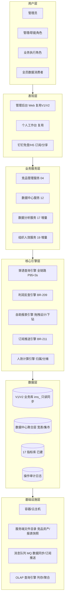
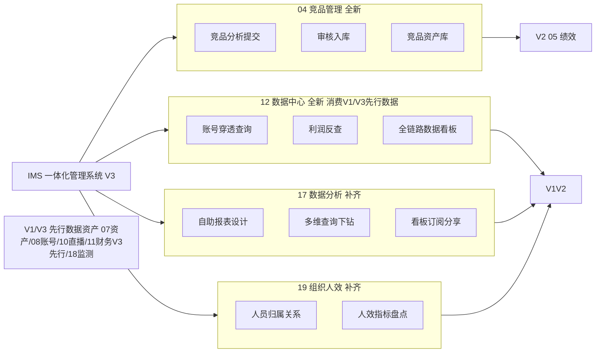
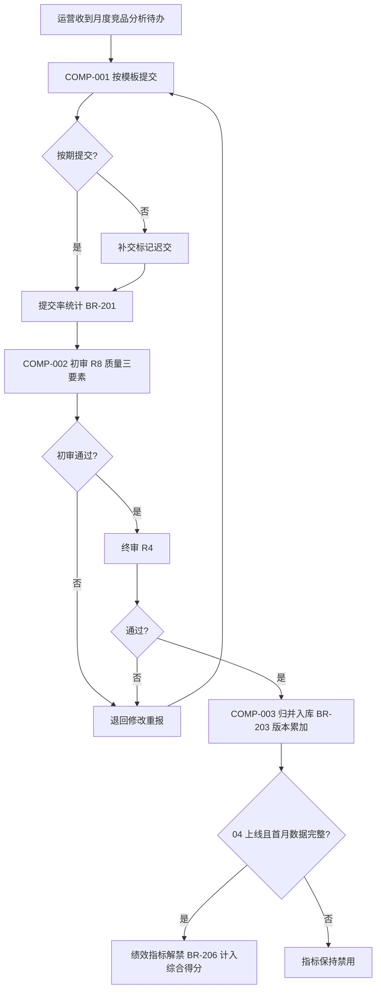
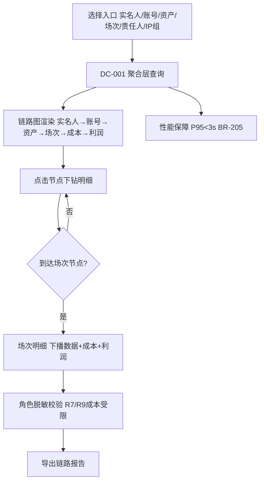
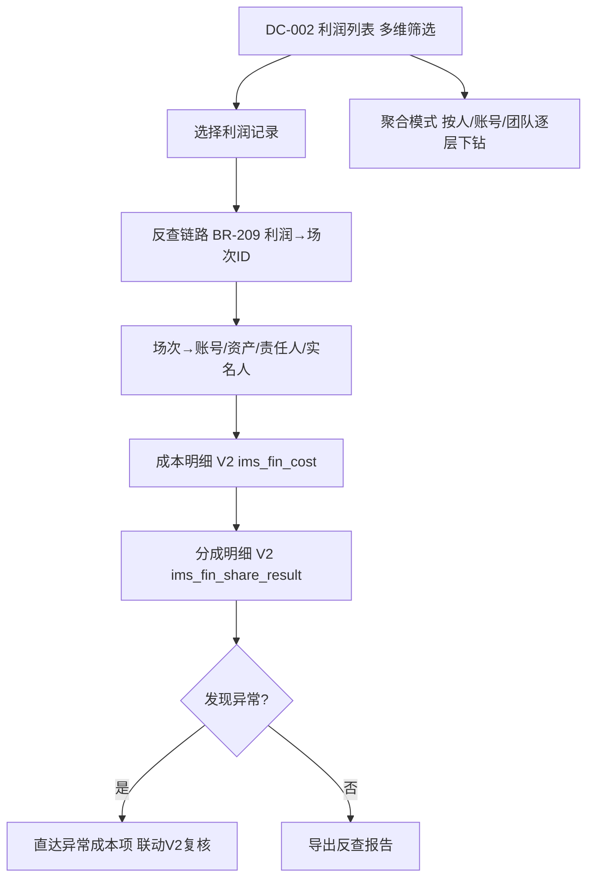
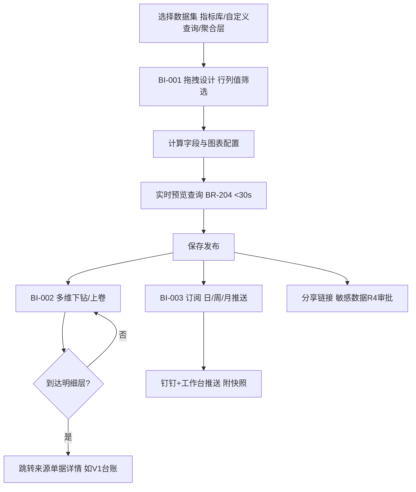
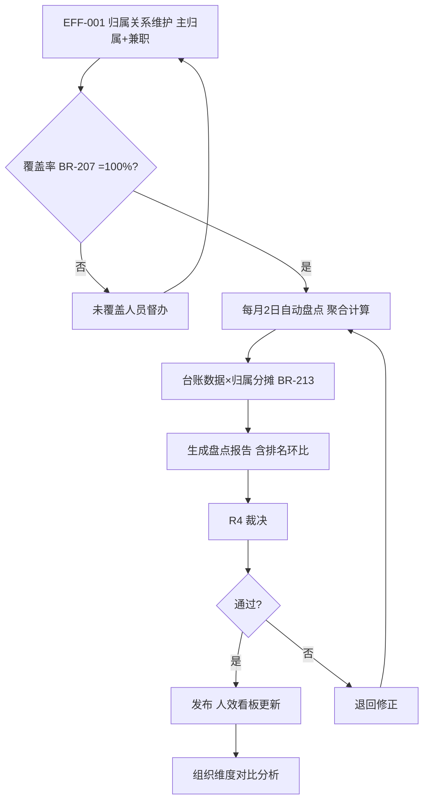

# 神鱼体育 一体化管理系统（IMS）第三期（V3）产品需求文档

> **文档用途**：开发就绪 PRD（Product Requirement Document），供架构、开发、测试直接依据实施。
> **覆盖范围**：IMS 第三期（V3）全部产品功能——11 财务核算（由 V2 移入，V3 第 28~33 周先行批次）、04 竞品管理（全新）、12 数据中心（全新，消费 V1/V3 先行数据）、17 数据分析（补齐，指标管理/自定义查询已完成）、19 组织人效（补齐，IP 组管理已完成）。
> **分期口径**：V3 = 第 28~38 周（9~11 周，P2）。第 7 章数据库设计概要、第 8 章 API 路径规范由架构师负责撰写，本版预留章节号。
> **依据文档**：《IMS 一体化管理系统需求说明书》、《IMS 第一期 PRD（V1）》、《IMS 第二期 PRD（V2）》、《IMS 三期总体规划》。
> **周次格式约定**：全文周次统一使用波浪号格式（如"第 28~38 周"、"第 31~38 周"）。

## 版本历史

| 版本 | 日期 | 更新内容 | 更新人 |
|------|------|----------|--------|
| V1.0 | 2025-06-10 | 初稿：基于 IMS 需求说明书与三期规划，完成 V3（第 28~38 周）产品部分全部章节 | 许清楚（Xu·产品经理） |
| v1.1.0 | 2026-09-14 | 嵌入架构师第 7/8 章（数据库设计概要与 API 路径规范）及 V3 期架构技术约束（9A 章），形成开发就绪完整版 | 齐活林（汇编） |
| v1.2.0 | 2026-09-28 | 2026-09-19 规划重排落地：11 财务核算由 V2 移入 V3（第 28~33 周先行批次，原 V2 5.16~5.19 与 BR-107/108/109/118 迁入），BR-206 量化、里程碑 M0 拆分 | 许清楚（Xu·产品经理） |
| v1.3.0 | 2026-09-29 | 用户走查 #13：侧栏 L1「穿透查询」仅 DC-001；DC-002/003 菜单迁出；交互强调源头+关联逐层下钻与图表明细同屏；OPS「线索挖掘」**无 SSOT** | 许清楚（Xu·产品经理） |

---

## 目录

1. 产品概述
   - 1.1 产品背景
   - 1.2 产品定位
   - 1.3 核心业务规则表
2. 产品逻辑架构
3. 功能架构
   - 3A. 产品功能点列表
4. 目标用户与权限矩阵
5. 功能详细设计（开发功能点级别）
6. 业务流程总览
7. 数据库设计概要
8. API 路径规范
9. 架构技术约束（9A）与非功能性需求
10. 附录
11. 分期与验收

---

# 1. 产品概述

## 1.1 产品背景

V1（第 1~14 周）完成流程线上化与台账留痕，V2（第 15~27 周）完成管理闭环（培训/日报/上报/工作流/AI 资源中台/绩效/预警；11 财务核算移入 V3 先行批次）。两期上线后，系统已积累：

- **V1 数据**：07 资产台账、08 账号台账与时间线、10 直播场次台账（含下播数据与成本）、15 内容生产归档、16 采集数据、18 作品监测数据；
- **V3 先行数据：11 财务核算（成本/利润/分成，第 28~33 周先行交付，先于 12/19 消费时点）**、V2 数据：02/03/09 管理动作数据、05 绩效结果。

但三期规划中仍有四块能力缺口（P-21 起编号）：

| 编号 | 问题描述 | 影响 |
|------|----------|------|
| P-21 | 竞品情报靠运营个人手工收集，无提交/审核/入库流程，竞品资产散落无法复用 | 情报资产不沉淀，重复劳动；V2 绩效中"竞品分析提交率"指标无法启用 |
| P-22 | 数据分散在 07/08/10/11 各模块，无法从实名人/账号一键穿透全链路（实名人→账号→资产→场次→成本→利润），管理层无全局经营视图 | 追责与复盘靠人工拼表，决策慢 |
| P-23 | 查询能力局限于预置页面：指标管理/自定义查询（17，已完成部分）之外，业务方无法自助设计报表、多维下钻、订阅分享 | 报表需求排队开发，数据消费瓶颈 |
| P-24 | 人员与 IP 组归属关系（19，IP 组管理已完成部分）未与人效数据打通，无法盘点"哪个团队/哪个人产出多少" | 人效黑箱，组织优化缺依据 |

**不做的后果**：若 V3 不落地，三期规划的数据资产化目标落空——竞品情报继续流失；全链路穿透与利润反查无法实现；数据消费继续依赖开发排队；人效盘点无从谈起；V2 预留的"竞品分析提交率"绩效指标（BR-110）持续禁用。

**V3 关键原则**：
1. **无上游台账新建**：12 数据中心完全消费 V1/V3 先行 11 已积累数据（07/08/10/11 等），只建查询与聚合层，不建业务台账；
2. **补齐不重建**：17 数据分析在已完成的指标管理/自定义查询之上补齐自助报表/下钻/订阅分享；19 组织人效在已完成的 IP 组管理之上补齐人员归属与人效盘点；
3. **指标解禁联动**：04 竞品管理上线后同步启用 V2 绩效"竞品分析提交率"指标项（BR-110 → BR-206 联动）；
4. **穿透链路口径统一**：场次 ID 贯穿全链路（实名人→账号→资产→场次→成本→利润）。

## 1.2 产品定位

V3 是 IMS 从"**管理闭环化**"迈向"**数据资产化与决策智能化**"的一期：

- **对管理层**：全链路数据看板提供账号—资产—人—场次—成本—利润的一屏穿透；人效盘点提供组织产出全景；
- **对运营团队**：竞品情报资产库沉淀可复用的分析资产；绩效体系补齐竞品分析维度；
- **对全体数据消费者**：自助报表设计+多维下钻+订阅分享，数据消费自助化；
- **对系统本身**：完成三期规划收官，形成"流程（V1）→ 管理（V2）→ 决策（V3）"完整闭环。

## 1.3 核心业务规则表

| 编号 | 名称 | 描述 | 计算公式 |
|------|------|------|----------|
| BR-101 | 培训每周更新率 | 岗位资料库每周有新增/更新的比率（由 V2 移入备案） | 更新率 = 本周有更新资料数 / 应更新资料数；目标 = 100% |
| BR-107 | 成本录入完整率 | 直播场次成本录入完整比率（联动 V1 BR-006/BR-007，由 V2 移入） | 完整率 = 成本录入齐全场次数 / 已核准场次总数；目标 > 95% |
| BR-108 | 单场利润自动计算 | 单场净利润计算公式（由 V2 移入） | 净利润 = GMV − 退款额 − 平台佣金 − 投放成本 − 冲话费摊销 − 场次固定成本 − 达人分成 − 实名人分成 |
| BR-109 | 分成规则引擎 | 分成基数与比例计算（由 V2 移入） | 分成金额 = 分成基数（毛利或 GMV，按规则配置）× 分成比例（支持阶梯：基数分档 × 对应比例求和） |
| BR-118 | 成本未录入预警联动 | 成本录入完整性纳入预警中心（由 V2 移入） | 下播数据核准后 48 小时未录入成本 → 触发成本未录入预警（ALERT 规则子集） |
| BR-201 | 竞品分析提交率 | 竞品分析的提交比率（V2 BR-110 禁用项，V3 启用） | 提交率 = 按期提交竞品分析份数 / 应提交份数（按人月统计）；目标 > 95%；04 上线后自动启用为绩效指标 |
| BR-202 | 竞品入库审核 | 竞品分析入库规则 | 入库条件 = 审核通过（数据来源可靠 + 字段齐全 + 结论明确）；未通过退回补充 |
| BR-203 | 竞品资产唯一性 | 同一竞品对象的资产归并规则 | 归并键 = 竞品名称/账号 ID（标准化后）；重复提交归并到同一竞品档案，版本累加 |
| BR-204 | 报表查询性能 | 自助报表大数据量查询时效 | 10 万行级数据集查询 < 30 秒（含聚合下钻） |
| BR-205 | 穿透查询性能 | 全链路穿透查询时效 | P95 < 3 秒（实名人→账号→资产→场次→成本→利润 任意入口穿透） |
| BR-206 | 绩效指标解禁 | 竞品分析提交率指标启用条件 | 启用条件 = 04 竞品管理正式上线 AND 首月数据完整（首月应提交份数的提交率 ≥ 95% 且入库归档完成）；启用后计入 PERF 综合得分（权重由绩效配置决定） |
| BR-207 | 人效盘点覆盖率 | 人员归属与人效数据的覆盖比率 | 覆盖率 = 已建立归属关系且纳入人效统计的人数 / 在职总人数；目标 = 100% |
| BR-208 | 资产关联完整率（全链路复核） | V1 BR-003 的全链路升级口径 | 完整率 = 全链路（资产→人→账号→场次→成本→利润）字段齐全的资产数 / 资产总数；目标 > 98% |
| BR-209 | 利润反查规则 | 从利润结果反查链路的聚合规则 | 反查路径 = 利润记录 → 场次 ID → 账号/资产/责任人/实名人 → 成本明细；支持聚合（按人/账号/团队汇总）与明细两种模式 |
| BR-210 | 数据中心数据新鲜度 | 聚合层与源数据延迟 | 业务台账 → 数据中心聚合层延迟 < 1 小时（T+1 深度汇总） |
| BR-211 | 看板订阅规则 | 看板订阅与推送周期 | 订阅周期 = 日/周/月（用户可选）；推送通道 = 钉钉工作通知 + 工作台；数据快照留档 |
| BR-212 | 自助报表权限继承 | 报表数据权限规则 | 报表查询结果按创建者与查看者的角色数据权限双重过滤（行级）；报表分享不突破原权限 |
| BR-213 | 人员归属关系口径 | 组织人效归属唯一性 | 唯一在职主归属（一主多兼：主归属计入人效，兼职按比例分摊，比例合计 ≤ 100%） |
| BR-214 | 竞品资产引用计数 | 竞品资产复用度量 | 引用计数 = 被报表/看板/穿透查询引用次数；热度排行纳入资产价值评估 |

---

# 2. 产品逻辑架构

## 2.1 六层架构图



## 2.2 各层职责表

| 层 | 职责 | V3 关键内容 |
|----|------|-------------|
| 用户层 | 全员数据消费 + 管理层决策视图 | 订阅/分享触达（钉钉 H5） |
| 表现层 | 复用 V1/V2 管理后台与工作台 | 新增竞品库、数据中心、自助报表、人效盘点页面 |
| 业务服务层 | 四大业务域服务 | 04/12/17 增量/19 增量 |
| 核心引擎层 | 数据消费引擎 | 全链路穿透、利润反查、报表设计/下钻、订阅推送、人效计算 |
| 数据层 | 业务库只读同步 + 聚合层宽表 + 指标库 | 消费 07/08/10 台账 + V3 先行 11 财务（BR-210 新鲜度 < 1 小时） |
| 基础设施层 | 容器、服务端文件目录、MQ、OLAP 引擎 | 10 万行级查询 < 30 秒（BR-204）支撑 |

---

# 3. 功能架构

## 3.1 模块图



## 3.2 模块清单表

| 模块编号 | 模块名称 | 建设类型 | 周次 | V3 交付内容 | 依赖 |
|----------|----------|----------|------|-------------|------|
| 11 | 财务核算 | 全新（由 V2 移入） | 先行批次（第 28~33 周） | 单场成本录入、利润自动计算、分成规则引擎、利润看板（V2 原设计迁移） | V1 直播台账（ims_live_session）；成本/分成口径拍板（V3 前置阶段完成） |
| 04 | 竞品管理 | 全新 | 第 31~38 周 | 竞品分析提交、审核入库、竞品资产库；上线后启用 V2 绩效"竞品分析提交率"指标（BR-206） | V2 05 绩效 |
| 12 | 穿透查询（原数据中心） | 全新 | 第 28~35 周 | **侧栏仅 DC-001** 全链路穿透；DC-002/003 API 保留，入口分别迁至 11 财务 / 17a 指标报表（走查 #13） | V1 07/08/10、V3 先行 11（财务数据第 31~32 周接入） |
| 17 | 数据分析 | 补齐 | 第 29~36 周 | 自助报表设计、多维查询下钻、看板订阅分享（指标管理/自定义查询已完成，不重复建设） | 已建指标库/自定义查询 |
| 19 | 组织人效 | 补齐 | 第 32~38 周 | 人员归属关系、人效指标盘点（IP 组管理已完成，不重复建设） | 已建 IP 组管理、V1/V2 台账 |

## 3.3 关键流程贯穿表

| 流程 | 贯穿模块 | 触发 | 结果 |
|------|----------|------|------|
| 竞品情报入库 | 04→05(V2) | 运营提交分析 | 审核入库 → 竞品资产库 → 绩效指标解禁（BR-201/BR-206） |
| 账号全链路穿透 | 12→07/08/10/11(V1/V3 先行) | 查询发起 | 实名人→账号→资产→场次→成本→利润一屏穿透（BR-205） |
| 利润反查 | 12→11(V3 先行)→10(V1) | 从利润记录发起 | 利润 → 场次 ID → 账号/人/成本明细（BR-209） |
| 自助报表消费 | 17→聚合层→源数据 | 业务自助 | 拖拽设计 → 下钻 → 订阅推送（BR-204/BR-211/BR-212） |
| 人效盘点 | 19→12→V1/V2 台账 | 周期盘点 | 归属关系 → 人效指标计算 → 盘点报告（BR-207/BR-213） |

## 3A. 产品功能点列表

### 3A.1 功能编号体系

| 前缀 | 业务域 | 示例 |
|------|--------|------|
| FIN- | 11 财务核算（V3 先行批次，由 V2 移入） | FIN-001 |
| COMP- | 04 竞品管理 | COMP-001 |
| DC- | 12 数据中心 | DC-001 |
| BI- | 17 数据分析（增量） | BI-001 |
| EFF- | 19 组织人效 | EFF-001 |

### 3A.2 各业务域功能点明细表

**11 财务核算（FIN，V3 先行批次，由 V2 移入）**

| 编号 | 名称 | 章节 | 优先级 | API 前缀 |
|------|------|------|--------|----------|
| FIN-001 | 单场成本录入 | 5.0.1 | P1 | /admin-api/ims/fin/cost |
| FIN-002 | 利润自动计算 | 5.0.2 | P1 | /admin-api/ims/fin/profit |
| FIN-003 | 分成规则引擎 | 5.0.3 | P1 | /admin-api/ims/fin/share |
| FIN-004 | 利润看板 | 5.0.4 | P1 | /admin-api/ims/fin/dashboard |

**04 竞品管理（COMP）**

| 编号 | 名称 | 章节 | 优先级 | API 前缀 |
|------|------|------|--------|----------|
| COMP-001 | 竞品分析提交 | 5.1 | P2 | /admin-api/ims/comp/analysis |
| COMP-002 | 审核入库 | 5.2 | P2 | /admin-api/ims/comp/audit |
| COMP-003 | 竞品资产库 | 5.3 | P2 | /admin-api/ims/comp/asset |

**12 数据中心（DC）**

| 编号 | 名称 | 章节 | 优先级 | API 前缀 |
|------|------|------|--------|----------|
| DC-001 | 账号穿透查询 | 5.4 | P2 | /admin-api/ims/dc/trace |
| DC-002 | 利润反查 | 5.5 | P2 | /admin-api/ims/dc/profit-trace |
| DC-003 | 全链路数据看板 | 5.6 | P2 | /admin-api/ims/dc/dashboard |

**17 数据分析（BI，增量）**

| 编号 | 名称 | 章节 | 优先级 | API 前缀 |
|------|------|------|--------|----------|
| BI-001 | 自助报表设计 | 5.7 | P2 | /admin-api/ims/bi/report |
| BI-002 | 多维查询下钻 | 5.8 | P2 | /admin-api/ims/bi/query |
| BI-003 | 看板订阅分享 | 5.9 | P2 | /admin-api/ims/bi/subscribe |

**19 组织人效（EFF）**

| 编号 | 名称 | 章节 | 优先级 | API 前缀 |
|------|------|------|--------|----------|
| EFF-001 | 人员归属关系 | 5.10 | P2 | /admin-api/ims/eff/relation |
| EFF-002 | 人效指标盘点 | 5.11 | P2 | /admin-api/ims/eff/metrics |

### 3A.3 功能点统计

| 业务域 | 功能点数 | P1 | P2 |
|--------|----------|----|----|
| 11 财务核算（V3 先行批次，由 V2 移入） | 4 | 4 | 0 |
| 04 竞品管理 | 3 | 0 | 3 |
| 12 数据中心 | 3 | 3 |
| 17 数据分析（增量） | 3 | 3 |
| 19 组织人效 | 2 | 2 |
| **合计** | **11** | **11** |

---

# 4. 目标用户与权限矩阵

## 4.1 角色清单（沿用 V1/V2 十类角色）

V3 沿用 V1/V2 角色体系（R1~R10，见 V1 PRD 第 4 章），V3 新增职责：

| # | 角色 | V3 新增主要职责 |
|---|------|-----------------|
| R1 | 系统管理员 | 数据中心聚合层运维、报表/看板全局管理、订阅推送配置 |
| R2 | 行政管理员 | 人员归属关系维护（人效主责之一） |
| R3 | 财务管理员 | 成本录入、利润核算、分成计算主责（11 财务先行批次，由 V2 移入）；利润反查、成本明细穿透（数据权限最高之一） |
| R4 | 运营总监 | 全链路看板、竞品审核终审、人效盘点裁决；分成单双审 |
| R5 | 直播运营 | 成本协录（本团队场次）；竞品分析提交、本人团队穿透查询 |
| R6 | 短视频运营 | 竞品分析提交、自助报表使用 |
| R7 | 主播/达人 | 本人账号链路视图（脱敏成本） |
| R8 | 内容审核员 | 竞品入库初审（数据质量） |
| R9 | 数据分析师 | 全域自助报表/下钻/订阅（成本脱敏） |
| R10 | 外协人员 | 无 V3 新增权限（保持 V1/V2 既有） |

权限标记：**R**=查看，**W**=编辑/提交，**D**=删除/终审；括号内为数据范围限定。

## 4.2 角色×功能矩阵

| 功能点 | R1 | R2 | R3 | R4 | R5 | R6 | R7 | R8 | R9 | R10 |
|--------|----|----|----|----|----|----|----|----|----|----|
| FIN-001 单场成本录入 | R（全量） | — | R/W/D（全量主责） | R/W（全量） | W（协录本团队场次） | — | — | — | R（全量） | — |
| FIN-002 利润自动计算 | R（全量） | — | R/W/D（全量主责） | R（全量） | — | — | — | — | R（全量） | — |
| FIN-003 分成规则引擎 | R/W/D（全量） | — | R/W/D（全量主责） | R/W（审批） | — | — | R（本人分成单） | — | — | — |
| FIN-004 利润看板 | R（全量） | — | R/W（全量） | R（全量） | R（本团队场次） | — | R（本人场次） | — | R（全量） | — |
| COMP-001 竞品分析提交 | R（全量） | — | — | R（全量） | W（提交） | W（提交） | — | — | — | — |
| COMP-002 审核入库 | R（全量） | — | — | R/W/D（终审） | — | — | — | W（初审） | — | — |
| COMP-003 竞品资产库 | R/W/D（全量） | R | R（财务维度） | R/W（全量） | R（全量只读） | R（全量只读） | — | R | R（全量） | — |
| DC-001 账号穿透查询 | R（全量） | R（全量） | R（全量） | R（全量） | R（本团队账号） | — | R（本人账号链路，成本脱敏） | — | R（全量，成本脱敏） | — |
| DC-002 利润反查 | R（全量） | — | R/W（全量主责） | R（全量） | R（本团队场次） | — | R（本人场次） | — | R（全量） | — |
| DC-003 全链路数据看板 | R/W/D（全量配置） | R | R（全量） | R/W（全量） | R（本团队） | R（内容域） | R（本人） | — | R（全量，脱敏） | — |
| BI-001 自助报表设计 | R/W/D（全量） | R（使用） | R/W（设计） | R/W（设计） | R/W（设计本域） | R/W（设计本域） | — | — | R/W（设计全量，成本脱敏） | — |
| BI-002 多维查询下钻 | R（全量） | R（行政维度） | R（全量） | R（全量） | R（本域） | R（本域） | — | — | R（全量，脱敏） | — |
| BI-003 看板订阅分享 | R/W/D（全量） | W（订阅） | W（订阅） | W（订阅+分享审批） | W（订阅） | W（订阅） | W（订阅本人） | — | W（订阅+分享） | — |
| EFF-001 人员归属关系 | R/W/D（全量） | R/W（全量主责） | — | R（全量） | — | — | R（本人归属） | — | R | — |
| EFF-002 人效指标盘点 | R/W/D（全量配置） | R/W（盘点执行） | R（成本/利润维度） | R/W/D（裁决发布） | R（本人+团队） | R（本人+团队） | R（本人） | — | R（全量脱敏） | — |

---

# 5. 功能详细设计（开发功能点级别）

> 本章共 15 个功能点（第 5.0~5.11 节；其中 5.0 为 11 财务核算先行批次，由 V2 移入）。17/19 为补齐类功能点，头部标注"现状"行。

## 5.0 财务核算（V3 第 28~33 周先行批次，由 V2 移入）

> 本节四个功能点（FIN-001~004）由 V2 PRD 原设计整体迁移（原 V2 5.16~5.19），仅期次口径调整为"V3 第 28~33 周先行批次（由 V2 移入）"，功能描述/数据结构/业务规则/操作流程/权限/API 内容原样保留。

## 5.0.1 财务核算 - 单场成本录入

**功能编号**：FIN-001
**优先级**：P1
**对应表**：`ims_fin_cost`（消费 V1 `ims_live_session`/`ims_live_report`/`ims_live_cost`）
**对应API**：`/admin-api/ims/fin/cost/*`

### 功能描述

以 V1 直播场次（场次 ID 口径：IMS+yyyyMMdd+3 位平台码+4 位序列，见 V1 BR-011）为单位录入成本。核心能力：
1. 场次选择：从 V1 台账拉取已核准场次（下播数据已核准的场次才可录成本）；
2. 成本项录入：平台佣金、投放成本（联动 V1 冲话费）、固定成本（场地/设备折旧/人力）、达人分成、实名人分成、样品成本；
3. 成本分摊：多场次共担成本按规则分摊（比例/场次 GMV 权重）；
4. 完整率统计（BR-107 > 95%）与未录入预警（BR-118）。

### 数据结构

| 字段 | 类型 | 说明 |
|------|------|------|
| id | BIGINT PK | 主键 |
| session_code | VARCHAR(20) | 场次 ID（V1 台账，如 IMS20250610DY0001，唯一索引） |
| platform | VARCHAR(32) | 平台（V1 场次带出，只读） |
| cost_gmv / cost_refund | DECIMAL(12,2) | GMV/退款（V1 下播数据带出，只读） |
| commission_rate | DECIMAL(5,4) | 平台佣金率 |
| ad_cost | DECIMAL(12,2) | 投放成本（可从 V1 ims_live_cost 汇总带入） |
| recharge_cost | DECIMAL(12,2) | 冲话费摊销 |
| fixed_cost | DECIMAL(12,2) | 固定成本 |
| sample_cost | DECIMAL(12,2) | 样品成本 |
| share_daren / share_realname | DECIMAL(12,2) | 达人/实名人分成（可由 FIN-003 引擎计算） |
| share_cost_type | TINYINT | 1 手工录入 / 2 引擎计算 |
| entry_status | TINYINT | 0 草稿 / 1 已提交 / 2 已核准 |
| entry_user_id / entry_at | BIGINT / DATETIME | 录入人/时间 |

### 业务规则

- FIN-C-R1：仅 V1 场次状态下播数据"已核准"的场次可录入成本；
- FIN-C-R2：GMV/退款从 V1 报告只读带出，不可在财务侧修改（数据同源）；
- FIN-C-R3：成本核准后 48 小时未录入触发预警（BR-118，联动 V2 13 预警中心规则启用）；
- FIN-C-R4：成本提交后字段修改走更正单留痕。

### 操作流程

1. 财务从待录入清单选择已核准场次；
2. 系统带入 GMV/退款/投放汇总（只读）；
3. 录入各成本项（分成可先手工，引擎上线后自动）；
4. 提交 → 财务核准 → 进入利润计算。

### 权限说明

- **查看**：R1、R3（全量主责）、R4、R9、R5（本团队场次）
- **新增/编辑**：R3（主责）、R5（协录）、R4
- **删除（更正）**：R3、R1

### API 设计

| 方法 | 路径 | 说明 |
|------|------|------|
| GET | `/admin-api/ims/fin/cost/pending-sessions` | 待录入场次清单（V1 台账） |
| POST | `/admin-api/ims/fin/cost/{sessionCode}` | 提交成本录入 |
| GET | `/admin-api/ims/fin/cost/{sessionCode}` | 成本详情 |
| PUT | `/admin-api/ims/fin/cost/{sessionCode}` | 编辑（核准前） |
| PUT | `/admin-api/ims/fin/cost/{sessionCode}/confirm` | 财务核准 |
| POST | `/admin-api/ims/fin/cost/{sessionCode}/correction` | 成本更正单 |
| GET | `/admin-api/ims/fin/cost/complete-rate` | 完整率统计（BR-107） |

## 5.0.2 财务核算 - 利润自动计算

**功能编号**：FIN-002
**优先级**：P1
**对应表**：`ims_fin_profit`
**对应API**：`/admin-api/ims/fin/profit/*`

### 功能描述

成本核准后自动计算单场利润（BR-108）。核心能力：
1. 利润公式引擎：净利润 = GMV − 退款额 − 平台佣金 − 投放成本 − 冲话费摊销 − 场次固定成本 − 达人分成 − 实名人分成；
2. 多级利润口径：毛利（GMV−退款−佣金）、经营利润（毛利−投放−冲话费）、净利润（全扣）；
3. 重算机制：成本更正后自动重算并标记重算版本；
4. 成本未录入预警联动（BR-118）；
5. 利润异常检测（净利率偏离同均值 2σ 预警）。

### 数据结构

| 字段 | 类型 | 说明 |
|------|------|------|
| id | BIGINT PK | 主键 |
| session_code | VARCHAR(20) | 场次 ID（唯一索引） |
| gross_profit | DECIMAL(12,2) | 毛利 |
| operating_profit | DECIMAL(12,2) | 经营利润 |
| net_profit | DECIMAL(12,2) | 净利润（BR-108） |
| net_profit_rate | DECIMAL(5,2) | 净利率 |
| calc_version | INT | 计算版本（重算递增） |
| calc_rule_snapshot | JSON | 计算时公式与参数快照 |
| calc_status | TINYINT | 0 待计算 / 1 已计算 / 2 已重算 / 3 异常待核 |
| calculated_at | DATETIME | 计算时间 |

### 业务规则

- FIN-P-R1：成本核准（FIN-001）后 5 分钟内自动完成计算；
- FIN-P-R2：三级利润口径同时落库（看板切换用）；
- FIN-P-R3：成本更正触发重算，旧结果版本留痕；
- FIN-P-R4：净利率异常（偏离同类均值 2 倍标准差）标记待核并预警。

### 操作流程

1. 成本核准事件触发计算引擎；
2. 引擎按 BR-108 公式计算三级利润；
3. 结果落库 → 异常检测；
4. 更正触发重算（版本化）。

### 权限说明

- **查看**：R1、R3（全量主责）、R4、R9、R5（本团队场次）、R7（本人场次）
- **新增/编辑（重算触发）**：R3、R1
- **删除**：R1

### API 设计

| 方法 | 路径 | 说明 |
|------|------|------|
| GET | `/admin-api/ims/fin/profit/{sessionCode}` | 单场利润详情 |
| GET | `/admin-api/ims/fin/profit/list` | 利润列表（多维筛选） |
| POST | `/admin-api/ims/fin/profit/recalc/{sessionCode}` | 手动触发重算 |
| GET | `/admin-api/ims/fin/profit/abnormal` | 异常净利率清单 |
| GET | `/admin-api/ims/fin/profit/history/{sessionCode}` | 重算版本历史 |

## 5.0.3 财务核算 - 分成规则引擎

**功能编号**：FIN-003
**优先级**：P1
**对应表**：`ims_fin_share_rule`、`ims_fin_share_result`
**对应API**：`/admin-api/ims/fin/share/*`

### 功能描述

分成规则配置与自动计算（BR-109）。核心能力：
1. 规则配置：分成对象（达人/实名人/团队）、分成基数（GMV/毛利/净利润）、分成比例（固定或阶梯）；
2. 阶梯规则：基数分档 × 对应比例，逐档计算求和；
3. 规则优先级与适用范围（按平台/账号/IP 组限定）；
4. 分成单生成与审批（结果发放前须财务+运营总监双审）；
5. 规则版本化与生效审计。

### 数据结构

| 字段 | 类型 | 说明 |
|------|------|------|
| id | BIGINT PK | 主键 |
| rule_name | VARCHAR(64) | 规则名称 |
| share_target | TINYINT | 1 达人 / 2 实名人 / 3 团队 |
| base_type | TINYINT | 1 GMV / 2 毛利 / 3 净利润 |
| rate_type | TINYINT | 1 固定比例 / 2 阶梯 |
| fixed_rate | DECIMAL(5,4) | 固定比例 |
| ladder_config | JSON | 阶梯配置（[{min,max,rate},…]） |
| scope | JSON | 适用范围（平台/账号/IP 组） |
| priority | INT | 优先级（冲突时高优先） |
| version | INT | 版本 |
| status | TINYINT | 0 停用 / 1 启用 |

`ims_fin_share_result`：id、session_code、rule_id、share_target、target_ref_id（达人/实名人/团队 ID）、share_base（分成基数）、share_amount（分成金额）、calc_detail（JSON 计算过程）、status（0 待审 / 1 已审 / 2 已发放 / 3 已冲销）、audited_by、audited_at。

### 业务规则

- FIN-S-R1：分成金额（BR-109）= 分成基数 × 分成比例；阶梯模式逐档求和；
- FIN-S-R2：利润计算（FIN-002）完成后自动生成对应分成单；
- FIN-S-R3：分成单须财务 + 运营总监双审后生效；
- FIN-S-R4：规则冲突按优先级取最高；同对象命中多条规则时取优先级最高一条；
- FIN-S-R5：规则变更不影响已生成分成单（重算需人工触发并留痕）。

### 操作流程

1. 财务配置分成规则（基数/比例/范围/优先级）；
2. 利润计算完成 → 引擎匹配规则生成分成单；
3. 双审批（财务 + 运营总监）；
4. 发放登记与冲销（负向调整）。

### 权限说明

- **查看**：R1、R3（全量主责）、R4、R7（本人分成单）、R9（脱敏）
- **新增/编辑（规则）**：R3（主责）
- **删除（停用）**：R3、R1
- **审批**：R3 + R4（双审）

### API 设计

| 方法 | 路径 | 说明 |
|------|------|------|
| GET | `/admin-api/ims/fin/share/rules` | 规则列表 |
| POST | `/admin-api/ims/fin/share/rule` | 创建规则 |
| PUT | `/admin-api/ims/fin/share/rule/{id}` | 编辑规则（新版本） |
| DELETE | `/admin-api/ims/fin/share/rule/{id}` | 停用规则 |
| POST | `/admin-api/ims/fin/share/simulate` | 规则试算（给定基数预估） |
| GET | `/admin-api/ims/fin/share/results` | 分成单列表 |
| PUT | `/admin-api/ims/fin/share/result/{id}/audit` | 分成单审批 |
| PUT | `/admin-api/ims/fin/share/result/{id}/payoff` | 发放登记 |

## 5.0.4 财务核算 - 利润看板

**功能编号**：FIN-004
**优先级**：P1
**对应表**：`ims_fin_profit`（聚合视图）、`ims_fin_dashboard_cache`
**对应API**：`/admin-api/ims/fin/dashboard/*`

### 功能描述

经营利润可视化看板。核心能力：
1. 总览：周期净利润、净利率、GMV、成本结构占比；
2. 多维下钻：按平台/账号/IP 组/达人/责任人/时间；
3. 趋势对比：环比/同比、场次级明细入口；
4. 分成汇总：各分成对象周期分成总额；
5. 报表导出（Excel/PDF）。

### 数据结构

| 字段 | 类型 | 说明 |
|------|------|------|
| id | BIGINT PK | 主键 |
| stat_period | VARCHAR(16) | 统计周期（日/周/月） |
| dimension_type | VARCHAR(32) | 维度（platform/account/ip_group/daren/owner） |
| dimension_value | VARCHAR(64) | 维度值 |
| total_gmv / total_cost / net_profit | DECIMAL(14,2) | 聚合值 |
| session_count | INT | 场次数 |
| refreshed_at | DATETIME | 刷新时间 |

### 业务规则

- FIN-B-R1：看板数据小时级刷新（缓存表），明细实时查；
- FIN-B-R2：下钻最深到场次明细（联动 V1 台账详情）；
- FIN-B-R3：数据权限与角色矩阵一致（R5 本团队、R7 本人场次、R9 全量只读）。

### 操作流程

1. 管理层打开利润看板；
2. 切换周期与口径（毛利/经营/净利）；
3. 按维度下钻至场次明细；
4. 导出报表。

### 权限说明

- **查看**：R1、R3、R4、R9（全量）、R5（本团队）、R7（本人场次）
- **导出**：R1、R3、R4、R9
- **写操作**：无（缓存自动刷新）

### API 设计

| 方法 | 路径 | 说明 |
|------|------|------|
| GET | `/admin-api/ims/fin/dashboard/overview` | 总览指标 |
| GET | `/admin-api/ims/fin/dashboard/trend` | 趋势分析 |
| GET | `/admin-api/ims/fin/dashboard/drilldown` | 多维下钻 |
| GET | `/admin-api/ims/fin/dashboard/cost-structure` | 成本结构占比 |
| GET | `/admin-api/ims/fin/dashboard/share-summary` | 分成汇总 |
| GET | `/admin-api/ims/fin/dashboard/export` | 报表导出 |

## 5.1 竞品管理 - 竞品分析提交

**功能编号**：COMP-001
**优先级**：P2
**对应表**：`ims_comp_analysis`
**对应API**：`/admin-api/ims/comp/analysis/*`

### 5.1.1 功能描述

竞品分析的规范化提交。核心能力：
1. 提交模板：竞品对象、分析周期、数据来源、维度字段（销售/GMV/价格带/内容策略/投放策略）、结论与可借鉴点；
2. 附件上传（截图/表格凭证）；
3. 提交频率：按岗位指派（每人每月应提交份数可配，供 BR-201 统计）；
4. 提交率统计（BR-201 > 95%），数据同时供绩效取数（BR-206）。

### 5.1.2 数据结构

| 字段 | 类型 | 说明 |
|------|------|------|
| id | BIGINT PK | 主键 |
| analysis_no | VARCHAR(32) | 分析编号（CA+日期+流水） |
| submitter_user_id | BIGINT | 提交人 |
| period_month | CHAR(7) | 分析所属月（yyyy-MM） |
| comp_name | VARCHAR(128) | 竞品对象名称 |
| comp_account_id | VARCHAR(64) | 竞品账号 ID（可选） |
| data_source | VARCHAR(256) | 数据来源说明 |
| dimension_data | JSON | 维度字段数据（销售/GMV/价格带/策略等） |
| conclusion | TEXT | 结论与可借鉴点 |
| attachments | JSON | 附件列表 |
| submit_status | TINYINT | 0 草稿 / 1 已提交 / 2 已入库 / 3 已退回 |
| is_on_time | TINYINT | 是否按期（BR-201） |
| submitted_at | DATETIME | 提交时间 |

### 5.1.3 业务规则

- CMP-A-R1：提交截止 = 每月 25 日 22:00（可配）；逾期可补交标记迟交；
- CMP-A-R2：提交率（BR-201）= 按期提交份数 / 应提交份数（按人月）；按期含 3 日内补交；
- CMP-A-R3：提交数据进入审核流（COMP-002），退回可修改重报；
- CMP-A-R4：同一竞品对象多次提交归并（BR-203，以入库归并为准）。

### 5.1.4 操作流程

1. 运营收到月度竞品分析待办（工作台）；
2. 按模板填写维度数据与结论（附凭证）；
3. 提交 → 进入审核队列；
4. 退回则修改重报；入库后计入提交率与绩效取数。

### 5.1.5 权限说明

- **查看**：R1（全量）、R4（全量）、R5/R6（本人提交）
- **新增/编辑**：R5、R6（本人，提交前与退回后）
- **删除**：R1

### 5.1.6 API 设计

| 方法 | 路径 | 说明 |
|------|------|------|
| POST | `/admin-api/ims/comp/analysis` | 提交竞品分析 |
| GET | `/admin-api/ims/comp/analysis/list` | 提交列表 |
| GET | `/admin-api/ims/comp/analysis/{analysisNo}` | 分析详情 |
| PUT | `/admin-api/ims/comp/analysis/{analysisNo}` | 编辑（退回后） |
| GET | `/admin-api/ims/comp/analysis/pending` | 待办提交任务 |
| GET | `/admin-api/ims/comp/analysis/submit-rate` | 提交率统计（BR-201） |

## 5.2 竞品管理 - 审核入库

**功能编号**：COMP-002
**优先级**：P2
**对应表**：`ims_comp_audit`
**对应API**：`/admin-api/ims/comp/audit/*`

### 5.2.1 功能描述

竞品分析审核与入库（BR-202）。核心能力：
1. 两级审核：R8 初审（数据质量：来源可靠/字段齐全/结论明确）→ R4 终审；
2. 入库归并：按 BR-203 归并键归并到竞品档案，版本累加；
3. 退回机制（结构化退回原因）；
4. 审核时效 SLA（提交后 48 小时内完成初审）。

### 5.2.2 数据结构

| 字段 | 类型 | 说明 |
|------|------|------|
| id | BIGINT PK | 主键 |
| analysis_id | BIGINT | 分析 ID |
| audit_round | INT | 审核轮次 |
| audit_level | TINYINT | 1 初审（R8）/ 2 终审（R4） |
| conclusion | TINYINT | 1 通过入库 / 2 退回 |
| reject_reason | VARCHAR(512) | 退回原因（结构化） |
| auditor_user_id | BIGINT | 审核人 |
| audited_at | DATETIME | 审核时间 |

### 5.2.3 业务规则

- CMP-B-R1：入库条件（BR-202）= 来源可靠 + 字段齐全 + 结论明确，三要素齐全方可通过；
- CMP-B-R2：终审通过触发归并入库（BR-203）；
- CMP-B-R3：3 轮退回升级运营总监裁决；
- CMP-B-R4：初审 SLA 48 小时，超时督办。

### 5.2.4 操作流程

1. 提交进入初审队列（R8）；
2. 质量要素核查 → 通过进终审 / 退回；
3. 终审（R4）通过 → 归并入库；
4. 入库完成反馈提交人。

### 5.2.5 权限说明

- **查看**：R1、R4、R8（队列）、提交人（本人状态）
- **新增/编辑（审核结论）**：R8（初审）、R4（终审）
- **删除**：R1

### 5.2.6 API 设计

| 方法 | 路径 | 说明 |
|------|------|------|
| GET | `/admin-api/ims/comp/audit/queue` | 审核队列 |
| PUT | `/admin-api/ims/comp/audit/{analysisNo}` | 提交审核结论 |
| GET | `/admin-api/ims/comp/audit/records` | 审核记录 |
| GET | `/admin-api/ims/comp/audit/merge-preview` | 归并预览（命中既有档案提示） |

## 5.3 竞品管理 - 竞品资产库

**功能编号**：COMP-003
**优先级**：P2
**对应表**：`ims_comp_asset`、`ims_comp_asset_version`
**对应API**：`/admin-api/ims/comp/asset/*`

### 5.3.1 功能描述

入库竞品情报的资产化管理。核心能力：
1. 竞品档案：竞品对象唯一档案（归并键标准化），基本信息+账号+平台；
2. 版本化情报：每次入库分析作为档案新版本（时间序列可对比）；
3. 多维检索：按竞品/平台/时间/提交人/维度字段检索；
4. 引用计数与热度（BR-214）：被报表/看板/穿透查询引用统计；
5. 导出竞品对比报告（多竞品多维横向对比）。

### 5.3.2 数据结构

| 字段 | 类型 | 说明 |
|------|------|------|
| id | BIGINT PK | 主键 |
| asset_no | VARCHAR(32) | 档案编号（CP+日期+流水） |
| comp_name_std | VARCHAR(128) | 标准化竞品名（归并键，唯一索引） |
| comp_account_id | VARCHAR(64) | 竞品账号（第二归并键，可空） |
| platform | VARCHAR(32) | 主要平台 |
| base_info | JSON | 基本信息 |
| latest_version | INT | 最新版本号 |
| reference_count | INT | 引用计数（BR-214） |
| created_at / updated_at | DATETIME | 创建/更新 |

`ims_comp_asset_version`：id、asset_id、version、source_analysis_id（来源分析单）、dimension_data（JSON）、conclusion、archived_at。

### 5.3.3 业务规则

- CMP-C-R1：归并键 = 竞品名称标准化（去空格/统一大小写/别名映射表）或账号 ID；
- CMP-C-R2：版本只增不改（可追溯），错误数据走"标记无效"；
- CMP-C-R3：引用计数在报表/看板/穿透引用时累加；
- CMP-C-R4：档案删除仅支持归档（有引用时禁止删除）。

### 5.3.4 操作流程

1. 入库归并生成/更新竞品档案；
2. 版本记录追加；
3. 用户多维检索浏览档案与历史版本；
4. 引用与导出（对比报告）。

### 5.3.5 权限说明

- **查看**：R1、R2、R3（财务维度）、R4、R5/R6/R8/R9（只读）
- **新增/编辑（档案维护与别名映射）**：R4、R1
- **删除（归档）**：R1

### 5.3.6 API 设计

| 方法 | 路径 | 说明 |
|------|------|------|
| GET | `/admin-api/ims/comp/asset/list` | 档案列表（多维检索） |
| GET | `/admin-api/ims/comp/asset/{assetNo}` | 档案详情（含版本时间轴） |
| GET | `/admin-api/ims/comp/asset/{assetNo}/versions` | 版本历史 |
| PUT | `/admin-api/ims/comp/asset/{assetNo}/alias` | 别名映射维护（归并） |
| GET | `/admin-api/ims/comp/asset/compare` | 多竞品对比报告 |
| GET | `/admin-api/ims/comp/asset/heat-rank` | 引用热度排行（BR-214） |

## 5.4 穿透查询 - 账号全链路穿透（DC-001）

> **信息架构（v1.3.0 · 走查 #13）**：用户可见菜单名为 **「穿透查询」**（模块 12），**无**「数据中心」下多 Tab/多子页。DC-002 利润反查、DC-003 全链路看板 **不挂本 L1**（见《IMS完整产品需求文档》§12）。产品期望的「线索挖掘」式 **选源头 → 按关联关系逐层下钻** 在本节落地；仓库内 **无 OPS 线索挖掘 PRD/UX/API**，实现以 `POST /admin-api/ims/dc/trace/query`（GRAPH/DETAIL）及 **节点 focus 后以 entryId 重查** 为准，禁止新增 graph lineage API。

**功能编号**：DC-001
**优先级**：P2
**对应表**：`ims_dc_trace`（聚合层宽表，架构师第 7 章细化；消费 V1 `ims_asset`/`ims_account`/`ims_live_session`、V2 `ims_fin_cost`/`ims_fin_profit`）
**对应API**：`/admin-api/ims/dc/trace/*`

### 5.4.1 功能描述

全链路穿透查询：**实名人 → 账号 → 资产 → 场次 → 成本 → 利润**（BR-205 P95 < 3 秒）。核心能力：
1. 六种入口穿透：实名人、账号、资产、场次 ID、责任人、IP 组；
2. 链路图可视化（节点点击下钻明细）；
3. 聚合与明细双模式（按人/账号/团队聚合汇总 或 逐场明细）；
4. 角色数据权限过滤（成本/利润字段按矩阵脱敏）；
5. 查询审计留痕。

### 5.4.2 数据结构

聚合层穿透视图（宽表，字段示意；完整 DDL 由架构师产出）：

| 字段 | 类型 | 说明 |
|------|------|------|
| session_code | VARCHAR(20) | 场次 ID（V1 口径 IMS+yyyyMMdd+3位平台码+4位序列，链路锚点） |
| realname_person_id | BIGINT | 实名人 |
| account_id | BIGINT | 账号 |
| asset_ids | JSON | 场次关联资产 |
| responsible_user_id | BIGINT | 责任人 |
| ip_group_id | BIGINT | IP 组 |
| gmv / net_profit | DECIMAL(14,2) | 经营数据（V2 财务联动） |
| stat_period | DATE | 数据周期 |

查询审计表 `ims_dc_trace_log`：id、entry_type、entry_id、query_user_id、result_rows、cost_ms、created_at。

### 5.4.3 业务规则

- DC-T-R1：穿透性能（BR-205）P95 < 3 秒（聚合层预join，避免在线多表实时穿透）；
- DC-T-R2：场次 ID 为链路唯一锚点，跨模块关联以场次 ID 编码对齐（BR-209 前置）；
- DC-T-R3：数据新鲜度（BR-210）：业务库 → 聚合层延迟 < 1 小时；
- DC-T-R4：每次穿透查询审计留痕（查询人/入口/耗时）。

### 5.4.4 操作流程

1. 用户选择穿透入口（实名人/账号/资产/场次/责任人/IP 组）；
2. 系统从聚合层返回链路图（聚合或明细模式）；
3. 点击节点下钻（如场次 → 下播数据 → 成本明细 → 利润）；
4. 导出链路报告。

### 5.4.5 权限说明

- **查看**：R1、R2、R3、R4（全量）、R5（本团队账号）、R7（本人账号链路，成本脱敏）、R9（全量，成本脱敏）
- **写操作**：无（只读查询功能）

### 5.4.6 API 设计

| 方法 | 路径 | 说明 |
|------|------|------|
| GET | `/admin-api/ims/dc/trace/entry` | 入口搜索（实名人/账号/资产/场次/责任人/IP 组） |
| POST | `/admin-api/ims/dc/trace/query` | 穿透查询（返回链路图数据） |
| GET | `/admin-api/ims/dc/trace/detail/{sessionCode}` | 场次明细下钻（含成本/利润） |
| GET | `/admin-api/ims/dc/trace/aggregate` | 聚合模式（按人/账号/团队汇总） |
| GET | `/admin-api/ims/dc/trace/export` | 链路报告导出 |
| GET | `/admin-api/ims/dc/trace/perf-metrics` | 穿透性能统计（BR-205 验证） |

## 5.5 数据中心 - 利润反查

**功能编号**：DC-002
**优先级**：P2
**对应表**：消费 V2 `ims_fin_profit`、`ims_fin_cost`、V1 `ims_live_session`/`ims_live_report`（聚合层视图 `ims_dc_profit_trace`）
**对应API**：`/admin-api/ims/dc/profit-trace/*`

### 5.5.1 功能描述

从利润结果反查全链路（BR-209）。核心能力：
1. 利润列表入口：按周期/平台/账号/IP 组/责任人筛选利润记录；
2. 反查路径：利润记录 → 场次 ID → 账号/资产/责任人/实名人 → 成本明细 → 分成明细；
3. 聚合反查：按人/账号/团队/时间聚合利润并逐层展开（下钻到场次）；
4. 异常利润下钻（联动 V2 FIN-002 异常标记，直达到异常成本项）；
5. 角色脱敏（R7/R9 成本字段受限）。

### 5.5.2 数据结构

聚合视图（字段示意）：

| 字段 | 类型 | 说明 |
|------|------|------|
| session_code | VARCHAR(20) | 场次 ID（反查锚点） |
| net_profit / gross_profit / operating_profit | DECIMAL(14,2) | 三级利润（V2 FIN-002 口径） |
| cost_detail | JSON | 成本明细引用（V2 ims_fin_cost） |
| share_detail | JSON | 分成明细引用（V2 ims_fin_share_result） |
| chain_ref | JSON | 反查链引用（账号/资产/人/实名人 ID 列表） |
| calc_version | INT | 利润计算版本（V2 重算版本对齐） |

### 5.5.3 业务规则

- DC-P-R1：反查路径（BR-209）= 利润 → 场次 ID → 账号/资产/责任人/实名人 → 成本明细；聚合与明细双模式；
- DC-P-R2：利润数据以 V2 计算版本为准（重算后旧版本仅审计可见）；
- DC-P-R3：反查性能同 BR-205（P95 < 3 秒）；
- DC-P-R4：分成明细反查仅 R1/R3/R4/R9（脱敏）可见。

### 5.5.4 操作流程

1. 用户进入利润查询列表（多维筛选）；
2. 点击某条利润记录 → 展开反查链路（场次→成本→分成）；
3. 或聚合模式：按人/账号/团队汇总后逐层下钻到场次；
4. 异常记录直达到异常成本项。

### 5.5.5 权限说明

- **查看**：R1、R3（全量主责）、R4、R9（脱敏）、R5（本团队场次）、R7（本人场次）
- **写操作**：R3 可标记待核记录联动 V2 复核流程
- **删除**：无（只读分析功能）

### 5.5.6 API 设计

| 方法 | 路径 | 说明 |
|------|------|------|
| GET | `/admin-api/ims/dc/profit-trace/list` | 利润记录列表（多维筛选） |
| GET | `/admin-api/ims/dc/profit-trace/{sessionCode}` | 单场利润反查链路 |
| GET | `/admin-api/ims/dc/profit-trace/aggregate` | 聚合反查（下钻展开） |
| GET | `/admin-api/ims/dc/profit-trace/abnormal` | 异常利润下钻清单 |
| GET | `/admin-api/ims/dc/profit-trace/share-detail/{sessionCode}` | 分成明细反查 |

## 5.6 数据中心 - 全链路数据看板

**功能编号**：DC-003
**优先级**：P2
**对应表**：`ims_dc_dashboard_config`、`ims_dc_dashboard_cache`
**对应API**：`/admin-api/ims/dc/dashboard/*`

### 5.6.1 功能描述

管理层全局经营视图。核心能力：
1. 经营总览：GMV/成本/净利润/场次数/账号数/资产数核心指标卡（周期切换）；
2. 链路健康度：资产关联完整率（BR-208 全链路复核）、账号线上化率、台账留痕率的趋势（复用 V1 BR 指标，全链路口径升级）；
3. 维度下钻：平台/账号/IP 组/团队/实名人维度切换，最深下钻到场次明细（联动 DC-001/DC-002）；
4. 看板配置：指标卡/图表自定义布局（管理员与运营总监）；
5. 数据新鲜度展示（BR-210 延迟标识）。

### 5.6.2 数据结构

| 字段 | 类型 | 说明 |
|------|------|------|
| id | BIGINT PK | 主键 |
| dashboard_name | VARCHAR(64) | 看板名称 |
| owner_user_id | BIGINT | 负责人 |
| layout_config | JSON | 布局与图表配置 |
| refresh_cron | VARCHAR(32) | 缓存刷新策略 |
| status | TINYINT | 0 停用 / 1 启用 |

`ims_dc_dashboard_cache`：id、dashboard_id、widget_key、cache_data（JSON）、data_as_of（数据截止时间，BR-210 展示）、refreshed_at。

### 5.6.3 业务规则

- DC-D-R1：看板数据小时级刷新，页面展示"数据截至"时间戳；
- DC-D-R2：下钻路径复用 DC-001/DC-002 能力（不重复建设穿透逻辑）；
- DC-D-R3：资产关联完整率（BR-208）按全链路口径计算（V1 BR-003 升级），低于 98% 看板红色告警；
- DC-D-R4：看板数据权限同角色矩阵（缓存数据按人预过滤）。

### 5.6.4 操作流程

1. 管理层打开看板 → 查看核心指标与链路健康度；
2. 切换维度与周期；
3. 点击图表下钻（最终到场次明细/穿透链路）；
4. 管理员配置看板布局。

### 5.6.5 权限说明

- **查看**：R1、R3、R4、R9（全量，R9 脱敏）、R5（本团队）、R6（内容域）、R7（本人）、R2（只读）
- **新增/编辑（看板配置）**：R1、R4
- **删除**：R1

### 5.6.6 API 设计

| 方法 | 路径 | 说明 |
|------|------|------|
| GET | `/admin-api/ims/dc/dashboard/overview` | 经营总览指标卡 |
| GET | `/admin-api/ims/dc/dashboard/health` | 链路健康度（BR-208 趋势） |
| GET | `/admin-api/ims/dc/dashboard/dimension` | 维度切换数据 |
| GET | `/admin-api/ims/dc/dashboard/list` | 看板列表 |
| POST | `/admin-api/ims/dc/dashboard` | 创建看板 |
| PUT | `/admin-api/ims/dc/dashboard/{id}` | 编辑布局 |
| GET | `/admin-api/ims/dc/dashboard/freshness` | 数据新鲜度（BR-210） |

## 5.7 数据分析 - 自助报表设计

**功能编号**：BI-001
**优先级**：P2
**对应表**：`ims_bi_report`、`ims_bi_report_widget`
**对应API**：`/admin-api/ims/bi/report/*`
**现状**：✅ 已完成（17 指标管理 + 自定义查询）——本次仅补齐自助报表设计能力

### 5.7.1 功能描述

业务自助拖拽式报表设计。核心能力：
1. 数据集选择：基于已建指标库/自定义查询数据集 + V3 聚合层数据集（数据中心宽表）；
2. 拖拽设计：字段拖入行/列/值/筛选，图表类型（表格/柱/线/饼）切换；
3. 计算字段：聚合（求和/均值/计数）与简单表达式（加减乘除/占比）；
4. 报表保存与版本（修改生成新版本，分享链接不变）；
5. 权限继承：查询结果按 BR-212 行级过滤（不突破创建者/查看者权限）；
6. 性能保障：10 万行级查询 < 30 秒（BR-204）。

### 5.7.2 数据结构

| 字段 | 类型 | 说明 |
|------|------|------|
| id | BIGINT PK | 主键 |
| report_no | VARCHAR(32) | 报表编号（BR+日期+流水） |
| report_name | VARCHAR(128) | 报表名称 |
| dataset_id | BIGINT | 数据集（指标库/自定义查询/聚合层） |
| layout_config | JSON | 行列值筛选配置与图表定义 |
| calc_fields | JSON | 计算字段定义 |
| version | INT | 版本 |
| owner_user_id | BIGINT | 创建人 |
| share_scope | TINYINT | 0 私有 / 1 指定人 / 2 全员（受 BR-212 限制） |
| status | TINYINT | 0 草稿 / 1 已发布 |

### 5.7.3 业务规则

- BIR-R1：报表查询行级权限（BR-212）= 创建者与查看者角色数据权限交集过滤；
- BIR-R2：性能（BR-204）：数据集 10 万行级查询（含聚合）< 30 秒，超时提示缩小范围；
- BIR-R3：数据集字段引用已建指标口径（指标管理），不允许自造口径；
- BIR-R4：报表版本化，分享链接指向最新发布版本。

### 5.7.4 操作流程

1. 用户新建报表 → 选择数据集；
2. 拖拽字段设计（行/列/值/筛选）；
3. 添加计算字段与图表类型；
4. 预览（实时查询）→ 保存发布；
5. 分享（指定人/全员，受权限约束）。

### 5.7.5 权限说明

- **查看**：R1、R3、R4、R9（全量，R9 成本脱敏）、R5/R6（本域数据集）
- **新增/编辑**：R1、R3、R4、R9、R5/R6（本域数据集）
- **删除**：R1、创建者本人

### 5.7.6 API 设计

| 方法 | 路径 | 说明 |
|------|------|------|
| GET | `/admin-api/ims/bi/report/datasets` | 可用数据集列表 |
| POST | `/admin-api/ims/bi/report` | 创建报表 |
| GET | `/admin-api/ims/bi/report/list` | 报表列表 |
| PUT | `/admin-api/ims/bi/report/{id}` | 编辑（新版本） |
| DELETE | `/admin-api/ims/bi/report/{id}` | 删除报表 |
| POST | `/admin-api/ims/bi/report/query` | 报表数据查询（BR-204 性能） |
| PUT | `/admin-api/ims/bi/report/{id}/share` | 分享范围设置 |

## 5.8 数据分析 - 多维查询下钻

**功能编号**：BI-002
**优先级**：P2
**对应表**：`ims_bi_query_log`
**对应API**：`/admin-api/ims/bi/query/*`
**现状**：✅ 已完成（17 指标管理 + 自定义查询）——本次仅补齐多维下钻能力

### 5.8.1 功能描述

任意报表/看板上的多维下钻。核心能力：
1. 维度下钻链：预定义维度层级（平台→账号→场次；部门→团队→人；年→月→日）；
2. 上卷与下钻（drill-up/drill-down）双向导航；
3. 单元格穿透：点击数值单元格 → 按当前维度组合过滤下钻明细；
4. 明细导出（下钻结果 Excel）；
5. 查询日志与性能统计（BR-204 监控）。

### 5.8.2 数据结构

| 字段 | 类型 | 说明 |
|------|------|------|
| id | BIGINT PK | 主键 |
| report_id / dashboard_id | BIGINT | 来源报表/看板（可空其一） |
| query_user_id | BIGINT | 查询人 |
| drill_path | JSON | 下钻路径（维度层级序列） |
| filter_context | JSON | 下钻时维度组合过滤 |
| cost_ms | INT | 查询耗时 |
| result_rows | INT | 结果行数 |
| created_at | DATETIME | 查询时间 |

### 5.8.3 业务规则

- BIQ-R1：下钻层级最深到场次/明细单据（复用 DC 穿透）；
- BIQ-R2：下钻查询同样受 BR-204 性能约束与 BR-212 行级权限；
- BIQ-R3：下钻到单据明细时跳转来源模块详情页（如场次 → V1 台账详情）。

### 5.8.4 操作流程

1. 用户在报表/看板点击维度或数值单元格；
2. 系统按层级下钻（或上卷）；
3. 过滤上下文自动携带；
4. 最深下钻到单据明细跳转；
5. 导出下钻结果。

### 5.8.5 权限说明

- **查看/使用**：同 BI-001 报表查看权限
- **写操作**：无（查询导航功能）

### 5.8.6 API 设计

| 方法 | 路径 | 说明 |
|------|------|------|
| GET | `/admin-api/ims/bi/query/dimension-tree` | 维度层级定义 |
| POST | `/admin-api/ims/bi/query/drill` | 下钻/上卷查询 |
| POST | `/admin-api/ims/bi/query/cell-drill` | 单元格穿透下钻 |
| GET | `/admin-api/ims/bi/query/export` | 下钻结果导出 |
| GET | `/admin-api/ims/bi/query/perf-stats` | 查询性能统计（BR-204） |

## 5.9 数据分析 - 看板订阅分享

**功能编号**：BI-003
**优先级**：P2
**对应表**：`ims_bi_subscription`、`ims_bi_share_link`
**对应API**：`/admin-api/ims/bi/subscribe/*`
**现状**：✅ 已完成（17 指标管理 + 自定义查询）——本次仅补齐订阅分享能力

### 5.9.1 功能描述

报表与看板的订阅推送与分享。核心能力：
1. 订阅：对已发布报表/看板设置周期（日/周/月，BR-211）；
2. 推送：钉钉工作通知 + 工作台消息（附数据快照摘要与链接）；
3. 快照留档：推送时点数据快照存档（可回溯当时数据）；
4. 分享链接：带权限校验的分享链接（免登录走 SSO 钉钉授权）；
5. 分享审批：敏感数据（含成本/利润）分享需 R4 审批。

### 5.9.2 数据结构

| 字段 | 类型 | 说明 |
|------|------|------|
| id | BIGINT PK | 主键 |
| target_type | TINYINT | 1 报表 / 2 看板 |
| target_id | BIGINT | 目标 ID |
| subscriber_user_id | BIGINT | 订阅人 |
| period | TINYINT | 1 日 / 2 周 / 3 月 |
| push_time | VARCHAR(16) | 推送时刻（如 09:00） |
| status | TINYINT | 0 暂停 / 1 订阅中 |

`ims_bi_share_link`：id、target_type、target_id、link_token、creator_user_id、expire_at、approval_status（含成本数据需 R4 审批）、created_at。

### 5.9.3 业务规则

- BIS-R1：订阅推送周期（BR-211）= 日/周/月；推送含摘要+链接，快照留档；
- BIS-R2：分享链接不突破数据权限（打开后按查看者权限过滤，BR-212）；
- BIS-R3：含成本/利润数据的分享链接须 R4 审批，有效期默认 7 天（最长 30 天）；
- BIS-R4：订阅推送失败自动补发 1 次并记录。

### 5.9.4 操作流程

1. 用户对报表/看板发起订阅（选周期与时刻）；
2. 系统按周期推送（钉钉+工作台，附快照）；
3. 分享：生成链接（敏感数据走审批）；
4. 接收人打开链接 → SSO 授权 → 按权限查看。

### 5.9.5 权限说明

- **查看/使用（订阅与分享）**：R1~R9 按各自数据权限（R10 不开放）
- **新增/编辑（订阅管理）**：订阅人本人
- **删除**：订阅人本人、R1
- **分享审批**：R4

### 5.9.6 API 设计

| 方法 | 路径 | 说明 |
|------|------|------|
| POST | `/admin-api/ims/bi/subscribe` | 创建订阅 |
| GET | `/admin-api/ims/bi/subscribe/list` | 我的订阅列表 |
| PUT | `/admin-api/ims/bi/subscribe/{id}` | 修改/暂停订阅 |
| DELETE | `/admin-api/ims/bi/subscribe/{id}` | 取消订阅 |
| POST | `/admin-api/ims/bi/subscribe/share-link` | 生成分享链接 |
| PUT | `/admin-api/ims/bi/subscribe/share-approval/{linkId}` | 分享审批（R4） |
| GET | `/admin-api/ims/bi/subscribe/snapshot/{id}` | 快照查看 |

## 5.10 组织人效 - 人员归属关系

**功能编号**：EFF-001
**优先级**：P2
**对应表**：`ims_eff_person_relation`
**对应API**：`/admin-api/ims/eff/relation/*`
**现状**：✅ 已完成（19 IP 组管理）——本次仅补齐人员归属关系

### 5.10.1 功能描述

人员与组织/IP 组的归属关系管理（BR-207 覆盖率 = 100%、BR-213 归属口径）。核心能力：
1. 归属模型：人员 ↔ IP 组/团队/账号的多层归属（在职唯一主归属，BR-213）；
2. 兼职分摊：多账号/多组参与按比例分摊（比例合计 ≤ 100%）；
3. 归属变更留痕：调岗/转组时间线（人效按时间段归属计算）；
4. 覆盖率统计：未建立归属人员清单督办（BR-207）；
5. 与 V1 钉钉组织同步联动（组织变更提示归属调整）。

### 5.10.2 数据结构

| 字段 | 类型 | 说明 |
|------|------|------|
| id | BIGINT PK | 主键 |
| user_id | BIGINT | 人员 |
| relation_type | TINYINT | 1 主归属 / 2 兼职归属 |
| target_type | TINYINT | 1 IP 组 / 2 团队 / 3 账号 |
| target_id | BIGINT | 归属目标 |
| share_ratio | DECIMAL(5,2) | 分摊比例（主归属=100%） |
| effective_from / effective_to | DATE | 归属起止（留痕时间段） |
| status | TINYINT | 0 历史 / 1 生效 |
| changed_by | BIGINT | 变更操作人 |
| changed_at | DATETIME | 变更时间 |

### 5.10.3 业务规则

- EFF-R1：在职人员唯一主归属（BR-213）；兼职分摊比例合计 ≤ 100%；
- EFF-R2：归属变更生成新时间段记录（历史保留，人效按时间段计算）；
- EFF-R3：覆盖率（BR-207）= 已建归属且纳入人效人数 / 在职总人数，目标 = 100%；未覆盖人员每日督办；
- EFF-R4：离职人员归属自动失效（联动 V1 离职事件），历史归属保留供回溯。

### 5.10.4 操作流程

1. 行政管理员维护归属关系（主归属+兼职）；
2. 变更留痕生成时间段；
3. 覆盖率监控督办未覆盖人员；
4. 归属数据供人效计算（EFF-002）。

### 5.10.5 权限说明

- **查看**：R1、R2、R4、R9、R5/R6（本人归属）、R7（本人归属）
- **新增/编辑**：R2（主责）、R1
- **删除**：R1

### 5.10.6 API 设计

| 方法 | 路径 | 说明 |
|------|------|------|
| GET | `/admin-api/ims/eff/relation/list` | 归属关系列表 |
| POST | `/admin-api/ims/eff/relation` | 建立归属 |
| PUT | `/admin-api/ims/eff/relation/{id}` | 变更归属（时间段留痕） |
| DELETE | `/admin-api/ims/eff/relation/{id}` | 删除（误操作） |
| GET | `/admin-api/ims/eff/relation/timeline/{userId}` | 人员归属时间线 |
| GET | `/admin-api/ims/eff/relation/coverage` | 覆盖率统计（BR-207） |
| GET | `/admin-api/ims/eff/relation/uncovered` | 未覆盖人员清单 |

## 5.11 组织人效 - 人效指标盘点

**功能编号**：EFF-002
**优先级**：P2
**对应表**：`ims_eff_metric_config`、`ims_eff_result`
**对应API**：`/admin-api/ims/eff/metrics/*`
**现状**：✅ 已完成（19 IP 组管理）——本次仅补齐人效指标盘点

### 5.11.1 功能描述

人效指标计算与周期盘点。核心能力：
1. 人效指标：人均 GMV、人均净利润、人均场次、人均内容产出、人均涨粉（消费 10/15/11 台账与归属关系）；
2. 按归属聚合：指标按主归属+兼职分摊聚合到人/团队/IP 组；
3. 周期盘点：月度自动计算，生成盘点报告（含排名与环比）；
4. 盘点裁决与发布：R4 裁决后发布（发布前不可见，模式同 V2 绩效）；
5. 人效看板：组织维度（IP 组/团队/部门）人效对比。

### 5.11.2 数据结构

| 字段 | 类型 | 说明 |
|------|------|------|
| id | BIGINT PK | 主键 |
| metric_code | VARCHAR(32) | 指标编码（如 EFF_GMV_PER_CAPITA） |
| metric_name | VARCHAR(64) | 指标名称 |
| source_config | JSON | 取数映射（10/15/11 台账字段+口径） |
| calc_expr | VARCHAR(256) | 计算表达式（如 人均GMV = ΣGMV×分摊比例 / 在职人数） |
| status | TINYINT | 0 禁用 / 1 启用 |

`ims_eff_result`：id、period_month、dimension_type（person/team/ip_group/dept）、dimension_id、metric_id、metric_value、rank_no、publish_status（0 计算中/1 待裁决/2 已发布）、calc_snapshot（JSON）。

### 5.11.3 业务规则

- EFF-M-R1：指标计算 = 台账数据 × 归属分摊（BR-213 口径），按周期分段加权；
- EFF-M-R2：盘点月度自动触发（每月 2 日，绩效计算后执行，数据依赖绩效前置完成）；
- EFF-M-R3：发布前仅 R1/R2/R4 可见；发布后本人可见本人维度；
- EFF-M-R4：覆盖人数（BR-207）= 100% 方可通过盘点发布（未覆盖阻断发布并督办）。

### 5.11.4 操作流程

1. 管理员配置人效指标与取数映射；
2. 每月 2 日自动计算（按归属聚合）；
3. 生成盘点报告 → R4 裁决；
4. 发布 → 人效看板更新；
5. 组织维度对比分析。

### 5.11.5 权限说明

- **查看**：R1、R2、R3（成本/利润维度）、R4、R9（脱敏）、R5/R6/R7（本人与所属团队，发布后）
- **新增/编辑（指标配置）**：R4、R1、R2
- **裁决/发布**：R4
- **删除**：R1

### 5.11.6 API 设计

| 方法 | 路径 | 说明 |
|------|------|------|
| GET | `/admin-api/ims/eff/metrics/list` | 指标配置列表 |
| POST | `/admin-api/ims/eff/metrics/metric` | 创建指标 |
| PUT | `/admin-api/ims/eff/metrics/metric/{id}` | 编辑指标 |
| POST | `/admin-api/ims/eff/metrics/run` | 手动触发盘点 |
| GET | `/admin-api/ims/eff/metrics/{period}/report` | 周期盘点报告 |
| PUT | `/admin-api/ims/eff/metrics/{period}/approve` | 裁决发布 |
| GET | `/admin-api/ims/eff/metrics/board` | 人效看板（组织对比） |
| GET | `/admin-api/ims/eff/metrics/mine` | 本人/所属团队人效 |

---

# 6. 业务流程总览

## 6.1 竞品情报入库与绩效解禁



## 6.2 账号全链路穿透查询



## 6.3 利润反查流程



## 6.4 自助报表消费流程



## 6.5 人效盘点流程



---

# 7. 数据库设计概要

> 本章由架构师产出，源自《共享技术规范-数据库与API.md》第 7 章（三期共用总表，本 PRD 摘录与本期相关内容均适用；标注 V1/V2/V3 归属期次的表按本 PRD 期次交付）。

## 7.1 表分类（三期总表）

IMS 全量数据表按业务域分为 8 大类，统一使用 `ims_` 前缀体系（区别于系统级 `sys_` 前缀表，但字段规范与芋道框架保持一致）。

| 分类 | 表数量 | 表名前缀 | 说明 | 归属期次 |
|------|--------|----------|------|----------|
| 组织与权限 | 6 | `ims_auth_` / `ims_org_` | 钉钉同步映射、角色矩阵、数据权限（部门/可见域）、多主体预留 | V1 新建 |
| 资产管理 | 7 | `ims_asset_` | 资产台账、穿透层级、资产-实名人-账号关联 | V1 新建（含已完成部分增量） |
| 账号管理 | 5 | `ims_account_` | 账号台账、领用/流转/归还、冲话费、时间线 | V1 新建（含已完成部分增量） |
| 证件管理 | 4 | `ims_cert_` | 证件档案、存储索引、到期预警、水印分级 | V1 新建（含已完成部分增量） |
| 直播管理 | 5 | `ims_live_` | 直播场次（含场次 ID 主表）、排期、人员、数据回流 | V1 新建（全新） |
| 内容生产 | 6 | `ims_content_` | SOP、生产任务、ComfyUI 工作流、AI 生产链、素材库 | V1 新建（全新） |
| 培训/会议/日报/上报 | 10 | `ims_train_` / `ims_meeting_` / `ims_report_` | 培训、会议、日报、数据上报 | V2 新建 |
| 工作流/绩效/预警 | 8 | `ims_flow_` / `ims_perf_` / `ims_alert_` | 工作流定义与实例、绩效取数、预警规则与事件 | V2 新建 |
| 财务核算 | 4 | `ims_finance_` | 成本/收入/利润/分成核算 | V3 新建（由 V2 移入，V3 先行批次交付） |
| AI 资源中台 | 12 | `ims_skill` 等 12 张（V2.2 批次） | 技能/专家/知识库/密钥/MCP 网关等 AIR 资源台账 | V2.2 批次新建（表结构 V1 数据库设计时一并预留） |
| 竞品/数据仓库/分析/人效 | 14 | `ims_comp_` / `ims_dws_` / `ims_analysis_` / `ims_eff_` | 竞品库、数仓分层表、自助报表、人员归属与人效盘点 | V3 新建 |
| **复用已完成模块** | — | `sys_*`、既有表 | 16 数据采集、18 作品监测整体完成；07/08/06/17/19 部分完成的表仅做**增量消费**，不重复建设 | 不新建 |

**复用与增量消费约定**：

| 已完成模块 | 复用策略 |
|-----------|---------|
| 16 数据采集 | 直接消费其采集结果表（不改表结构），V2 数据上报（09）与 V3 数据中心（12）仅新增视图/同步任务 |
| 18 作品监测 | 直接消费监测指标，V3 数据分析（17）经 `ims_analysis_` 层聚合，不回写 |
| 07 资产（已建部分） | 保留既有台账表，V1 仅新增穿透层级表与关联表 |
| 08 账号（已建部分） | 保留既有账号表，V1 新增领用/流转/归还/冲话费/时间线表 |
| 06 证件（已建部分） | 保留既有档案表，V1 新增存储索引表、到期预警表、水印分级配置表 |
| 17 / 19（已建部分） | V3 在其上补自助报表元数据表、订阅表、人员归属表，不破坏既有结构 |

## 7.2 核心表结构（三期核心表清单）

| 表名 | 说明 | 关键字段 | 归属期次 |
|------|------|----------|----------|
| `ims_auth_user_mapping` | 钉钉用户映射 | user_id(sys_user_id), dingtalk_user_id, union_id, dept_ids, sync_status, last_sync_time | V1 |
| `ims_sys_role` | 角色（**权限唯一载体** · ADR-IMS-008） | role_id, role_name, role_key, data_scope(ALL/DEPT/IP_GROUP/SELF), dingtalk_position(NULL 唯一), source(MANUAL/DINGTALK_AUTO), status(ENABLED/PENDING_CONFIG) | V1 |
| `ims_sys_role_menu` | 角色-菜单权限码 | role_id, menu_id, perm_code(兼容 `ops:*`) | V1 |
| `ims_role_perm_detail` | 角色 功能点×R/W/D 明细 | role_id, module_code, perm_code, perm_level(R/W/D/RW/RWD) | V1 |
| `ims_org_subject` | 多主体/租户预留表 | subject_id, subject_code, subject_name, status, is_default | V1（预留，不做功能） |
| `ims_asset_ledger` | 资产台账（含既有增量） | asset_id, asset_code, asset_type, spec, status, purchase_date, subject_id | V1 |
| `ims_asset_hierarchy` | 资产穿透层级 | asset_id, parent_asset_id, level, path | V1 |
| `ims_asset_bind` | 资产-账号-实名人关联 | bind_id, asset_id, account_id, verified_person_id, bind_type, bind_status, effective_time | V1 |
| `ims_account_ledger` | 账号台账 | account_id, platform, account_no, nickname, status, owner_person_id, subject_id | V1 |
| `ims_account_flow` | 领用/流转/归还记录 | flow_id, account_id, from_person_id, to_person_id, flow_type, flow_time, remark | V1 |
| `ims_account_charge` | 冲话费记录 | charge_id, account_id, amount, payer, voucher_url, charge_time | V1 |
| `ims_account_timeline` | 账号时间线（事件流） | event_id, account_id, event_type, event_time, event_detail(JSON), operator_id | V1 |
| `ims_cert_archive` | 证件档案 | cert_id, cert_no, cert_type, owner_person_id, valid_from, valid_until | V1 |
| `ims_cert_storage_index` | 证件存储索引 | cert_id, oss_bucket, oss_object_key, storage_status | V1 |
| `ims_cert_expire_task` | 到期预警任务 | task_id, cert_id, warn_level, notify_channel, next_run_time | V1 |
| `ims_cert_watermark_config` | 权限分级水印配置 | config_id, perm_level, watermark_text, opacity, position | V1 |
| `ims_live_session` | 直播场次主表 | session_id(场次 ID，编码规则见 7.4), subject_id, platform, title, plan_start, plan_end, actual_start, actual_end, status | V1 |
| `ims_live_schedule` | 直播排期 | schedule_id, session_id, live_date, time_slot, live_room_id | V1 |
| `ims_live_person` | 场次人员分工 | person_id, session_id, role_type(主播/中控/运营), verified_person_id | V1 |
| `ims_live_data_snapshot` | 场次数据回流快照 | snapshot_id, session_id, metric_code, metric_value, collect_time | V1 |
| `ims_content_sop` | 内容生产 SOP | sop_id, sop_code, sop_name, phase, standard_type(执行标准级), version | V1 |
| `ims_content_task` | 生产任务 | task_id, sop_id, session_id, assignee_id, status, deadline | V1 |
| `ims_content_workflow` | ComfyUI 工作流登记 | workflow_id, workflow_code, comfy_flow_path, param_schema(JSON), version | V1 |
| `ims_content_ai_job` | AI 生产任务 | job_id, workflow_id, task_id, priority, queue_status, gpu_node, result_file_key | V1 |
| `ims_content_material` | 素材库 | material_id, material_type, file_key, tag_ids | V1 |
| `ims_train_material` / `ims_train_task` / `ims_train_task_record` | 培训素材 / 培训任务 / 参训记录 | material_id, task_id, record_id（含成绩、签到） | V2 |
| `ims_meeting_minutes` | 会议纪要（含会议室字段） | room_id, meeting_id, attendees | V2 |
| `ims_daily_report` | 日报 | report_id, person_id, report_date, content, status | V2 |
| `ims_report_submission` | 数据上报任务 | task_id, template_id, reporter_id, period, due_time, submit_status | V2 |
| `ims_flow_template` / `ims_flow_instance` | 工作流定义 / 实例 | definition_id, instance_id, node_states(JSON) | V2 |
| `ims_fin_cost` | 场次成本 | cost_id, session_id, cost_type, amount(DECIMAL(12,2)), occurred_date | V3 先行批次（由 V2 移入） |
| `ims_fin_cost` | 场次成本（含收入项，revenue 通道字段） | cost_id, session_id, cost_type, channel, amount(DECIMAL(12,2)), occurred_date | V3 先行批次（由 V2 移入） |
| `ims_fin_profit` | 场次利润（预计算） | profit_id, session_id, total_cost, total_revenue, profit, share_rule_id | V3 先行批次（由 V2 移入） |
| `ims_fin_share_rule` | 分成规则 | rule_id, role_type, ratio(DECIMAL(5,4)), effective_range | V3 先行批次（由 V2 移入） |
| `ims_perf_metric` / `ims_perf_result` | 绩效指标 / 取数快照 | indicator_id, snapshot_id, calc_time, source_table | V2 |
| `ims_alert_rule` / `ims_alert_record` | 预警规则 / 事件 | rule_id(dsl_content), event_id, level, escalate_status, dedup_key | V2 |
| `ims_comp_asset` / `ims_comp_analysis` | 竞品库 / 竞品指标 | product_id, metric_id, collect_time | V3 |
| `ims_dc_trace` | 场次日汇总 | stat_date, session_id, metric 集 | V3 |
| `ims_dws_person_monthly` | 人员月汇总 | stat_month, person_id, metric 集 | V3 |
| `ims_bi_report` | 自助报表元数据 | report_id, dataset_id, dim_codes, metric_codes, chart_type | V3 |
| `ims_analysis_subscription` | 报表订阅 | sub_id, report_id, subscriber_id, freq, channel | V3 |
| `ims_eff_person_relation` | 人员归属（多线归属） | person_id, org_node_id, role, weight, effective_range | V3 |
| `ims_eff_metric_config` | 人效盘点批次 | batch_id, period, scope, conclusion | V3 |

## 7.3 核心关联关系总览

### 7.3.1 内嵌外键关联（逻辑外键，InnoDB 不建物理外键，由应用层保证）

| 主表 | 外键字段 | 关联表 | 说明 |
|------|----------|--------|------|
| `ims_asset_bind` | asset_id | `ims_asset_ledger` | 资产绑定 |
| `ims_asset_bind` | account_id | `ims_account_ledger` | 账号绑定 |
| `ims_asset_bind` | verified_person_id | `ims_auth_user_mapping`（→ sys_user） | 实名人 |
| `ims_account_flow` | account_id | `ims_account_ledger` | 领用/流转/归还 |
| `ims_live_person` | session_id | `ims_live_session` | 场次人员 |
| `ims_live_person` | verified_person_id | `ims_auth_user_mapping` | 场次实名人 |
| `ims_content_task` | session_id | `ims_live_session` | 内容任务挂场次 |
| `ims_fin_cost/revenue/profit` | session_id | `ims_live_session` | 成本/收入/利润挂场次 |
| `ims_live_data_snapshot` | session_id | `ims_live_session` | 数据回流 |
| `ims_perf_result` | person_id + period | `ims_auth_user_mapping` | 绩效取数 |

### 7.3.2 独立关联表（多对多）

| 关联表 | 连接的两端 | 说明 |
|--------|-----------|------|
| `ims_asset_bind` | 资产 ↔ 账号 ↔ 实名人（三元关联，bind_type 区分持有/担保/代管） | 穿透查询核心 |
| `ims_live_person` | 场次 ↔ 实名人（role_type 区分主播/中控/运营） | 分成计算依据 |
| `ims_fin_share_rule` ↔ `ims_live_person`（经 role_type） | 场次人员分成 | 利润分成 |
| `ims_eff_person_relation` | 人员 ↔ 组织节点（weight 加权） | 人效盘点 |

### 7.3.3 完整关联链路文本图

```
「实名人 → 账号 → 资产 → 场次 → 成本 → 利润」全链路：

ims_auth_user_mapping (实名人)
        │ 1
        │        （ims_asset_bind 三元关联表）
        │ N
ims_account_ledger (账号) ──N── ims_account_flow (领用/流转/归还)
        │ 1                       ims_account_charge (冲话费)
        │        （ims_asset_bind）  ims_account_timeline (时间线)
        │ N
ims_asset_ledger (资产) ── ims_asset_hierarchy (穿透层级: parent/path/level)
        │ N
        │        （经 asset_bind.account_id → account → session 间接 + live_person 直接挂人）
        │
ims_live_session (场次, session_id 为编码主键) ── ims_live_schedule (排期)
        │ 1                              ── ims_live_person (场次人员↔实名人)
        │ N
        ├── ims_live_data_snapshot (场次数据回流)
        │
        ├── ims_fin_cost (成本, DECIMAL(12,2))
        ├── ims_fin_cost（收入项） (收入, DECIMAL(12,2))
        │            │
        │            ▼ 预计算汇总
        └── ims_fin_profit (利润 = Σrevenue − Σcost)
                     │ 按 share_rule + live_person.role_type 拆分
                     ▼
              分成结果（挂 person_id 回到实名人）
```

穿透查询（V1 关键约束）即沿该链路反查：给定资产 → 找到关联账号 → 找到实名人 → 找到其参与场次 → 汇总成本与利润。详见分期技术约束文档中「穿透查询性能设计」。

## 7.4 数据模型独立交付物说明（V1）

V1 交付一份独立《IMS 数据模型设计文档》（含 ER 图、主键/外键字典），本节给出其核心规范：

### 7.4.1 主键规范

- 所有表主键统一为 `BIGINT(20)` 自增 `id`（芋道 Snowflake ID），业务编码另设唯一索引列（如 `asset_code`、`account_no`）。
- 唯一业务编码列统一加 `UNIQUE KEY`，编码规则集中定义于字典附录。

### 7.4.2 外键字典

外键不建物理约束（便于迁移与分库），应用层校验 + 字典登记：

| 字段 | 引用表 | 说明 |
|------|--------|------|
| account_id | ims_account_ledger | 各流转/冲值/时间线/绑定表 |
| asset_id | ims_asset_ledger | 绑定、层级、索引表 |
| verified_person_id | sys_user（经 ims_auth_user_mapping 映射钉钉） | 一律存 sys_user_id，钉钉 ID 仅存映射表 |
| session_id | ims_live_session | 数据快照、内容任务、财务、分析 |
| subject_id | ims_org_subject | 多主体预留字段（见 7.5） |

### 7.4.3 场次 ID 编码规则（V1 定死，后续不得变更）

格式：**`IMS` + `yyyyMMdd`（8 位日期）+ `3 位平台码` + `4 位当日序列`**，共 19 位字符串。

```
示例：IMS 20250401  DYS  0042  →  IMS20250401DYS0042
      │      │        │     │
      │      │        │     └── 当日按平台自增序列（0001~9999，日切重置）
      │      │        └──────── 平台码（3 位字典：DYS=抖音直播, KS=快手, WX=视频号,
      │      │                    TM=淘宝, JD=京东, OTA=其他，V1 建平台码字典表，可扩展）
      │      └───────────────── 场次创建日期（北京时间，非直播日期）
      └──────────────────────── 固定系统标识，区别于其他系统单号
```

**并发设计要点**（详细方案见分期技术约束 V1 章节）：

1. 日期+平台码维度维护 Redis 序列计数器（`INCR`，原子自增），TTL 48 小时；
2. 落库前由「场次 ID 生成器」统一签发，`ims_live_session.session_id` 列加唯一索引兜底；
3. 当日序列达到 9999 时回退为「日期+平台码+5 位序列」降级策略并告警（单日单平台超 9999 场次极小概率）；
4. 幂等：创建场次接口携带 `client_token`，生成器按 token 去重，防止重试导致跳号或重复。

## 7.5 多租户/多主体设计

| 规范项 | 约定 |
|--------|------|
| 字段名 | `tenant_id BIGINT NOT NULL DEFAULT 0`，遵循芋道租户规范 |
| 取值 | V1 单主体阶段统一 `0`（默认主体）；未来多主体启用后 `ims_org_subject.subject_id` 提供主体维度 |
| 预留范围 | `ims_asset_ledger`、`ims_account_ledger`、`ims_live_session`、`ims_fin_*`、`ims_content_*` 等**核心业务表全部预留 `tenant_id` 列**（单主体也预留，不做功能） |
| 隔离策略 | 芋道 `TenantLineInnerInterceptor` 自动拼接租户条件，V1 阶段租户过滤开关**关闭**（全表 tenant_id=0），启用时无需改表 |
| 注意事项 | 逻辑外键字典（7.4.2）中的引用关系在多主体启用后必须保证同主体内闭合，禁止跨主体引用 |

## 7.6 审计字段规范

所有 `ims_` 业务表统一包含以下六字段（与芋道 BaseDO 对齐）：

| 字段 | 类型 | 规范 |
|------|------|------|
| creator | VARCHAR(64) | 创建者（sys_user_id 或钉钉同步任务标记 `dingtalk-sync`） |
| create_time | DATETIME | 创建时间，ISO 8601，默认 CURRENT_TIMESTAMP |
| updater | VARCHAR(64) | 最后更新者 |
| update_time | DATETIME | 最后更新时间，自动更新 |
| deleted | BIT(1) | 逻辑删除位：0=未删，1=已删；唯一索引列需与 deleted 组合处理（deleted=1 时唯一列拼接 id 后缀或改用组合唯一索引 `(biz_code, deleted)`，按芋道规范） |
| tenant_id | BIGINT | 租户/主体预留，默认 0（见 7.5） |

## 7.7 数据迁移规范

### 7.7.1 迁移范围清单

| 类别 | 内容 | 期次要求 |
|------|------|----------|
| **V1 必迁（一次性迁完）** | 人员（含钉钉映射初始全量）、资产台账（含既有 07 部分数据归并）、账号-资产-实名人关联关系 | 第 1~14 周内完成，上线前校验通过 |
| **可后补** | 历史直播场次（场次 ID 按编码规则补签发，日期段取历史日期） | V2 上线前补齐近 6 个月 |
| **不迁** | 历史成本、历史利润、历史分成数据 | 明确不迁移，财务核算（V3 先行批次）自上线起从 0 开始记账 |

### 7.7.2 迁移校验规则

1. **数量校验**：源表/Excel 台账行数 = 目标表 `deleted=0` 行数，误差 0 容忍；
2. **抽样比对**：每类数据随机抽 5%（≥50 条）逐字段比对，关键字段（资产编码、账号编号、钉钉 userId、手机号）全量比对；
3. **关联完整性**：`ims_asset_bind` 中每个 asset_id/account_id/verified_person_id 必须能在对应主表命中，孤儿记录进「待补录池」并出清单；
4. **幂等可重跑**：迁移脚本以「源主键+批次号」去重，支持断点重跑；
5. **回滚预案**：迁移前对目标表做全量备份快照，校验不通过回滚并修复后重迁；
6. **审计留痕**：迁移数据 creator 统一标记 `data-migration`，create_time 保留源数据原时间（若有）。


# 8. API 路径规范

> 本章由架构师产出，源自《共享技术规范-数据库与API.md》第 8 章（三期共用规范；本 PRD 5.x 各功能点 API 明细遵循本章全局约定）。

## 8.1 全局规范

| 规范项 | 约定 |
|--------|------|
| 统一前缀 | `/admin-api/ims/`（管理端）；如后续开放移动端另设 `/app-api/ims/`，V1 不建设 |
| 风格 | RESTful：GET 查询 / POST 创建 / PUT 更新 / DELETE 删除（逻辑删除） |
| 分页参数 | `pageNo`（页码，1 起）+ `pageSize`（每页，默认 10，最大 100） |
| 响应格式 | `{"code": 0, "msg": "success", "data": {...}}`；非 0 即异常，data 可为 null |
| 时间格式 | ISO 8601（`yyyy-MM-dd'T'HH:mm:ssXXX`），金额单位元、两位小数（DECIMAL(12,2)） |
| 认证 | 钉钉 SSO 换发系统 Token（Authorization: Bearer），请求级鉴权走芋道权限体系 |
| 幂等 | 写接口支持 `client_token` 请求头，关键资源（场次创建、冲话费）强制校验 |

## 8.2 错误码规划

| 区间 | 类别 | 示例 |
|------|------|------|
| 0 | 成功 | — |
| 1001~1999 | 业务错误 | 1001 参数校验失败；1002 资产不存在；1003 账号已被领用；1004 证件已到期；1005 场次 ID 冲突；1006 钉钉同步失败；1007 SOP 步骤不合规；1008 无数据权限；1009 预警规则 DSL 非法；1010 财务期间已结账 |
| 401/403 | 认证/授权 | Token 失效 / 无权限（沿用 HTTP 语义） |
| 5001~5999 | 系统错误 | 5001 DB 异常；5002 Redis 异常；5003 钉钉接口超时；5004 ComfyUI 队列满；5005 文件落盘失败；5006 定时任务调度失败；5007 RAGFlow 检索超时；5008 RAGFlow 组件不健康（5007/5008 于 v2.6.34 移除） |

## 8.3 各期各模块 API 前缀分配表

所有模块 API 为：`/admin-api/ims/{module}/{resource}`。

### V1（第 1~14 周）

| 模块 | 前缀 | 典型端点 |
|------|------|----------|
| 01 权限 | `/auth` | GET /auth/user/sync-status、POST /auth/role/matrix、GET /auth/data-scope |
| 07 资产 | `/asset` | GET /asset/ledger/page、GET /asset/{id}/penetrate（穿透）、POST /asset/bind |
| 08 账号 | `/account` | POST /account/flow/apply（领用）、POST /account/flow/transfer、POST /account/flow/return、POST /account/charge、GET /account/{id}/timeline |
| 06 证件 | `/cert` | POST /cert/archive、GET /cert/{id}/file（带水印）、GET /cert/expire/warnings |
| 10 直播 | `/live` | POST /live/session（生成场次 ID）、GET /live/session/page、POST /live/schedule、GET /live/session/{id}/data |
| 15 内容 | `/content` | GET /content/sop/page、POST /content/task、POST /content/ai-job/submit、GET /content/ai-job/{id}/status |
| 数据模型 | `/model` | GET /model/entity/page（模型字典查询，独立交付物的在线版） |
| 钉钉集成 | 见 8.4 | — |

### V2（第 15~27 周）

| 模块 | 前缀 | 典型端点 |
|------|------|----------|
| 02 培训 | `/train` | POST /train/course、POST /train/record/sign |
| 03 会议/日报 | `/meeting` / `/daily-report` | POST /meeting/room/book、POST /daily-report/submit |
| 09 数据上报 | `/data-report` | POST /data-report/task/push、POST /data-report/submit |
| 14 工作流 | `/flow` | POST /flow/definition、POST /flow/instance/start |
| 20 AI 资源中台 | `/air/*`（skill/expert/kb/key/log）+ `/ims/mcp` 独立网关端点 | POST /air/skill、GET /air/expert/page、POST /air/key、POST /ims/mcp/xxx（MCP 统一网关） |
| 05 绩效 | `/perf` | GET /perf/snapshot?period=、GET /perf/indicator/page |
| 13 预警 | `/alert` | POST /alert/rule、GET /alert/event/page、POST /alert/event/{id}/escalate |
| 定时任务 | `/schedule`（内部） | GET /schedule/job/status（心跳监控查询） |

### V3（第 28~38 周）

| 模块 | 前缀 | 典型端点 |
|------|------|----------|
| 11 财务核算 | `/fin`（由 V2 移入） | POST /fin/cost/{sessionCode}、GET /fin/profit/list、POST /fin/share/simulate、GET /fin/dashboard/overview |
| 04 竞品 | `/competitor` | GET /competitor/product/page、POST /competitor/metric/import |
| 12 数据中心 | `/dw` | GET /dw/dataset/page、GET /dw/dataset/{id}/preview |
| 17 数据分析 | `/analysis` | POST /analysis/report（自助报表定义）、POST /analysis/report/{id}/drill、POST /analysis/subscription |
| 19 组织人效 | `/efficiency` | GET /efficiency/person/affiliation、POST /efficiency/review/batch |

## 8.4 钉钉集成 API 规范

钉钉为唯一组织/权限同步源，集成通道分三类：

### 8.4.1 SSO 回调

| 端点 | 说明 |
|------|------|
| `GET /sso/dingtalk/callback?authCode=xxx&state=xxx` | 芋道钉钉 SSO 回调；用 authCode 换 userid → 查 `ims_auth_user_mapping` → 首次登录触发该用户信息即时同步；state 防 CSRF，有效期 5 分钟 |

### 8.4.2 事件订阅回调

| 端点 | 说明 |
|------|------|
| `POST /callback/dingtalk/event` | 接收钉钉事件推送（通讯录变更：user_add/user_modify/user_leave、部门变更、角色变更）；必须按钉钉规范先返回加密 echo 校验；事件解析后写入**重试队列**（见 V1 技术约束：重试队列+幂等+全量对账补偿） |
| 幂等键 | `dingtalk_event_id + event_type`，已处理事件直接返回成功 |

### 8.4.3 全量对账补偿接口

| 端点 | 说明 |
|------|------|
| `POST /callback/dingtalk/reconcile` | 触发全量对账补偿（管理端手动触发或每日 02:00 定时触发）：拉取钉钉全量部门+人员 → 与 `ims_auth_user_mapping` 比对 → 差异修正（新增/更新/标记离职）→ 输出对账报告 |
| `GET /callback/dingtalk/reconcile/report` | 查询最近一次对账结果（差异数、修正数、失败明细） |
| `POST /callback/dingtalk/retry-queue/replay` | 重放失败事件队列（按事件时间区间） |

---

# 9A. 架构技术约束（V3 技术约束，第 28~38 周）

### 3.1 ODS/DWD/DWS 分层建模

| # | 约束 | 说明 |
|---|------|------|
| V3-A1 | 分层 | ODS（`ims_dws_ods_*`，原样同步业务表）→ DWD（`ims_dws_dwd_*`，清洗/一致性处理，统一场次 ID/人员 ID 维度）→ DWS（`ims_dc_trace`、`ims_dws_person_monthly` 等汇总）→ ADS（`ims_analysis_*` 报表层） |
| V3-A2 | 同步 | ODS 经定时批量同步（binlog 或 15 分钟增量查询兜底），同步任务纳入 V2 集群化调度；同步延迟 > 1h 告警 |
| V3-A3 | 不可回写 | 数仓层只读消费业务数据，分析结果不回写业务表；ADS 层结果落 `ims_analysis_*` 供报表查询 |
| V3-A4 | 维度统一 | 场次/人员/资产/账号四类核心维度 ID 在 DWD 层统一清洗（含历史补迁场次的 ID 兼容映射表） |

### 3.2 自助报表引擎

| # | 约束 | 说明 |
|---|------|------|
| V3-B1 | 元数据驱动 | 报表 = 数据集（dataset：来源 DWS/ADS 表 + 字段元数据）+ 维度/指标选择 + 图表类型，全部登记于 `ims_bi_report`；新增报表零代码 |
| V3-B2 | 预计算 | 高频指标（场次/人效日报）预计算入 DWS/ADS；查询命中预计算表优先 |
| V3-B3 | 缓存 | 查询结果 Redis 缓存（TTL = 数据集新鲜度，默认 15 分钟），报表定义变更主动失效 |
| V3-B4 | 下钻 | 支持维度下钻钻取（年→月→日、部门→人），下钻查询复用同一 dataset 元数据动态生成 SQL；SQL 白名单校验（只能查登记过的 dataset） |
| V3-B5 | 订阅 | 定时推送（钉钉工作通知+邮件附件），推送任务纳入集群化调度，失败重试 3 次 |
| V3-B6 | 并发 | 单报表查询并发上限 10/用户；超 10s 未完成的查询自动转异步任务（结果 落服务端文件目录+通知领取） |

### 3.3 穿透查询 P95 < 3s 方案

| # | 约束 | 说明 |
|---|------|------|
| V3-C1 | 指标 | 「资产→账号→实名人→场次→成本→利润」全链穿透 + 报表大屏查询 **P95 < 3s**（P99 < 8s） |
| V3-C2 | 手段 | ① 链路末端（场次/成本/利润汇总）切换为 DWS/ADS 预计算表直查；② 维度 ID 反查走 DWD 映射缓存；③ 保留 V1 分层渐进查询作为兜底路径 |
| V3-C3 | 保障 | 每日自动压测（预置 10 条典型穿透用例），P95 超标自动告警并出具慢查询清单 |
| V3-C4 | 索引治理 | 季度性慢查询审查，穿透链路相关表索引覆盖率审查纳入发布检查单 |

### 3.4 读写分离

| # | 约束 | 说明 |
|---|------|------|
| V3-D1 | 拓扑 | 一主一从起步（读流量增长后线性加从库）；主库承担写+强一致读（财务、冲话费、场次创建），从库承担报表/穿透/大屏读 |
| V3-D2 | 路由 | 基于 ShardingSphere-JDBC 读写分离路由；标注 `@Master` 强制走主库 |
| V3-D3 | 一致性 | 从库延迟容忍 < 3s；财务/审批类接口强制主库读；延迟超阈值自动将读切回主库并告警 |
| V3-D4 | 前置准备 | V2 阶段所有 DAO 层完成读写语义标注（为 V3 平滑切换做准备） |

---

# 9. 非功能性需求

## 9.1 性能

| 指标 | 目标 | 依据 |
|------|------|------|
| 报表查询性能（10 万行级） | < 30 秒 | BR-204 |
| 穿透查询 P95 | < 3 秒 | BR-205 |
| 聚合层数据新鲜度 | < 1 小时（T+1 深度汇总） | BR-210 |
| 看板缓存刷新 | 小时级 | DC-D-R1 |
| 竞品审核时效（初审） | < 48 小时 | CMP-B-R4 |
| 人效月度盘点计算 | 单次 < 30 分钟 | 常规 |

## 9.2 安全

1. **认证/授权**：复用 V1/V2 SSO + JWT + RBAC + 数据权限；分享链接走 SSO 钉钉授权（免密直连禁止）；
2. **数据权限（BR-212）**：报表/看板/下钻/分享全程行级过滤，分享不突破原权限；成本/利润字段按矩阵脱敏（R7/R9 受限）；
3. **敏感分享审批**：含成本/利润数据分享链接须 R4 审批、限时有效（7~30 天）；
4. **操作审计**：穿透查询、利润反查、报表设计、分享审批、人效裁决全量审计；
5. **竞品数据合规**：竞品情报仅采集公开数据，来源字段必填（BR-202 合规要素）。

## 9.3 可用性

1. 聚合层同步失败告警与断点续传（业务库只读，不影响线上业务）；
2. 报表查询超时降级（提示缩小范围，不阻塞服务）；
3. 订阅推送失败自动补发 1 次；
4. 人效计算失败转人工兜底（不阻塞发布流程）。

---

# 10. 附录

## 10.1 术语表

| 术语 | 释义 |
|------|------|
| V3 | IMS 三期（第 28~38 周）：数据资产化与决策智能化阶段 |
| 竞品资产库 | 入库竞品情报的档案化沉淀：竞品对象唯一档案 + 版本化分析（BR-203） |
| 归并键 | 竞品档案唯一标识：标准化竞品名称或竞品账号 ID |
| 全链路穿透 | 实名人→账号→资产→场次→成本→利润 的六层链路查询（BR-205） |
| 利润反查 | 从利润记录反向展开：利润→场次 ID→账号/人/成本/分成（BR-209） |
| 场次 ID | 直播场次唯一编码，IMS+yyyyMMdd+3 位平台码+4 位序列（V1 BR-011 口径），V3 穿透链路唯一锚点 |
| 聚合层 | 数据中心在业务库之上的宽表/集市层（只读同步，延迟 < 1 小时，BR-210） |
| 自助报表 | 业务用户拖拽字段自行设计的报表（数据集来自指标库/自定义查询/聚合层） |
| 维度下钻 | 沿预定义维度层级（如平台→账号→场次）逐层细化查询 |
| 看板订阅 | 周期性（日/周/月）推送报表/看板快照至钉钉与工作台（BR-211） |
| 人效盘点 | 按人员归属关系聚合台账数据，计算人均产出并周期发布（BR-207/BR-213） |
| 主归属/兼职归属 | 在职人员唯一主归属（100%计入）+ 兼职按比例分摊（合计 ≤ 100%） |
| 指标解禁 | V2 禁用的"竞品分析提交率"绩效指标在 04 上线后启用（BR-206） |
| 引用计数 | 竞品资产被报表/看板/穿透查询引用的次数，衡量资产复用价值（BR-214） |

## 10.2 角色速查

沿用 V1/V2 角色清单（R1~R10），V3 职责扩展见 4.1 表。

---

# 11. 分期与验收

## 11.1 V3 验收指标表

| # | 指标 | 目标值 | 关联 BR | 验证方式 |
|---|------|--------|---------|----------|
| 1 | 报表查询性能（10 万行级） | < 30 秒 | BR-204 | 压测标准数据集（含聚合下钻） |
| 2 | 穿透查询 P95 | < 3 秒 | BR-205 | 全链路穿透压测（六种入口） |
| 3 | 人效盘点覆盖率 | = 100% | BR-207 | 未覆盖人员清单清零 |
| 4 | 竞品分析提交率 | > 95% | BR-201 | 提交日志统计（按人月） |
| 5 | 资产关联完整率（全链路复核） | > 98% | BR-208 | 聚合层全链路字段完整性扫描 |
| 6 | 利润反查可用性 | 全量核准场次可反查 | BR-209 | 利润记录 → 场次 → 成本链路抽验 |
| 7 | 聚合层新鲜度 | < 1 小时 | BR-210 | 同步延迟监控报表 |
| 8 | 绩效指标解禁 | "竞品分析提交率"启用 | BR-206 | 04 上线 + 首月应提交份数的提交率 ≥ 95% 且入库归档完成后绩效配置检查 |
| 9 | 12 数据中心无上游台账新建 | 验证通过 | V3 原则 | 数据中心表清单审查（仅聚合层/视图，无业务台账） |
| 10 | 11 财务核算先行批次上线 | 第 28~33 周交付（FIN-001~004） | BR-107/BR-108/BR-109 | V1 台账核准场次穿透验证；成本核准后自动计算成功率 100% |

## 11.2 V3 里程碑周次表

| 里程碑 | 周次 | 交付内容 | 验收要点 |
|--------|------|----------|----------|
| M0a 聚合层基建（07/08/10 数据接入） | 第 28~30 周 | 数据同步管道、聚合层宽表、场次 ID 锚点对齐（07/08/10 数据接入） | BR-210 新鲜度达标；同步稳定性 |
| M0b 财务数据接入 | 第 31~32 周（11 财务先行批次交付后） | 11 财务核算（FIN-001~004）数据接入聚合层 | 财务四表同步链路验证；BR-210 延续达标 |
| M0c 财务核算先行批次（由 V2 移入） | 第 28~33 周 | 11 财务核算 FIN-001~004（成本录入/利润计算/分成引擎/利润看板，V2 移入原设计） | BR-107~BR-109；引用 V1 场次台账穿透验证 |
| M1 数据中心核心 | 第 30~35 周 | DC-001 账号穿透、DC-002 利润反查、DC-003 全链路看板 | BR-205、BR-208、BR-209；六入口穿透演示 |
| M2 数据分析补齐 | 第 29~36 周 | BI-001 自助报表、BI-002 多维下钻、BI-003 订阅分享 | BR-204、BR-211、BR-212 |
| M3 竞品管理 | 第 31~38 周 | COMP-001~003 竞品提交/审核入库/资产库 | BR-201~BR-203；绩效解禁联动验证（BR-206） |
| M4 组织人效补齐 | 第 32~38 周 | EFF-001 归属关系、EFF-002 人效盘点 | BR-207、BR-213 |
| M5 收口与三期总验收 | 第 37~38 周 | 全模块联调、UAT、三期整体收官评审 | 11.1 全表指标过验 |
| 上线 | 第 38 周末 | V3 正式发布，IMS 三期规划收官 | 上线评审通过 |

## 11.3 三期收官总结

- **V1（第 1~14 周）**：流程线上化——权限/资产/账号/证件/直播/内容台账全留痕；
- **V2（第 15~27 周）**：管理闭环化——培训/日报/上报/工作流/AI 资源中台（V2.2 批次并入）/绩效/预警全量上线（11 财务核算移入 V3）；
- **V3（第 28~38 周）**：数据资产化——财务核算先行批次（第 28~33 周，由 V2 移入）、竞品情报沉淀、全链路穿透、自助报表、人效盘点；
- 三期后 IMS 形成"流程→管理→决策"完整闭环；后续演进（V4+）按业务需要另行立项，本期不规划。

---

（全文完）
