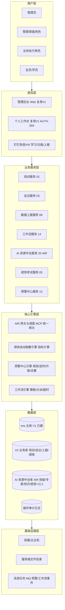
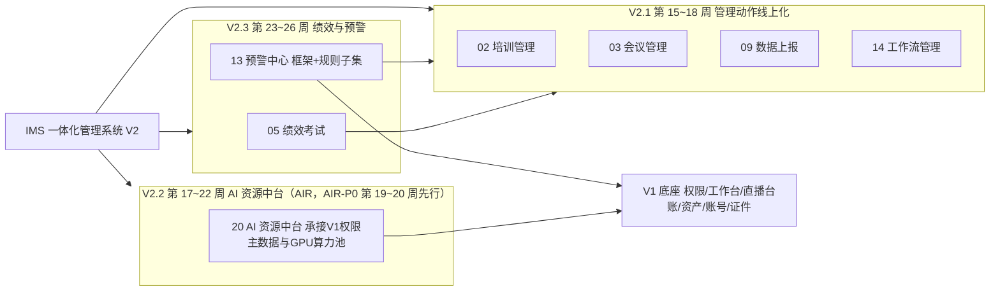
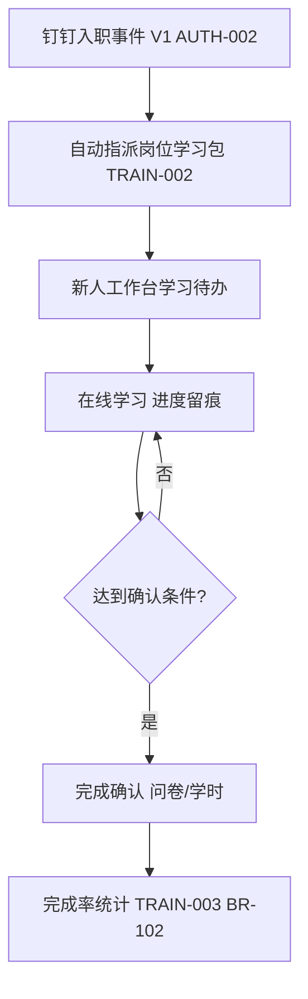
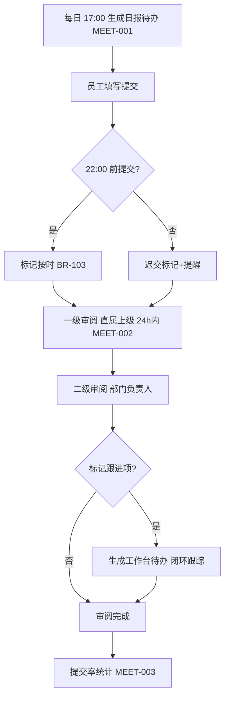
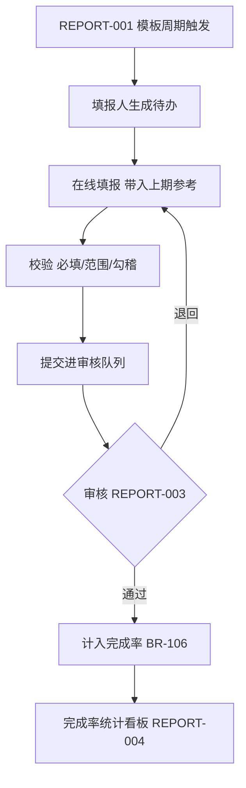
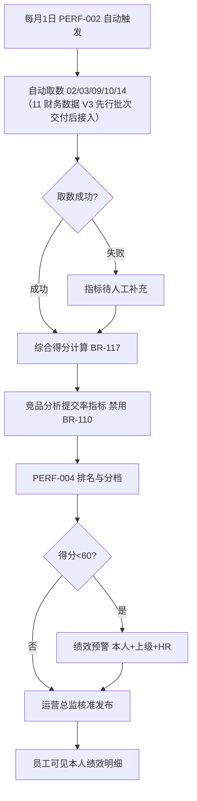
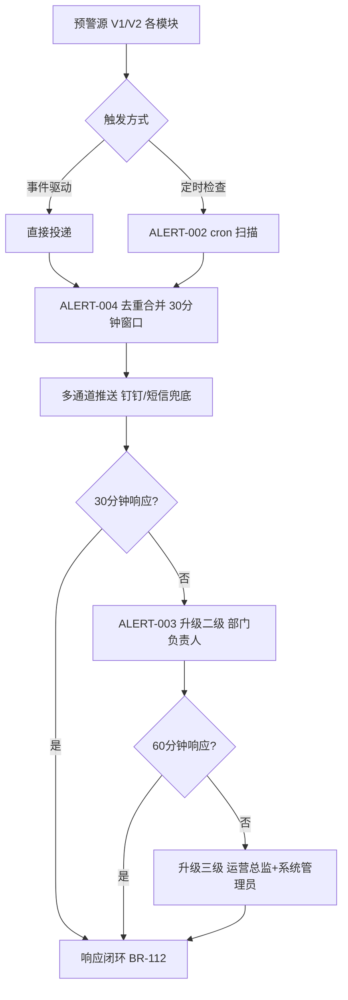

# 神鱼体育 一体化管理系统（IMS）第二期（V2）产品需求文档

> **文档用途**：开发就绪 PRD（Product Requirement Document），供架构、开发、测试直接依据实施。
> **覆盖范围**：IMS 第二期（V2）全部产品功能——02 培训管理（全新）、03 会议管理（全新）、09 数据上报（全新）、14 工作流管理（全新）、20 AI 资源中台（AIR，V2.2 批次并入，承接 V1 权限主数据与 GPU 算力池）、05 绩效考试（全新，剔除"竞品分析提交率"项）、13 预警中心（全新，先上框架+规则子集）；11 财务核算已移至第三期 V3（V3 先行批次）。
> **分期口径**：V2 = 第 15~27 周（11~13 周，P1）。第 7 章数据库设计概要、第 8 章 API 路径规范由架构师负责撰写，本版预留章节号。
> **依据文档**：《IMS 一体化管理系统需求说明书》、《IMS 第一期 PRD（V1）》（已上线：01/06/07/08/10/15/16/18 及数据模型）、《IMS 三期总体规划》。
> **周次格式约定**：全文周次统一使用波浪号格式（如"第 15~27 周"、"第 17~22 周"）。
> **v2.6.34（2026-10-05）**：AIR 知识库的**语义检索已整体移出范围（不做）**——KNOW-003 检索、KB-001 RAGFlow 底座、`knowledge_context`、错误码 5007/5008 全部**移除**（非延后）；范围锁定为**文件管理**，底座 `KbProvider=LOCAL`，MCP 固定四工具。

## 版本历史

| 版本 | 日期 | 更新内容 | 更新人 |
|------|------|----------|--------|
| V1.0 | 2025-06-10 | 初稿：基于 IMS 需求说明书与三期规划，完成 V2（第 15~27 周）产品部分全部章节 | 许清楚（Xu·产品经理） |
| v1.1.0 | 2026-09-14 | 嵌入架构师第 7/8 章（数据库设计概要与 API 路径规范）及 V2 期架构技术约束（9A 章），形成开发就绪完整版 | 齐活林（汇编） |
| v1.2.0 | 2026-09-28 | 2026-09-19 规划重排落地：11 财务核算移至第三期 V3（V3 第 28~33 周先行批次），20 AI 资源中台（AIR）由 V1.5 专项并入 V2（V2.2 批次，AIR-P0 先行） | 许清楚（Xu·产品经理） |

---

## 目录

1. 产品概述
   - 1.1 产品背景
   - 1.2 产品定位
   - 1.3 核心业务规则表
2. 产品逻辑架构
3. 功能架构
   - 3A. 产品功能点列表
4. 目标用户与权限矩阵
5. 功能详细设计（开发功能点级别）
6. 业务流程总览
7. 数据库设计概要
8. API 路径规范
9. 架构技术约束（9A）与非功能性需求
10. 附录
11. 分期与验收

---

# 1. 产品概述

## 1.1 产品背景

V1（第 1~14 周）已交付：01 权限管理、07 资产管理、08 账号管理、06 证件档案、10 直播管理、15 内容生产、数据模型，并保留 16 数据采集/18 作品监测持续运行。V1 上线后，账号—资产—人—场次的台账数据已线上化留痕，但**管理侧仍存在以下问题**（V2 立项依据，P-11 起编号）：

| 编号 | 问题描述 | 影响 |
|------|----------|------|
| P-11 | 培训无系统承载：岗位资料散落在各网盘/群文件，新员工学习任务靠口头布置，完成情况无人知晓 | 新人上手慢，能力水位不可见 |
| P-12 | 日报靠群消息提交，逐级审阅无留痕，提交率无法统计；会议纪要散落，行动项无人跟踪 | 管理动作不可量化，决策失真 |
| P-13 | 各业务线手工报表（Excel/微信报数）上报，口径不一、催收靠吼、错报无退回机制 | 数据滞后且质量差 |
| P-14 | 跨部门流程（如账号交接之外的审批协作）无通用工作流引擎，每类需求重复开发 | 开发成本高，流程不可配置 |
| P-15 | V1 直播台账（场次 ID、GMV、成本）已留痕，但单场成本靠财务手工 Excel 汇总，利润无法自动核算，分成规则各平台/达人各异 | 经营核算滞后 1~2 周，无法支撑单场复盘 |
| P-16 | 员工绩效指标靠人工汇总各系统数据，无自动取数；无在线考试；排名与预警缺失 | 绩效公平性受质疑，管理成本高 |
| P-17 | V1 各模块告警（证件到期、领用超期、直播风险）散落各处，无统一预警中心，无升级与去重机制 | 预警漏处理、重复打扰 |

**不做的后果**：若 V2 不落地，V1 积累的台账数据无法转化为经营核算能力（利润黑箱）；管理动作（培训/日报/上报/绩效）继续游离于系统外；预警散乱继续造成管理盲区。

**前置依赖**：
- 11 财务核算已移至第三期 V3（V3 第 28~33 周先行批次），其成本/分成口径拍板相应后移至 V3 前置阶段；
- 05 绩效考试需 02/03/09/10 模块跑满 1 个月观察期（即第 23 周后方可计算绩效基线）；
- 20 AI 资源中台（AIR）依赖 V1 已上线权限主数据与 GPU 算力池。

## 1.2 产品定位

V2 是 IMS 从"**流程线上化**"迈向"**管理闭环化**"的一期：

- **对管理层**：日报提交率、上报完成率、培训完成率、绩效排名、单场利润全部可量化、可预警；
- **对职能/业务团队**：培训、日报、数据上报、工作流全部在个人工作台闭环（复用 V1 AUTH-004）；
- **对财务**：11 财务核算（成本录入 → 利润计算 → 分成引擎 → 利润看板）已移至 V3 先行批次（第 28~33 周），取代手工 Excel；
- **系统原则**：
  1. 复用 V1 底座：SSO/权限/岗位模板/工作台/消息通道全部复用，不重复建设；
  2. 台账先行：所有管理动作先留痕再统计（延续 V1 原则）；
  3. 预警中心"框架先行"：先上框架+已有规则子集，其余规则随上游模块陆续开启；
  4. 20 AI 资源中台（AIR，V2.2 批次并入）承接 V1 权限主数据与 GPU 算力池，配独立资源，不占 V2 关键路径。

## 1.3 核心业务规则表

| 编号 | 名称 | 描述 | 计算公式 |
|------|------|------|----------|
| BR-101 | 培训每周更新率 | 岗位资料库每周有新增/更新的比率 | 更新率 = 本周有更新资料数 / 应更新资料数；目标 = 100% |
| BR-102 | 培训学习完成率 | 指派学习任务的完成比率 | 完成率 = 已完成学习人次 / 应完成学习人次；目标 > 90% |
| BR-103 | 日报按时提交率 | 日报在规定时限内提交的比率 | 按时率 = 按时提交人数 / 应提交人数；目标 > 95% |
| BR-104 | 日报提交率统计口径 | 日报提交率的统计规则 | 提交率 = 实际提交天数 / 应提交工作日数（按人月统计） |
| BR-105 | 绩效自动取数覆盖率 | 绩效指标中可系统自动取数的比率 | 覆盖率 = 自动取数指标数 / 绩效指标总数；目标 > 80% |
| BR-106 | 每日数据上报完成率 | 每日上报任务按期完成的比率 | 完成率 = 按时提交报表数 / 应提交报表数；目标 > 95% |
| BR-110 | 竞品分析提交率指标（V2 剔除，V3 启用） | 该指标项 V2 不上线 | 指标状态 = 禁用；待 V3 的 04 竞品管理上线后启用 |
| BR-111 | 预警送达率 | 预警消息成功送达目标人的比率 | 送达率 = 送达成功数 / 应送达数；目标 > 99% |
| BR-112 | 预警响应率 | 预警在时限内被响应（确认/处理）的比率 | 响应率 = 时限内响应数 / 预警总数；目标 > 90% |
| BR-113 | 预警三级升级 | 未响应预警逐级升级 | 一级（责任人）30 分钟未响应 → 二级（部门负责人）60 分钟未响应 → 三级（运营总监+系统管理员） |
| BR-114 | 预警去重合并 | 同源预警合并规则 | 同一规则+同一对象 30 分钟内合并为一条（计数累加），不重复推送 |
| BR-115 | 工作流节点超时率 | 工作流节点超时占比 | 超时率 = 超时节点数 / 执行节点总数；目标 < 10% |
| BR-116 | 会议纪要留痕率 | 会议召开后纪要归档比率 | 留痕率 = 已归档纪要数 / 实际会议数；目标 = 100% |
| BR-117 | 绩效排名规则 | 绩效综合得分与排名 | 综合得分 = Σ(指标得分 × 权重)；排名按部门内综合得分降序；低于阈值（60 分）触发绩效预警 |

---

# 2. 产品逻辑架构

## 2.1 六层架构图



## 2.2 各层职责表

| 层 | 职责 | V2 关键内容 |
|----|------|-------------|
| 用户层 | 全员触达（学习任务、日报、上报、绩效均覆盖普通员工） | 钉钉账号映射（复用 V1 AUTH） |
| 表现层 | 复用 V1 管理后台+工作台+钉钉 H5 | 新增学习/日报/上报/绩效 H5 页 |
| 业务服务层 | 七大业务域服务 | 02/03/09/14/20（AIR）/05/13 |
| 核心引擎层 | 跨域通用引擎 | AIR 网关（MCP 统一网关）、绩效取数、预警中心（升级/去重）、工作流引擎 |
| 数据层 | V1 主库 + V2 业务库 + AIR 资源库 | 消费 V1 ims_live_* 台账；AIR 资源台账独立库 |
| 基础设施层 | 容器、服务端文件目录、MQ | 预警消息通道、工作流事件驱动 |

---

# 3. 功能架构

## 3.1 模块图



## 3.2 模块清单表

| 模块编号 | 模块名称 | 建设类型 | 交付批次 | V2 交付内容 | 依赖 |
|----------|----------|----------|----------|-------------|------|
| 02 | 培训管理 | 全新 | V2.1（第 15~18 周） | 岗位资料库、学习任务管理、完成率统计 | V1 权限/工作台 |
| 03 | 会议管理 | 全新 | V2.1（第 15~18 周） | 日报提交、逐级审阅、提交率统计、会议纪要管理 | V1 权限/工作台 |
| 09 | 数据上报 | 全新 | V2.1（第 15~18 周） | 上报模板配置、数据提交、审核退回、完成率统计 | 14 工作流 |
| 14 | 工作流管理 | 全新 | V2.1（第 15~18 周） | 模板设计器、任务分派与看板、版本管理、超时提醒与统计 | V1 权限 |
| 20 | AI 资源中台 | 全新 | V2.2（第 19~20 周，AIR-P0 先行） | AIR-P0 核心功能点（技能/专家/知识库/密钥/网关，约 11 个功能点，KB-* 已移除） | V1 权限主数据 |
| 05 | 绩效考试 | 全新 | V2.3（第 23~26 周） | 绩效指标配置、自动计算、在线考试、排名与预警（剔除竞品分析提交率） | 02/03/09/10 跑满 1 个月观察期 |
| 13 | 预警中心 | 全新 | V2.3（第 23~26 周） | 预警规则配置、定时检查推送、三级升级、去重合并（框架+规则子集） | V1/V2 各模块告警源 |

## 3.3 关键流程贯穿表

| 流程 | 贯穿模块 | 触发 | 结果 |
|------|----------|------|------|
| 新员工学习闭环 | 02→01 | 入职事件（V1 AUTH-002） | 岗位学习包自动指派 → 完成率统计 |
| 日报逐级审阅 | 03→01 | 每日定时 | 员工提交 → 直属上级 → 部门负责人 → 提交率统计 |
| 数据上报闭环 | 09→14 | 上报周期到期 | 填报 → 审核通过/退回 → 完成率统计 |
| 单场利润核算 | 11→10(V1)（已移至 V3 先行批次） | 下播数据核准 | 成本录入 → 利润自动计算 → 分成计算 → 利润看板（V3 交付） |
| 绩效月度闭环 | 05→02/03/09/10 | 每月 1 日 | 自动取数 + 考试成绩 → 综合得分 → 排名 → 预警 |
| 预警统一分发 | 13→各模块 | 各模块事件/定时 | 去重合并 → 分级推送 → 升级 → 响应闭环 |

## 3A. 产品功能点列表

### 3A.1 功能编号体系

| 前缀 | 业务域 | 示例 |
|------|--------|------|
| TRAIN- | 02 培训管理 | TRAIN-001 |
| MEET- | 03 会议管理 | MEET-001 |
| REPORT- | 09 数据上报 | REPORT-001 |
| FLOW- | 14 工作流管理 | FLOW-001 |
| FIN- | 11 财务核算（已移至 V3 先行批次） | FIN-001（详见 V3 PRD） |
| PERF- | 05 绩效考试 | PERF-001 |
| ALERT- | 13 预警中心 | ALERT-001 |
| SKILL- / EXPERT- / KNOW- / KEY- / MCP- / KB- | 20 AI 资源中台（AIR，V2.2 批次交付） | SKILL-001 / EXPERT-001 / KNOW-001 / KEY-001 / MCP-001 / KB-003 |

### 3A.2 各业务域功能点明细表

**02 培训管理（TRAIN）**

| 编号 | 名称 | 章节 | 优先级 | API 前缀 |
|------|------|------|--------|----------|
| TRAIN-001 | 岗位资料库 | 5.1 | P1 | /admin-api/ims/train/material |
| TRAIN-002 | 学习任务管理 | 5.2 | P1 | /admin-api/ims/train/task |
| TRAIN-003 | 学习完成率统计 | 5.3 | P1 | /admin-api/ims/train/stat |

**03 会议管理（MEET）**

| 编号 | 名称 | 章节 | 优先级 | API 前缀 |
|------|------|------|--------|----------|
| MEET-001 | 日报提交 | 5.4 | P1 | /admin-api/ims/meet/daily |
| MEET-002 | 日报逐级审阅 | 5.5 | P1 | /admin-api/ims/meet/review |
| MEET-003 | 日报提交率统计 | 5.6 | P1 | /admin-api/ims/meet/stat |
| MEET-004 | 会议纪要管理 | 5.7 | P1 | /admin-api/ims/meet/minutes |

**09 数据上报（REPORT）**

| 编号 | 名称 | 章节 | 优先级 | API 前缀 |
|------|------|------|--------|----------|
| REPORT-001 | 上报模板配置 | 5.8 | P1 | /admin-api/ims/report/template |
| REPORT-002 | 数据提交 | 5.9 | P1 | /admin-api/ims/report/submit |
| REPORT-003 | 审核退回 | 5.10 | P1 | /admin-api/ims/report/audit |
| REPORT-004 | 完成率统计 | 5.11 | P1 | /admin-api/ims/report/stat |

**14 工作流管理（FLOW）**

| 编号 | 名称 | 章节 | 优先级 | API 前缀 |
|------|------|------|--------|----------|
| FLOW-001 | 工作流模板设计器 | 5.12 | P1 | /admin-api/ims/flow/template |
| FLOW-002 | 任务分派与看板 | 5.13 | P1 | /admin-api/ims/flow/task |
| FLOW-003 | 模板版本管理 | 5.14 | P2 | /admin-api/ims/flow/version |
| FLOW-004 | 超时提醒与统计 | 5.15 | P1 | /admin-api/ims/flow/timeout |

**11 财务核算（FIN）——已移至第三期 V3（先行批次，功能点详见 V3 PRD；原 5.16~5.19 章节号保留跳空）**

**20 AI 资源中台（AIR，V2.2 批次，详细功能点清单见《IMS-模块20-AI资源中台PRD》）**

| 编号 | 名称 | 章节 | 优先级 | API 前缀 |
|------|------|------|--------|----------|
| SKILL-/EXPERT-/KNOW-/KEY-/MCP-/KB- | AIR-P0 批次约 11 个功能点（KB-* 已移除） | 模块 20 专项 PRD | P0/P1 | /admin-api/ims/air/*（skill/expert/kb/key/log）+ /ims/mcp 独立网关端点 |

**05 绩效考试（PERF）**

| 编号 | 名称 | 章节 | 优先级 | API 前缀 |
|------|------|------|--------|----------|
| PERF-001 | 绩效指标配置 | 5.20 | P1 | /admin-api/ims/perf/metric |
| PERF-002 | 绩效自动计算 | 5.21 | P1 | /admin-api/ims/perf/calc |
| PERF-003 | 在线考试 | 5.22 | P1 | /admin-api/ims/perf/exam |
| PERF-004 | 排名与预警 | 5.23 | P1 | /admin-api/ims/perf/rank |

**13 预警中心（ALERT）**

| 编号 | 名称 | 章节 | 优先级 | API 前缀 |
|------|------|------|--------|----------|
| ALERT-001 | 预警规则配置 | 5.24 | P1 | /admin-api/ims/alert/rule |
| ALERT-002 | 定时检查与推送 | 5.25 | P1 | /admin-api/ims/alert/check |
| ALERT-003 | 三级升级机制 | 5.26 | P1 | /admin-api/ims/alert/escalate |
| ALERT-004 | 去重合并与统计 | 5.27 | P1 | /admin-api/ims/alert/stats |

### 3A.3 功能点统计

| 业务域 | 功能点数 | P1 | P2 |
|--------|----------|----|----|
| 02 培训管理 | 3 | 3 | 0 |
| 03 会议管理 | 4 | 4 | 0 |
| 09 数据上报 | 4 | 4 | 0 |
| 14 工作流管理 | 4 | 3 | 1 |
| 20 AI 资源中台（AIR，V2.2 批次） | 约 11（AIR-P0 先行，KB-* 已移除） | 见模块 20 专项 PRD | — |
| 05 绩效考试 | 4 | 4 | 0 |
| 13 预警中心 | 4 | 4 | 0 |
| **合计** | **27** | **26** | **1** |

---

# 4. 目标用户与权限矩阵

## 4.1 角色清单（沿用 V1 十类角色 + 学员/全员视角）

V2 沿用 V1 角色体系（R1~R10，见 V1 PRD 第 4 章），全员默认获得"学员/日报人/上报人"基础能力（由岗位模板配置）：

| # | 角色 | V2 新增主要职责 |
|---|------|-----------------|
| R1 | 系统管理员 | 各模块配置、工作流模板、预警规则、权限分配 |
| R2 | 行政管理员 | 培训资料、会议纪要归档、组织级统计 |
| R3 | 财务管理员 | 成本录入、利润核算、分成计算主责 |
| R4 | 运营总监 | 日报终审、绩效裁决、预警三级接收人 |
| R5 | 直播运营 | 日报/上报提交、成本协录 |
| R6 | 短视频运营 | 日报/上报提交、学习任务 |
| R7 | 主播/达人 | 学习任务、绩效个人视图 |
| R8 | 内容审核员 | 上报审核（数据质量） |
| R9 | 数据分析师 | 全域统计查看（脱敏） |
| R10 | 外协人员 | 被指派学习任务/工作流任务 |

权限标记：**R**=查看，**W**=编辑/提交，**D**=删除/终审；括号内为数据范围限定。

## 4.2 角色×功能矩阵

| 功能点 | R1 | R2 | R3 | R4 | R5 | R6 | R7 | R8 | R9 | R10 |
|--------|----|----|----|----|----|----|----|----|----|----|
| TRAIN-001 岗位资料库 | R/W/D（全量） | R/W（全量主责） | — | R | — | R（本岗位） | R（本岗位） | — | — | R（指派课程） |
| TRAIN-002 学习任务管理 | R/W/D（全量） | R/W（全量） | — | R/W（本部门） | W（本人完成） | W（本人完成） | W（本人完成） | — | — | W（被指派） |
| TRAIN-003 完成率统计 | R（全量） | R（全量） | — | R（本部门） | R（本人） | R（本人） | R（本人） | — | R（全量） | — |
| MEET-001 日报提交 | R（全量可查） | R（本部门） | — | R（下属+本部门） | W（本人） | W（本人） | — | — | — | W（被要求时） |
| MEET-002 逐级审阅 | R（全量） | R（本部门） | — | W/D（本部门终审） | W（审直属下级，如有） | — | — | — | — | — |
| MEET-003 提交率统计 | R（全量） | R（全量） | — | R（本部门） | — | — | — | — | R（全量） | — |
| MEET-004 会议纪要管理 | R/W/D（全量） | R/W（全量主责） | — | R/W（本部门） | R（参会） | R（参会） | R（参会） | R（参会） | — | R（参会） |
| REPORT-001 上报模板配置 | R/W/D（全量） | — | R/W（财务模板） | R/W（业务模板） | — | — | — | — | — | — |
| REPORT-002 数据提交 | R（全量） | W（行政报表） | W（财务报表） | R（全量） | W（直播报表） | W（内容报表） | — | — | R（脱敏） | W（被指派） |
| REPORT-003 审核退回 | R/W/D（全量） | W（行政线） | W（财务线） | W/D（业务线终审） | — | — | — | W（数据质量初审） | — | — |
| REPORT-004 完成率统计 | R（全量） | R（行政线） | R（财务线） | R（业务线） | R（本人） | R（本人） | — | — | R（全量） | — |
| FLOW-001 模板设计器 | R/W/D（全量） | — | — | R/W（业务流程） | — | — | — | — | — | — |
| FLOW-002 任务分派与看板 | R/W/D（全量） | R/W（行政流程） | R/W（财务流程） | R/W（业务流程） | W（执行） | W（执行） | — | W（执行） | R（只读） | W（被指派） |
| FLOW-003 版本管理 | R/W/D（全量） | — | — | R | — | — | — | — | — | — |
| FLOW-004 超时提醒与统计 | R/W/D（全量配置） | R（行政线） | R（财务线） | R（业务线） | R（本人） | R（本人） | — | — | R（全量） | — |
| PERF-001 绩效指标配置 | R/W/D（全量） | — | R/W（财务类指标） | R/W/D（全量终审） | — | — | — | — | — | — |
| PERF-002 绩效自动计算 | R（全量） | — | R（成本相关） | R/W/D（全量核准） | R（本人） | R（本人） | R（本人） | — | R（全量脱敏） | — |
| PERF-003 在线考试 | R/W/D（全量题库） | R/W（题库协管） | — | R（成绩） | W（参考） | W（参考） | W（参考） | R（监考成绩） | — | W（被指派） |
| PERF-004 排名与预警 | R（全量） | R（全量） | — | R/W/D（全量裁决） | R（本人+排名） | R（本人+排名） | R（本人+排名） | — | R（全量脱敏） | — |
| ALERT-001 预警规则配置 | R/W/D（全量） | — | R/W（财务类规则） | R/W（业务类规则） | — | — | — | — | — | — |
| ALERT-002 定时检查与推送 | R（全量） | R | R | R | R（本人预警） | R（本人预警） | R（本人预警） | — | R | — |
| ALERT-003 三级升级 | R/W/D（全量配置） | R（二级接收） | R（财务线） | R/W（三级接收） | R（一级接收） | R（一级接收） | R（一级接收） | — | — | — |
| ALERT-004 去重合并与统计 | R/W/D（全量） | R | R | R | — | — | — | — | R（全量） | — |

---

# 5. 功能详细设计（开发功能点级别）

> 本章共 23 个功能点（第 5.1~5.27 节，其中 5.16~5.19 章节号因 11 财务核算移至第三期 V3 跳空）。V2 全部为全新功能点（无补齐类）；20 AI 资源中台（AIR）功能点详见《IMS-模块20-AI资源中台PRD》。

## 5.1 培训管理 - 岗位资料库

**功能编号**：TRAIN-001
**优先级**：P1
**对应表**：`ims_train_material`、`ims_train_material_cate`
**对应API**：`/admin-api/ims/train/material/*`

### 5.1.1 功能描述

按岗位组织的培训资料库。核心能力：
1. 资料分类树（岗位 → 类别 → 资料）；
2. 资料上传：文档/视频/链接，支持版本更新；
3. 资料与岗位模板关联（新员工自动可见本岗位资料包）；
4. 更新率统计（BR-101 每周更新率 = 100%）。

### 5.1.2 数据结构

| 字段 | 类型 | 说明 |
|------|------|------|
| id | BIGINT PK | 主键 |
| material_no | VARCHAR(32) | 资料编号（MT+日期+流水） |
| title | VARCHAR(128) | 资料标题 |
| cate_id | BIGINT | 分类 ID |
| material_type | VARCHAR(16) | doc / video / link |
| file_url | VARCHAR(512) | 文件地址（视频/文档） |
| link_url | VARCHAR(512) | 外链地址 |
| position_codes | JSON | 关联岗位编码列表 |
| version | INT | 版本号 |
| status | TINYINT | 0 草稿 / 1 已发布 / 2 已下架 |
| uploader_user_id | BIGINT | 上传人 |
| updated_at | DATETIME | 最后更新时间 |

### 5.1.3 业务规则

- TRN-M-R1：仅"已发布"资料对学员可见；
- TRN-M-R2：资料更新生成新版本，旧版本留档可查；
- TRN-M-R3：每周更新率纳入 BR-101 统计（应更新资料 = 岗位关联的全部已发布资料）。

### 5.1.4 操作流程

1. 行政/管理员创建分类与资料；
2. 上传文件或配置外链 → 发布；
3. 关联岗位（新员工自动可见）；
4. 按周统计更新率，未更新进入督办。

### 5.1.5 权限说明

- **查看**：R1、R2（全量）、R4（只读）、R5/R6/R7（本岗位已发布）、R10（指派课程）
- **新增/编辑**：R2（主责）、R1
- **删除（下架）**：R1、R2

### 5.1.6 API 设计

| 方法 | 路径 | 说明 |
|------|------|------|
| GET | `/admin-api/ims/train/material/cates` | 分类树 |
| POST | `/admin-api/ims/train/material` | 上传资料 |
| GET | `/admin-api/ims/train/material/list` | 资料列表（按岗位过滤） |
| PUT | `/admin-api/ims/train/material/{id}` | 更新资料（新版本） |
| DELETE | `/admin-api/ims/train/material/{id}` | 下架资料 |
| GET | `/admin-api/ims/train/material/weekly-update-metrics` | 每周更新率统计（BR-101） |

## 5.2 培训管理 - 学习任务管理

**功能编号**：TRAIN-002
**优先级**：P1
**对应表**：`ims_train_task`、`ims_train_task_record`
**对应API**：`/admin-api/ims/train/task/*`

### 5.2.1 功能描述

学习任务的指派、执行与完成确认。核心能力：
1. 任务指派：按人/按岗位批量指派（资料集 + 截止时间）；
2. 学习执行：在线观看/阅读，记录进度（视频看时长、文档看翻页）；
3. 完成确认：自测问卷或学时达标；
4. 入职事件自动指派（联动 V1 AUTH-002：新人自动下发岗位学习包）；
5. 完成率统计支撑 BR-102（> 90%）。

### 5.2.2 数据结构

| 字段 | 类型 | 说明 |
|------|------|------|
| id | BIGINT PK | 主键 |
| task_no | VARCHAR(32) | 任务编号（TT+日期+流水） |
| task_name | VARCHAR(128) | 任务名称 |
| material_ids | JSON | 资料 ID 列表 |
| assign_scope | TINYINT | 1 按人 / 2 按岗位 |
| assign_targets | JSON | 目标人/岗位编码列表 |
| deadline | DATETIME | 截止时间 |
| confirm_type | TINYINT | 1 学时达标 / 2 自测问卷 |
| status | TINYINT | 0 进行中 / 1 已结束 |

`ims_train_task_record`：id、task_id、user_id、progress（进度百分比）、material_progress（JSON：单资料进度）、confirm_status（0 未完成 / 1 已完成）、confirm_score（问卷得分）、started_at、finished_at。

### 5.2.3 业务规则

- TRN-T-R1：视频按实际观看时长计进度，拖拽快进不计；
- TRN-T-R2：截止前 1 天未完成推送提醒，逾期进入督办并计入完成率分母；
- TRN-T-R3：入职事件自动指派岗位学习包（截止 = 入职日 + 14 天）。

### 5.2.4 操作流程

1. 管理员创建任务 → 选择资料与目标 → 发布；
2. 目标人工作台收到学习待办；
3. 学习执行 → 进度更新 → 达标确认；
4. 完成率实时统计。

### 5.2.5 权限说明

- **查看**：R1、R2（全量）、R4（本部门）、R5/R6/R7（本人）、R10（被指派）
- **新增/编辑（任务）**：R2（主责）、R1
- **删除**：R1
- **执行（学习）**：被指派人

### 5.2.6 API 设计

| 方法 | 路径 | 说明 |
|------|------|------|
| POST | `/admin-api/ims/train/task` | 创建学习任务 |
| GET | `/admin-api/ims/train/task/list` | 任务列表 |
| PUT | `/admin-api/ims/train/task/{id}` | 编辑任务 |
| DELETE | `/admin-api/ims/train/task/{id}` | 删除任务 |
| PUT | `/admin-api/ims/train/task/{id}/progress` | 上报学习进度 |
| POST | `/admin-api/ims/train/task/{id}/confirm` | 完成确认（问卷提交） |
| GET | `/admin-api/ims/train/task/records` | 学习记录查询 |

## 5.3 培训管理 - 学习完成率统计

**功能编号**：TRAIN-003
**优先级**：P1
**对应表**：`ims_train_stat_daily`
**对应API**：`/admin-api/ims/train/stat/*`

### 5.3.1 功能描述

培训数据统计看板。核心能力：
1. 完成率指标（BR-102）：总完成率、按任务/按部门/按人分布；
2. 学习时长排行（部门/个人）；
3. 资料热度（学习人次）；
4. 逾期未完成清单导出（督办用）。

### 5.3.2 数据结构

| 字段 | 类型 | 说明 |
|------|------|------|
| id | BIGINT PK | 主键 |
| stat_date | DATE | 统计日 |
| dept_id | BIGINT | 部门 |
| assigned_count | INT | 应完成人次 |
| finished_count | INT | 已完成人次 |
| finish_rate | DECIMAL(5,2) | 完成率（计算列） |
| avg_duration_minutes | INT | 人均学习时长 |

### 5.3.3 业务规则

- TRN-S-R1：每日凌晨汇总前日数据入统计表；
- TRN-S-R2：完成率口径（BR-102）= 已完成学习人次 / 应完成学习人次（含逾期）；
- TRN-S-R3：部门完成率连续 2 周低于 85% 推送部门负责人。

### 5.3.4 操作流程

1. 定时汇总任务执行；
2. 管理层查看看板（部门/任务/人三维）；
3. 低完成率自动督办；
4. 导出逾期清单。

### 5.3.5 权限说明

- **查看**：R1、R2、R9（全量）、R4（本部门）、R5/R6/R7（本人）
- **写操作**：无（系统自动统计）

### 5.3.6 API 设计

| 方法 | 路径 | 说明 |
|------|------|------|
| GET | `/admin-api/ims/train/stat/finish-rate` | 完成率指标（BR-102） |
| GET | `/admin-api/ims/train/stat/dept` | 部门统计 |
| GET | `/admin-api/ims/train/stat/rank` | 学习时长排行 |
| GET | `/admin-api/ims/train/stat/overdue` | 逾期未完成清单 |
| GET | `/admin-api/ims/train/stat/material-heat` | 资料热度 |

## 5.4 会议管理 - 日报提交

**功能编号**：MEET-001
**优先级**：P1
**对应表**：`ims_daily_report`
**对应API**：`/admin-api/ims/meet/daily/*`

### 5.4.1 功能描述

结构化日报提交。核心能力：
1. 日报模板（今日完成/明日计划/问题风险三段式，支持自定义字段）；
2. 移动端优先（钉钉 H5 随时提交）；
3. 草稿自动保存；
4. 定时提醒（截止前 1 小时未提交推送）。

### 5.4.2 数据结构

| 字段 | 类型 | 说明 |
|------|------|------|
| id | BIGINT PK | 主键 |
| report_date | DATE | 日报所属日期 |
| user_id | BIGINT | 提交人 |
| content_done | TEXT | 今日完成 |
| content_plan | TEXT | 明日计划 |
| content_issue | TEXT | 问题与风险 |
| extra_fields | JSON | 自定义字段 |
| submit_status | TINYINT | 0 草稿 / 1 已提交 / 2 已审阅 |
| submitted_at | DATETIME | 提交时间 |
| is_on_time | TINYINT | 是否按时（统计 BR-103） |

### 5.4.3 业务规则

- MEE-D-R1：日报截止时间默认当日 22:00（可按部门配置）；
- MEE-D-R2：逾期仍可补交，标记"迟交"，计入提交率不计入按时率（BR-103/BR-104 分口径）；
- MEE-D-R3：一人一日一份日报（唯一索引 user_id+report_date）；
- MEE-D-R4：周五需附加"周小结"段（模板自动带出）。

### 5.4.4 操作流程

1. 每日 17:00 工作台生成日报待办；
2. 员工填写（可存草稿）→ 提交；
3. 进入直属上级审阅队列；
4. 截止前未提交自动提醒。

### 5.4.5 权限说明

- **查看**：R1（全量）、R2（本部门）、R4（下属+本部门）、R5/R6（本人）
- **新增/编辑**：日报人本人（提交前）
- **删除**：R1（逻辑删除）

### 5.4.6 API 设计

| 方法 | 路径 | 说明 |
|------|------|------|
| POST | `/admin-api/ims/meet/daily` | 提交/保存日报 |
| GET | `/admin-api/ims/meet/daily/{date}` | 本人某日日报 |
| GET | `/admin-api/ims/meet/daily/list` | 日报列表（按权限过滤） |
| PUT | `/admin-api/ims/meet/daily/{id}` | 编辑（已提交不可改，走补充说明） |
| GET | `/admin-api/ims/meet/daily/template` | 日报模板获取 |

## 5.5 会议管理 - 日报逐级审阅

**功能编号**：MEET-002
**优先级**：P1
**对应表**：`ims_daily_review`
**对应API**：`/admin-api/ims/meet/review/*`

### 5.5.1 功能描述

日报逐级审阅。核心能力：
1. 审阅队列：直属上级（一级）→ 部门负责人（二级）；
2. 审阅动作：已读 / 点评 / 标记跟进项（问题风险转待办）；
3. 跟进项联动工作台待办（复用 V1 AUTH-004）与 14 工作流；
4. 审阅留痕（谁、何时、批注内容）。

### 5.5.2 数据结构

| 字段 | 类型 | 说明 |
|------|------|------|
| id | BIGINT PK | 主键 |
| report_id | BIGINT | 日报 ID |
| reviewer_user_id | BIGINT | 审阅人 |
| review_level | TINYINT | 1 直属上级 / 2 部门负责人 |
| action | TINYINT | 1 已读 / 2 点评 / 3 标记跟进 |
| comment | VARCHAR(512) | 批注内容 |
| follow_up_items | JSON | 跟进项（描述+责任人+期限） |
| reviewed_at | DATETIME | 审阅时间 |

### 5.5.3 业务规则

- MEE-R-R1：一级审阅须在提交后 24 小时内完成，未完成推送提醒；
- MEE-R-R2：一级审阅完成后才进入二级队列（逐级）；
- MEE-R-R3：跟进项生成工作台待办，责任人完成回填后闭环。

### 5.5.4 操作流程

1. 直属上级收到审阅待办；
2. 阅读日报 → 已读/点评/标记跟进；
3. 完成一级 → 流入二级审阅；
4. 跟进项生成待办并跟踪闭环。

### 5.5.5 权限说明

- **查看**：R1（全量）、R2/R4（本部门审阅记录）
- **新增/编辑（审阅）**：各级审阅人（直属下级日报）
- **删除**：R1

### 5.5.6 API 设计

| 方法 | 路径 | 说明 |
|------|------|------|
| GET | `/admin-api/ims/meet/review/queue` | 审阅队列 |
| PUT | `/admin-api/ims/meet/review/{reportId}` | 提交审阅动作 |
| GET | `/admin-api/ims/meet/review/records` | 审阅记录查询 |
| PUT | `/admin-api/ims/meet/review/follow-up/{itemId}` | 跟进项闭环回填 |

## 5.6 会议管理 - 日报提交率统计

**功能编号**：MEET-003
**优先级**：P1
**对应表**：`ims_daily_stat`
**对应API**：`/admin-api/ims/meet/stat/*`

### 5.6.1 功能描述

日报提交率统计看板。核心能力：
1. 按时提交率（BR-103 > 95%）：按部门/按人/按日趋势；
2. 提交率（BR-104 口径：按人月统计）；
3. 未交/迟交清单（督办导出）；
4. 审阅及时性统计（一级 24 小时完成率）。

### 5.6.2 数据结构

| 字段 | 类型 | 说明 |
|------|------|------|
| id | BIGINT PK | 主键 |
| stat_month | CHAR(7) | 统计月（yyyy-MM） |
| dept_id | BIGINT | 部门 |
| user_id | BIGINT | 员工 |
| should_days | INT | 应提交工作日数 |
| on_time_days | INT | 按时提交天数 |
| submitted_days | INT | 实际提交天数 |
| on_time_rate / submit_rate | DECIMAL(5,2) | 按时率/提交率（计算列） |

### 5.6.3 业务规则

- MEE-S-R1：应提交工作日 = 当月工作日（排除请假/节假日，联动钉钉考勤）；
- MEE-S-R2：按时率（BR-103）= 按时提交人数 / 应提交人数（日口径）；月度看板用 BR-104 口径；
- MEE-S-R3：按时率低于 90% 的部门连续 2 周推送部门负责人。

### 5.6.4 操作流程

1. 每日汇总提交情况；
2. 看板展示日/月/部门/人四维；
3. 低按时率督办；
4. 导出未交清单。

### 5.6.5 权限说明

- **查看**：R1、R2、R9（全量）、R4（本部门）、R5/R6（本人）
- **写操作**：无（自动统计）

### 5.6.6 API 设计

| 方法 | 路径 | 说明 |
|------|------|------|
| GET | `/admin-api/ims/meet/stat/on-time-rate` | 按时提交率（BR-103） |
| GET | `/admin-api/ims/meet/stat/monthly` | 月度提交率（BR-104） |
| GET | `/admin-api/ims/meet/stat/missed` | 未交/迟交清单 |
| GET | `/admin-api/ims/meet/stat/review-timeliness` | 审阅及时性统计 |

## 5.7 会议管理 - 会议纪要管理

**功能编号**：MEET-004
**优先级**：P1
**对应表**：`ims_meeting_minutes`
**对应API**：`/admin-api/ims/meet/minutes/*`

### 5.7.1 功能描述

会议纪要的结构化管理。核心能力：
1. 会议登记：主题、时间、参会人（关联钉钉日程可选）；
2. 纪要录入：决议事项、行动项（责任人+期限）；
3. 行动项跟踪：完成回填，逾期督办；
4. 纪要归档与检索（BR-116 留痕率 = 100%）；
5. 可选对接钉钉 AI 听记（V1 已建能力）自动生成纪要初稿。

### 5.7.2 数据结构

| 字段 | 类型 | 说明 |
|------|------|------|
| id | BIGINT PK | 主键 |
| minutes_no | VARCHAR(32) | 纪要编号（MM+日期+流水） |
| meeting_title | VARCHAR(128) | 会议主题 |
| meeting_date | DATETIME | 会议时间 |
| attendees | JSON | 参会人列表 |
| summary | TEXT | 纪要正文 |
| decisions | JSON | 决议事项列表 |
| action_items | JSON | 行动项（描述/责任人/期限/状态） |
| minutes_status | TINYINT | 0 会议已登记 / 1 纪要已录 / 2 已归档 |
| recorder_user_id | BIGINT | 记录人 |
| archived_at | DATETIME | 归档时间 |

### 5.7.3 业务规则

- MEE-M-R1：会后 24 小时内须录入纪要，48 小时内归档（BR-116）；
- MEE-M-R2：行动项逾期 1 天推送责任人，3 天升级行政管理员；
- MEE-M-R3：纪要归档后不可修改，更正走附录说明。

### 5.7.4 操作流程

1. 会前/会后登记会议信息；
2. 录入纪要（或导入听记初稿编辑）；
3. 行动项生成待办；
4. 归档 → 统计留痕率。

### 5.7.5 权限说明

- **查看**：R1、R2（全量）、R4（本部门）、参会人（本人参会）
- **新增/编辑**：R2（主责）、记录人
- **删除**：R1

### 5.7.6 API 设计

| 方法 | 路径 | 说明 |
|------|------|------|
| POST | `/admin-api/ims/meet/minutes` | 登记会议/录入纪要 |
| GET | `/admin-api/ims/meet/minutes/list` | 纪要列表 |
| GET | `/admin-api/ims/meet/minutes/{id}` | 纪要详情 |
| PUT | `/admin-api/ims/meet/minutes/{id}` | 编辑（归档前） |
| PUT | `/admin-api/ims/meet/minutes/{id}/archive` | 归档 |
| PUT | `/admin-api/ims/meet/minutes/action-item/{itemId}` | 行动项回填闭环 |
| GET | `/admin-api/ims/meet/minutes/archive-rate` | 留痕率统计（BR-116） |

## 5.8 数据上报 - 上报模板配置

**功能编号**：REPORT-001
**优先级**：P1
**对应表**：`ims_report_template`
**对应API**：`/admin-api/ims/report/template/*`

### 5.8.1 功能描述

数据上报模板配置。核心能力：
1. 模板设计：表单字段（数值/文本/枚举/日期/附件）+ 校验规则（必填/范围/勾稽）；
2. 上报周期：每日/每周/每月 + 截止时间；
3. 指派填报人（按人/按岗位/按部门轮值）；
4. 模板版本管理（字段变更走版本）。

### 5.8.2 数据结构

| 字段 | 类型 | 说明 |
|------|------|------|
| id | BIGINT PK | 主键 |
| template_no | VARCHAR(32) | 模板编号（RT+日期+流水） |
| template_name | VARCHAR(128) | 模板名称（如"直播日报-抖音"） |
| fields_schema | JSON | 字段定义（类型/校验/勾稽） |
| period_type | TINYINT | 1 每日 / 2 每周 / 3 每月 |
| deadline_rule | VARCHAR(32) | 截止规则（如 22:00 / 周五18:00 / 次月5日） |
| assignees | JSON | 填报人配置（人/岗位/部门+轮值） |
| version | INT | 版本 |
| status | TINYINT | 0 停用 / 1 启用 |

### 5.8.3 业务规则

- RPT-T-R1：模板启用后修改字段生成新版本，进行中填报单沿用旧版；
- RPT-T-R2：勾稽校验（如明细合计 = 汇总值）在提交时强制执行；
- RPT-T-R3：一个模板同一周期一个填报人一份填报单（去重）。

### 5.8.4 操作流程

1. 业务负责人创建模板（字段+周期+填报人）；
2. 启用 → 系统按周期自动生成填报任务；
3. 填报人工作台收到待办；
4. 字段变更走版本迭代。

### 5.8.5 权限说明

- **查看**：R1（全量）、R3（财务模板）、R4（业务模板）、R9
- **新增/编辑**：R1、R3（财务线）、R4（业务线）
- **删除**：R1

### 5.8.6 API 设计

| 方法 | 路径 | 说明 |
|------|------|------|
| POST | `/admin-api/ims/report/template` | 创建模板 |
| GET | `/admin-api/ims/report/template/list` | 模板列表 |
| PUT | `/admin-api/ims/report/template/{id}` | 编辑（新版本） |
| DELETE | `/admin-api/ims/report/template/{id}` | 停用/删除 |
| POST | `/admin-api/ims/report/template/{id}/preview` | 模板填报预览 |

## 5.9 数据上报 - 数据提交

**功能编号**：REPORT-002
**优先级**：P1
**对应表**：`ims_report_submission`
**对应API**：`/admin-api/ims/report/submit/*`

### 5.9.1 功能描述

填报人按模板提交数据。核心能力：
1. 在线表单填报（Web + 钉钉 H5）；
2. 草稿保存与历史参考（上期数据带入）；
3. 提交时校验（必填/范围/勾稽）；
4. 附件上传（Excel/截图凭证）；
5. 截止前提醒（前 1 小时未提交推送）。

### 5.9.2 数据结构

| 字段 | 类型 | 说明 |
|------|------|------|
| id | BIGINT PK | 主键 |
| submission_no | VARCHAR(32) | 填报单号（RS+日期+流水） |
| template_id / template_version | BIGINT / INT | 模板与版本 |
| period | VARCHAR(16) | 上报周期标识（如 2025-06-10 / 2025-W24 / 2025-06） |
| submitter_user_id | BIGINT | 填报人 |
| data_content | JSON | 填报数据（按模板 schema） |
| attachments | JSON | 附件列表 |
| submit_status | TINYINT | 0 草稿 / 1 已提交 / 2 审核通过 / 3 已退回 |
| is_on_time | TINYINT | 是否按期 |
| submitted_at | DATETIME | 提交时间 |

### 5.9.3 业务规则

- RPT-S-R1：退回修改后再提交，历史版本留痕可对比；
- RPT-S-R2：逾期提交标记"迟交"，计入完成率分母（BR-106）；
- RPT-S-R3：上期数据自动带入参考（可覆盖），降低填报成本。

### 5.9.4 操作流程

1. 系统按周期生成填报待办；
2. 填报人在线填报（参考上期）；
3. 校验通过提交 → 审核队列；
4. 截止提醒与迟交标记。

### 5.9.5 权限说明

- **查看**：R1（全量）、R3/R4（本线）、R9（脱敏）、填报人（本人）
- **新增/编辑**：填报人（提交前与退回后）
- **删除**：R1

### 5.9.6 API 设计

| 方法 | 路径 | 说明 |
|------|------|------|
| POST | `/admin-api/ims/report/submit` | 保存/提交填报单 |
| GET | `/admin-api/ims/report/submit/{submissionNo}` | 填报单详情 |
| GET | `/admin-api/ims/report/submit/list` | 填报单列表 |
| GET | `/admin-api/ims/report/submit/pending` | 待填报任务 |
| GET | `/admin-api/ims/report/submit/last-period` | 上期数据参考 |

## 5.10 数据上报 - 审核退回

**功能编号**：REPORT-003
**优先级**：P1
**对应表**：`ims_report_audit`
**对应API**：`/admin-api/ims/report/audit/*`

### 5.10.1 功能描述

上报数据审核与退回。核心能力：
1. 审核队列：按模板线（财务/业务/行政）路由到对应审核人；
2. 审核动作：通过 / 退回（须填退回原因，结构化原因可选）；
3. 退回后填报人修改重报（版本留痕）；
4. 审核时效 SLA（24 小时）与超时督办。

### 5.10.2 数据结构

| 字段 | 类型 | 说明 |
|------|------|------|
| id | BIGINT PK | 主键 |
| submission_id | BIGINT | 填报单 |
| auditor_user_id | BIGINT | 审核人 |
| audit_round | INT | 审核轮次 |
| conclusion | TINYINT | 1 通过 / 2 退回 |
| reject_reason | VARCHAR(512) | 退回原因 |
| audited_at | DATETIME | 审核时间 |

### 5.10.3 业务规则

- RPT-A-R1：退回必须填写原因；3 轮退回后升级业务线负责人裁决；
- RPT-A-R2：审核通过的数据进入统计口径（完成率分子，BR-106）；
- RPT-A-R3：审核时效 24 小时，超时推送审核人。

### 5.10.4 操作流程

1. 提交后进入审核队列；
2. 审核人查看数据+附件；
3. 通过 → 计入完成率；退回 → 填报人修改重报；
4. 超时督办。

### 5.10.5 权限说明

- **查看**：R1（全量）、R3/R4/R2（本线）、R8（初审队列）
- **新增/编辑（审核结论）**：R8（数据质量初审）、R2/R3/R4（本线终审）
- **删除**：R1

### 5.10.6 API 设计

| 方法 | 路径 | 说明 |
|------|------|------|
| GET | `/admin-api/ims/report/audit/queue` | 审核队列 |
| PUT | `/admin-api/ims/report/audit/{submissionId}` | 提交审核结论 |
| GET | `/admin-api/ims/report/audit/records` | 审核记录 |
| GET | `/admin-api/ims/report/audit/diff` | 退回前后数据对比 |

## 5.11 数据上报 - 完成率统计

**功能编号**：REPORT-004
**优先级**：P1
**对应表**：`ims_report_stat`
**对应API**：`/admin-api/ims/report/stat/*`

### 5.11.1 功能描述

上报完成率统计看板。核心能力：
1. 完成率（BR-106 > 95%）：按模板/按部门/按人/按周期趋势；
2. 迟交与退回率分析（数据质量维度）；
3. 未交清单导出（督办）；
4. 审核时效统计。

### 5.11.2 数据结构

| 字段 | 类型 | 说明 |
|------|------|------|
| id | BIGINT PK | 主键 |
| stat_period | VARCHAR(16) | 统计周期 |
| template_id | BIGINT | 模板 |
| dept_id | BIGINT | 部门 |
| should_count | INT | 应提交数 |
| submitted_count / on_time_count / approved_count | INT | 提交/按时/通过数 |
| complete_rate | DECIMAL(5,2) | 完成率（计算列，BR-106） |

### 5.11.3 业务规则

- RPT-C-R1：完成率分子 = 审核通过的填报单（质量口径，非仅提交）；
- RPT-C-R2：每日/每周期汇总；低于 90% 的线自动督办；
- RPT-C-R3：退回率 > 20% 的模板提示检查字段设计合理性。

### 5.11.4 操作流程

1. 周期结束后自动汇总；
2. 看板多维度展示；
3. 低完成率督办；
4. 导出未交清单。

### 5.11.5 权限说明

- **查看**：R1、R2/R3/R4（本线）、R9（全量）、填报人（本人）
- **写操作**：无（自动统计）

### 5.11.6 API 设计

| 方法 | 路径 | 说明 |
|------|------|------|
| GET | `/admin-api/ims/report/stat/complete-rate` | 完成率（BR-106） |
| GET | `/admin-api/ims/report/stat/trend` | 周期趋势 |
| GET | `/admin-api/ims/report/stat/missed` | 未交清单 |
| GET | `/admin-api/ims/report/stat/quality` | 退回率/数据质量分析 |

## 5.12 工作流管理 - 工作流模板设计器

**功能编号**：FLOW-001
**优先级**：P1
**对应表**：`ims_flow_template`、`ims_flow_node`
**对应API**：`/admin-api/ims/flow/template/*`

### 5.12.1 功能描述

可视化工作流模板设计器。核心能力：
1. 节点编排：串行/并行/条件分支，节点类型（审批/任务/抄送/定时）；
2. 节点配置：处理人（人/岗位/部门/发起人上级）、SLA 时限、表单字段；
3. 可视化预览（流程图渲染）；
4. 模板启用发布（联动 FLOW-003 版本管理）。

### 5.12.2 数据结构

| 字段 | 类型 | 说明 |
|------|------|------|
| id | BIGINT PK | 主键 |
| template_no | VARCHAR(32) | 流程模板编号（FT+日期+流水） |
| template_name | VARCHAR(128) | 模板名称 |
| business_domain | VARCHAR(32) | 业务域（行政/财务/业务/通用） |
| version | INT | 版本 |
| status | TINYINT | 0 草稿 / 1 已发布 / 2 停用 |
| published_at | DATETIME | 发布时间 |

`ims_flow_node`：id、template_id、node_order、node_name、node_type（approve/task/cc/timer）、assignee_rule（JSON：人/岗位/部门/上级）、sla_hours、condition_expr（JSON：分支条件）、form_fields（JSON）。

### 5.12.3 业务规则

- FLO-T-R1：模板必须包含起止节点且无环路（发布前校验 DAG）；
- FLO-T-R2：节点处理人规则支持"发起人直属上级"动态解析；
- FLO-T-R3：发布后修改走新版本（FLOW-003），进行中流程实例沿用原版本。

### 5.12.4 操作流程

1. 管理员创建模板 → 拖拽编排节点；
2. 配置节点处理人/SLA/表单；
3. 预览流程图 → 校验 → 发布；
4. 业务侧发起流程实例。

### 5.12.5 权限说明

- **查看**：R1（全量）、R4（业务流程）、R2/R3（本域流程）
- **新增/编辑**：R1、R4（业务）、R2（行政）、R3（财务）
- **删除**：R1

### 5.12.6 API 设计

| 方法 | 路径 | 说明 |
|------|------|------|
| POST | `/admin-api/ims/flow/template` | 创建模板 |
| GET | `/admin-api/ims/flow/template/list` | 模板列表 |
| PUT | `/admin-api/ims/flow/template/{id}` | 编辑（草稿） |
| POST | `/admin-api/ims/flow/template/{id}/publish` | 发布（DAG 校验） |
| GET | `/admin-api/ims/flow/template/{id}/preview` | 流程图预览数据 |
| POST | `/admin-api/ims/flow/instance` | 发起流程实例 |

## 5.13 工作流管理 - 任务分派与看板

**功能编号**：FLOW-002
**优先级**：P1
**对应表**：`ims_flow_instance`、`ims_flow_task`
**对应API**：`/admin-api/ims/flow/task/*`

### 5.13.1 功能描述

流程实例运行与任务看板。核心能力：
1. 流程实例运行：节点自动流转（审批通过→下一节点；退回→指定节点）；
2. 任务看板：我的待办/我的发起/我已处理三视图；
3. 全局看板：进行中实例、超时实例、节点分布（管理员/负责人视角）；
4. 抄送通知（钉钉+工作台）。

### 5.13.2 数据结构

| 字段 | 类型 | 说明 |
|------|------|------|
| id | BIGINT PK | 主键 |
| instance_no | VARCHAR(32) | 实例编号（FI+日期+流水） |
| template_id / template_version | BIGINT / INT | 模板与版本 |
| initiator_user_id | BIGINT | 发起人 |
| form_data | JSON | 表单数据 |
| current_nodes | JSON | 当前节点列表 |
| instance_status | TINYINT | 0 进行中 / 1 已完成 / 2 已撤销 / 3 异常 |
| started_at / finished_at | DATETIME | 起止时间 |

`ims_flow_task`：id、instance_id、node_id、assignee_user_id、task_status（0 待处理/1 已通过/2 已退回/3 转交）、sla_deadline、is_timeout、handled_at、comment。

### 5.13.3 业务规则

- FLO-I-R1：并行节点全部完成才进入汇合后节点；
- FLO-I-R2：任务可转交（一次一跳，留痕）；
- FLO-I-R3：发起人可撤销进行中实例（已完成节点留痕）。

### 5.13.4 操作流程

1. 发起人提交表单 → 实例创建；
2. 节点处理人收到任务待办；
3. 处理（通过/退回/转交）→ 流转；
4. 终止节点 → 实例完成 → 通知发起人。

### 5.13.5 权限说明

- **查看**：R1（全量看板）、R2/R3/R4（本域看板）、发起人/处理人（本人相关）、R9（只读）
- **新增（发起）**：按模板配置的发起权限
- **编辑（处理任务）**：节点处理人、R10（被指派节点）
- **删除（撤销）**：发起人、R1

### 5.13.6 API 设计

| 方法 | 路径 | 说明 |
|------|------|------|
| GET | `/admin-api/ims/flow/task/my-todo` | 我的待办 |
| GET | `/admin-api/ims/flow/task/my-initiated` | 我发起的 |
| GET | `/admin-api/ims/flow/task/my-handled` | 我已处理 |
| PUT | `/admin-api/ims/flow/task/{id}/handle` | 处理任务（通过/退回） |
| PUT | `/admin-api/ims/flow/task/{id}/transfer` | 转交任务 |
| GET | `/admin-api/ims/flow/instance/{instanceNo}` | 实例详情（含流转轨迹） |
| GET | `/admin-api/ims/flow/instance/board` | 全局看板 |
| PUT | `/admin-api/ims/flow/instance/{instanceNo}/revoke` | 撤销实例 |

## 5.14 工作流管理 - 模板版本管理

**功能编号**：FLOW-003
**优先级**：P2
**对应表**：`ims_flow_template`（version 字段）、`ims_flow_version_log`
**对应API**：`/admin-api/ims/flow/version/*`

### 5.14.1 功能描述

流程模板版本管理。核心能力：
1. 版本列表与变更 Diff（节点/配置差异对比）；
2. 旧版本回溯查询（在途实例按版本追溯）；
3. 版本回滚（停用新版，恢复旧版）。

### 5.14.2 数据结构

| 字段 | 类型 | 说明 |
|------|------|------|
| id | BIGINT PK | 主键 |
| template_id | BIGINT | 模板 |
| version | INT | 版本号 |
| change_desc | VARCHAR(512) | 变更说明 |
| version_snapshot | JSON | 版本全量快照（节点+配置） |
| published_by | BIGINT | 发布人 |
| published_at | DATETIME | 发布时间 |

### 5.14.3 业务规则

- FLO-V-R1：仅最新发布版本可发起新实例；
- FLO-V-R2：回滚生成新版本号（指向旧配置），不做物理回退；
- FLO-V-R3：版本快照不可修改。

### 5.14.4 操作流程

1. 查看版本列表与 Diff；
2. 需要时执行回滚（生成新版本）；
3. 在途实例按原版本继续运行。

### 5.14.5 权限说明

- **查看**：R1、R4、R2/R3（本域）
- **新增/编辑（回滚）**：R1
- **删除**：R1（快照不允许删除）

### 5.14.6 API 设计

| 方法 | 路径 | 说明 |
|------|------|------|
| GET | `/admin-api/ims/flow/version/list` | 版本列表 |
| GET | `/admin-api/ims/flow/version/diff` | 版本 Diff |
| POST | `/admin-api/ims/flow/version/{templateId}/rollback` | 回滚 |
| GET | `/admin-api/ims/flow/version/snapshot` | 版本快照查询 |

## 5.15 工作流管理 - 超时提醒与统计

**功能编号**：FLOW-004
**优先级**：P1
**对应表**：`ims_flow_timeout_log`、`ims_flow_stat`
**对应API**：`/admin-api/ims/flow/timeout/*`

### 5.15.1 功能描述

节点超时管理。核心能力：
1. SLA 超时检测：节点到达 SLA 时限未处理即标记超时；
2. 超时提醒：临期（80% 时限）预警一次、超时即时推送（处理人+抄送上级）；
3. 超时统计：节点超时率（BR-115 < 10%）、按模板/节点/部门/人分布；
4. 超时实例督办清单。

### 5.15.2 数据结构

| 字段 | 类型 | 说明 |
|------|------|------|
| id | BIGINT PK | 主键 |
| task_id | BIGINT | 超时任务 |
| node_name | VARCHAR(64) | 节点名称 |
| assignee_user_id | BIGINT | 责任人 |
| sla_hours | INT | 配置时限 |
| timeout_at | DATETIME | 超时时间 |
| duration_minutes | INT | 超时时长（处理完成时计算） |
| remind_count | INT | 提醒次数 |

### 5.15.3 业务规则

- FLO-O-R1：超时率（BR-115）= 超时节点数 / 执行节点总数（月度）；
- FLO-O-R2：超时 24 小时未处理升级推送（节点责任人上级 + 流程域负责人）；
- FLO-O-R3：超时任务完成时间差计入处理人时效档案（供绩效取数）。

### 5.15.4 操作流程

1. 定时任务扫描在途任务 SLA；
2. 临期/超时触发提醒；
3. 超时留痕 + 统计更新；
4. 督办清单推送。

### 5.15.5 权限说明

- **查看**：R1、R2/R3/R4（本域）、R9（全量）、处理人（本人超时）
- **新增/编辑（SLA 配置）**：模板管理权限者（同 FLOW-001）
- **删除**：R1

### 5.15.6 API 设计

| 方法 | 路径 | 说明 |
|------|------|------|
| GET | `/admin-api/ims/flow/timeout/list` | 超时任务清单 |
| GET | `/admin-api/ims/flow/timeout/rate` | 超时率统计（BR-115） |
| GET | `/admin-api/ims/flow/timeout/distribution` | 按模板/节点/人分布 |
| PUT | `/admin-api/ims/flow/timeout/{id}/urge` | 手动督办 |

## 5.16~5.19 财务核算四功能点已移至第三期 PRD（11 财务核算 V3 先行批次，第 28~33 周）

## 5.20 绩效考试 - 绩效指标配置

**功能编号**：PERF-001
**优先级**：P1
**对应表**：`ims_perf_metric`
**对应API**：`/admin-api/ims/perf/metric/*`

### 5.20.1 功能描述

绩效指标体系配置。核心能力：
1. 指标定义：指标名称、口径、取数来源（系统自动/手工录入/考试成绩）、权重；
2. 取数映射：自动取数指标映射到数据源（02 培训完成率、03 日报按时率、09 上报完成率、10 直播场次指标、11 成本/利润指标、14 超时率）；
3. 岗位适用：不同岗位套用不同指标集与权重；
4. **竞品分析提交率指标项剔除**：本指标在 V2 配置为禁用态（BR-110），待 V3 的 04 竞品管理上线后启用；
5. 自动取数覆盖率统计（BR-105 > 80%）。

### 5.20.2 数据结构

| 字段 | 类型 | 说明 |
|------|------|------|
| id | BIGINT PK | 主键 |
| metric_code | VARCHAR(32) | 指标编码（如 TRAIN_FINISH_RATE） |
| metric_name | VARCHAR(64) | 指标名称 |
| data_source | TINYINT | 1 系统自动 / 2 手工录入 / 3 考试成绩 |
| source_config | JSON | 取数映射（模块/表/字段/口径） |
| weight | DECIMAL(5,2) | 权重（岗位套用时可覆盖） |
| score_rule | JSON | 得分规则（分段得分/线性映射） |
| status | TINYINT | 0 禁用 / 1 启用 |
| enable_note | VARCHAR(256) | 状态说明（竞品分析提交率：V3 上线后启用） |

### 5.20.3 业务规则

- PER-M-R1：竞品分析提交率指标（BR-110）V2 期间状态=禁用，不入计算；
- PER-M-R2：自动取数覆盖率（BR-105）= 自动取数启用指标 / 启用指标总数，须 > 80%；
- PER-M-R3：指标集按岗位绑定，权重覆盖不改变全局定义；
- PER-M-R4：指标口径变更走版本，历史周期按旧版本追溯。

### 5.20.4 操作流程

1. HR/运营总监定义指标与取数映射；
2. 绑定岗位指标集与权重；
3. 系统验证取数连通性（试取数）；
4. 启用进入月度计算。

### 5.20.5 权限说明

- **查看**：R1、R3（财务类指标）、R4
- **新增/编辑**：R4（主责）、R1、R3（财务类）
- **删除**：R4、R1

### 5.20.6 API 设计

| 方法 | 路径 | 说明 |
|------|------|------|
| GET | `/admin-api/ims/perf/metric/list` | 指标列表 |
| POST | `/admin-api/ims/perf/metric` | 创建指标 |
| PUT | `/admin-api/ims/perf/metric/{id}` | 编辑指标 |
| DELETE | `/admin-api/ims/perf/metric/{id}` | 删除（禁用） |
| POST | `/admin-api/ims/perf/metric/bind-position` | 岗位指标集绑定 |
| POST | `/admin-api/ims/perf/metric/test-fetch` | 取数连通性测试 |
| GET | `/admin-api/ims/perf/metric/auto-coverage` | 自动取数覆盖率（BR-105） |

## 5.21 绩效考试 - 绩效自动计算

**功能编号**：PERF-002
**优先级**：P1
**对应表**：`ims_perf_result`、`ims_perf_result_detail`
**对应API**：`/admin-api/ims/perf/calc/*`

### 5.21.1 功能描述

月度绩效自动计算。核心能力：
1. 计算触发：每月 1 日凌晨自动计算上月绩效；
2. 自动取数：从 02/03/09/10/14 各模块拉取指标值（11 财务数据 V3 先行批次交付后接入）；
3. 得分计算：综合得分 = Σ(指标得分 × 权重)（BR-117）；
4. 例外处理：取数失败指标置"待人工"，不阻塞整体计算；
5. 结果核准：运营总监核准后发布（发布前员工不可见）。

### 5.21.2 数据结构

| 字段 | 类型 | 说明 |
|------|------|------|
| id | BIGINT PK | 主键 |
| period_month | CHAR(7) | 绩效月（yyyy-MM） |
| user_id | BIGINT | 员工 |
| position_code | VARCHAR(32) | 岗位 |
| total_score | DECIMAL(6,2) | 综合得分 |
| rank_in_dept | INT | 部门内排名 |
| result_status | TINYINT | 0 计算中 / 1 待核准 / 2 已发布 / 3 待人工补充 |
| calc_snapshot | JSON | 指标版本与取数快照 |
| approved_by / approved_at | BIGINT / DATETIME | 核准人/时间 |

`ims_perf_result_detail`：id、result_id、metric_id、metric_value（指标原始值）、metric_score（得分）、weight（权重快照）、data_status（自动/手工/缺失）。

### 5.21.3 业务规则

- PER-C-R1：综合得分（BR-117）= Σ(指标得分 × 权重)；缺项指标按 0 分计入并标记待人工；
- PER-C-R2：入职/离职当月按在职天数折算；
- PER-C-R3：结果核准前对员工不可见；核准后员工可见本人明细；
- PER-C-R4：绩效月数据锁定后更正须运营总监审批并留痕。

### 5.21.4 操作流程

1. 每月 1 日自动触发取数与计算；
2. 异常指标转人工补充；
3. 运营总监核准 → 发布；
4. 员工工作台收到绩效通知。

### 5.21.5 权限说明

- **查看**：R1、R4（全量）、R9（全量脱敏）、员工（本人，发布后）
- **新增/编辑（人工补充）**：R4、R1
- **核准/发布**：R4
- **删除**：R1

### 5.21.6 API 设计

| 方法 | 路径 | 说明 |
|------|------|------|
| POST | `/admin-api/ims/perf/calc/run` | 手动触发计算（月度） |
| GET | `/admin-api/ims/perf/calc/{period}` | 周期绩效结果列表 |
| GET | `/admin-api/ims/perf/calc/{period}/mine` | 本人绩效明细 |
| PUT | `/admin-api/ims/perf/calc/detail/{id}/manual` | 人工补充指标值 |
| PUT | `/admin-api/ims/perf/calc/{period}/approve` | 核准发布 |

## 5.22 绩效考试 - 在线考试

**功能编号**：PERF-003
**优先级**：P1
**对应表**：`ims_exam_paper`、`ims_exam_question`、`ims_exam_record`
**对应API**：`/admin-api/ims/perf/exam/*`

### 5.22.1 功能描述

在线考试系统。核心能力：
1. 题库管理：单选/多选/判断/简答，按知识域分类；
2. 试卷组卷：固定卷 / 随机组卷（题库抽题策略）；
3. 考试执行：限时作答（Web/H5）、防切屏（切屏计数）、自动判分（客观题）；
4. 成绩管理：主观题人工阅卷、成绩复核、计入绩效；
5. 补考机制。

### 5.22.2 数据结构

| 字段 | 类型 | 说明 |
|------|------|------|
| id | BIGINT PK | 主键 |
| paper_no | VARCHAR(32) | 试卷编号（EP+日期+流水） |
| paper_name | VARCHAR(128) | 试卷名称 |
| paper_type | TINYINT | 1 固定卷 / 2 随机组卷 |
| question_ids / strategy | JSON | 固定题目列表 / 抽题策略 |
| total_score / pass_score | DECIMAL(6,2) | 总分/及格线 |
| duration_minutes | INT | 限时 |
| status | TINYINT | 0 草稿 / 1 已发布 |

`ims_exam_record`：id、paper_id、user_id、start_at、submit_at、score、objective_score、subjective_score、switch_screen_count、exam_status（0 未开始 / 1 进行中 / 2 已交卷 / 3 已判分 / 4 补考）、review_status。

### 5.22.3 业务规则

- PER-E-R1：切屏 ≥ 3 次强制交卷（成绩按已答计）；
- PER-E-R2：客观题自动判分，主观题 48 小时内人工阅卷；
- PER-E-R3：不及格可申请补考一次，补考成绩覆盖（标记补考）；
- PER-E-R4：考试成绩作为 PERF-001 中"考试成绩"类指标的取数来源。

### 5.22.4 操作流程

1. 管理员维护题库 → 组卷 → 发布；
2. 指派考生（工作台收到考试待办）；
3. 考生限时作答 → 交卷；
4. 判分 → 成绩发布 → 计入绩效。

### 5.22.5 权限说明

- **查看**：R1、R2（题库/成绩）、R4（成绩）、R8（监考成绩）、考生（本人）
- **新增/编辑（题库/试卷）**：R2（主责）、R1
- **删除**：R1
- **阅卷**：R2、R8

### 5.22.6 API 设计

| 方法 | 路径 | 说明 |
|------|------|------|
| GET | `/admin-api/ims/perf/exam/questions` | 题库管理 |
| POST | `/admin-api/ims/perf/exam/paper` | 创建试卷 |
| PUT | `/admin-api/ims/perf/exam/paper/{id}/publish` | 发布试卷 |
| POST | `/admin-api/ims/perf/exam/paper/{id}/assign` | 指派考生 |
| POST | `/admin-api/ims/perf/exam/record/start` | 开始考试 |
| POST | `/admin-api/ims/perf/exam/record/submit` | 交卷 |
| PUT | `/admin-api/ims/perf/exam/record/{id}/grade` | 主观题阅卷 |
| GET | `/admin-api/ims/perf/exam/record/scores` | 成绩列表 |

## 5.23 绩效考试 - 排名与预警

**功能编号**：PERF-004
**优先级**：P1
**对应表**：`ims_perf_rank`、`ims_perf_alert`
**对应API**：`/admin-api/ims/perf/rank/*`

### 5.23.1 功能描述

绩效排名与低分预警。核心能力：
1. 排名看板：部门内综合得分降序排名（BR-117）；
2. 分档：优秀（≥85）/合格（60~84）/待改进（<60）；
3. 预警：综合得分 < 60 触发绩效预警（推送本人+直属上级+HR）；
4. 连续预警跟踪：连续 2 月待改进列入重点辅导名单；
5. 排名隐私：员工可见本人排名与分档，不可见他人明细（管理者除外）。

### 5.23.2 数据结构

| 字段 | 类型 | 说明 |
|------|------|------|
| id | BIGINT PK | 主键 |
| period_month | CHAR(7) | 绩效月 |
| dept_id | BIGINT | 部门 |
| user_id | BIGINT | 员工 |
| total_score | DECIMAL(6,2) | 综合得分 |
| rank_no | INT | 部门排名 |
| grade_level | TINYINT | 1 优秀 / 2 合格 / 3 待改进 |
| alert_status | TINYINT | 0 无 / 1 已预警 |
| consecutive_months | INT | 连续待改进月数 |

### 5.23.3 业务规则

- PER-R-R1：分档线（85/60）全局默认，可按岗位组配置；
- PER-R-R2：预警（BR-117）推送本人+直属上级+HR；
- PER-R-R3：连续 2 月待改进进入重点辅导名单（推送部门负责人+运营总监）；
- PER-R-R4：竞品分析提交率指标未启用（BR-110），V2 排名不包含该维度。

### 5.23.4 操作流程

1. 绩效发布后自动生成排名与分档；
2. 待改进触发预警推送；
3. 连续预警跟踪更新；
4. 管理层查看排名看板。

### 5.23.5 权限说明

- **查看**：R1、R2、R4（全量排名）、员工（本人排名+分档）、R9（脱敏）
- **新增/编辑（预警处置）**：R4、R2
- **删除**：R1

### 5.23.6 API 设计

| 方法 | 路径 | 说明 |
|------|------|------|
| GET | `/admin-api/ims/perf/rank/period/{period}` | 周期排名看板 |
| GET | `/admin-api/ims/perf/rank/mine` | 本人排名与分档 |
| GET | `/admin-api/ims/perf/rank/alerts` | 绩效预警清单 |
| PUT | `/admin-api/ims/perf/rank/alert/{id}/handle` | 预警处置登记 |
| GET | `/admin-api/ims/perf/rank/coaching-list` | 重点辅导名单 |

## 5.24 预警中心 - 预警规则配置

**功能编号**：ALERT-001
**优先级**：P1
**对应表**：`ims_alert_rule`
**对应API**：`/admin-api/ims/alert/rule/*`

### 5.24.1 功能描述

**V2 先上框架 + 已有规则子集，其余规则随上游模块陆续开启。** 首批启用规则子集：
1. 资产到期（V1 06 证件到期预警规则迁移并入）；
2. 账号未归还（V1 离职归还超时）；
3. 直播风险联动（V1 10 直播风险告警规则迁移）；
4. 采集异常（V1 16 数据采集失败/延迟）；
5. 成本未录入（V3 11 财务先行批次，BR-118——规则随 V3 财务交付后启用，V2 先注册置"未启用"）。

核心能力：
1. 规则注册：规则来源（各模块注册）、触发条件、检查周期、级别、通知对象；
2. 规则启停与参数化（阈值可调）；
3. 规则分组（按业务域）与批量启停；
4. 未接入规则占位管理（上游模块上线后自动可启用）。

### 5.24.2 数据结构

| 字段 | 类型 | 说明 |
|------|------|------|
| id | BIGINT PK | 主键 |
| rule_code | VARCHAR(32) | 规则编码（如 CERT_EXPIRE / ACCT_UNRETURN / LIVE_RISK / COLLECT_ERROR / FIN_COST_MISS） |
| rule_name | VARCHAR(64) | 规则名称 |
| source_module | VARCHAR(16) | 来源模块（06/08/10/16/11） |
| trigger_type | TINYINT | 1 事件驱动 / 2 定时检查 |
| trigger_config | JSON | 触发条件与阈值（参数化） |
| check_cron | VARCHAR(32) | 定时检查表达式 |
| level | TINYINT | 1 提示 / 2 警告 / 3 严重 |
| notify_targets | JSON | 通知对象（角色/具体人/责任人动态） |
| enabled | TINYINT | 0 未启用 / 1 已启用 |
| enable_condition | VARCHAR(256) | 启用条件说明（如"待 04 竞品管理上线"） |

### 5.24.3 业务规则

- ALR-C-R1：首批启用 5 条规则子集（上述清单），其余规则注册但置"未启用"（其中"成本未录入"随 V3 11 财务先行批次交付后启用）；
- ALR-C-R2：规则阈值修改即时生效（热更新）；
- ALR-C-R3：规则删除仅支持停用（历史预警数据引用不可断）。

### 5.24.4 操作流程

1. 模块注册规则（来源+触发+级别）；
2. 管理员审核启用与参数化；
3. 运行期监控规则命中情况；
4. 新模块上线后补充启用。

### 5.24.5 权限说明

- **查看**：R1、R3（财务类规则）、R4（业务类规则）
- **新增/编辑**：R1、R4（业务类）、R3（财务类）
- **删除（停用）**：R1

### 5.24.6 API 设计

| 方法 | 路径 | 说明 |
|------|------|------|
| GET | `/admin-api/ims/alert/rule/list` | 规则列表（含未启用占位） |
| POST | `/admin-api/ims/alert/rule` | 注册规则 |
| PUT | `/admin-api/ims/alert/rule/{id}` | 编辑参数/启停 |
| PUT | `/admin-api/ims/alert/rule/{id}/enable` | 启用/停用 |
| GET | `/admin-api/ims/alert/rule/hit-stats` | 规则命中统计 |

## 5.25 预警中心 - 定时检查与推送

**功能编号**：ALERT-002
**优先级**：P1
**对应表**：`ims_alert_record`
**对应API**：`/admin-api/ims/alert/check/*`

### 5.25.1 功能描述

预警的定时检查与多通道推送。核心能力：
1. 定时检查引擎：按规则 cron 执行条件扫描（数据源跨 V1/V2 各模块）；
2. 事件驱动接入：各模块事件直接投递预警（免轮询）；
3. 多通道推送：工作台 + 钉钉工作通知 + 短信（严重级兜底）；
4. 送达回执：送达成功率统计（BR-111 > 99%），失败自动补发 1 次；
5. 预警详情跳转：点击直达来源单据。

### 5.25.2 数据结构

| 字段 | 类型 | 说明 |
|------|------|------|
| id | BIGINT PK | 主键 |
| alert_no | VARCHAR(32) | 预警编号（AL+日期+流水） |
| rule_id | BIGINT | 规则 |
| source_ref_type / source_ref_id | VARCHAR(32) / BIGINT | 来源单据 |
| level | TINYINT | 级别 |
| content | VARCHAR(512) | 预警内容 |
| notify_target_user_ids | JSON | 通知目标人 |
| push_status | TINYINT | 0 待推送 / 1 已送达 / 2 部分失败 / 3 失败 |
| push_channels | JSON | 推送通道与回执 |
| response_status | TINYINT | 0 未响应 / 1 已确认 / 2 已处理 / 3 误报 |
| occurred_at | DATETIME | 预警产生时间 |

### 5.25.3 业务规则

- ALR-P-R1：严重级预警 1 分钟内送达（推送通道优先级：钉钉>短信兜底）；
- ALR-P-R2：送达失败自动补发 1 次，仍失败标记失败并告警管理员；
- ALR-P-R3：去重合并（BR-114）：同一规则+同一对象 30 分钟内合并，计数累加。

### 5.25.4 操作流程

1. 定时检查/事件触发 → 命中规则；
2. 去重合并判定 → 生成预警记录；
3. 多通道推送 → 回执更新；
4. 目标人响应（联动 ALERT-003 升级机制）。

### 5.25.5 权限说明

- **查看**：R1、R2/R3/R4（全局），预警目标人（本人相关）
- **新增/编辑（响应处置）**：预警目标人、R4
- **删除**：R1

### 5.25.6 API 设计

| 方法 | 路径 | 说明 |
|------|------|------|
| GET | `/admin-api/ims/alert/check/records` | 预警记录列表 |
| GET | `/admin-api/ims/alert/check/{alertNo}` | 预警详情 |
| PUT | `/admin-api/ims/alert/check/{alertNo}/respond` | 响应处置（确认/处理/误报） |
| GET | `/admin-api/ims/alert/check/my-alerts` | 我的预警 |
| GET | `/admin-api/ims/alert/check/delivery-stats` | 送达率统计（BR-111） |
| POST | `/admin-api/ims/alert/check/run/{ruleId}` | 手动触发检查 |

## 5.26 预警中心 - 三级升级机制

**功能编号**：ALERT-003
**优先级**：P1
**对应表**：`ims_alert_escalation_log`
**对应API**：`/admin-api/ims/alert/escalate/*`

### 5.26.1 功能描述

未响应预警逐级升级（BR-113）。核心能力：
1. 升级链路：一级（责任人，30 分钟）→ 二级（部门负责人，60 分钟）→ 三级（运营总监+系统管理员）；
2. 升级推送内容聚合（原预警+已通知记录）；
3. 升级时间轴可视化（预警详情页）；
4. 升级规则按级别差异化（严重级直接从二级起跳）。

### 5.26.2 数据结构

| 字段 | 类型 | 说明 |
|------|------|------|
| id | BIGINT PK | 主键 |
| alert_no | VARCHAR(32) | 预警编号 |
| escalation_level | TINYINT | 升级级别（1/2/3） |
| escalated_to | JSON | 升级通知人 |
| escalated_at | DATETIME | 升级时间 |
| elapsed_minutes | INT | 距预警产生时长 |

### 5.26.3 业务规则

- ALR-E-R1：升级时限（BR-113）：一级 30 分钟、二级 60 分钟（自上一级计）；
- ALR-E-R2：严重级预警直接从二级开始升级；
- ALR-E-R3：任一级响应即停止后续升级；
- ALR-E-R4：升级通知走钉钉强提醒（DING 或短信）。

### 5.26.4 操作流程

1. 预警产生 → 一级通知责任人；
2. 30 分钟未响应 → 升级二级（部门负责人）；
3. 再 60 分钟未响应 → 升级三级（运营总监+系统管理员）；
4. 响应即终止升级链。

### 5.26.5 权限说明

- **查看**：R1、R4（三级接收）、各级接收人（本人相关）
- **新增/编辑（升级链路配置）**：R1
- **删除**：R1

### 5.26.6 API 设计

| 方法 | 路径 | 说明 |
|------|------|------|
| GET | `/admin-api/ims/alert/escalate/timeline/{alertNo}` | 升级时间轴 |
| PUT | `/admin-api/ims/alert/escalate/config` | 升级链路配置 |
| GET | `/admin-api/ims/alert/escalate/pending` | 待升级/升级中预警 |
| GET | `/admin-api/ims/alert/escalate/response-stats` | 响应率统计（BR-112） |

## 5.27 预警中心 - 去重合并与统计

**功能编号**：ALERT-004
**优先级**：P1
**对应表**：`ims_alert_stats`、`ims_alert_merge_log`
**对应API**：`/admin-api/ims/alert/stats/*`

### 5.27.1 功能描述

预警去重合并与全局统计。核心能力：
1. 去重合并（BR-114）：同规则+同对象 30 分钟窗口合并，命中次数累加、只推一条（更新计数）；
2. 全局统计：预警总量、级别分布、规则命中排行、响应率（BR-112 > 90%）、平均响应时长；
3. 预警健康度：送达率（BR-111）、误报率、升级率；
4. 周报输出（推送管理层）。

### 5.27.2 数据结构

| 字段 | 类型 | 说明 |
|------|------|------|
| id | BIGINT PK | 主键 |
| stat_date | DATE | 统计日 |
| rule_code | VARCHAR(32) | 规则 |
| alert_count | INT | 预警数 |
| merged_count | INT | 合并节省数 |
| response_rate / delivery_rate | DECIMAL(5,2) | 响应率/送达率 |
| avg_response_minutes | INT | 平均响应时长 |

`ims_alert_merge_log`：id、master_alert_no（主预警）、merged_alert_nos（JSON 合并列表）、merge_window_minutes。

### 5.27.3 业务规则

- ALR-S-R1：合并窗口 30 分钟（按规则可配 5~60 分钟）；
- ALR-S-R2：合并预警内容更新计数与最新发生时间；
- ALR-S-R3：误报标记反馈至规则（连续误报 ≥ 5 次建议管理员复核阈值）。

### 5.27.4 操作流程

1. 预警产生时执行去重合并判定；
2. 合并记录留痕；
3. 每日汇总统计；
4. 周报推送管理层。

### 5.27.5 权限说明

- **查看**：R1、R2/R3/R4、R9（全量）
- **新增/编辑（合并窗口配置）**：R1
- **删除**：R1

### 5.27.6 API 设计

| 方法 | 路径 | 说明 |
|------|------|------|
| GET | `/admin-api/ims/alert/stats/overview` | 全局统计总览 |
| GET | `/admin-api/ims/alert/stats/response-rate` | 响应率（BR-112） |
| GET | `/admin-api/ims/alert/stats/rule-rank` | 规则命中排行 |
| GET | `/admin-api/ims/alert/stats/merge-logs` | 合并记录 |
| GET | `/admin-api/ims/alert/stats/weekly-report` | 周报数据 |

---

# 6. 业务流程总览

## 6.1 新员工学习闭环



## 6.2 日报逐级审阅闭环



## 6.3 数据上报闭环



## 6.4 单场利润核算全流程（已移至 V3 PRD——11 财务核算 V3 先行批次，第 28~33 周交付）

> 本流程随 11 财务核算（FIN-001~004）整体移至第三期 PRD，V2 不交付；流程图见 V3 PRD 对应章节。

## 6.5 绩效月度闭环



## 6.6 预警中心统一分发



---

# 7. 数据库设计概要

> 本章由架构师产出，源自《共享技术规范-数据库与API.md》第 7 章（三期共用总表，本 PRD 摘录与本期相关内容均适用；标注 V1/V2/V3 归属期次的表按本 PRD 期次交付）。

## 7.1 表分类（三期总表）

IMS 全量数据表按业务域分为 8 大类，统一使用 `ims_` 前缀体系（区别于系统级 `sys_` 前缀表，但字段规范与芋道框架保持一致）。

| 分类 | 表数量 | 表名前缀 | 说明 | 归属期次 |
|------|--------|----------|------|----------|
| 组织与权限 | 6 | `ims_auth_` / `ims_org_` | 钉钉同步映射、角色矩阵、数据权限（部门/可见域）、多主体预留 | V1 新建 |
| 资产管理 | 7 | `ims_asset_` | 资产台账、穿透层级、资产-实名人-账号关联 | V1 新建（含已完成部分增量） |
| 账号管理 | 5 | `ims_account_` | 账号台账、领用/流转/归还、冲话费、时间线 | V1 新建（含已完成部分增量） |
| 证件管理 | 4 | `ims_cert_` | 证件档案、存储索引、到期预警、水印分级 | V1 新建（含已完成部分增量） |
| 直播管理 | 5 | `ims_live_` | 直播场次（含场次 ID 主表）、排期、人员、数据回流 | V1 新建（全新） |
| 内容生产 | 6 | `ims_content_` | SOP、生产任务、ComfyUI 工作流、AI 生产链、素材库 | V1 新建（全新） |
| 培训/会议/日报/上报 | 10 | `ims_train_` / `ims_meeting_` / `ims_report_` | 培训、会议、日报、数据上报 | V2 新建 |
| 工作流/绩效/预警 | 8 | `ims_flow_` / `ims_perf_` / `ims_alert_` | 工作流定义与实例、绩效取数、预警规则与事件 | V2 新建 |
| 财务核算 | 4 | `ims_finance_` | 成本/收入/利润/分成核算 | V3 新建（由 V2 移入，V3 先行批次交付） |
| AI 资源中台 | 12 | `ims_skill` 等 12 张（V2.2 批次） | 技能/专家/知识库/密钥/MCP 网关等 AIR 资源台账 | V2.2 批次新建（表结构 V1 数据库设计时一并预留） |
| 竞品/数据仓库/分析/人效 | 14 | `ims_comp_` / `ims_dws_` / `ims_analysis_` / `ims_eff_` | 竞品库、数仓分层表、自助报表、人员归属与人效盘点 | V3 新建 |
| **复用已完成模块** | — | `sys_*`、既有表 | 16 数据采集、18 作品监测整体完成；07/08/06/17/19 部分完成的表仅做**增量消费**，不重复建设 | 不新建 |

**复用与增量消费约定**：

| 已完成模块 | 复用策略 |
|-----------|---------|
| 16 数据采集 | 直接消费其采集结果表（不改表结构），V2 数据上报（09）与 V3 数据中心（12）仅新增视图/同步任务 |
| 18 作品监测 | 直接消费监测指标，V3 数据分析（17）经 `ims_analysis_` 层聚合，不回写 |
| 07 资产（已建部分） | 保留既有台账表，V1 仅新增穿透层级表与关联表 |
| 08 账号（已建部分） | 保留既有账号表，V1 新增领用/流转/归还/冲话费/时间线表 |
| 06 证件（已建部分） | 保留既有档案表，V1 新增存储索引表、到期预警表、水印分级配置表 |
| 17 / 19（已建部分） | V3 在其上补自助报表元数据表、订阅表、人员归属表，不破坏既有结构 |

## 7.2 核心表结构（三期核心表清单）

| 表名 | 说明 | 关键字段 | 归属期次 |
|------|------|----------|----------|
| `ims_auth_user_mapping` | 钉钉用户映射 | user_id(sys_user_id), dingtalk_user_id, union_id, dept_ids, sync_status, last_sync_time | V1 |
| `ims_sys_role` | 角色（**权限唯一载体** · ADR-IMS-008） | role_id, role_name, role_key, data_scope(ALL/DEPT/IP_GROUP/SELF), dingtalk_position(NULL 唯一), source(MANUAL/DINGTALK_AUTO), status(ENABLED/PENDING_CONFIG) | V1 |
| `ims_sys_role_menu` | 角色-菜单权限码 | role_id, menu_id, perm_code(兼容 `ops:*`) | V1 |
| `ims_role_perm_detail` | 角色 功能点×R/W/D 明细 | role_id, module_code, perm_code, perm_level(R/W/D/RW/RWD) | V1 |
| `ims_org_subject` | 多主体/租户预留表 | subject_id, subject_code, subject_name, status, is_default | V1（预留，不做功能） |
| `ims_asset_ledger` | 资产台账（含既有增量） | asset_id, asset_code, asset_type, spec, status, purchase_date, subject_id | V1 |
| `ims_asset_hierarchy` | 资产穿透层级 | asset_id, parent_asset_id, level, path | V1 |
| `ims_asset_bind` | 资产-账号-实名人关联 | bind_id, asset_id, account_id, verified_person_id, bind_type, bind_status, effective_time | V1 |
| `ims_account_ledger` | 账号台账 | account_id, platform, account_no, nickname, status, owner_person_id, subject_id | V1 |
| `ims_account_flow` | 领用/流转/归还记录 | flow_id, account_id, from_person_id, to_person_id, flow_type, flow_time, remark | V1 |
| `ims_account_charge` | 冲话费记录 | charge_id, account_id, amount, payer, voucher_url, charge_time | V1 |
| `ims_account_timeline` | 账号时间线（事件流） | event_id, account_id, event_type, event_time, event_detail(JSON), operator_id | V1 |
| `ims_cert_archive` | 证件档案 | cert_id, cert_no, cert_type, owner_person_id, valid_from, valid_until | V1 |
| `ims_cert_storage_index` | 证件存储索引 | cert_id, oss_bucket, oss_object_key, storage_status | V1 |
| `ims_cert_expire_task` | 到期预警任务 | task_id, cert_id, warn_level, notify_channel, next_run_time | V1 |
| `ims_cert_watermark_config` | 权限分级水印配置 | config_id, perm_level, watermark_text, opacity, position | V1 |
| `ims_live_session` | 直播场次主表 | session_id(场次 ID，编码规则见 7.4), subject_id, platform, title, plan_start, plan_end, actual_start, actual_end, status | V1 |
| `ims_live_schedule` | 直播排期 | schedule_id, session_id, live_date, time_slot, live_room_id | V1 |
| `ims_live_person` | 场次人员分工 | person_id, session_id, role_type(主播/中控/运营), verified_person_id | V1 |
| `ims_live_data_snapshot` | 场次数据回流快照 | snapshot_id, session_id, metric_code, metric_value, collect_time | V1 |
| `ims_content_sop` | 内容生产 SOP | sop_id, sop_code, sop_name, phase, standard_type(执行标准级), version | V1 |
| `ims_content_task` | 生产任务 | task_id, sop_id, session_id, assignee_id, status, deadline | V1 |
| `ims_content_workflow` | ComfyUI 工作流登记 | workflow_id, workflow_code, comfy_flow_path, param_schema(JSON), version | V1 |
| `ims_content_ai_job` | AI 生产任务 | job_id, workflow_id, task_id, priority, queue_status, gpu_node, result_file_key | V1 |
| `ims_content_material` | 素材库 | material_id, material_type, file_key, tag_ids | V1 |
| `ims_train_material` / `ims_train_task` / `ims_train_task_record` | 培训素材 / 培训任务 / 参训记录 | material_id, task_id, record_id（含成绩、签到） | V2 |
| `ims_meeting_minutes` | 会议纪要（含会议室字段） | room_id, meeting_id, attendees | V2 |
| `ims_daily_report` | 日报 | report_id, person_id, report_date, content, status | V2 |
| `ims_report_submission` | 数据上报任务 | task_id, template_id, reporter_id, period, due_time, submit_status | V2 |
| `ims_flow_template` / `ims_flow_instance` | 工作流定义 / 实例 | definition_id, instance_id, node_states(JSON) | V2 |
| `ims_fin_cost` | 场次成本 | cost_id, session_id, cost_type, amount(DECIMAL(12,2)), occurred_date | V3（由 V2 移入，先行批次） |
| `ims_fin_cost` | 场次成本（含收入项，revenue 通道字段） | cost_id, session_id, cost_type, channel, amount(DECIMAL(12,2)), occurred_date | V3（由 V2 移入，先行批次） |
| `ims_fin_profit` | 场次利润（预计算） | profit_id, session_id, total_cost, total_revenue, profit, share_rule_id | V3（由 V2 移入，先行批次） |
| `ims_fin_share_rule` | 分成规则 | rule_id, role_type, ratio(DECIMAL(5,4)), effective_range | V3（由 V2 移入，先行批次） |
| `ims_perf_metric` / `ims_perf_result` | 绩效指标 / 取数快照 | indicator_id, snapshot_id, calc_time, source_table | V2 |
| `ims_alert_rule` / `ims_alert_record` | 预警规则 / 事件 | rule_id(dsl_content), event_id, level, escalate_status, dedup_key | V2 |
| `ims_comp_asset` / `ims_comp_analysis` | 竞品库 / 竞品指标 | product_id, metric_id, collect_time | V3 |
| `ims_dc_trace` | 场次日汇总 | stat_date, session_id, metric 集 | V3 |
| `ims_dws_person_monthly` | 人员月汇总 | stat_month, person_id, metric 集 | V3 |
| `ims_bi_report` | 自助报表元数据 | report_id, dataset_id, dim_codes, metric_codes, chart_type | V3 |
| `ims_analysis_subscription` | 报表订阅 | sub_id, report_id, subscriber_id, freq, channel | V3 |
| `ims_eff_person_relation` | 人员归属（多线归属） | person_id, org_node_id, role, weight, effective_range | V3 |
| `ims_eff_metric_config` | 人效盘点批次 | batch_id, period, scope, conclusion | V3 |

## 7.3 核心关联关系总览

### 7.3.1 内嵌外键关联（逻辑外键，InnoDB 不建物理外键，由应用层保证）

| 主表 | 外键字段 | 关联表 | 说明 |
|------|----------|--------|------|
| `ims_asset_bind` | asset_id | `ims_asset_ledger` | 资产绑定 |
| `ims_asset_bind` | account_id | `ims_account_ledger` | 账号绑定 |
| `ims_asset_bind` | verified_person_id | `ims_auth_user_mapping`（→ sys_user） | 实名人 |
| `ims_account_flow` | account_id | `ims_account_ledger` | 领用/流转/归还 |
| `ims_live_person` | session_id | `ims_live_session` | 场次人员 |
| `ims_live_person` | verified_person_id | `ims_auth_user_mapping` | 场次实名人 |
| `ims_content_task` | session_id | `ims_live_session` | 内容任务挂场次 |
| `ims_fin_cost/revenue/profit` | session_id | `ims_live_session` | 成本/收入/利润挂场次 |
| `ims_live_data_snapshot` | session_id | `ims_live_session` | 数据回流 |
| `ims_perf_result` | person_id + period | `ims_auth_user_mapping` | 绩效取数 |

### 7.3.2 独立关联表（多对多）

| 关联表 | 连接的两端 | 说明 |
|--------|-----------|------|
| `ims_asset_bind` | 资产 ↔ 账号 ↔ 实名人（三元关联，bind_type 区分持有/担保/代管） | 穿透查询核心 |
| `ims_live_person` | 场次 ↔ 实名人（role_type 区分主播/中控/运营） | 分成计算依据 |
| `ims_fin_share_rule` ↔ `ims_live_person`（经 role_type） | 场次人员分成 | 利润分成 |
| `ims_eff_person_relation` | 人员 ↔ 组织节点（weight 加权） | 人效盘点 |

### 7.3.3 完整关联链路文本图

```
「实名人 → 账号 → 资产 → 场次 → 成本 → 利润」全链路：

ims_auth_user_mapping (实名人)
        │ 1
        │        （ims_asset_bind 三元关联表）
        │ N
ims_account_ledger (账号) ──N── ims_account_flow (领用/流转/归还)
        │ 1                       ims_account_charge (冲话费)
        │        （ims_asset_bind）  ims_account_timeline (时间线)
        │ N
ims_asset_ledger (资产) ── ims_asset_hierarchy (穿透层级: parent/path/level)
        │ N
        │        （经 asset_bind.account_id → account → session 间接 + live_person 直接挂人）
        │
ims_live_session (场次, session_id 为编码主键) ── ims_live_schedule (排期)
        │ 1                              ── ims_live_person (场次人员↔实名人)
        │ N
        ├── ims_live_data_snapshot (场次数据回流)
        │
        ├── ims_fin_cost (成本, DECIMAL(12,2))
        ├── ims_fin_cost（收入项） (收入, DECIMAL(12,2))
        │            │
        │            ▼ 预计算汇总
        └── ims_fin_profit (利润 = Σrevenue − Σcost)
                     │ 按 share_rule + live_person.role_type 拆分
                     ▼
              分成结果（挂 person_id 回到实名人）
```

穿透查询（V1 关键约束）即沿该链路反查：给定资产 → 找到关联账号 → 找到实名人 → 找到其参与场次 → 汇总成本与利润。详见分期技术约束文档中「穿透查询性能设计」。

## 7.4 数据模型独立交付物说明（V1）

V1 交付一份独立《IMS 数据模型设计文档》（含 ER 图、主键/外键字典），本节给出其核心规范：

### 7.4.1 主键规范

- 所有表主键统一为 `BIGINT(20)` 自增 `id`（芋道 Snowflake ID），业务编码另设唯一索引列（如 `asset_code`、`account_no`）。
- 唯一业务编码列统一加 `UNIQUE KEY`，编码规则集中定义于字典附录。

### 7.4.2 外键字典

外键不建物理约束（便于迁移与分库），应用层校验 + 字典登记：

| 字段 | 引用表 | 说明 |
|------|--------|------|
| account_id | ims_account_ledger | 各流转/冲值/时间线/绑定表 |
| asset_id | ims_asset_ledger | 绑定、层级、索引表 |
| verified_person_id | sys_user（经 ims_auth_user_mapping 映射钉钉） | 一律存 sys_user_id，钉钉 ID 仅存映射表 |
| session_id | ims_live_session | 数据快照、内容任务、财务、分析 |
| subject_id | ims_org_subject | 多主体预留字段（见 7.5） |

### 7.4.3 场次 ID 编码规则（V1 定死，后续不得变更）

格式：**`IMS` + `yyyyMMdd`（8 位日期）+ `3 位平台码` + `4 位当日序列`**，共 19 位字符串。

```
示例：IMS 20250401  DYS  0042  →  IMS20250401DYS0042
      │      │        │     │
      │      │        │     └── 当日按平台自增序列（0001~9999，日切重置）
      │      │        └──────── 平台码（3 位字典：DYS=抖音直播, KS=快手, WX=视频号,
      │      │                    TM=淘宝, JD=京东, OTA=其他，V1 建平台码字典表，可扩展）
      │      └───────────────── 场次创建日期（北京时间，非直播日期）
      └──────────────────────── 固定系统标识，区别于其他系统单号
```

**并发设计要点**（详细方案见分期技术约束 V1 章节）：

1. 日期+平台码维度维护 Redis 序列计数器（`INCR`，原子自增），TTL 48 小时；
2. 落库前由「场次 ID 生成器」统一签发，`ims_live_session.session_id` 列加唯一索引兜底；
3. 当日序列达到 9999 时回退为「日期+平台码+5 位序列」降级策略并告警（单日单平台超 9999 场次极小概率）；
4. 幂等：创建场次接口携带 `client_token`，生成器按 token 去重，防止重试导致跳号或重复。

## 7.5 多租户/多主体设计

| 规范项 | 约定 |
|--------|------|
| 字段名 | `tenant_id BIGINT NOT NULL DEFAULT 0`，遵循芋道租户规范 |
| 取值 | V1 单主体阶段统一 `0`（默认主体）；未来多主体启用后 `ims_org_subject.subject_id` 提供主体维度 |
| 预留范围 | `ims_asset_ledger`、`ims_account_ledger`、`ims_live_session`、`ims_fin_*`、`ims_content_*` 等**核心业务表全部预留 `tenant_id` 列**（单主体也预留，不做功能） |
| 隔离策略 | 芋道 `TenantLineInnerInterceptor` 自动拼接租户条件，V1 阶段租户过滤开关**关闭**（全表 tenant_id=0），启用时无需改表 |
| 注意事项 | 逻辑外键字典（7.4.2）中的引用关系在多主体启用后必须保证同主体内闭合，禁止跨主体引用 |

## 7.6 审计字段规范

所有 `ims_` 业务表统一包含以下六字段（与芋道 BaseDO 对齐）：

| 字段 | 类型 | 规范 |
|------|------|------|
| creator | VARCHAR(64) | 创建者（sys_user_id 或钉钉同步任务标记 `dingtalk-sync`） |
| create_time | DATETIME | 创建时间，ISO 8601，默认 CURRENT_TIMESTAMP |
| updater | VARCHAR(64) | 最后更新者 |
| update_time | DATETIME | 最后更新时间，自动更新 |
| deleted | BIT(1) | 逻辑删除位：0=未删，1=已删；唯一索引列需与 deleted 组合处理（deleted=1 时唯一列拼接 id 后缀或改用组合唯一索引 `(biz_code, deleted)`，按芋道规范） |
| tenant_id | BIGINT | 租户/主体预留，默认 0（见 7.5） |

## 7.7 数据迁移规范

### 7.7.1 迁移范围清单

| 类别 | 内容 | 期次要求 |
|------|------|----------|
| **V1 必迁（一次性迁完）** | 人员（含钉钉映射初始全量）、资产台账（含既有 07 部分数据归并）、账号-资产-实名人关联关系 | 第 1~14 周内完成，上线前校验通过 |
| **可后补** | 历史直播场次（场次 ID 按编码规则补签发，日期段取历史日期） | V2 上线前补齐近 6 个月 |
| **不迁** | 历史成本、历史利润、历史分成数据 | 明确不迁移，财务核算（V3 先行批次）自上线起从 0 开始记账 |

### 7.7.2 迁移校验规则

1. **数量校验**：源表/Excel 台账行数 = 目标表 `deleted=0` 行数，误差 0 容忍；
2. **抽样比对**：每类数据随机抽 5%（≥50 条）逐字段比对，关键字段（资产编码、账号编号、钉钉 userId、手机号）全量比对；
3. **关联完整性**：`ims_asset_bind` 中每个 asset_id/account_id/verified_person_id 必须能在对应主表命中，孤儿记录进「待补录池」并出清单；
4. **幂等可重跑**：迁移脚本以「源主键+批次号」去重，支持断点重跑；
5. **回滚预案**：迁移前对目标表做全量备份快照，校验不通过回滚并修复后重迁；
6. **审计留痕**：迁移数据 creator 统一标记 `data-migration`，create_time 保留源数据原时间（若有）。


# 8. API 路径规范

> 本章由架构师产出，源自《共享技术规范-数据库与API.md》第 8 章（三期共用规范；本 PRD 5.x 各功能点 API 明细遵循本章全局约定）。

## 8.1 全局规范

| 规范项 | 约定 |
|--------|------|
| 统一前缀 | `/admin-api/ims/`（管理端）；如后续开放移动端另设 `/app-api/ims/`，V1 不建设 |
| 风格 | RESTful：GET 查询 / POST 创建 / PUT 更新 / DELETE 删除（逻辑删除） |
| 分页参数 | `pageNo`（页码，1 起）+ `pageSize`（每页，默认 10，最大 100） |
| 响应格式 | `{"code": 0, "msg": "success", "data": {...}}`；非 0 即异常，data 可为 null |
| 时间格式 | ISO 8601（`yyyy-MM-dd'T'HH:mm:ssXXX`），金额单位元、两位小数（DECIMAL(12,2)） |
| 认证 | 钉钉 SSO 换发系统 Token（Authorization: Bearer），请求级鉴权走芋道权限体系 |
| 幂等 | 写接口支持 `client_token` 请求头，关键资源（场次创建、冲话费）强制校验 |

## 8.2 错误码规划

| 区间 | 类别 | 示例 |
|------|------|------|
| 0 | 成功 | — |
| 1001~1999 | 业务错误 | 1001 参数校验失败；1002 资产不存在；1003 账号已被领用；1004 证件已到期；1005 场次 ID 冲突；1006 钉钉同步失败；1007 SOP 步骤不合规；1008 无数据权限；1009 预警规则 DSL 非法；1010 财务期间已结账 |
| 401/403 | 认证/授权 | Token 失效 / 无权限（沿用 HTTP 语义） |
| 5001~5999 | 系统错误 | 5001 DB 异常；5002 Redis 异常；5003 钉钉接口超时；5004 ComfyUI 队列满；5005 文件落盘失败；5006 定时任务调度失败；5007/5008 已移除（原 RAGFlow 检索超时/组件不健康，号位作废） |

## 8.3 各期各模块 API 前缀分配表

所有模块 API 为：`/admin-api/ims/{module}/{resource}`。

### V1（第 1~14 周）

| 模块 | 前缀 | 典型端点 |
|------|------|----------|
| 01 权限 | `/auth` | GET /auth/user/sync-status、POST /auth/role/matrix、GET /auth/data-scope |
| 07 资产 | `/asset` | GET /asset/ledger/page、GET /asset/{id}/penetrate（穿透）、POST /asset/bind |
| 08 账号 | `/account` | POST /account/flow/apply（领用）、POST /account/flow/transfer、POST /account/flow/return、POST /account/charge、GET /account/{id}/timeline |
| 06 证件 | `/cert` | POST /cert/archive、GET /cert/{id}/file（带水印）、GET /cert/expire/warnings |
| 10 直播 | `/live` | POST /live/session（生成场次 ID）、GET /live/session/page、POST /live/schedule、GET /live/session/{id}/data |
| 15 内容 | `/content` | GET /content/sop/page、POST /content/task、POST /content/ai-job/submit、GET /content/ai-job/{id}/status |
| 数据模型 | `/model` | GET /model/entity/page（模型字典查询，独立交付物的在线版） |
| 钉钉集成 | 见 8.4 | — |

### V2（第 15~27 周）

| 模块 | 前缀 | 典型端点 |
|------|------|----------|
| 02 培训 | `/train` | POST /train/course、POST /train/record/sign |
| 03 会议/日报 | `/meeting` / `/daily-report` | POST /meeting/room/book、POST /daily-report/submit |
| 09 数据上报 | `/data-report` | POST /data-report/task/push、POST /data-report/submit |
| 14 工作流 | `/flow` | POST /flow/definition、POST /flow/instance/start |
| 20 AI 资源中台 | `/air/*`（skill/expert/kb/key/log）+ `/ims/mcp` 独立网关端点 | POST /air/skill、GET /air/expert/page、POST /air/key、POST /ims/mcp/xxx（MCP 统一网关） |
| 05 绩效 | `/perf` | GET /perf/snapshot?period=、GET /perf/indicator/page |
| 13 预警 | `/alert` | POST /alert/rule、GET /alert/event/page、POST /alert/event/{id}/escalate |
| 定时任务 | `/schedule`（内部） | GET /schedule/job/status（心跳监控查询） |

### V3（第 28~38 周）

| 模块 | 前缀 | 典型端点 |
|------|------|----------|
| 04 竞品 | `/competitor` | GET /competitor/product/page、POST /competitor/metric/import |
| 12 数据中心 | `/dw` | GET /dw/dataset/page、GET /dw/dataset/{id}/preview |
| 17 数据分析 | `/analysis` | POST /analysis/report（自助报表定义）、POST /analysis/report/{id}/drill、POST /analysis/subscription |
| 19 组织人效 | `/efficiency` | GET /efficiency/person/affiliation、POST /efficiency/review/batch |

## 8.4 钉钉集成 API 规范

钉钉为唯一组织/权限同步源，集成通道分三类：

### 8.4.1 SSO 回调

| 端点 | 说明 |
|------|------|
| `GET /sso/dingtalk/callback?authCode=xxx&state=xxx` | 芋道钉钉 SSO 回调；用 authCode 换 userid → 查 `ims_auth_user_mapping` → 首次登录触发该用户信息即时同步；state 防 CSRF，有效期 5 分钟 |

### 8.4.2 事件订阅回调

| 端点 | 说明 |
|------|------|
| `POST /callback/dingtalk/event` | 接收钉钉事件推送（通讯录变更：user_add/user_modify/user_leave、部门变更、角色变更）；必须按钉钉规范先返回加密 echo 校验；事件解析后写入**重试队列**（见 V1 技术约束：重试队列+幂等+全量对账补偿） |
| 幂等键 | `dingtalk_event_id + event_type`，已处理事件直接返回成功 |

### 8.4.3 全量对账补偿接口

| 端点 | 说明 |
|------|------|
| `POST /callback/dingtalk/reconcile` | 触发全量对账补偿（管理端手动触发或每日 02:00 定时触发）：拉取钉钉全量部门+人员 → 与 `ims_auth_user_mapping` 比对 → 差异修正（新增/更新/标记离职）→ 输出对账报告 |
| `GET /callback/dingtalk/reconcile/report` | 查询最近一次对账结果（差异数、修正数、失败明细） |
| `POST /callback/dingtalk/retry-queue/replay` | 重放失败事件队列（按事件时间区间） |

---

# 9A. 架构技术约束（V2 技术约束，第 15~27 周）

### 2.1 定时任务调度集群化

| # | 约束 | 说明 |
|---|------|------|
| V2-A1 | 分布式锁 | 基于 Redisson 分布式锁（`lock:schedule:{jobId}`，看门狗续期），同一任务同一时刻全集群仅一实例执行 |
| V2-A2 | 心跳监控 | 执行实例每 30s 上报心跳；任务执行超时（> 配置阈值）由监控端标记「疑似僵死」并支持强制释放锁重派 |
| V2-A3 | 错过补偿 | `misfire` 策略：错过的触发合并为一次立即执行（对账类/巡检类），汇总类任务跳过错过周期并记录 |
| V2-A4 | 关键任务 | 财务预计算、绩效取数、预警巡检为「关键任务」，连续 2 次失败 P1 告警；任务执行历史保留 90 天 |

### 2.2 绩效自动取数引擎

| # | 约束 | 说明 |
|---|------|------|
| V2-B1 | 数据源映射 | 指标-数据源映射登记于 `ims_perf_metric`（source_table/source_field/filter 条件 DSL），新增指标不改代码 |
| V2-B2 | 计算引擎 | 取数（SQL 模板 + 参数）→ 计算（四则/聚合/排名，公式 DSL）→ 快照落 `ims_perf_result`；快照不可变，重算生成新版本并保留历史 |
| V2-B3 | 数据缺失策略 | 数据源缺数时该指标标记「缺数」不计 0 分，快照标注缺失率；缺失率 > 20% 阻断发布快照并告警 |
| V2-B4 | 重算约束 | 已被人工引用（申诉/薪酬）的快照版本冻结，重算生成新版本 |

### 2.3 预警规则引擎

| # | 约束 | 说明 |
|---|------|------|
| V2-C1 | 规则 DSL | 规则以 JSON DSL 表达（metric + operator + threshold + window + scope），禁用硬编码规则；DSL 语法校验在规则保存时完成（错误码 1009） |
| V2-C2 | 定时巡检 | 巡检频率最低 5 分钟粒度，规则按自身 window 对齐执行；巡检任务纳入 2.1 集群化调度 |
| V2-C3 | 三级升级 | L1 提醒（责任人）→ L2 升级（责任人+直属上级，超 2h 未处理）→ L3 紧急（部门负责人，超 24h 未处理）；升级通知经钉钉工作通知通道 |
| V2-C4 | 去重合并 | 同一规则+同一对象在恢复窗口期内只产生一条事件（`dedup_key` = rule_id+object_id+window_bucket）；同类事件 10 分钟内合并计数，避免风暴 |
| V2-C5 | 恢复通知 | 指标恢复正常后自动发恢复通知并关闭事件 |

### 2.4 工作流引擎选型约束

| # | 约束 | 说明 |
|---|------|------|
| V2-D1 | 选型 | 优先采用与 Spring Boot 3 兼容的成熟开源引擎（Flowable 7.x 为首选候选；若芋道脚手架已内置工作流方案则优先复用其方案），禁止自研流程流转内核 |
| V2-D2 | 嵌入式部署 | 引擎以嵌入式（in-process）方式集成，不独立部署流程服务；表结构使用引擎自带前缀（`ACT_*` / 芋道方案自带前缀），`ims_flow_*` 仅存业务扩展数据 |
| V2-D3 | 验收约束 | 选型必须通过 POC：串行审批（日报类）、并行会签（会议纪要类）、条件分支（成本核算复核）三个场景，POC 于 V2 第 15~16 周完成 |
| V2-D4 | 表单约束 | 审批表单字段以 JSON Schema 定义，与前端动态表单渲染组件对齐 |

### 2.5 财务核算精度规范（随 11 财务核算移至 V3 先行批次，在 V3 PRD 生效；V2 不交付财务功能）

| # | 约束 | 说明 |
|---|------|------|
| V2-E1 | 金额类型 | 全链路 `DECIMAL(12,2)`（金额，元）；分成比例 `DECIMAL(5,4)`；**禁止 FLOAT/DOUBLE 存金额** |
| V2-E2 | 计算规范 | 计算全程 BigDecimal；分成比例求和必须校验 = 1.0000（误差容 0.0001）；分成尾差归属规则固定（尾差计入主播角色） |
| V2-E3 | 结账约束 | 财务期间结账后该期间数据只读，调整需走「红冲+蓝补」反向凭证流程 |
| V2-E4 | 对账 | 每日定时核对 `Σ明细 = 预计算汇总`，差异 > 0.01 元即告警阻断 |

---

# 9. 非功能性需求

## 9.1 性能

| 指标 | 目标 | 依据 |
|------|------|------|
| 每日数据上报完成率 | > 95% | BR-106（管理指标，系统支撑） |
| 预警送达率 | > 99% | BR-111 |
| 严重预警送达时延 | < 1 分钟 | ALR-P-R1 |
| 绩效月度计算 | 单次全量 < 30 分钟 | 常规 |
| AIR 网关转发时延 | 见模块 20 专项 PRD（V2.2 批次） | AIR 约束 |

## 9.2 安全

1. **认证/授权**：复用 V1 SSO + JWT + RBAC + 数据权限（V2 不新建权限体系）；
2. **财务数据**：利润/成本/分成数据按角色矩阵严格隔离（R5 团队、R7 本人场次、R9 只读）；
3. **操作审计**：成本更正、分成审批、绩效核准、预警处置等关键动作全量审计；
4. **考试防作弊**：切屏检测与强制交卷（PER-E-R1）；
5. **绩效隐私**：员工仅可见本人明细与排名，不可见他人（PER-R 隐私规则）。

## 9.3 可用性

1. 工作流引擎实例状态持久化，服务重启不丢在途实例（MQ 至少一次投递 + 幂等）；
2. 预警推送失败自动补发与管理员告警兜底；
3. 绩效取数失败不阻塞整体计算（例外转人工）；
4. 定时任务（上报生成/预警检查/统计汇总）分布式锁防重复执行。

---

# 10. 附录

## 10.1 术语表

| 术语 | 释义 |
|------|------|
| V2.1/V2.2/V2.3 | V2 内部交付批次：管理动作线上化 / AI 资源中台（AIR，V2.2 批次并入）/ 绩效与预警 |
| 岗位学习包 | 按岗位预置的资料集+学习任务模板，入职自动指派 |
| 勾稽校验 | 上报数据内部逻辑校验（如明细合计=汇总值） |
| 分成基数 | 计算分成金额的基准值（GMV/毛利/净利润，按规则配置） |
| 阶梯分成 | 基数分档 × 对应比例逐档计算求和的分成模式 |
| 三级利润 | 毛利（GMV−退款−佣金）、经营利润（−投放−冲话费）、净利润（全扣） |
| 绩效自动取数 | 绩效指标值由系统从各模块数据源自动拉取计算 |
| 竞品分析提交率 | 绩效指标项之一，V2 剔除禁用，待 V3 的 04 竞品管理上线后启用（BR-110） |
| 三级升级 | 预警未响应逐级上报：责任人→部门负责人→运营总监+系统管理员（BR-113） |
| 去重合并 | 同规则+同对象 30 分钟窗口内预警合并为一条、计数累加（BR-114） |
| 规则子集 | 预警中心首批启用的 5 条规则：资产到期/账号未归还/直播风险/采集异常/成本未录入 |
| 场次 ID | 直播场次唯一编码，IMS+yyyyMMdd+3 位平台码+4 位序列（V1 BR-011 口径），V3 先行批次财务核算以该 ID 关联 V1 台账 |

## 10.2 角色速查

沿用 V1 角色清单（R1~R10），V2 职责扩展见 4.1 表。

---

# 11. 分期与验收

## 11.1 V2 验收指标表

| # | 指标 | 目标值 | 关联 BR | 验证方式 |
|---|------|--------|---------|----------|
| 1 | 培训每周更新率 | = 100% | BR-101 | 岗位资料更新统计（周报） |
| 2 | 培训学习完成率 | > 90% | BR-102 | 学习任务记录统计 |
| 3 | 日报按时提交率 | > 95% | BR-103 / BR-104 | 日报提交日志统计 |
| 4 | 绩效自动取数覆盖率 | > 80% | BR-105 | 指标配置与取数日志 |
| 5 | 每日数据上报完成率 | > 95% | BR-106 | 上报审核通过统计 |
| 6 | 预警送达率 | > 99% | BR-111 | 推送回执统计 |
| 7 | 预警响应率 | > 90% | BR-112 | 响应闭环记录统计 |
| 8 | 工作流节点超时率 | < 10% | BR-115 | 工作流任务超时统计 |
| 9 | 竞品分析提交率指标 | 禁用态（V3 启用） | BR-110 | 指标配置检查 |
| 10 | AIR-P0 批次上线 | 第 19~20 周交付 | 20 AIR 专项 PRD | 网关路由、权限主数据承接验收 |

## 11.2 V2 里程碑周次表

| 里程碑 | 周次 | 交付内容 | 验收要点 |
|--------|------|----------|----------|
| M1 管理动作线上化 | 第 15~18 周 | 02 培训、03 会议、09 数据上报、14 工作流 | BR-101~BR-104、BR-106、BR-115 抽验 |
| M2：AI 资源中台上线（AIR-P0 批次，第 19~20 周） | 第 19~20 周（与 V2.1/V2.3 衔接，配独立资源） | 20 AI 资源中台 AIR-P0 功能点（技能/专家/知识库/密钥/网关，KB-* 已移除） | AIR 专项 PRD 验收指标；网关路由与 V1 权限主数据承接验证 |
| M3 观察期 | 第 19~23 周 | 02/03/09/10 模块运行观察，绩效基线数据积累 | 1 个月完整数据观察（绩效前置） |
| M4 绩效与预警 | 第 23~26 周 | 05 绩效考试（剔除竞品分析提交率）、13 预警中心（框架+5 条规则子集） | BR-105、BR-110~BR-114、BR-116~BR-117 |
| M5 观察与收口缓冲 | 第 26~27 周 | 全模块联调、UAT、上线准备 | 11.1 全表指标过验 |
| 上线 | 第 27 周末 | V2 正式发布 | 上线评审通过 |

## 11.3 后续衔接

- **V3（第 28~38 周）**：04 竞品管理上线后启用"竞品分析提交率"绩效指标（BR-110 解禁）；12 数据中心消费 V1/V2 积累数据；17 数据分析补齐；19 组织人效补齐；
- V2 各模块持续运营：预警中心规则随 V3 模块上线陆续开启；
- V1 底座（权限/工作台/直播台账）为 V2/V3 共享基础设施，不再变更架构。

---

（全文完）
