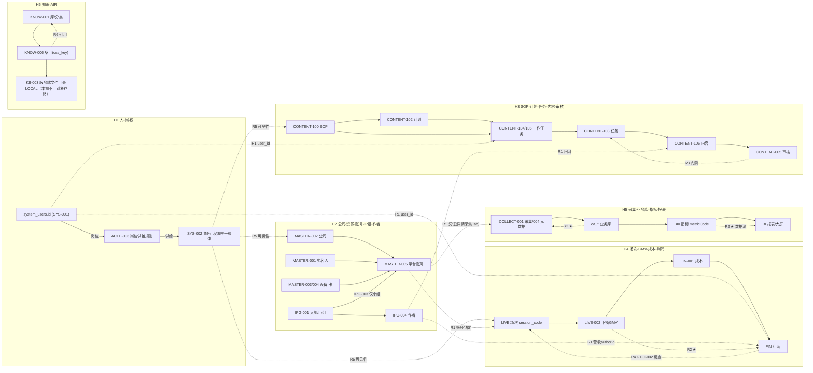
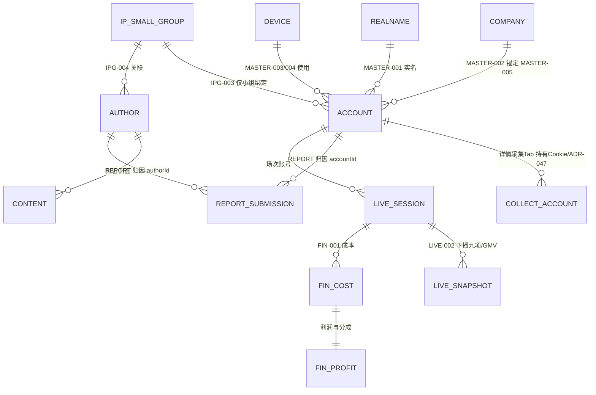
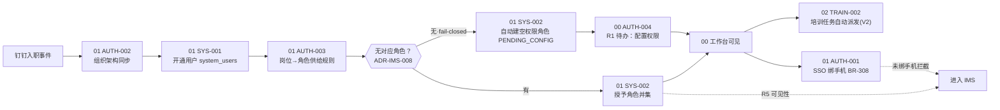
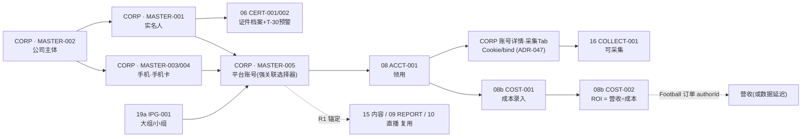
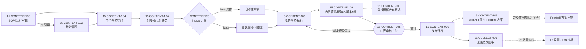
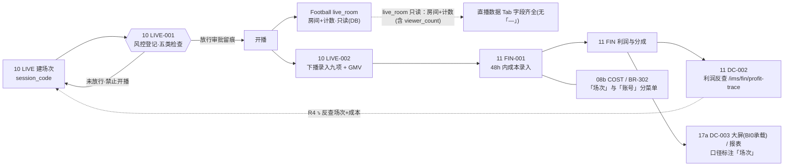
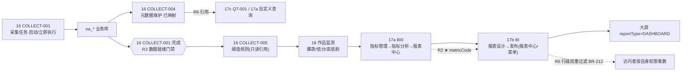
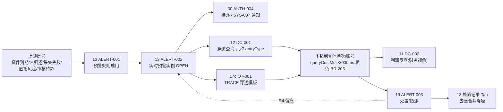
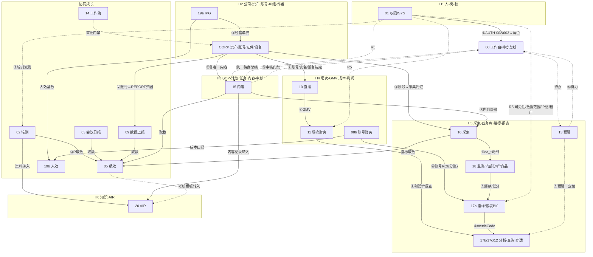

# IMS 功能关系图谱（业务关系与流程关系）

> **图谱定位**：本文件是《IMS-功能复盘-业务需求与价值-20261005.md》的**「关系维度」深化**——复盘回答「每个功能做什么、值多少」，本图谱回答「**功能之间谁锚定谁、谁的产出喂给谁、谁卡谁、谁给谁下钻、谁决定谁可见、谁引用谁的版本**」。
> **需求 SSOT**：《IMS完整产品需求文档》**v2.6.34**（`产品PRD/IMS完整产品需求文档.md`）｜**叙事 SSOT**：《IMS-业务用户故事》**v1.6**（分册 A~F + QT）｜**范围冻结**：ADR-IMS-006。
> **范围**：8 大导航域 · 28 模块 · 约 160 功能点。交互载体 `UI原型/IMS-完整系统-UI原型.html`（109 页）。
> **本期已收敛事实（贯穿全篇）**：① **AIR 知识库 = 文件管理**（`KbProvider=LOCAL`，语义检索整体移出本期范围，KNOW-003/KB-001 整体移除不做）；② **内容生产 = 7 子菜单**（SOP 审核整体移除、模板免审；「全部任务」为「我的任务」页内 Tab）；③ ADR-IMS-008 **角色 = 权限唯一载体**（岗位模板降级为「岗位→角色 供给规则」）；④ IR-01/02/03 架构铁律。
> **关系粒度**：所有关系**具体到模块编号 / 功能点编号**。

---

## 0. 关系维度定义与读法

### 0.1 六类关系（本图谱的维度）

| 码 | 关系类型 | 一句话定义 | 所属大类 | 方向性 |
|----|----------|------------|----------|--------|
| **R1** | 主数据锚定关系 | 主数据（Hub 实体）→ 从属实体；谁定义、谁引用 | **数据流**（静态结构） | 单向（Hub → 从属） |
| **R2** | 产出-消费关系 | A 的产出是 B 的输入（数据或文档） | **数据流**（动态流转） | 单向（产出 → 消费） |
| **R3** | 触发-门禁关系 | B 只有 A 通过/完成才可做（前置条件） | **流程/时序** | 单向（触发方 → 被触发/被阻塞） |
| **R4** | 汇总-下钻关系 | 明细 → 汇总 → 反查/穿透（可回退） | **数据流**（双向） | 双向（汇总 ⇄ 明细） |
| **R5** | 权限-可见性关系 | 人-岗-权 / 数据范围 / IP 组 / 租户 决定「谁看得见什么」 | **横切 · 流程/时序** | 单向（权限源 → 被授权对象） |
| **R6** | 版本-引用关系 | 配置/主数据被谁引用；改动影响谁（版本与影响面） | **数据流**（静态依赖） | 单向（被引用者 → 引用者） |

### 0.2 「数据流关系」与「流程/时序关系」的区分（硬要求）

| 大类 | 包含 | 特征 | 判据 |
|------|------|------|------|
| **数据流关系** | R1、R2、R4、R6 | **静态或异步**：描述「数据从哪来、到哪去、谁依赖谁」；**断开不阻断事务**，只影响结果新鲜度 | 问「**数据**流向何处」 |
| **流程/时序关系** | R3、R5 | **时序**：描述「**必须先A后B**」「谁阻塞谁」「谁决定可见」；**断开会阻断动作** | 问「**动作**能否此刻执行」 |

> 例：「16 COLLECT → 17a BI0」是 **R2 数据流**（采集数据喂给指标，采集延迟只让指标变旧，不阻断指标管理做配置）；「16 COLLECT 采集完成 →门禁→ 17a BI0 分析」是 **R3 时序**（无已入库数据则无法出分析结果）。两者**同源不同类**，本图谱分别标注。

### 0.3 符号约定

| 符号 | 含义 | 符号 | 含义 |
|------|------|------|------|
| `→` | 数据/流程方向（产出方 → 消费方） | `★` | **强依赖**（断开则目标不可用） |
| `⛔` | 门禁 / 阻塞节点 | `○` | **弱依赖**（断开仅降级/变旧） |
| `⊞` | 汇总节点（R4 上行） | `⤵` | 下钻 / 反查（R4 下行） |
| `[Rn]` | 关系类型标签（n=1..6） | `(延迟)` | 异步最终一致（补偿队列 / 数据延迟） |
| `H#` | Hub 实体编号（§2） | `⛓` | 版本-引用链（R6） |

---

## 1. 关系类型总览

> 本章把 6 类关系各自「是什么、谁锚定谁、典型例子」列清；具体到功能点的实例见 §3~§6。

### R1 主数据锚定关系（主数据 → 从属）

| 主数据（Hub 锚点） | 从属实体 | 锚定键 | 实例（功能点级） |
|---------------------|----------|--------|------------------|
| 用户 `system_users.id` | 所有人员 FK | `user_id` | SYS-001 → MEET 日报 / REPORT 填报 / PERF 考核 / TRAIN 指派 |
| 公司 `MASTER-002` | 账号 / 合同 / 公众号容量 | `company_id` | MASTER-002 → MASTER-005 平台账号（强关联选择器，禁手输 1500） |
| 实名人 `MASTER-001` | 账号 / 手机卡 / 证件 | `realname_id` | MASTER-001 → MASTER-005 / MASTER-004；CERT-001 证件档案 |
| IP 组 `IPG-001` | 账号 / 作者 / 成员 / 数据权限 | `ip_group_id` | IPG-003 → MASTER-005 账号（**仅小组**绑定）；IPG-004 作者 |
| 作者 `IPG-004` | 内容 / 上报归因 / ROI 营收 / 人效 | `author_user.id` | IPG-004 → CONTENT-106 内容；→ REPORT 归因；→ COST-002 ROI |
| 岗位 `AUTH-003`（`dict_position`） | 角色 / 培训资料 / 学习任务 | `positionCode` | AUTH-003 → SYS-002 角色（供给规则）；→ TRAIN-001 岗位资料库 |
| SOP 模板 `CONTENT-100` | 计划 / 任务 / 内容 | `sop_id` | CONTENT-100 → CONTENT-102 计划（**未发布 SOP 不可被计划引用 1501**） |

### R2 产出-消费关系（A 的产出是 B 的输入）

| 产出方 | 消费方 | 产出物 | 强弱 |
|--------|--------|--------|------|
| 16 COLLECT-001 采集任务 | 18 监测 / 17a BI0 / 17b·12 分析 | `oa_*` 作品/账号明细 | ★ |
| 16 COLLECT-004 元数据维护 | 17c QT / 17a BI0 自定义查询 | 已映射实体字段（P4m） | ★ |
| 16 COLLECT-005 阈值规则 | 18 内部分析/竞品分析 · 13 ALERT | 爆款/低分/高低粉阈值 | ○（只读引用） |
| 10 LIVE-002 下播录入 | 11 FIN-001 成本核算 | 单场 GMV | ★ |
| 11 FIN 利润核算 | 11 DC-002 利润反查 | 利润构成 | ★ |
| 15 CONTENT-106 内容 | 15 CONTENT-109 方案同步 | 内容终稿 | ★（写 Football） |
| 15 CONTENT-005 审核通过 | 15 CONTENT-006 发布归档 | 已审内容 | ★ |
| 02 TRAIN-003 / 03 MEET / 09 REPORT / 15 CONTENT / 16 COLLECT 指标 | 05 PERF-002 自动算分 | 取数指标 | ○（多源汇总） |
| 02 TRAIN-001 / 05 PERF 模板 / 15 CONTENT 记录 | 20 AIR 知识库（KNOW-006 转入） | 可入库条目 | ○（勾选转入） |
| 08b COST-001 成本 | 19b EFF 人效盘点 | 成本口径 | ○ |
| 17a BI0 指标 | 17b BI 报表数据源 / 大屏 widget | `metricCode` | ★ |
| 01 SYS-007 消息通知 | 00 AUTH-004 消息中心 | 站内信/钉钉 | ○ |

### R3 触发-门禁关系（B 只有 A 通过才可做）

| 触发/门禁方 | 被阻塞方 | 门禁语义 | 解除条件 |
|-------------|----------|----------|----------|
| **15 CONTENT-005 内容审核** | 15 CONTENT-103 任务完成 / 106 内容发布 | 审核门禁 | 审核**通过**（可配置级数） |
| **10 LIVE-001 风控登记** | 单场**开播** | 风控放行 | 五类检查通过 + 放行审批留痕 |
| **16 COLLECT-001 采集入库 + 004 映射** | 17a/17b/12 分析出数 | 数据就绪门禁 | 明细入库 + 元数据已映射（1261 拦截） |
| **01 AUTH-001 SSO（BR-308 绑手机）** | 进入 IMS | 登录门禁 | `mobile` 命中 `system_users` |
| **01 AUTH-003 岗位供给 + SYS-002 角色** | 用户可见功能 | 入职/权限门禁 | 授予角色；**fail-closed 空权限≠放行** |
| **14 FLOW 审批流** | 领用/培训/上报等审批型动作 | 审批门禁 | 审批节点通过 |
| **11 FIN-001 成本录入** | FIN 利润 / DC-002 反查 | 成本就绪 | 48h 内录入并核准 |
| **15 CONTENT-109 WebAPI 同步** | Football 方案上架 | 集成门禁 | HTTP 成功或进补偿队列（延迟） |

### R4 汇总-下钻关系（明细 → 汇总 → 反查/穿透）

| 明细层 | 汇总层（⊞） | 反查/下钻入口（⤵） | 说明 |
|--------|-------------|---------------------|------|
| 单场 GMV/成本（LIVE-002 / FIN-001） | 场次利润（FIN） | **11 DC-002 利润反查** `/ims/fin/profit-trace` | 从利润反查构成场次与成本 |
| 账号明细 | 账号/IP组/公司 ROI（COST-002） | 报表→穿透 | 营收走 Football 订单（authorId） |
| 采集明细（COLLECT） | 指标（BI0）/ 报表（BI）/ 大屏 | **12 DC-001 穿透** `/ims/dc/trace` · **17c QT-001** | 六种 entryType 逐层下钻，`queryCostMs` |
| 全链路经营 | 大屏（`reportType=DASHBOARD`） | DC-003（BI0 承载） | BR-210 新鲜度同 DC |
| 人员归属/产出 | **19b EFF 人效看板** | EFF 页内三 Tab（归属/盘点/看板） | 反查 IPG+任务+成本 |

### R5 权限-可见性关系（人-岗-权 决定可见）

| 权限源 | 决定 | 粒度 | 实例 |
|--------|------|------|------|
| `SYS-002` 角色（**权限唯一载体**，ADR-IMS-008） | 菜单/按钮可见 + 功能点 R/W/D | 功能点 | 无 `ims:fin:profit-trace:query` → 利润反查不可见 |
| `SYS-002` `dataScope` | 数据行可见范围 | **全部/部门/IP组/本人**（BR-305） | 运营人员仅见本组数据 |
| `IPG-003` 账号绑 IP 组 | 账号/内容/成本数据归属 | IP 组（**仅小组**） | IP 组是数据权限轴 |
| `SYS-008` 租户 `tenant_id` | 全业务表行级隔离 | 租户 | 跨租户 1504 |
| `AUTH-003` 岗位供给规则 | 新用户默认角色 | 岗位 | 无角色→自动建 `PENDING_CONFIG` 空角色（fail-closed） |
| `SYS-005` 参数 | 功能开关可见性 | 全局 | `jingcai` 开关控制 CONTENT-105 是否自动建草稿 |

### R6 版本-引用关系（配置被谁引用，改动影响谁）

| 被引用配置（带版本） | 引用方的行为 | 版本影响 |
|----------------------|--------------|----------|
| `CONTENT-100` SOP 模板 | CONTENT-102 计划 / CONTENT-104 出任务 | SOP 可在用版本的 DAG 变更影响在跑任务定义 |
| `AUTH-003` 岗位供给规则（保留版本，POS-R2） | 用户角色授予 | 变更生成新版本，**已套用用户不自动变更** |
| `CONTENT-107` 公推模板 | CONTENT-106 任务执行页套版式 | 停用模板不可选 |
| `17b` 已发布报表 | 发布链接/菜单（`sys_menu` + `ims_report_menu`） | **发布版本快照**；报表下线菜单自动置灰 |
| `17a` 指标（`metricCode`） | 17b 报表组件数据源 | 指标口径变更影响所有引用报表 |
| `16 COLLECT-004` 元数据映射 | 17c QT / BI0 自定义查询实体 | 映射变更影响已发布查询模板 |
| `SYS-003` 菜单树 / `SYS-004` 字典 | 全系统导航/枚举 | 字典值域变更影响所有消费方 |

---

## 2. 主数据锚点（Hub 实体）关系图

### 2.1 六大 Hub 一览

| Hub | 名称 | 核心实体（功能点） | 锚定轴 | 下游从属 |
|-----|------|--------------------|--------|----------|
| **H1** | 人-岗-权 | `system_users.id` · AUTH-003 岗位 · SYS-002 角色 | `user_id` / `positionCode` / `roleId` | 全系统人员 FK、菜单可见、数据范围 |
| **H2** | 公司-资源-账号-IP组-作者 | MASTER-002 公司 · 003/004 设备卡 · 001 实名人 · 005 账号 · IPG-001/003/004 | `company_id` / `account_id` / `ip_group_id` / `author_user.id` | 内容/采集/直播/报告/成本/人效 |
| **H3** | SOP-计划-任务-内容-审核 | CONTENT-100 · 102 · 104/105 · 103 · 106 · 005 | `sop_id` / `task_id` / `content_id` | 审批门禁、Football 方案、采集效果 |
| **H4** | 场次-GMV-成本-利润 | LIVE 场次 · LIVE-002 GMV · FIN-001 成本 · FIN 利润 · DC-002 | `session_code` | 财务口径、利润反查 |
| **H5** | 采集-业务库-指标-报表 | COLLECT-001/004/005 · `oa_*` 业务库 · BI0 指标 · BI 报表 | `entity_code` / `metricCode` | 监测、分析、查询、预警、穿透 |
| **H6** | 知识-AIR | KNOW-001~006 · KB-002/003（`LOCAL`）· 转入源 TRAIN/PERF/CONTENT | `kb_id` / `category_id` / `doc_id` | 专家组装、AI 能力复用 |

### 2.2 Hub 关系图（Mermaid graph）

### 2.3 H2 / H4 关键实体关系（ER 视角）

---

## 3. 功能依赖矩阵（模块 × 模块 · 带方向）

> 读法：**行 = 产出方 / 触发方**，**列 = 消费方 / 被触发方**；单元格 = `关系码+强弱`（`R2★` = 产出-消费强依赖）；空 = 无直接关系；`↺` = 反向另见对应格。为可读性，仅列 12 个高互联模块。

### 3.1 二维矩阵

| 产出方 ↓ \ 消费方 → | 01 权限 | 19a IPG | 15 内容 | 16 采集 | 10 直播 | CORP 资产 | 08b COST | 11 FIN | 17a 指标报表 | 17b/17c/12 分析 | 13 预警 | 00 工作台 |
|---|---|---|---|---|---|---|---|---|---|---|---|---|
| **01 权限 AUTH/SYS** | — | R5★ | R5★ | R5★ | R5★ | R5★ | R5★ | R5★ | R5★ | R5★ | R5★ | R5★ |
| **19a IPG** | R1○ | — | R1○ | R1★ | R1○ | R1○ | R1★ | R1○ | R1○ | R1○ | — | R1○ |
| **15 内容 CONTENT** | — | — | R3★(内部) | R2○ | R2○ | R1○(作者) | — | — | R2○ | R2○ | R3○ | R3★ |
| **16 采集 COLLECT** | — | — | — | R3★(内部) | — | — | — | — | R2★ | R2★ | R2○ | R3○ |
| **10 直播 LIVE** | — | — | R2○ | — | R3★(内部) | — | — | R2★ | R2○ | R2○ | R2○ | R3○ |
| **CORP 资产账号** | — | R1○ | R1★ | R1★ | R1★ | R3★(内部) | R1★ | — | R1○ | R1○ | — | R3○ |
| **08b COST** | — | — | — | — | — | — | — | — | R2○ | R2○(19b) | — | R2○ |
| **11 FIN** | — | — | — | — | — | — | — | — | R2○ | R2★(11 DC-002) | — | R2○ |
| **17a 指标报表 BI0** | — | — | — | — | — | — | — | — | — | R2★(17b数据源) | R2○ | R2○ |
| **17b/17c/12 分析** | — | — | — | — | — | — | — | — | — | — | — | R2○ |
| **13 预警 ALERT** | — | — | — | — | — | — | — | — | — | R3○(预警→定位) | R3★(内部) | R3★ |
| **00 工作台 HOME** | R3○(待办) | — | R3★(待办) | — | — | — | — | — | — | — | — | — |

### 3.2 关键有向关系明细（补充矩阵不可见的跨域 R3/R4/R6）

| # | 产出/触发方 | → | 消费/被拦方 | 关系 | 强弱 | 落点说明 |
|---|-------------|---|-------------|------|------|----------|
| 1 | 16 COLLECT-001 | → | 17a BI0 指标 | R2 | ★ | 采集明细喂指标（数据流） |
| 2 | 16 COLLECT-001 完成 | →⛔ | 17a/17b/12 出数 | R3 | ★ | **采集完成才可分析**（时序门禁） |
| 3 | 15 CONTENT-005 | →⛔ | 15 CONTENT-103/106 | R3 | ★ | 内容审核门禁 |
| 4 | 15 CONTENT-104 | → | 15 CONTENT-103 | R2 | ★ | 工作任务→我的任务 |
| 5 | 10 LIVE-001 | →⛔ | 单场开播 | R3 | ★ | 风控放行 |
| 6 | 10 LIVE-002 GMV | → | 11 FIN 利润 | R2 | ★ | 下播 GMV→场次利润 |
| 7 | 11 FIN 利润 | ⇄ | 11 DC-002 利润反查 | R4 | ★ | 汇总⇄下钻（双向） |
| 8 | 02/03/09/15/16 指标 | → | 05 PERF-002 算分 | R2 | ○ | 多源取数 |
| 9 | TRAIN-001/PERF 模板/CONTENT 记录 | → | 20 KNOW-006 转入 | R2 | ○ | AIR 系统资料转入 |
| 10 | 20 EXPERT-002 | → | 20 EXPERT-003 组装 | R2 | ○ | 技能组合成专家 |
| 11 | 01 SYS-002 角色 | →⛔ | 全功能可见性 | R5 | ★ | fail-closed 空权限 |
| 12 | 17b 发布 | → | SYS-003 菜单（`sys_menu`+`ims_report_menu`） | R6 | ★ | 上报为菜单并置灰联动 |
| 13 | 13 ALERT-002 | → | 12 DC-001 / 17c QT | R3 | ○ | 预警→定位（时序） |
| 14 | 12 DC-001 | ⤵ | COLLECT 明细 / 场次 / 账号 | R4 | ★ | 逐层下钻 |
| 15 | 01 IR-03 停 OPS | → | 并入域（M0~M10）运行时 | R6 | ★ | 切流后 OPS 菜单下线 |

---

## 4. 流程关系图（6 条端到端链）

> 节点命名 = **模块编号，功能点编号**；`{{...}}` = 门禁节点（⛔）；虚线 `-.->` = 门禁解除/异步/补偿。

### 4.1 流程① 人员入职

### 4.2 流程② 资产账号上架

### 4.3 流程③ 工作任务与内容（本期 7 子菜单）

> **说明**：CONTENT-104 的**矩阵确认出任务**是「我的任务」的来源；「全部任务」为 CONTENT-103 页内 Tab（非独立子菜单）；SOP 审核整体移除（模板保存即生效）。

### 4.4 流程④ 开播到场次利润

### 4.5 流程⑤ 日常分析

### 4.6 流程⑥ 问题定位

---

## 5. 触发与门禁关系表（谁能阻塞谁）

> 语义：**阻塞方（门禁）→ 被阻塞方 → 解除条件**。`fail-closed` = 缺省拒绝。

| # | 阻塞方（门禁/触发） | 被阻塞方 | 门禁类型 | 级别 | 解除条件 | 错误码/表现 |
|---|---------------------|----------|----------|------|----------|-------------|
| G1 | **15 CONTENT-005 内容审核** | 15 CONTENT-103 任务完成 · 106 内容发布 | 审核门禁 | ★阻断 | 审核**通过**（级数可配） | 未审内容不进发布态列表 |
| G2 | 15 CONTENT-103 提交人=审核人 | 自我审核 | 回避规则 | ★阻断 | 换审核人 | 审核按钮禁用 |
| G3 | **10 LIVE-001 风控登记未放行** | 单场**开播** | 风控放行 | ★阻断 | 五类检查通过 + 放行审批 | 未放行不可开播 |
| G4 | **16 COLLECT-001 未完成 + 004 未映射** | 17a/17b/12 分析出数 | 数据就绪 | ★阻断 | 明细入库 + 元数据已映射 | 1261 → 链 `/ims/collect/metadata` |
| G5 | **01 AUTH-001 SSO 未绑手机** | 进入 IMS | 登录门禁 | ★阻断 | `mobile` 命中 `system_users` | BR-308 |
| G6 | **01 SYS-002 空权限（fail-closed）** | 全系统功能可见（**空权限≠放行**） | 权限门禁 | ★阻断 | 角色并集非空 | AC-AUTH-022 拒绝 |
| G7 | 01 AUTH-003 岗位无对应角色 | 用户默认权限 | 入职门禁 | ★阻断 | 自动建角色 + 配置权限 | `PENDING_CONFIG` + R1 待办 |
| G8 | **14 FLOW 审批流** | 领用/培训/上报等审批型动作 | 审批门禁 | ★阻断 | 审批节点通过 | 单据状态流转 |
| G9 | **11 FIN-001 成本未录入** | FIN 利润 · 11 DC-002 反查 | 成本就绪 | ★阻断 | 48h 内录入并核准 | 无核准场次空态 |
| G10 | **15 CONTENT-109 WebAPI** | Football 方案上架 | 集成门禁 | ○降级 | HTTP 成功或进补偿队列 | BR-303（内容已存，同步延迟） |
| G11 | 10 LIVE 直播 metrics HTTP 未提供 | 单场「直播数据」GMV/峰值/观看 | 数据源门禁 | ○降级 | 后续 Football OpenAPI | UI 显示「—」，**非整页阻塞** |
| G12 | 05 PERF-002 绩效状态机 | 执行考核确认 | 状态门禁 | ★阻断 | **ADR-IMS-005 冻结后** | **BLOCKED**（非法转移报错） |
| G13 | 01 IR-03 切流停 OPS | OPS 进程/菜单在线 | 切流门禁 | ★阻断 | IMS 验收通过后停 OPS | OPS 下线（Football 保留） |
| G14 | 20 AIR 知识库 KNOW-003 检索 | 二级知识检索 | 范围门禁 | ★阻断 | **已移出本期范围（v2.6.34 整体移除，不做）** | 无检索入口；`experts.assemble.knowledge_context` 恒空 |
| G15 | 16 COLLECT-003a 凭证缺失（Cookie） | 采集任务执行 | 凭证门禁 | ★阻断 | 公司资产账号详情采集 Tab 补 Cookie（ADR-047） | 任务 fail + 深链账号采集 Tab；1243 进日志 |
| G16 | 09 REPORT 作者/账号必填 | 提交填报单 | 归因门禁 | ★阻断 | 选 authorId + accountId（级联 IP 组账号池） | 1001 拦截；无 IP 组共池 1127 |

**门禁传播链（R3 链式）**：`G6 权限` → 决定 `G1/G3/G8/G9` 是否可操作 → 决定 `G4` 是否可见 → 决定 `G5` 是否可登录。**权限门禁是最上游的系统级阻塞**。

---

## 6. 全系统关系总图

> 一张图收进 **6 个 Hub + 6 条链**；节点用模块编号。实线 = R1/R2/R4 数据流；虚线 = R3/R5 时序门禁。

---

## 7. 关系层面的风险 / 断点 / 待决

> 只列**关系视角**的风险（谁与谁的连接会断、谁卡谁失效），不重复功能清单。

| # | 类型 | 关系断点 | 影响的连接 | 严重度 | 处置/现状 |
|---|------|----------|------------|--------|-----------|
| B1 | **端到端断点** | **CONTENT 端到端联调深度不可验收**（OPS 矩阵/执行/审核闭环） | 流程③ 的 `CONTENT-104→103→106→005→006` 整链 | **高** | 仅支持**模块级 Slice Gate**，不支持整系统全量开写；按模块切片联调 |
| B2 | **已解决** | 直播数据改用 `live_room` DB 只读（房间 + 计数含 `viewer_count`）；**时长/场次聚合「照抄现网」** `RoomMapper.xml#getLiveRoomCount`（`author_id`+`create_time between`，**无 `deleted`**；不等 REST / 不用 Feign） | — | 已解除 | 转正为正式数据源；GMV 等下播录入；口径见 LIVE 契约 §2.2 |
| B3 | **已定范式** | 并入域「实体→账号」级联**统一沿用 IP 组账号池**（`GET /admin-api/ims/ip-group/{id}/accounts`）；**账号→作者唯一化 = 加列**（`oa_ip_group_anchor_rel.is_primary` + `oa_platform_account.author_user_id`，错误码 **1223**） | 流程② → REPORT 归因（G16）· COST ROI / CONTENT `createArticle` | 已解除 | 2026-10-05 决议；**禁**新增 `authors/{id}/accounts`；映射规则见 MASTER 契约 §账号→作者映射列 |
| B4 | **IA 兼容 BLOCKED（三处）** | 走查 #8 Q1（个人账号/企微/B站/斗鱼是否增 L3）、Q5（`ims:corp:*` ↔ `ops:account:*` 权限码映射）；PERF Q1/Q3（OPS 单条 vs IMS 月度双轨、P3 首屏取数源）；DC Q1（OPS「线索挖掘」无 SSOT） | R5 可见性（权限码映射）· 05 PERF 取数· 12 DC 交互 | 中 | 默认假设已记；切片前 ADR 冻结 |
| B5 | **铁律关系影响** | **IR-03 切流停 OPS**：并入域 M0~M10 运行时不得再依赖 OPS HTTP | 并入域（内容/采集/指标/监测）全部 R1/R2 上游 | **高** | IMS 直连 `oa_*`（同库非同服务）；验收通过后停 OPS，禁止长期双写 |
| B6 | **已移除** | AIR 语义检索（KNOW-003 / KB-001 / knowledge_context）| H6 对外输出 | 已解除 | 整体移出本期范围；`KbProvider=LOCAL`；`KnowledgeProvider` 抽象保留 |
| B7 | **设备断点** | CORP 办公/直播设备分页 API **部分 BLOCKED** | 流程② 的 `MASTER-003/004 → LIVE` 关联 | 低 | 空态或 BLOCKED 说明，无假 CRUD toast；**页面必须保留分页组件** |
| B8 | **状态机断点** | 05 PERF-002 后端**统一状态机 BLOCKED** | 流程「考核执行确认」（G12） | 中 | ADR-IMS-005 已冻结映射，切片前实现 |
| B9 | **横切一致性** | SYS-008 租户 `tenant_id` + BR-305 数据范围（全部/部门/IP组/本人） | 全系统 R5 可见性 | 中 | 全业务表 `tenant_id`；发布/分享**行级双重过滤**（创建者 ∩ 查看者，BR-212） |
| B10 | **版本影响面** | `AUTH-003` 岗位供给规则升级（生成新版本，已套用用户不自动变更）+ `17b` 已发布报表版本快照 | R6 版本-引用链 | 低 | 保留版本管理与审计；报表下线菜单自动置灰 |
| B11 | **补偿链** | `CONTENT-109/110` WebAPI 失败进补偿队列 | 流程③ 的 IMS→Football 上架/下架 | 低 | BR-303：内容已保存成功，同步异步补偿不阻塞主路径 |

> **R-E（2026-10-05）追加裁定（不新增关系断点）**：① **CONTENT 双契约 = 方案甲**（主契约=字段权 / 补充契约=范围权）；② **文件存储本期不上对象存储**（统一 IMS 服务端文件目录，见《全局开发规范》§6.3）；③ Football 全路径对照表**引进 IMS**（`产品规格/V1/FB-Football-WebAPI-待盘点全路径对照表.md` 引进版）。详见《IMS-关系断点处置方案-20261005.md》§0.5。

### 7.1 最强依赖 / 最关键门禁 / 最脆弱断点（收口）

- **最强依赖**：`H5 采集 → BI0/BI/12`（R2★ 全链路数据源）与 `01 SYS-002 角色 → 全功能可见性`（R5★ 横切）；数据侧与权限侧各有一条「断则全断」的脊柱。
- **最关键门禁**：`G6 权限 fail-closed`（系统级最上游）→ 决定 `G1 内容审核门禁` / `G3 直播风控放行` / `G9 成本就绪` 能否发生；其中 **G1 内容审核门禁**是业务流程中最高频的阻断点。
- **最脆弱断点**：**B1 CONTENT 端到端仅模块级 Slice Gate**（流程③整链不可整系统验收）；次为 **B5 IR-03 停 OPS 后禁止 OPS HTTP 依赖**（所有并入域上游连接方式被强制改写）。

---

> **附**：本图谱与《IMS完整产品需求文档》v2.6.34、《IMS-业务用户故事》v1.6、《IMS-功能复盘-业务需求与价值-20261005.md》一一对应；关系内所有编号可直接回查 PRD §3A 功能点清单与 §6 关键业务流程。
