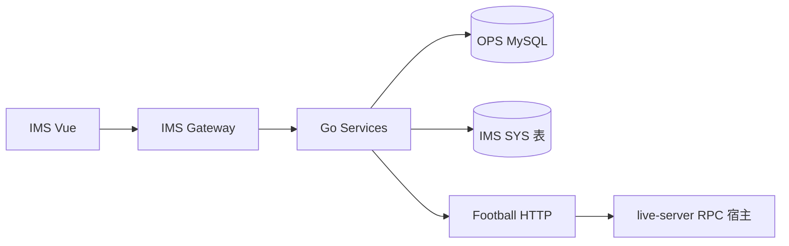

# IMS 技术设计总册

> **版本**：v1.0 | **日期**：2026-10-01（用户拍板）  
> **范围冻结**：《ADR-IMS-006-一次性开发范围冻结.md》  
> **需求 SSOT**：《IMS完整产品需求文档.md》

---

## 1. 系统边界

| 系统 | 职责 | IMS 关系 |
|------|------|----------|
| **IMS** | 唯一运营与一体化管理后台 | 独立应用 · 网关 `/admin-api/ims/` |
| **OPS 库** | 业务表 SSOT（M0～M10 并入表 + 扩展列） | ADR-001 共享读写的唯一业务数据源 |
| **Football** | 会员/方案/订单/直播 RPC 宿主 | **仅 HTTP**（`FB-Football-WebAPI适配.md`） |
| **OPS 进程** | 现网入口 | 验收后 **停用**（IR-03） |

---

## 2. 模块边界与 BFF 前缀

| 域 | 模块 | 路由前缀（目标） | 数据主表 / 来源 |
|----|------|------------------|-----------------|
| V1 基座 | AUTH/SYS/CORP/MASTER/LIVE | `/ims/auth` `/ims/sys` `/ims/corp` `/ims/live` | `ims_*` + `oa_*` |
| 日常 | CONTENT/COLLECT/MON/INT/COMPA | `/ims/content` `/ims/collect` `/ims/comp-analysis` … | **CONTENT 写**：IMS 表 + `/ims/content/**` API（2026-10-01）；`oa_*` 只读处仍 ADR-001 |
| V2 协同 | TRAIN/MEET/REPORT/FLOW/PERF | `/ims/train` `/ims/meet` `/ims/report` `/ims/flow` `/ims/perf` + `/ops/perf` 透传 | `ims_*` + OPS perf |
| V3 决策 | DC/BI/BI0/QT/EFF/FIN/COMP | `/ims/dc` `/ims/bi` `/ims/analysis/query-tool` … | 查询层 + 报表 |

**禁止**：运行时 OpenFeign 调 OPS。  
**例外（2026-10-01 · LIVE）**：单场 Football 直播间 **基本信息 + 计数**（预约/点赞/观看人数 `viewer_count`）允许 IMS **只读 JDBC** 表 **`live_room`**（与 live-server 同库/共用业务库，键 `ims_live_session.football_room_id`）；**仍禁止** Feign `LiveRoomApi` 与臆造 room metrics HTTP。

---

## 3. 数据流（读 / 写）

| 路径 | 写 | 读 |
|------|----|----|
| 平台账号 / 采集 | `oa_account` 凭证 ADR-047 | M4 API / IMS corp BFF |
| 内容 → Football | WebAPI 方案 create/update/status | ext 表 `author_article_id` |
| 数据上报 | `ims_report_*` | AuthorSelect + AccountSelect + IP 组账号池 |
| 绩效执行 | OPS `oa_perf_record` | `dict_perf_status` ADR-005 |
| 绩效批量 | `ims_perf_result` | `resultStatus` 独立 |
| 竞品作品 Tab 全部 | IMS BFF 读 `oa_external_work` | 爆款/低分透传 OPS monitor |
| 查询工具 | `ims_query_template` + MenuSeed | **`POST …/query-tool/run` 同步编排**：DRILL 逐级 M6 执行；TRACE 服务端逐步 DC trace；**无 1262 job** |

---

## 4. 横切能力

| 主题 | SSOT |
|------|------|
| 用户 FK | `system_users.id` · ADR-056 · 《IMS-用户FK与ADR-056摘要.md》 |
| 租户 | 全表 `tenant_id` · 1504 · 套餐 **`system_tenant` / `system_tenant_package`** · ADR-IMS-007 · SYS-008 |
| 字典 | SYS-004；资产类型 `dict_asset_type`（CORP 设备 L3） |
| 绩效状态 | ADR-IMS-005 |
| 上报去重 | 模板+周期+填报人+作者+账号 · 1127 共池 |
| QT 侧栏 | MenuSeed 动态 L3 · FR-QT-007/010 |
| TRAIN AI | ADR-IMS-004 同步 generate |

---

## 5. 实现顺序（建议）

1. **S0**：AUTH/SYS seed、用户 FK、错误码表、Football Client 壳  
2. **CORP 账号 + 采集 Tab**（ADR-047）→ REPORT 级联、COLLECT 任务  
3. **OPS 并入只读域**：MON/INT/COMPA/COLLECT 阈值  
4. **CONTENT**（UX-M2 主路径 + Football 写）  
5. **V2 协同**：MEET/REPORT/TRAIN（含 AI）/PERF（record 透传 + calc）  
6. **LIVE**（`ims_live_*` 全链 + **`live_room` 基本信息只读**；M6 时长聚合 HTTP 另案）  
7. **V3 决策**：DC/BI0/QT（含 MenuSeed）/EFF/FIN  
8. **AIR 四叶**（知识库 v2.6.31 由 Deferred 恢复；**v2.6.34 语义检索（KNOW-003/KB-001）整体移出本期范围**；仅文件管理，`KbProvider=LOCAL`）+ ALERT 框架  

整系统 Gate 仍按仓库 `MASTER-EXECUTION-TRACKER`；本顺序 **不跳过** 模块 Slice DoD。

---

## 6. 引用

- ADR-IMS-001 / 002 / 003 / 004 / 005 / **006** / **007**  
- 《IMS-PRD与原型完整性核验-20261001.md》
