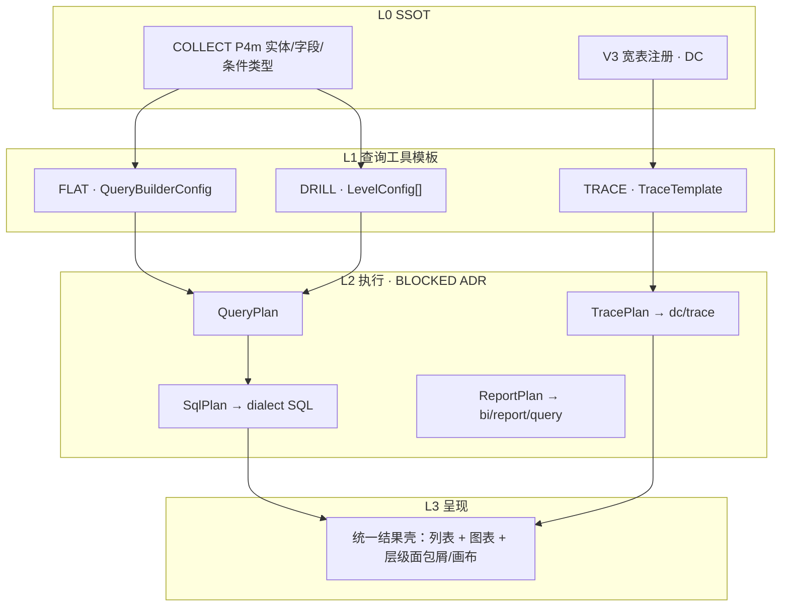

# IMS 查询工具 — 三模式统一引擎 · 产品方案

> **日期**：2026-09-30  
> **状态**：**走查 #18 已采纳**（选项 A P0 · PRD v2.6.14 · 规格《QT-查询工具-*》）  
> **前置**：《IMS-通用查询分析工具-可行性分析-20260930.md》· PRD v2.6.14 §17c · ADR-IMS-003  
> **SSOT 引用**：《BI0-指标查询报表-页面规格》P4 · 《BI-数据分析-页面规格》P2 · 《DC-数据中心-页面规格》P1 · 《COLLECT-数据采集-页面规格》P4m · BI0/BI/DC API 契约  
> **用户修正（本版）**：**自定义查询（M6 / BI0 P4）保持独立 L3**，不并入新工具；新能力以 **「查询工具」** 单产品、三交互模式、共享运行时呈现。

---

## 0. 文档目的

在保留 **自定义查询** 的前提下，评估并设计新产品 **「查询工具」**：同一套元数据与执行编排，支持 **平铺查询 · 分级下钻 · 穿透查询** 三种模式；明确与 DC 宽表、M6 QueryBuilder、BI 报表下钻的边界；给出 IA 选项与 P0–P3 分期。**不替代** 已登记 API/页面规格，实现细节在 ADR 前标记 **BLOCKED**。

---

## 1. 对产品诉求的回应（你说呢）

**你的判断大体对，但要加三层「但是」。**

1. **对的部分**：在 **COLLECT 已映射实体 + 指标库** 这一子域里，三种模式确实可以共用同一条链路——**元数据 → 组装可执行 SQL（或等价计划）→ 列表 + 图表**。这与 OPS 现网 `QueryBuilderConfig` + `buildQuerySqlFromConfig` 的方向一致，也符合 BI0 P4「表/图双 Tab」的消费形态。

2. **但是一 — 数据源不全是「动态 SQL」**：**穿透查询（DC-001）** 的底表是 V3 **预 join 宽表** + **六种固定 entryType / nodeType**，运行时主要是 `POST /dc/trace/query` 的参数映射与画布/表切换，**不是** M6 式 ad-hoc JOIN。若把 TRACE 模式也硬绑到 QueryBuilder SQL，会与 **BR-205（P95 &lt; 3s）**、**V3-A3 只读域** 冲突。更稳妥的说法是：**三种模式共享「查询计划 + 结果壳 UI」**，但 **TRACE 的计划类型 = TracePlan（宽表 + 预置边）**，**FLAT/DRILL = SqlPlan（元数据实体）**。

3. **但是二 — 「下钻」有两套语义**：**分级下钻（本工具 DRILL 模式）** 若指「每层一张表 + 关联键进下一层」，接近你要的可配置链；**预览与下钻（BI P2）** 则是 **已发布自助报表** 的 `layoutConfig` + `dimension-tree` + `cell-drill`（可 **跳转 DC**，非内嵌同一引擎）。因此：**DRILL 模式 ≠ 完全吃掉 BI P2**；BI P2 更宜作为 **「报表类已发布实例的运行时」**，查询工具的 DRILL 是 **「模板类多级探索」**，二者可 **互跳、共用 DrillSpec 元数据（远期）**，不宜一期合并为一个 L3。

4. **但是三 — 自定义查询单独保留是对的**：M6 **QueryBuilder + 发布供大屏/17b CUSTOM_QUERY** 已是切流 P0 承诺（ADR-003）。它强调 **个人/团队 ad-hoc、保存草稿、发布为数据集**，与「查询工具」强调的 **可配置多级/穿透模板 + 可选挂菜单** 产品心智不同。**自定义查询 = 轻量探索与发布；查询工具 = 结构化多模式分析产品**。

**一句话建议**：立项 **「查询工具」新 L3**（三模式 + 统一结果壳），**保留「自定义查询」L3**；**预览与下钻** 保留为 **报表查看/设计发布链** 的运行时，DRILL 模式与其 **能力重叠处用深链 + 共用元数据（P2+）** 收敛，而不是删掉 BI P2。**穿透查询 L3** 在 P0 仍走 DC-001；P3 再谈 TRACE 模式是否与 DC 页 **合并或双入口**（见 §6）。

---

## 2. 与用户假设的对照（细项）

| 假设 | 结论 | 说明 |
|------|------|------|
| 三模式底层都是「元数据 → SQL → 列表+图」 | **部分同意** | FLAT/DRILL（实体域）成立；TRACE 为 **TracePlan → 宽表 API/SQL 模板**，非自由 JOIN |
| 一套工具替代自定义查询 | **不同意** | 用户已明确保留 M6 L3；工具与 QueryBuilder **互补** |
| 一套工具合并预览与下钻 + 穿透 | **分阶段部分同意** | 交互壳可统一；**报表 layout 引擎** 与 **DC graph** 仍分 **Plan 类型** |
| 配置后可发布为 L3 菜单 | **方向同意，FR BLOCKED** | 现网仅各模块独立 publish；需 **MenuSeed + ADR**（可行性分析 Q4） |
| COLLECT 元数据 SSOT | **同意** | P4m 维护；BI0/工具 **只读** `entity/{code}/fields`；1261 规则不变 |
| M6 metricSchema 覆盖三模式 | **仅覆盖 FLAT 子集** | 关联/聚合/条件类型来自 M8；DRILL 需 **层级 Join 边**；TRACE 需 **DcEdge 注册**（未登记） |
| 租户/安全 | **同意且必须分层** | `tenant_id` 全链路；DC R7 脱敏、BI BR-212 行级、M6 创建者权限 — **artifact 级服务端校验**，不能仅靠前端模式切换 |
| 只读 vs 写 | **运行态只读** | 三者运行态均无写；**配置态** 在查询工具内（模板 CRUD），**不等于** COLLECT 映射编辑 |

---

## 3. 统一元数据模型（概念 · 实现 BLOCKED）

> 下列为 **产品/架构提案**；表结构、REST 路径、枚举落库 **未入契约** → 须 PRD FR + ADR + API 切片后方可实现。

### 3.1 核心实体

| 概念 | 说明 | 现网对齐 |
|------|------|----------|
| **CatalogEntity** | 可被查询引用的逻辑实体 | COLLECT `metadata` 实体 code |
| **CatalogField** | 字段、类型、条件控件、脱敏标记 | P4m 字段 + BI 指标 metricCode |
| **JoinEdge** | 两实体间关联（左键/右键/基数/cardinality） | M6 QueryBuilder「关联」；DRILL 多层边 **需扩展** |
| **WideTableProfile** | 宽表/ADS 注册（只读） | DC DWS/ADS；**非** COLLECT 1261 实体 |
| **TraceEdge** | entryType → nodeType 预置边 | DC 契约固定；用户可配链 **与现 DC 冲突** → P3 ADR |
| **QueryTemplate** | 保存的配置 + 模式 + 版本 | 类比 `oa_*` query 行 + BI report 行；**统一 artifact_type BLOCKED** |
| **QueryMode** | `FLAT` \| `DRILL` \| `TRACE` | 新枚举 |
| **LevelConfig** | DRILL/TRACE 单层：数据集/实体、默认筛选、展示列、下一层 JoinEdge 或 TraceEdge | 新 |
| **MenuSeed** | 发布后 route + perm | IMS 菜单自管；规则 **BLOCKED** |

### 3.2 模式与配置载荷（逻辑 JSON）

```typescript
/** 产品概念类型 — 非已批准 API Schema */
type QueryMode = 'FLAT' | 'DRILL' | 'TRACE';

interface QueryTemplateBase {
  templateCode: string;
  name: string;
  mode: QueryMode;
  tenantId: string;
  status: 'DRAFT' | 'PUBLISHED';
}

/** FLAT：单结果集，对齐 QueryBuilder 语义 */
interface FlatTemplate extends QueryTemplateBase {
  mode: 'FLAT';
  rootEntityCode: string;           // COLLECT 已映射
  builderConfig: QueryBuilderConfig; // OPS metricSchema 同形
}

/** DRILL：有序层级，每层 table + 到下一层 relation */
interface DrillTemplate extends QueryTemplateBase {
  mode: 'DRILL';
  levels: Array<{
    levelIndex: number;
    label: string;
    dataSource: { type: 'ENTITY'; entityCode: string } | { type: 'DATASET'; datasetId: string };
    displayFields: string[];
    defaultFilters?: FilterClause[];
    drillToNext?: JoinEdgeRef;      // 最后一层可无
  }>;
}

/** TRACE：入口 + 深度/层 + 关系链（产品向 DC UX 靠拢） */
interface TraceTemplate extends QueryTemplateBase {
  mode: 'TRACE';
  entryProfile: { allowedEntryTypes: DcEntryType[]; defaultDepth: number };
  relationChain: TraceEdge[];       // P3 前建议只读 seed，不允许用户改 ER
  presentation: 'GRAPH' | 'DETAIL' | 'AGGREGATE'; // 对齐 DcTraceMode + aggregate
}
```

### 3.3 与三现网能力映射

| 现网能力 | 建议映射 |
|----------|----------|
| 自定义查询 BI0 P4 | **不迁入**；FLAT 模式 **复用同一 builderConfig 形状**，可选「从自定义查询导入为 FLAT 模板」（P2 增强，**BLOCKED**） |
| BI P2 预览与下钻 | **报表实例** = `layoutConfig` + drill API；DRILL 模板 **可引用同一 dataset**，运行时 **不同 Plan**（ReportPlan vs DrillPlan） |
| DC P1 穿透查询 | TRACE 模板 **运行时调用** `/dc/trace/*`（P0）；P3 才考虑 **用户可配 TraceTemplate** 与 DC 规格对齐 revision |

### 3.4 元数据分层图



---

## 4. 执行层概念（QueryPlan → SQL / 专用 API）

> **BLOCKED**：方言、缓存、异步 1262、与 BI/DC 接口是 **新 REST** 还是 **编排现有 REST**，均需 ADR。

### 4.1 QueryPlan（逻辑）

1. **Resolve**：模板 + 运行时参数（筛选、分页、当前 drill 层、trace entryId）→ 解析 Catalog + 权限过滤（tenant、行级、DC 脱敏）。  
2. **Route**：按 `planType` 分支：`SQL_DYNAMIC` | `DC_TRACE` | `REPORT_LAYOUT`（后两者 **查询工具 P0 不实现 REPORT**）。  
3. **Compile**：`SQL_DYNAMIC` → `buildQuerySqlFromConfig` 扩展（多级 JOIN、层级参数绑定）；`DC_TRACE` → 映射为 DC 契约请求体。  
4. **Execute**：走对应 SLA 通道（M6 超时/1262；DC BR-205）。  
5. **Present**：统一 **QueryResult**（columns、rows、chartHints、levelState、breadcrumbs、queryCostMs）。

### 4.2 与 OPS 差距（执行）

| 项 | OPS/M6 | 查询工具需要 |
|----|--------|--------------|
| SQL 生成 | `metricSchema.ts` 单层 | DRILL 多层 JOIN + 参数传递 **未实现** |
| 穿透 | 无 SSOT（线索挖掘 BLOCKED） | TRACE 必须 **IMS DC 契约** |
| 预览/执行 API | `custom-query preview/execute` | 统一 `…/query-tool/run` **或** 编排层 **BLOCKED** |
| 双轨切流 | ADR-001 Go 化 M6 | V1 **不得** 改 M6 交互；工具 **Phase 2+ 壳** 或 IMS 新路由 |

---

## 5. UI 与交互

### 5.1 单 L3「查询工具」

| 元素 | 说明 |
|------|------|
| 路由（建议） | `/ims/analysis/query-tool`（**待产品确认**，勿与 `/ims/bi/query` 冲突） |
| 入口 | 数据分析 L2 下 **新增 L3**；与 **自定义查询** 并列 |
| 模式选择 | 顶栏 **模式切换**（FLAT / DRILL / TRACE）或 **新建向导**（选模式 → 配模板 → 预览 → 保存/发布） |
| 配置区 | FLAT：嵌入或复用 QueryBuilder 字段（**只读 COLLECT**）；DRILL：层级步骤条 + 每层表预览；TRACE：入口类型 + 深度 + 链预览（P0 可 **只读展示 seed 链**） |
| 运行区 | **统一 QueryResultPanel**：结果列表 \| 图表；DRILL 面包屑 + 「下钻到下一层」；TRACE 图/表/聚合切换 **对齐 DC P1 布局**（不发明 graph API） |
| 发布 | 保存 DRAFT → PUBLISHED；可选「供 BI 数据集引用」「挂菜单申请」（**BLOCKED FR**） |

### 5.2 与「预览与下钻」关系（澄清）

| 维度 | 查询工具 · DRILL 模式 | BI · 预览与下钻 P2 |
|------|----------------------|-------------------|
| 对象 | **QueryTemplate（DRILL）** | **已发布 Report** |
| 配置 | 层级表 + JoinEdge | layout 行/列/值 + dimension-tree |
| 消费 | 数据分析 · 查询工具 | 报表管理发布 → `/bi/report/view/{id}` |
| 单元格穿透 | 可配置「下一层表」 | `cell-drill` → MODULE_DETAIL / **DC_TRACE 跳转** |
| 建议 | P1 起 **BI 单元格跳 DRILL 模板** 或 DC **深链**；**不合并 L3** |

### 5.3 与「自定义查询」关系

- **菜单**：两者并存；查询工具页内 **不提供** QueryBuilder 替代路径作为唯一入口。  
- **能力**：FLAT 与 M6 **高度重叠** → 产品文案区分：**自定义查询 = 快速探索与发布数据集**；**查询工具 FLAT = 可挂菜单/多模式套件中的平铺模式**（避免用户困惑，P0 可 **隐藏 FLAT** 仅开 DRILL/TRACE，**待产品二选一**）。

---

## 6. 信息架构建议（数据分析 L2）

**约束**：PRD v2.6.13 四 L2 不变；**自定义查询保持独立 L3**（用户修正）。

### 6.1 选项 A — 增量 L3（推荐 P0 产品选择）

```
数据决策 → 数据分析
├── 查询工具          /ims/analysis/query-tool   【新 · 三模式配置+运行】
├── 自定义查询        /ims/bi/query              【保留 · M6 不变】
├── 预览与下钻        /ims/bi/report/preview     【保留 · 报表运行时】
├── 穿透查询          /ims/dc/trace              【保留 · DC-001 直至 P3 决策】
└── 组织人效          …
```

- **优点**：切流风险低；ADR-003 不动 M6；DC/BI 契约零改动即可启动 **壳 + FLAT/TRACE 只读 seed**。  
- **缺点**：L3 增多；需在导航文案区分「查询工具 vs 自定义查询」。

### 6.2 选项 B — 收敛运行时 L3（P3 目标态，需 ADR + PRD major）

```
数据决策 → 数据分析
├── 查询工具          【FLAT/DRILL/TRACE + 已发布模板运行 Hub】
├── 自定义查询        【保留 或 降为「快捷探索」深链到 FLAT】
├── 预览与下钻        【保留 或 降为「报表类实例」入口，从报表管理跳入】
├── 穿透查询          【退役侧栏 → 301 到查询工具 TRACE 模式 或 保留别名入口】
└── 组织人效
```

- **优点**：用户心智「一个分析入口」。  
- **缺点**：与《IA梳理》§2「禁止合并 DC/BI 下钻为一 Tab」需 **ADR 修订**；DC BR-205、BI BR-212 要在 Hub 内 **引擎路由**；切流与测试面大。

**推荐路径**：**先 A，P2–P3 评估 B**；无论 A/B，**自定义查询 L3 在用户当前诉求下不删除**（最多 B 中改为二级入口）。

---

## 7. 分期（P0–P3）

| 阶段 | 范围 | 交付 | 依赖 / 备注 |
|------|------|------|-------------|
| **P0** | IA 选项 A + 文档/FR | 新 L3 占位、模式枚举、**TRACE 运行时 = 嵌入/跳转 DC P1**（不重复造 graph API）；**DRILL = 规格 + 原型线框**，实现可 stub | COLLECT 映射、seed-analytics；**不合并** 三现网 Slice |
| **P1** | FLAT + 统一结果壳 | 复用 M6 builderConfig 执行；**与自定义查询 API 编排**（同形 config，不删 M6 页） | ADR：QueryPlan SqlPlan；1261/1262 |
| **P2** | DRILL 可配置模板 | LevelConfig + 多层 preview/run；与 BI `dimension-tree` **文档对齐**；可选从 BI cell-drill **深链** | BI API 扩展 **BLOCKED** 清单 |
| **P3** | TRACE 模板化 + IA 选项 B 评估 | TraceTemplate 与 DC 规格 **major 对齐**；MenuSeed 发布 L3；宽表 Catalog 与 COLLECT 关系 ADR | 数仓 ER SSOT、Q2/Q3 闭合 |

**OPS gap（延续可行性分析 §3）**：P0–P1 仍以 **M6 Go 化 + UX 对齐** 为主；查询工具 **独立 Vue 壳** 建议排在 **M6/DC/BI P2 基线绿** 之后，避免一片一会话跨 BI0+BI+DC。

---

## 8. 风险

| 风险 | 说明 | 缓解 |
|------|------|------|
| FLAT 与自定义查询重复 | 用户困惑、双维护 | P0 **隐藏 FLAT** 或明确文案；共用 config schema，单测 SQL 生成 |
| TRACE 动态链 vs DC | 破坏 BR-205 / 预 join | P3 前 TRACE **仅 seed**；禁止 QueryBuilder 直查宽表 |
| 权限三套 | M6 / BI / DC | QueryTemplate **artifact 级** perm；运行时复用各引擎校验 |
| Spec 蔓延 | 一片跨三模块 | 按 P0–P3 拆 Slice + CHECKLIST |
| ADR-003 | 改 M6 交互 | 自定义查询页 **OPS 1:1**；新能力在新 L3 |
| cell-drill | BI → DC | 查询工具 **链式跳转** DC，不内嵌 DC 引擎除非 P3 统一 Hub |

---

## 9. 开放问题（继承并追加）

| # | 问题 | 状态 |
|---|------|------|
| Q1 | 统一 QueryTemplate 表与 REST | BLOCKED |
| Q2 | DRILL LevelConfig 谁可配（管理员 vs seed） | BLOCKED |
| Q3 | TRACE 用户可配链 vs DC 固定六种 entry | BLOCKED · P3 |
| Q4 | 发布为数据分析 L3 审批与 perm | BLOCKED |
| Q5 | P0 是否 **隐藏 FLAT** 避免与自定义查询重复 | **已决 · #18**：P0 **隐藏 FLAT**，仅 DRILL + TRACE |
| Q6 | 查询工具路由与 perm 码命名 | **待产品** |
| Q7 | P3 穿透查询 L3 301 到 TRACE 还是双入口 | **待产品** |

---

## 10. 与可行性分析文档关系

- 《IMS-通用查询分析工具-可行性分析-20260930.md》结论 **「不宜一期三合一为单一 L3」** 仍然成立。  
- 本文 **采纳用户修正**：**不合并自定义查询**；将「通用」收窄为 **新 L3「查询工具」+ 三模式共享运行时**。  
- 可行性分析 **备选 C「分析资产」** 仍可作 P2 **Tab/列表** 挂在查询工具或数据分析下，与 **MenuSeed** 一并立项。

---

## 11. 变更记录

| 日期 | 说明 |
|------|------|
| 2026-09-30 | 走查 #18 已采纳：选项 A 入 PRD v2.6.14；Q5 FLAT 隐藏；QT 规格/API 契约 |
| 2026-09-30 | 初版：三模式、统一元模型、执行层概念、UI/IA A/B、P0–P3、对产品诉求回应 |
