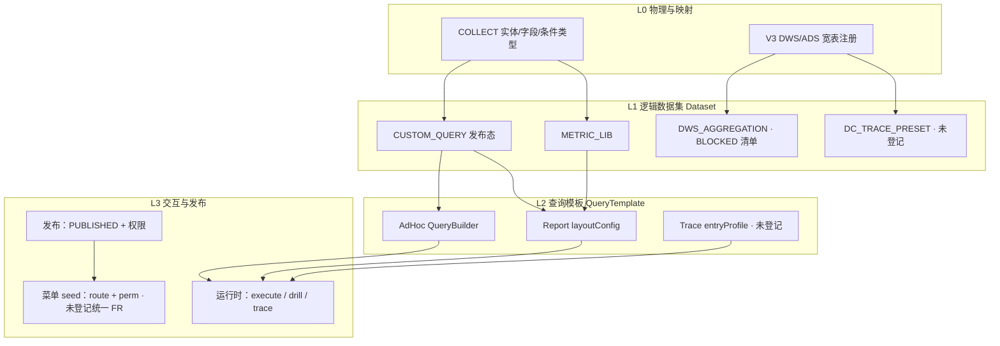

# IMS 通用查询分析工具 — 可行性分析

> **日期**：2026-09-30  
> **问题**：「预览与下钻」「穿透查询」「自定义查询」能否合并为**一套基于元数据配置查询条件、支持下钻/穿透关系链、可发布为自定义查询并 seed 菜单**的通用工具？  
> **方法**：对照 IMS 已登记规格（BI0 / BI / DC / COLLECT）、PRD v2.6.13 §17 IA、ADR-IMS-001/003、OPS M6 并入边界；参考 Lite DW PRD §9.8/§9.9 作产品对标，**不发明 API**。  
> **结论摘要**：**元数据与「已发布查询/报表实例」层可逐步统一；三能力运行时引擎与 SLA 不同，不宜一期合并为单一 L3 产品。** 推荐 **分阶段：共享数据集 SSOT + 发布/菜单编排**，保留 #17 v2 下三个独立 L3 入口。

---

## 0. 文档依据（SSOT）

| 来源 | 用途 |
|------|------|
| 《BI0-指标查询报表-页面规格》P4 | 自定义查询 QueryBuilder、发布态、1261/1262 |
| 《BI-数据分析-页面规格》P2 | 预览与下钻、单元格穿透、`jumpType: DC_TRACE` |
| 《DC-数据中心-页面规格》P1 + API 契约 §2.1 | DC-001 六种 entryType、GRAPH/DETAIL、禁止 graph 专用 API |
| 《COLLECT-数据采集-页面规格》§0.1 P4m | 元数据维护 vs BI 消费边界 |
| 《IMS-数据决策-IA梳理与重组-20260930》§2 重叠矩阵 | #17 对「下钻 vs 穿透」的定性 |
| 《IMS-数据决策-四能力设计分析-20260930》§5.1 | 能力边界表 |
| ADR-IMS-001 | 共用 `oa_*`、切流后停 OPS，无长期双写 |
| ADR-IMS-003 | M6 交互以 OPS UX 为准，IMS 原型非实现蓝本 |
| `一体化管理/参考文件/DW-PRD-Phase1.md` §9.8 / §9.9 | DW 将自定义查询与 BI 下钻分模块；IMS 进一步拆 DC |

**OPS 现网（本仓库无 football-front 源码，引用规格已登记路径）**

| 组件 | 路径（规格引用） |
|------|------------------|
| CustomQuery.vue | `apps/web-ele/src/views/ops/analysis/CustomQuery.vue` |
| QueryBuilder | `apps/web-ele/src/components/ops/QueryBuilder.vue` |
| SQL 生成 | `constants/ops/metricSchema.ts` → `buildQuerySqlFromConfig` |
| API | `api/ops/custom-query.ts`（list/create/preview/execute/publish） |

**PRD 交叉引用（一段）**：《IMS完整产品需求文档》v2.6.13 将 **数据决策** 固化为四 L2（数据报表 / 数据指标 / **数据分析** / 预警中心）；本分析**不修改**该导航，仅在「若产品确认合并工具」时给出 IA 备选。

---

## 1. 现状：三能力差异与重叠

### 1.1 能力对照（用户问题 × 已登记规格）

| 维度 | 自定义查询（BI0 P4） | 预览与下钻（BI P2） | 穿透查询（DC-001） |
|------|----------------------|---------------------|---------------------|
| **菜单（#17 v2）** | 数据分析 L3 `/ims/bi/query` | 数据分析 L3 `/ims/bi/report/preview`（查看态路由 `/bi/report/view/{id}`） | 数据分析 L3 `/ims/dc/trace` |
| **核心问题** | 对**已映射实体** ad-hoc 探索并**保存/发布** | 对**已发布自助报表**做维度下钻与单元格穿透 | 从**六种主数据入口**沿**预置链路**核查经营全链路 |
| **配置对象** | `QueryBuilderConfig`（字段/过滤/聚合/关联/SQL 预览） | `layoutConfig`（行/列/值/筛选 + 图表类型） | **无用户可配关系链**（V3 聚合宽表 + 固定 nodeType） |
| **元数据依赖** | COLLECT **已映射实体** + `entity/{code}/fields` | 数据集 `METRIC_LIB` / `CUSTOM_QUERY` / `DWS_AGGREGATION`（后者 **BLOCKED** 字段清单） | DWS/ADS **预 join** 宽表（V3-C2），非 QueryBuilder 动态 SQL |
| **下钻/穿透语义** | 结果表内探索（无规格级「层级链」配置 UI） | `POST /bi/query/drill` + `dimension-tree`；单元格 → `cell-drill`（可跳 DC 或 V1 台账） | 节点/chip 点击 → **再次** `POST /dc/trace/query`（entryType/entryId 映射），面包屑回退 |
| **发布与消费** | DRAFT → PUBLISHED；供大屏 QUERY、17b `CUSTOM_QUERY` | 报表 PUBLISHED + 分享/订阅（BI-003） | 只读分析域，**无**「发布为查询模板」 |
| **性能口径** | 1262 超时异步导出；M6 预览 | BR-204（10 万行 &lt; 30s）、V3-B6 异步 | **BR-205** P95 &lt; 3s（预 join 直查） |
| **权限** | `ops:custom-query:list` / BR-305；创建者 + 发布态 | BR-212 行级双重过滤 + 分享审批（1196） | R1~R9 矩阵 + 成本/利润脱敏 |

### 1.2 重叠面（可抽象的部分）

1. **字段/实体元数据**：三者均依赖「可被查询系统理解的字段清单」——COLLECT P4m 维护，BI0/BI 只读消费；DC 使用**另一套**已建模的宽表字段（非同一 QueryBuilder 实体列表）。
2. **「发布 → 被引用」**：自定义查询发布态 ≈ 17b 数据集之一；报表发布 ≈ 预览与下钻入口；二者均可视为**查询实例（Query Artifact）**，但**规格未定义统一实例模型**。
3. **下钻 vs 穿透（用户口语易混）**：IA 重叠矩阵已定性——BI 下钻 = 报表维度层级；DC 穿透 = 主数据链路图；**禁止合并为一 Tab**（《IA梳理》§2）。
4. **菜单 seed**：IMS 切流后菜单 IMS 自管（ADR-001）；「配置完成后发布为 L3 菜单」在规格中**仅隐含**于报表/查询各自列表，**无**通用「菜单编排」FR。

### 1.3 不重叠（合并工具的硬边界）

| 边界 | 说明 |
|------|------|
| 执行引擎 | M6 `buildQuerySqlFromConfig` 动态 SQL vs BI 报表引擎（layout + 缓存 V3-B3） vs DC 固定 trace query（1181 段） |
| 关系链配置 | BI 下钻链来自 `GET /bi/query/dimension-tree`（数据集级）；DC 关系为**产品/数仓预置**，非 COLLECT 实体 JOIN 配置 |
| 可视化 | QueryBuilder 表/图 vs 报表 chartType vs DC GRAPH 画布 |
| 写操作 | 三者均只读；但**配置页**归属不同模块（BI0 / BI-001 / 无 DC 配置页） |

---

## 2. 统一元模型设想（概念层，非已批准实现）

> 下列为**架构推演**；任何落库表结构、统一 REST 均未在契约中登记 → 实现前须 PRD + ADR + API 切片，否则 **BLOCKED**。

### 2.1 分层模型



### 2.2 建议统一的「最小元模型」（与现网可对齐部分）

| 概念 | 已有 SSOT | 统一工具需增补（**BLOCKED**） |
|------|-----------|--------------------------------|
| **Entity** | COLLECT `metadata` 实体 code | DC 宽表实体是否纳入同一 catalog |
| **Field** | `entity/{code}/fields`、指标 metricCode | 宽表字段与 oa 实体字段的全局 `fieldKey` |
| **Relation** | QueryBuilder「关联」在 M6 内 | DC 六种 entry → node 边；**非**用户可配 ER 图 |
| **DrillSpec** | BI `dimension-tree` | 是否允许管理员配置「层级表 + join 键」而非代码/seed |
| **TraceSpec** | DC 契约固定 mode/entryType | 用户配置「source + relation chain」**与现 DC 规格冲突** |
| **QueryTemplate** | `oa_*` 自定义查询行 + BI `report` 行 | 统一 `artifact_type` 枚举与版本策略 |
| **MenuSeed** | IMS 菜单表（切流自管） | 「发布为数据分析 L3」的审批、perm 码生成规则 |

### 2.3 「一套工具」理想用户旅程（对标 DW，非 IMS 承诺）

1. 选数据源（实体 / 数据集 / 宽表入口）→ 配置条件与展示 → 预览。  
2. 可选：配置**下钻层级**（每层：目标表或数据集 + 关联键 + 默认筛选）。  
3. 可选：配置**穿透链**（与 DC 类似的 entry → 边 → 下一跳，但由元数据驱动）。  
4. 保存 → 发布 → **选择挂载**：仅个人 / 数据分析新 L3 / 大屏 widget / 报表数据集。  

**与 IMS 现状差距**：步骤 2~3 在 BI/DC 规格中由**不同 API 族**实现；步骤 4 的「挂载为 L3」无统一 FR。

---

## 3. 与 OPS 现网差距

| 项 | OPS 现网（M6） | IMS 目标 | 统一工具含义 |
|----|----------------|----------|--------------|
| 自定义查询 | QueryBuilder + publish + 双 Tab | BI0 P4 1:1 并入（ADR-003） | **可复用**为「模板编辑子模式」 |
| 指标/报表/大屏 | 分离路由与 UX | 拆到数据指标 / 数据报表 L2 | 不纳入本次三能力合并 |
| 自助报表下钻 | **无**（V3 新建） | BI-002 新接口族 | OPS **无**可对齐实现，需 Go 新写 |
| 穿透查询 | 「线索挖掘」**无 SSOT**（走查 #13 BLOCKED） | DC-001 契约 18 接口 | 不能假设 OPS graph API；统一工具若绑 trace 只能走 IMS V3 |
| 元数据 | M8 / MetadataManage | COLLECT P4m | 已是跨能力 SSOT；**不是**三合一 UI |
| 菜单 | OPS 菜单 6125 等 | IMS seed + 权限 DB | 切流后需迁移 perm；**通用 publish-to-menu BLOCKED** |

**metricSchema.ts / QueryBuilder**：仅覆盖 **M6 自定义查询** SQL 生成；**不能**直接驱动 DC trace 或 BI `layoutConfig` drill（需中间适配层，**未设计**）。

**双轨风险（ADR-001）**：V1 验收路径是 **OPS 能力 Go 化 + UX 对齐**，不是重写为 DW 式统一分析台。引入通用工具会增加切流前后端面，与「完整做完 V1 再切流」冲突，除非单独立项 Phase 2。

---

## 4. 可行性结论

### 4.1 总判断

| 选项 | 建议 | 理由 |
|------|------|------|
| **一期三合一为单一 L3「通用查询」** | **不推荐** | 三引擎、三 SLA、三权限模型；#17 IA 已显式拆分；spec-driven 禁止无 FR 合并 |
| **分阶段：共享层 + 编排，保留三入口** | **推荐** | 与现有 COLLECT + 发布态 + BI datasets 方向一致；切流可先做 M6/DC/BI 分模块交付 |
| **长期 DW 式统一分析工作台** | **有条件可行** | 需新 PRD 模块、ADR、统一 Artifact API；**DWS_AGGREGATION 与 DC 关系可配置化**均为 BLOCKED 前置 |

### 4.2 分阶段路线（若产品采纳「逻辑统一、物理分离」）

| 阶段 | 范围 | 交付物 | 依赖 |
|------|------|--------|------|
| **P0** | 维持 #17 v2 三 L3 | BI0 P4 + DC P1 + BI P2 按切片实现 | COLLECT 映射、seed-analytics |
| **P1** | **数据集目录统一** | `GET /bi/report/datasets` 扩展文档化：CUSTOM_QUERY 与 METRIC_LIB 同源说明；管理 UI 可只在报表设计器暴露 | 无新引擎 |
| **P2** | **发布编排（弱统一）** | 「已发布自定义查询」与「已发布报表」在同一「我的分析资产」列表（**新页或 Tab — 需 UX/FR**）；跳转各自运行时 | 菜单 seed 规则 ADR |
| **P3** | **可配置下钻链（BI 域内）** | 管理员配置 dimension-tree（仍限数据集，非 DC） | BI API 扩展 **BLOCKED** |
| **P4** | **可配置穿透（DC 域内）** | 与现 DC「固定六种入口」冲突，需 **DC 规格 major 版本** + 数仓 ER SSOT | V3 宽表 + ADR |

### 4.3 与 Lite DW 的对照结论

DW Phase-1 即将「自定义查询」与「BI 报表（含组件下钻）」分模块，IMS 在此基础上进一步把 **主数据穿透（DC）** 独立为 V3 只读域。**DW 并未将「穿透链路图」与 QueryBuilder 合并为单页**；用户设想更接近 DW 全量愿景 + DC 能力，**超出 IMS 第三期已裁剪范围**。

---

## 5. 建议 IA（仅在「弱统一 P2+」产品确认后）

**默认（与 v2.6.13 一致，推荐保持）**

```
数据决策
├── 数据报表 …
├── 数据指标 …
└── 数据分析
    ├── 预览与下钻
    ├── 穿透查询
    ├── 组织人效
    └── 自定义查询
```

**备选 A — 新 L2「查询工具」（不推荐除非强需求配置集中）**

- L2：**查询工具**（配置态：模板 / 下钻链 / 穿透链 / 发布编排）  
- L2：**数据分析**（实例态：运行已发布项 + DC 固定穿透 + 报表预览）  
- **代价**：五 L2，与 #17 四 L2 冲突；需 PRD major + 原型 + 菜单迁移。

**备选 B — 合并「数据分析」为配置 + 实例（Tab 化，慎用）**

- 单 L3「分析工作台」内 Tab：**探索 | 已发布 | 穿透**  
- **与 IA §2「禁止合并为一 Tab」对 DC/BI 下钻的定性冲突**；仅当 ADR 修订重叠矩阵后可考虑。

**备选 C — 仅增加「分析资产」L3（最小 IA 增量）**

- 数据分析下增 **分析资产**（列表 + 发布 + **申请挂菜单**），运行时仍跳转 query / report/view / dc。  
- 不合并运行时 UI，**推荐作为 P2 首选 IA 增量**（仍须 FR）。

---

## 6. 风险

| 风险 | 说明 | 缓解 |
|------|------|------|
| **权限** | 自定义查询创建者、报表 BR-212、DC 角色脱敏三套逻辑 | 统一工具若共享列表，须 **服务端 artifact 级 perm**，不能仅前端隐藏 |
| **性能** | 合并 UI 易引导用户在 DC 场景跑 QueryBuilder 大 SQL | 入口级 **引擎路由** + SLA 提示；DC 禁止动态 SQL（V3-A3 只读域） |
| **OPS 双轨/切流** | 通用工具重写 M6 交互 → 偏离 ADR-003 | V1 严格 OPS UX；统一壳 **Phase 2** |
| **切片范围** | 一个 Slice 跨 BI0+BI+DC → 违反 phase-gate / 一片一会话 | 按 P0~P4 拆 Slice + 独立 CHECKLIST |
| **规格 BLOCKED** | `DWS_AGGREGATION` 字段清单、OPS 线索挖掘、publish-to-menu | 见 §7 |
| **cell-drill → DC** | BI 已定义 `jumpType: DC_TRACE` | 统一工具应 **链式跳转** 而非嵌入 DC 引擎 |

---

## 7. 开放问题清单

| # | 问题 | 状态 | 默认/备注 |
|---|------|------|-----------|
| Q1 | 是否存在跨三能力的统一 **Query Artifact** 表与 REST？ | **BLOCKED** | 无契约 |
| Q2 | 「每层 table + drill relation」是否允许业务管理员配置，还是仅 seed/代码？ | **BLOCKED** | BI 仅 `dimension-tree` GET；DC 固定六种 entry |
| Q3 | 「穿透 relation chain」与 DC-001 预 join 宽表如何共存？ | **BLOCKED** | 动态链路与 BR-205 冲突风险 |
| Q4 | 发布为 **数据分析 L3 二级菜单** 的审批角色与 perm 码生成规则？ | **BLOCKED** | IMS 菜单自管未写 FR |
| Q5 | `DWS_AGGREGATION` 纳入 QueryBuilder 数据源是否与 COLLECT 1261 规则一致？ | **BLOCKED** | 四能力分析 Q5 |
| Q6 | OPS「线索挖掘」是否作为 DC UX 对齐源补 PRD？ | **BLOCKED** | 走查 #13 |
| Q7 | 统一工具是否包含 **SQL 自由文本**？ | **已闭合：否** | M6 QueryBuilder only |
| Q8 | 定时邮件/订阅是否纳入「通用工具」？ | **已闭合：否** | BI-003 / non-goal |
| Q9 | 新 L2「查询工具」是否提交产品走查 #18+？ | **待产品** | 本文默认维持四 L2 |
| Q10 | 公司资产 ASSET 穿透与 DC 是否在统一工具中合并？ | **已闭合：否** | IA：不同产品 |

---

## 8. 附录：已登记 API 族（便于切片拆分）

| 能力 | 契约 | 代表路径 |
|------|------|----------|
| 自定义查询 | BI0 摘要 + OPS 并入 | `/admin-api/ims/bi/query`、`…/publish`、`…/run` |
| 元数据只读 | BI0 #8 / COLLECT | `/collect/metadata/entity/{code}/fields` |
| 报表/下钻 | BI 契约 | `/bi/report/query`、`/bi/query/drill`、`/bi/query/cell-drill` |
| 穿透 | DC 契约 §2.1 | `/dc/trace/entry`、`/dc/trace/query` |

---

## 9. 变更记录

| 日期 | 说明 |
|------|------|
| 2026-09-30 | 初版：三能力差异、元模型设想、OPS 差距、分阶段建议、IA 备选、风险与开放问题 |
