# 简易版数据仓库 - 第一期 PRD（核心数据建设与自助分析）

> 文档版本: Phase-1.1 | 编写日期: 2026-08-26 | 编写人: 许清楚（产品经理） | 文档状态: 草案
> 部署形态: 独立本地化部署 | 技术栈: Python(FastAPI) + Vue 3 + SQL Server
> 分期说明: 本文档为第一期 PRD，聚焦数据接入、ETL 建设、调度监控、自助分析的核心能力建设；数据权限、字段级血缘、数据质量规则、多团队隔离等数据治理能力放在第二期（见 DW-PRD-Phase2.md）
> 架构调整说明: Phase-1.1 起，数据仓库存储选型由 MySQL 调整为 SQL Server；ERP 业务数据从库支持"直接映射 ODS"免采集模式，指标/查询/BI 可经元数据直接消费 ERP 从库映射表

---

## 修订记录

| 版本 | 日期 | 修订人 | 变更摘要 |
|------|------|--------|----------|
| Phase-1.1 | 2026-08-26 | 许清楚 | 架构调整：数据仓库存储由 MySQL 改为 SQL Server 2019+；新增 ERP 业务数据从库"直接映射 ODS"免采集模式（视图/同义词映射、只读账号）；指标/自定义查询/BI 组件数据源可经元数据直接使用 ERP 从库映射表；同步更新技术架构（§2.3）、业务流程（§3.1）、数据流（§3.2）、表结构（§5.2）、关键决策（§7.6）、功能详述（§9.1/9.2/9.3/9.7/9.8/9.9） |
| Phase-1.0 | 2026-08-26 | 许清楚 | 基于 DW-PRD-V1.5 拆分第一期：聚焦 9 个核心模块（数据源管理 / 元数据管理 / 采集任务 / 加工任务 / 任务调度 / 监控预警与日志 / 指标管理 / 自定义查询分析 / BI 报表与数据大屏）；移除数据权限、字段级血缘、数据资产发布审批流、独立质量规则管理、多团队隔离、API Token 等第二期内容；数据资产发布采用 P0 直接发布模式；血缘仅保留表级 |

---

## 1. 产品概述

### 1.1 产品定位

**一句话定义**：简易版数据仓库（Lite DW）是一款面向中小团队、以**配置驱动 ETL** 为核心、支持**本地化内网部署**的轻量级数据仓库产品，用户无需编写代码即可完成"数据源接入 → 元数据管理 → 采集（E）→ 加工（T&L）→ 调度监控 → 自助分析"的完整数据链路建设。

面向中小团队（10–200 人规模）的数据工程师与业务分析师，通过可视化配置完成数据源接入、元数据管理、ETL 采集与加工、任务调度、监控预警与自助式 BI 分析的全链路工作，无需编写代码即可构建标准化数据仓库。帮助团队在**不引入大数据平台、不依赖云服务**的前提下，3 周内完成从"散落数据源"到"统一可信数据资产 + 自助式 BI 分析"的升级。

**业务定位四要素**：

| 要素 | 说明 |
|------|------|
| 服务对象 | 中小团队的数据工程师（1–3 人）、业务分析师（2–10 人）、团队/部门管理者 |
| 业务问题 | 数据散落多源、口径不一、报表依赖工程师开发、数据建设周期长、合规要求数据不出域 |
| 解决方案 | 配置驱动 ETL + 元数据资产化 + 指标/查询/拖拽 BI 自助分析 + 全链路监控预警 |
| 差异定位 | 不做大数据平台、不做实时流式、不做 AI 智能分析、不做 SaaS 多租户；只做"轻量、可信、自助、闭环"的数据仓库 |

**与市面方案对比表**：

| 方案 | 建设周期 | 起步硬件 | 业务自助能力 | 内网合规 | 综合成本 |
|------|----------|----------|--------------|----------|----------|
| 自建 Hadoop/Spark 数仓 | 2–3 月 | 5 节点+ | 弱（依赖 SQL 工程师） | 可 | 高（人力+硬件） |
| 阿里云 DataWorks / 腾讯云 WeData | 1–2 月 | 云资源 | 中（需学习平台） | 否（数据上云） | 中（按量计费长期高） |
| 开源 Airflow + dbt + Metabase 自建 | 1–2 月 | 1–2 节点 | 中（需多工具拼接） | 可 | 中（多工具集成成本高） |
| **简易版数据仓库（Lite DW）** | **2–3 周** | **4C8G 单机** | **强（拖拽 BI + 自助指标/查询）** | **是（纯内网）** | **低（一键部署、一人即可维护）** |

### 1.2 目标用户与场景

#### 1.2.1 数据工程师

**使用场景**：
- 接入新的业务数据库（SQL Server/MySQL/PostgreSQL），配置采集任务将数据同步到数据仓库 ODS 层
- 将 ERP 业务数据从库直接映射到 ODS 层（免采集模式），小时级交付 ERP 数据资产
- 编写加工规则（SQL 脚本/字段计算/清洗规则），将 ODS 数据加工到 DWD/DWS 层
- 配置任务调度（Cron 定时），管理任务依赖关系（DAG）
- 排查任务失败，查看执行日志，配置重试策略

**核心诉求**：
- 配置而非编码：减少重复性 ETL 开发工作
- 可观测：任务运行状态、日志一目了然
- 可恢复：失败自动重试，支持补数
- 可扩展：支持多种数据源，加工规则可复用

**角色画像**：

| 维度 | 说明 |
|------|------|
| 岗位职责 | 负责数据源接入、元数据采集、ETL 采集与加工任务配置、调度编排、运行监控 |
| 技术能力 | 熟悉 SQL、数据库、ETL、调度、Linux 基础 |
| 典型工作日 | 上午：检查监控大盘、处理夜间失败任务；下午：配置新采集/加工任务、编排 DAG、调优性能；傍晚：配置预警 |
| KPI | 任务成功率 ≥ 99%、SLA 内数据就绪率、数据资产交付数 |
| 核心痛点 | 重复 ETL 编码、失败排查耗时、源表变更无感知、数据资产无法显式交付给业务侧 |

#### 1.2.2 业务分析师

**使用场景**：
- 通过元数据字典浏览数据资产，了解有哪些表、字段含义
- 基于加工结果表定义业务指标，配置计算公式与调度频率
- 使用自定义查询多条件筛选数据，保存查询模板复用
- 搭建 BI 报表/数据大屏，拖拽组件配置数据源与联动
- 配置报表定时刷新，发布分享给团队

**核心诉求**：
- 数据可发现：能快速找到需要的数据
- 简单操作：能自助完成轻量数据导入
- 指标可定义：不依赖工程师即可定义和计算业务指标
- 报表可自助搭建：拖拽式设计，组件联动，无需开发介入

**角色画像**：

| 维度 | 说明 |
|------|------|
| 岗位职责 | 基于已交付数据资产定义业务指标、自定义探索查询、搭建 BI 报表/数据大屏、发布分享给团队 |
| 技术能力 | 熟悉 SQL 基础、Excel、BI 工具，不写 ETL 代码 |
| 典型工作日 | 上午：浏览数据字典、确认指标计算结果；下午：搭建/优化 BI 报表、配置联动与定时推送 |
| KPI | 指标定义数与准确度、报表搭建效率、报表访问量 |
| 核心痛点 | 找不到可用数据、不区分"半成品表"与"已交付表"、报表依赖工程师开发 |

#### 1.2.3 用户画像对比表

| 属性 | 数据工程师 | 业务分析师 |
|------|------------|------------|
| 技术能力 | 熟悉 SQL、数据库、ETL、调度、Linux | 熟悉 SQL 基础、Excel、BI 工具 |
| 使用频率 | 每日 | 每日（查询/报表） |
| 核心操作 | 配置采集/加工任务、调度、监控 | 浏览元数据、定义指标、自定义查询、搭建报表/大屏 |
| 关注指标 | 任务成功率、吞吐量、延迟 | 数据覆盖率、指标准确度、报表响应速度 |
| 权限 | 全部任务读写 | 元数据只读 + 自助导入 + 指标/查询/报表读写 |

> 用户与权限管理由现有业务系统统一管理，本产品不设独立的系统管理员角色。

#### 1.2.4 角色协作触点

| 交接点 | 数据工程师交付 | 业务分析师反馈/消费 |
|--------|----------------|---------------------|
| 数据资产发布 | 将加工完成的表发布为"已交付数据资产"（第一期直接发布，无需审批） | 在数据字典中仅可见已发布表，发现并使用 |
| 指标依赖触发 | 加工任务成功后触发指标计算 | 查看指标结果，发现口径错误反馈口径 |
| 报表数据源 | 提供 DWD/DWS/ADS 表 | 引用表/查询模板/指标作为 BI 组件数据源 |

### 1.3 产品价值

#### 1.3.1 七项核心价值

| 价值点 | 说明 | 量化指标 |
|--------|------|----------|
| **轻量起步** | 单机 4C8G 即可运行，Docker Compose 一键部署 | 部署耗时 < 30 分钟 |
| **配置驱动** | 采集/加工任务全配置化，零代码完成 ETL | 任务配置耗时 < 10 分钟/个 |
| **数据资产化** | 元数据自动采集，数据字典统一数据发现 | 元数据采集覆盖率 100% |
| **自助分析** | 业务分析师自助完成指标/查询/报表，无需工程师 | 自助率 ≥ 70% |
| **可信监控** | 全链路运行监控 + 失败预警 + 审计日志 | 任务成功率 ≥ 99% |
| **内网合规** | 纯内网部署，数据不出域，凭据加密 | 0 外网依赖 |
| **快速闭环** | 数据接入→建设→使用→治理完整闭环 | 端到端闭环 < 3 周 |

#### 1.3.2 三类价值主张

| 价值主张 | 面向角色 | 核心价值 |
|----------|----------|----------|
| 让数据建设更轻量 | 数据工程师 | 配置驱动 ETL，单机部署，3 周完成数仓搭建 |
| 让数据消费更自助 | 业务分析师 | 自助指标/查询/报表，拖拽式 BI，无需工程师 |
| 让数据治理更可信 | 团队管理者 | 全链路监控 + 审计日志 + 内网合规 |

#### 1.3.3 价值量化指标矩阵

| 价值维度 | 指标 | 基线（无系统） | 目标（第一期上线后） |
|----------|------|---------------|---------------------|
| 效率 | 数据源接入耗时 | 1-2 周/个 | 1-2 天/个 |
| 效率 | 采集任务配置耗时 | 2-3 天编码/个 | 10 分钟配置/个 |
| 效率 | 加工任务配置耗时 | 3-5 天编码/个 | 15 分钟配置/个 |
| 效率 | BI 报表搭建耗时 | 5-10 天开发/张 | 1-2 天配置/张 |
| 效率 | 指标定义耗时 | 3-5 天开发/个 | 30 分钟配置/个 |
| 自助 | 业务分析师自助率 | 0% | ≥ 70% |
| 可信 | 任务成功率 | 未知 | ≥ 99% |
| 可信 | 数据资产覆盖率 | < 30% | ≥ 80% |
| 合规 | 内网部署 | - | 100% |
| 合规 | 操作审计覆盖率 | 0% | 100% |

### 1.4 产品边界

#### 1.4.1 包含范围（第一期）

- 数据源管理（SQL Server/MySQL/PostgreSQL/Excel/CSV/API/本地文件，支持 ERP 从库"映射型数据源"）
- 元数据管理（采集、映射、字典、表级血缘、变更检测；含 ERP 从库映射表注册与时效标识）
- 采集任务（E：全量/增量、手动/定时、测试运行）
- 加工任务（T&L：SQL 脚本、字段计算、清洗、聚合、JOIN、依赖、版本）
- 任务调度与管理（DAG、Cron、状态、重试、补数、参数）
- 监控预警与日志（运行监控、预警规则、通知、日志、审计）
- 指标管理（指标定义、公式引擎、计算调度、结果落库、历史版本、分类管理）
- 自定义查询分析（多条件筛选、聚合计算、图表展现、查询模板、定时执行与邮件通知）
- BI 报表与数据大屏（拖拽设计器、组件数据源配置、组件联动交互、大屏展示与发布）

> 用户/角色/权限/消息/日志等基座能力由现有业务系统统一提供，本产品通过接口对接，不独立实现。

#### 1.4.2 不包含范围（第一期不做，部分留待第二期）

- ❌ 数据权限（行级过滤/列级脱敏）——第二期实现
- ❌ 字段级血缘——第二期实现
- ❌ 数据资产发布审批流——第一期直接发布
- ❌ 独立数据质量规则管理（阻断下游）——第二期实现
- ❌ 多团队数据隔离——第二期实现
- ❌ API Token 管理——第二期实现
- ❌ 独立用户/角色/权限体系（由现有业务系统统一管理）
- ❌ 独立消息通知体系（由现有业务系统消息通道提供）
- ❌ 独立操作审计日志体系（由现有业务系统审计体系记录）
- ❌ AI 智能分析与自然语言查询
- ❌ 实时流式采集（CDC/Debezium 级实时同步）
- ❌ 多租户 SaaS 能力
- ❌ 数据资产价值评估/成本计量
- ❌ 业务化数据大屏

### 1.5 业务成功标准

**第一期上线成功标准**：
1. 至少接入 3 个真实数据源（含 ERP 从库映射型数据源 + 1 个采集型数据源 + 文件）
2. 至少配置 5 个采集任务 + 3 个加工任务，覆盖 ODS→DWD→DWS
3. 至少发布 5 张已交付数据资产（直接发布模式）
4. 至少定义 5 个业务指标并完成首次计算
5. 至少搭建 2 张 BI 报表 + 1 张数据大屏并发布分享
6. 监控大盘显示任务成功率 ≥ 95%
7. 完成至少 1 次端到端闭环演练（数据源→采集→加工→资产发布→指标/查询/报表）

---

## 2. 产品架构

### 2.1 核心能力地图

#### 2.1.1 核心能力地图 Mindmap

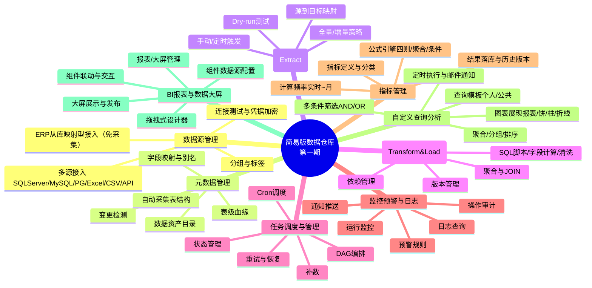

#### 2.1.2 六大能力域说明

| 能力域 | 一句话说明 |
|--------|-----------|
| 数据源管理 | 统一管理所有外部/内部数据源连接，支持凭据加密与连接测试 |
| 元数据管理 | 自动采集并维护表/字段结构，提供数据资产目录与表级血缘 |
| 采集任务（E） | 配置化将源表数据抽取到数据仓库 ODS 层，支持全量/增量 |
| 加工任务（T&L） | 配置化定义加工规则，将 ODS 数据加工并加载到 DWD/DWS/ADS 层 |
| 任务调度与管理 | DAG 编排 + Cron 调度，管理任务全生命周期与依赖关系 |
| 监控预警与日志 | 实时监控任务运行，配置预警规则，提供日志查询 |

#### 2.1.3 业务能力域全景图（第一期）

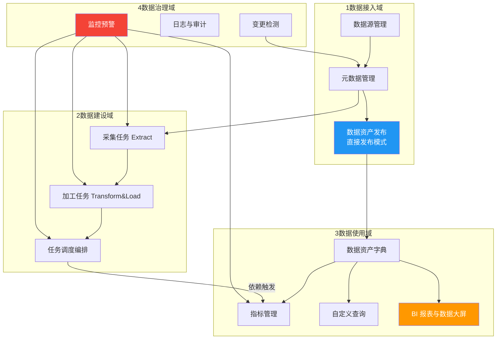

> 说明：第一期不包含字段级血缘、独立质量规则、数据权限、多团队隔离、API Token 等治理增强能力，这些在第二期实现。

### 2.2 业务功能架构

#### 2.2.1 业务能力域说明表（第一期）

| 能力域 | 组成模块 | 业务职责 | 交付物 | 服务对象 |
|--------|----------|----------|--------|----------|
| **①数据接入域** | 数据源管理 / 元数据管理 / 数据资产发布（直接发布） | 将外部数据源接入并登记为元数据，发布为"已交付数据资产" | 数据源记录、元数据表/字段、已发布资产 | 数据工程师主导，业务分析师消费 |
| **②数据建设域** | 采集任务 / 加工任务 / 调度编排 | 将源数据抽取到 ODS，加工到 DWD/DWS/ADS，按 DAG 编排调度 | 采集/加工任务、DAG、调度配置 | 数据工程师主导 |
| **③数据使用域** | 数据资产字典 / 指标管理 / 自定义查询 / BI 报表 | 基于已交付资产完成指标定义、数据探索、报表/大屏搭建与发布分享 | 指标定义、查询模板、报表配置、发布链接 | 业务分析师主导 |
| **④数据治理域（基础）** | 监控预警 / 日志审计 / 变更检测 | 守护前三域稳定运行，提供异常闭环与基础审计 | 预警记录、变更记录、审计日志 | 数据工程师 |

> 第一期治理域仅含基础能力（监控+日志+变更检测），字段级血缘、独立质量规则、数据权限等增强治理在第二期实现。

#### 2.2.2 业务能力协作矩阵

| 消费 ↓ \ 生产 → | ①数据接入 | ②数据建设 | ③数据使用 | ④数据治理 |
|------------------|------------|------------|------------|------------|
| **①数据接入** | — | 接收源表结构变更通知 | 接收数据使用反馈的口径问题 | 接收变更检测 |
| **②数据建设** | 消费已发布元数据作为采集/加工目标 | — | 加工完成触发指标计算 | 调度被监控 |
| **③数据使用** | 仅消费已发布资产 | 引用加工结果表/查询模板/指标 | — | 报表异常反馈 |
| **④数据治理** | 监控数据源连通性、变更检测 | 监控任务运行 | 监控指标计算/查询执行/报表刷新 | — |

#### 2.2.3 业务功能-模块对照表

| 业务能力 | 对应 PRD 模块 | 关键功能点 |
|----------|---------------|------------|
| 多源数据接入 | §9.1 数据源管理 | 数据源配置、连接测试、凭据加密、分组标签 |
| 元数据资产化 | §9.2 元数据管理 | 自动采集表结构、字段映射、数据字典、表级血缘、变更检测 |
| 数据资产交付 | §9.2.6 数据资产发布（直接发布） | 发布（无需审批）、字典可见、下线 |
| 配置化抽取 | §9.3 采集任务 | 全量/增量、字段映射、写入模式、参数化、Dry-run |
| 配置化加工 | §9.4 加工任务 | SQL 脚本、字段计算、清洗、聚合、JOIN、依赖、版本、测试运行 |
| 调度编排 | §9.5 任务调度 | DAG 编排、Cron、依赖触发、重试、补数、状态管理 |
| 运行监控 | §9.6 监控预警与日志 | 大盘、预警规则、通知、日志、审计 |
| 指标定义与计算 | §9.7 指标管理 | 定义、公式引擎、计算频率、结果落库、版本、分类 |
| 自助数据探索 | §9.8 自定义查询分析 | 多条件筛选、聚合分组、图表展现、模板、定时查询、邮件通知 |
| 自助 BI 搭建 | §9.9 BI 报表与数据大屏 | 拖拽设计器、组件库、数据源配置、联动、大屏、发布分享 |
| 平台治理 | 现有业务系统 | 用户、角色、功能权限、系统配置（由现有业务系统实现，本产品对接） |

### 2.3 技术架构

#### 2.3.1 分层架构

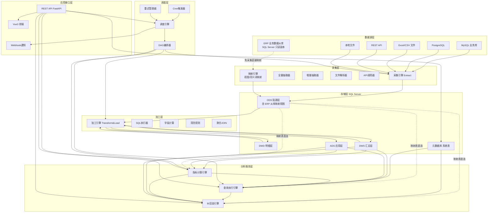

#### 2.3.2 整体架构图

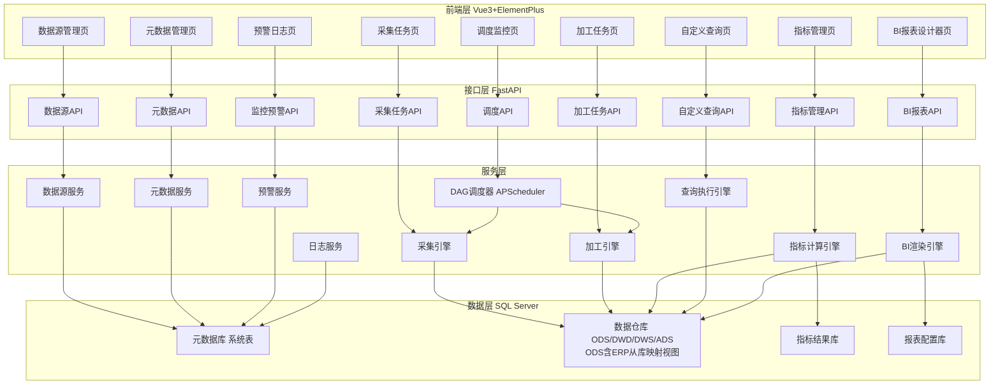

#### 2.3.3 技术选型表

| 层次 | 技术选型 | 说明 |
|------|----------|------|
| 前端 | Vue 3 + Element Plus + Vue Router + Pinia + Axios + ECharts | SPA 单页应用，ECharts 用于 BI 图表渲染 |
| 后端 | FastAPI + SQLAlchemy 2.0 + Pydantic | 异步高性能，自带 API 文档 |
| 数据库 | SQL Server 2019+ | 元数据库 + 数据仓库存储 + 指标结果 + 报表配置；与 ERP 技术栈统一，支持列存储索引/分区/页压缩提升分析性能 |
| 调度 | APScheduler + 自研 DAG | 轻量调度，单机足够；指标计算/定时查询/大屏刷新复用调度器 |
| 文件解析 | pandas + openpyxl + csv | Excel/CSV 导入 |
| 加密 | cryptography (Fernet) | 凭据对称加密 |
| 指标计算 | 自研表达式解析器（pyparsing + AST） | 四则运算 + 聚合函数 + 条件判断 |
| 查询执行 | SQLAlchemy 参数化查询 | 查询配置渲染为参数化 SQL，防注入 |
| BI 设计器 | vue-draggable + vuedraggable | 拖拽式布局，栅格 + 自由布局 |
| 部署 | Docker Compose | app + mssql 双容器（或复用现有 SQL Server 实例，独立 schema 隔离） |
| 进程守护 | supervisor / systemd | 生产环境进程管理 |
| 连接池 | SQLAlchemy + DBUtils | 统一连接管理，支持多数据源；SQL Server 经 pyodbc/pymssql 驱动 |
| BI 图表渲染 | ECharts | 生态成熟、组件丰富、支持地图/漏斗/KPI 等图表类型 |
| 元数据存储 | SQL Server 系统表 + sys.columns/INFORMATION_SCHEMA 读取 | 无需额外元数据服务；兼容读取 MySQL information_schema 与 SQL Server 系统视图 |

#### 2.3.4 部署架构

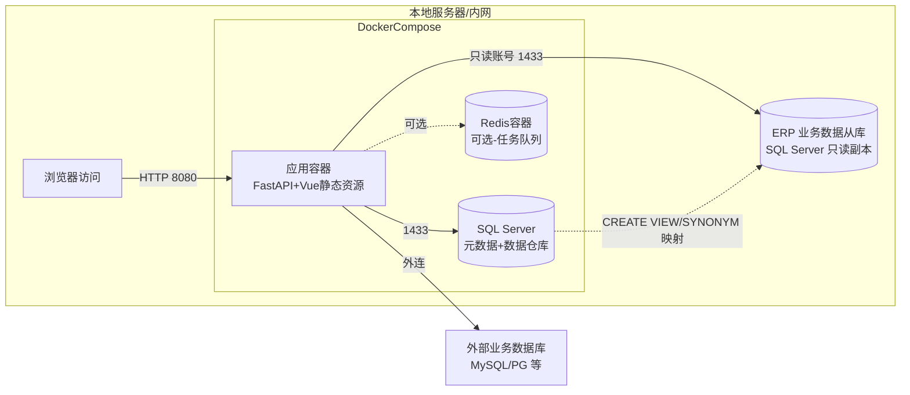

**部署特点**：
- **单机起步**：最低 4C8G 即可运行第一期版本（SQL Server 容器内存 ≥2GB；亦可复用现有 SQL Server 实例以独立 schema 隔离，降低部署成本）
- **Docker Compose 一键部署**：`docker-compose up -d` 启动全部服务
- **内网友好**：不依赖任何外网服务
- **ERP 从库只读直连**：应用以只读账号（db_datareader）连接 ERP 从库，通过视图/同义词映射至 ODS，不影响 ERP 主库业务；建议 DBA 配置资源调控器（Resource Governor）限制分析负载
- **可扩展**：后续可拆分调度引擎到独立容器，引入 Redis 做任务队列

### 2.4 模块划分

| 一级模块 | 二级模块 | 功能概述 |
|----------|----------|----------|
| 数据源管理 | 数据源配置 / 连接测试 / 凭据管理 / 分组标签 | 管理多类型数据源连接与凭据加密 |
| 元数据管理 | 元数据采集 / 字段映射 / 数据字典 / 表级血缘 / 变更检测 | 维护表字段结构与资产目录 |
| 采集任务 | 任务配置 / 任务执行 / 测试运行 / 参数化 | 配置化抽取源数据到 ODS |
| 加工任务 | 任务配置 / 加工规则 / 依赖管理 / 版本管理 / 测试运行 | 配置化加工数据到 DWD/DWS/ADS |
| 任务调度与管理 | 任务编排 / 调度策略 / 执行历史 / 状态管理 / 重试恢复 / 参数管理 | DAG 编排与 Cron 调度 |
| 监控预警与日志 | 运行监控 / 预警规则 / 通知 / 日志查询 / 审计 | 监控运行与异常预警 |
| 指标管理 | 指标定义 / 指标计算与调度 / 指标结果查询 / 指标分类管理 | 基于 DW 加工结果表定义与计算业务指标 |
| 自定义查询分析 | 查询配置 / 查询执行 / 查询模板管理 / 定时查询与通知 | 面向业务分析师的灵活数据探索与图表展示 |
| BI 报表与数据大屏 | 报表管理 / 拖拽设计器 / 组件数据源配置 / 组件联动与交互 / 大屏展示与发布 | 拖拽式报表/大屏设计、联动与发布分享 |

> 用户管理、角色权限、系统设置等基座功能由现有业务系统提供，本产品通过接口对接。
> 字段级血缘、独立质量规则、数据权限、多团队隔离等在第二期实现。

---

## 3. 业务流程与数据流

### 3.1 完整业务流程

#### 3.1.1 四阶段端到端旅程概述

Lite DW 的业务流程跨四大阶段首尾相接：

- **阶段 1：数据接入期**（数据工程师主导，1-2 周）——将外部业务数据库纳入数据仓库管理，完成元数据采集与数据资产登记（直接发布模式），形成可用数据资产清单。
- **阶段 2：数据建设期**（数据工程师主导，2-4 周）——完成 ODS/DWD/DWS/ADS 分层建设，配置采集与加工任务并编排调度上线。
- **阶段 3：数据使用期**（业务分析师主导，持续）——基于已交付数据资产完成指标定义、数据探索、BI 报表搭建与发布分享。
- **阶段 4：数据治理期（基础）**（数据工程师 + 业务分析师协作，持续）——持续监控运行、处理预警、排查异常、迭代数据资产。

#### 3.1.2 业务流程一：数据接入与资产交付流程（第一期）

**流程目标**：将一个新的外部数据源接入系统，完成元数据采集并发布为已交付数据资产（直接发布模式）。接入路径分两类：**采集型接入**（MySQL/PG/文件/API 经采集任务同步到 ODS）与**映射型接入**（ERP 业务数据从库直接映射 ODS，免采集）。

**参与角色**：数据工程师（主导）、业务分析师（消费）、DBA（映射型接入协作，负责从库只读账号与资源限流）

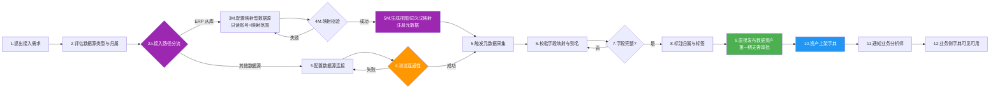

**流程节点说明**：

| 节点 | 动作 | 角色 | 模块 | 交付物 | 异常分支 |
|------|------|------|------|--------|----------|
| 1 | 提出接入需求 | 数据工程师 | - | 接入需求单 | - |
| 2 | 评估类型与归属 | 数据工程师 | §9.1 | 评估记录 | 类型不支持则终止 |
| 2a | 接入路径分流：ERP 从库走映射型（免采集），其他走采集型 | 数据工程师 | §9.1 | 路径决策 | - |
| 3M | 配置映射型数据源：从库连接（只读账号）+ 映射表范围 | 数据工程师 / DBA | §9.1 | 映射型数据源记录 | 只读账号权限不足阻断 |
| 4M | 映射校验：连接可达、账号只读、表存在 | 系统 | §9.1.2 | 校验结果 | 失败回 3M |
| 5M | 生成视图/同义词映射并注册元数据（自动读取从库表结构） | 系统 | §9.2 | 映射表元数据记录 | 从库结构不可读记录告警 |
| 3 | 配置连接参数并加密凭据 | 数据工程师 | §9.1 | 数据源记录 | 凭据加密失败告警 |
| 4 | 测试连通性 | 系统 | §9.1.2 | 测试结果 | 失败回 3 |
| 5 | 触发元数据采集 | 系统 | §9.2 | 元数据表/字段记录 | 源表不存在跳过并记录 |
| 6 | 校验字段映射，补别名与描述 | 数据工程师 | §9.2 | 字段映射记录 | 类型不兼容提示人工处理 |
| 7 | 字段完整性校验 | 系统 | §9.2 | 校验报告 | 不通过回 6 |
| 8 | 标注数据归属与标签（映射表标注"数据时效：准实时"） | 数据工程师 | §9.1 / §9.2 | 标注记录 | - |
| 9 | **直接发布数据资产**（第一期无需审批） | 数据工程师 | §9.2.6 | 发布记录 | - |
| 10 | 资产上架，字典可见 | 系统 | §9.2 | 资产发布记录 | - |
| 11 | 通知业务分析师 | 系统 | §9.6 | 通知记录 | - |
| 12 | 业务侧字典检索并使用（映射表可直接用于指标/查询/BI） | 业务分析师 | §9.2 / §9.7–9.9 | 使用记录 | - |

#### 3.1.3 业务流程二：数据建设与上线流程

**流程目标**：基于已接入数据源，设计数据分层、配置采集与加工任务、编排调度并正式上线。

**参与角色**：数据工程师（主导）

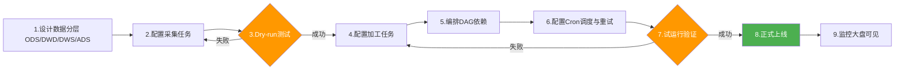

**流程节点说明**：

| 节点 | 动作 | 模块 | 交付物 | 异常分支 |
|------|------|------|--------|----------|
| 1 | 设计分层（ODS 贴源/DWD 明细/DWS 汇总/ADS 应用） | - | 分层设计文档 | - |
| 2 | 配置采集任务 | §9.3 | 采集任务配置 | - |
| 3 | Dry-run 测试（预览 N 条不入库） | §9.3 | 测试结果 | 失败回 2 |
| 4 | 配置加工任务（SQL/字段计算/清洗/聚合/JOIN） | §9.4 | 加工任务及规则 | SQL 语法错误阻断 |
| 5 | 编排 DAG 依赖 | §9.5 | DAG 配置 | 有环阻断保存 |
| 6 | 配置 Cron 与重试策略 | §9.5 | 调度配置 | Cron 表达式非法 |
| 7 | 试运行验证（手动触发全链路） | §9.5 | 试运行记录 | 失败回 4 |
| 8 | 正式上线（启用调度） | §9.5 | 上线记录 | - |
| 9 | 监控大盘可见运行状态 | §9.6 | 监控记录 | - |

#### 3.1.4 业务流程三：数据分析与服务流程

**流程目标**：基于已交付数据资产，业务分析师完成指标定义、数据探索、报表搭建与发布分享的完整闭环。

**参与角色**：业务分析师（主导）、数据工程师（协作）、团队/报表访问者（消费）

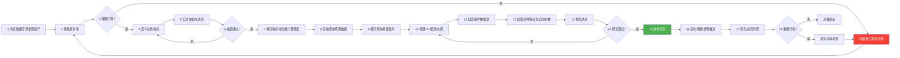

**流程节点说明**：

| 节点 | 动作 | 模块 | 交付物 | 异常分支 |
|------|------|------|--------|----------|
| 1 | 浏览数据资产字典 | §9.2.3 | 检索记录 | - |
| 2 | 查看表详情、字段描述 | §9.2 | - | - |
| 3 | 理解口径判断 | - | - | 不理解走反馈 |
| 4 | 定义指标 | §9.7 | 指标定义 | 编码重复阻断 |
| 5 | 公式语法校验与试算 | §9.7 | 校验结果 | - |
| 6 | 校验通过判断 | - | - | 否回 4 |
| 7 | 保存指标并启用计算调度 | §9.7 / §9.5 | 指标计算记录 | - |
| 8 | 自助查询 | §9.8 | 查询结果 | - |
| 9 | 保存为模板 | §9.8 | 查询模板 | - |
| 10 | 拖拽搭建 BI 报表/大屏 | §9.9 | 报表配置 | - |
| 11 | 配置组件数据源 | §9.9 | 组件配置 | - |
| 12 | 配置组件联动与全局参数 | §9.9 | 联动配置 | - |
| 13 | 预览调试 | §9.9 | 预览记录 | - |
| 14 | 预览通过判断 | - | - | 否回 10 |
| 15 | 发布分享（链接+密码+有效期） | §9.9 | 发布记录 | - |
| 16 | 配置定时刷新/邮件推送 | §9.9 / §9.8 | 定时计划 | - |
| 17 | 团队访问消费 | §9.9 | 访问日志 | - |
| 18 | 数据异常判断 | - | - | 是走异常反馈 |
| 反馈分支 | 异常反馈 → 数据工程师排查 → 修复 → 通知业务分析师 | §9.6 / §9.2 / §9.4 | 异常工单 | - |

#### 3.1.5 业务流程四：数据治理与闭环流程（基础）

**流程目标**：持续监控运行、处理预警、排查异常、保障合规（第一期为基础治理，字段级血缘和质量规则在第二期）。

**参与角色**：数据工程师（主导）、业务分析师（反馈）

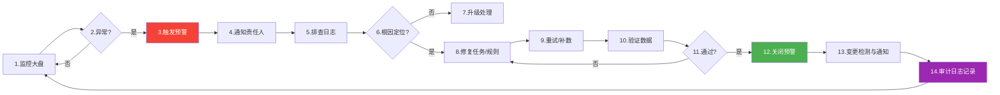

**流程节点说明**：

| 节点 | 动作 | 模块 | 交付物 | 异常分支 |
|------|------|------|--------|----------|
| 1 | 监控大盘实时查看任务/指标运行 | §9.6 | 监控记录 | - |
| 2 | 异常判断（失败/超时） | §9.6 | - | - |
| 3 | 触发预警（邮件/Webhook/钉钉） | §9.6 | 预警记录 | - |
| 4 | 通知责任人 | §9.6 | 通知记录 | - |
| 5 | 排查执行日志 | §9.6 | 排查记录 | - |
| 6 | 根因定位判断 | - | - | 否走升级 |
| 7 | 升级处理（人工介入） | 现有业务系统 | 升级记录 | - |
| 8 | 修复任务/规则/数据源 | §9.3-9.4 | 修复版本 | - |
| 9 | 重试或补数 | §9.5 | 执行记录 | - |
| 10 | 验证数据正确性 | §9.6 | 验证记录 | - |
| 11 | 通过判断 | - | - | 否回 8 |
| 12 | 关闭预警，记录闭环 | §9.6 | 闭环记录 | - |
| 13 | 变更检测（源表/字段/类型变更） | §9.2.5 | 变更日志 | - |
| 14 | 审计日志记录全过程 | §9.6.5 | 审计日志 | - |

### 3.2 完整数据流

#### 3.2.1 数据流总览大图（第一期）

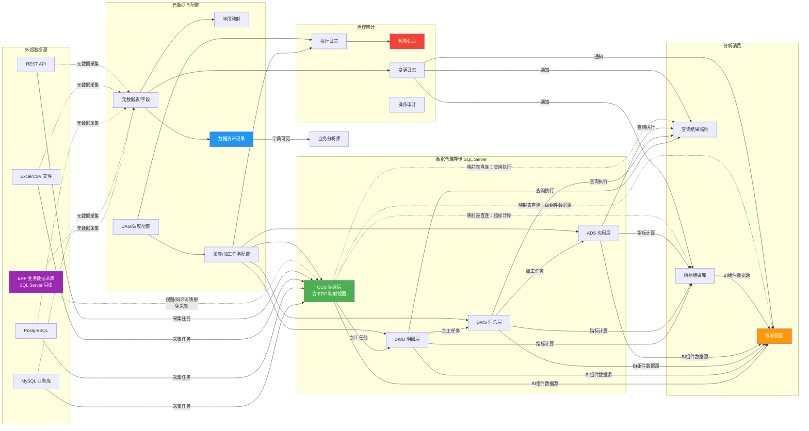

#### 3.2.2 业务数据流（源→仓库→消费）

**流向**：外部数据源 → 采集/映射 → ODS → 加工 → DWD/DWS/ADS → 消费（指标/查询/报表）；ERP 从库映射表可跳过采集加工直接进入消费

| 阶段 | 数据形态 | 生产者 | 消费者 | 关键控制点 |
|------|----------|--------|--------|------------|
| 源端 | 业务库表/文件/API 响应 | 业务系统 | 采集任务 | 凭据加密、连接测试 |
| 采集 | 全量/增量抽取批次 | 采集引擎 | ODS 表 | 水位点记录、字段映射、写入模式 |
| 映射（ERP 从库） | 视图/同义词映射（零复制） | 映射引擎 | ODS 映射视图 | 只读账号校验、映射范围、数据时效标注（准实时） |
| ODS | 贴源表/映射视图（与源结构一致） | 采集任务/映射引擎 | 加工任务、指标/查询/BI（映射表直连） | - |
| 加工 | SQL/计算/清洗/聚合/JOIN 输出 | 加工引擎 | DWD/DWS/ADS 表 | SQL 语法校验 |
| DWD | 明细层（清洗去噪） | 加工任务 | 下游加工/指标/查询/报表 | - |
| DWS | 汇总层（按维度聚合） | 加工任务 | ADS/指标/查询/报表 | - |
| ADS | 应用层（面向场景） | 加工任务 | 指标/查询/报表 | - |
| 指标结果 | 指标计算输出 | 指标引擎 | BI 组件、对比分析 | 版本管理、口径一致 |
| 查询结果 | 临时结果集 | 查询引擎 | 图表展现、导出 | 结果行数限制、超时控制 |
| 报表配置 | 组件布局+数据源+联动 | 业务分析师 | BI 渲染引擎 | 组件数据源可引用 ODS 映射表（经元数据注册，只读直连） |

#### 3.2.3 元数据与配置数据流

**流向**：数据源采集 → 元数据表/字段 → 字段映射 → 数据资产记录 → 字典可见

| 阶段 | 数据形态 | 生产者 | 消费者 | 关键控制点 |
|------|----------|--------|--------|------------|
| 元数据采集 | 表结构/字段/类型/注释 | 元数据服务 | 字段映射 | 自动比对源结构 |
| 字段映射 | 源字段→目标字段+转换规则 | 数据工程师 | 采集/加工任务 | 类型兼容校验 |
| 数据资产发布 | 资产名/说明/状态 | 数据工程师 | 业务字典 | 直接发布（第一期） |
| 变更检测 | 字段增删/类型变更 | 元数据服务 | 下游通知 | 严重级别分级 |

#### 3.2.4 治理与审计数据流

**流向**：任务执行 → 日志 → 预警 → 闭环；用户操作 → 审计日志

| 阶段 | 数据形态 | 生产者 | 消费者 | 关键控制点 |
|------|----------|--------|--------|------------|
| 执行日志 | 步骤/级别/内容/行号 | 采集/加工引擎 | 日志查询、排查 | 级别分级、保留天数 |
| 预警记录 | 规则触发/级别/通知状态 | 预警服务 | 闭环管理 | 通知渠道（邮件/Webhook/钉钉） |
| 变更日志 | 变更类型/旧值/新值/严重级别 | 元数据服务 | 下游影响分析 | 严重级别（info/warning/critical） |
| 操作审计 | 用户/操作/模块/内容/IP | 所有关键操作 | 合规审计 | 审计保留天数、不可篡改 |
| 闭环记录 | 预警处理/修复/验证 | 数据工程师 | 治理报表 | 闭环率度量 |

#### 3.2.5 数据流关键控制点汇总（第一期）

| 控制点 | 位置 | 控制内容 | 失败处理 |
|--------|------|----------|----------|
| 凭据加密 | 数据源接入 | Fernet 对称加密，密钥从环境变量 | 加密失败阻断保存 |
| 连接测试 | 数据源接入/采集前 | DB: SELECT 1；文件：存在性；API：响应码 | 失败阻断采集 |
| 映射只读校验 | ERP 从库映射接入 | 账号仅 db_datareader、连接指向从库（非主库）、表可读 | 非只读账号阻断保存 |
| 映射表直连限流 | 指标/查询/BI 直连映射表 | 只读连接 + 超时 30-60s + 行数上限 10 万 | 超时中止并提示；超限截断并提示 |
| 字段映射校验 | 采集任务 | 类型兼容性、必填字段 | 不兼容提示人工处理 |
| 写入模式 | 采集任务 | insert/upsert/replace + 冲突键 | 冲突未指定阻断 |
| SQL 语法校验 | 加工任务 | SQL 解析、参数化（T-SQL 方言） | 语法错误阻断保存 |
| DAG 无环校验 | 调度配置 | 拓扑排序校验 | 有环阻断保存 |
| 结果行数限制 | 自定义查询 | 默认 1000，最大 100000 | 超限截断并提示 |
| 查询超时 | 自定义查询 | 默认 30s | 超时中止并提示 |
| 报表发布权限 | BI 报表 | 仅创建者/管理员可发布 | 无权限阻断 |
| 审计日志 | 所有关键操作 | 记录用户/操作/模块/IP | 审计失败不阻断业务但告警 |

> 注：数据权限（行级/列级）、字段级血缘解析、质量规则阻断等控制点在第二期实现。

### 3.3 端到端用户故事

> 第一期包含 14 个用户故事（从 V1.5 的 18 个中移除 US-004 数据权限隔离、US-006 字段级血缘、US-008 质量规则阻断、US-018 字段级影响分析 4 个第二期故事），按数据接入 / 数据建设 / 数据使用 / 数据治理四组分类。

#### 3.3.1 数据接入期

**US-001 数据工程师接入新数据源并采集元数据**
- 角色：数据工程师
- 故事：作为数据工程师，我希望通过配置接入新的业务数据库并自动采集元数据，以便快速将外部数据源纳入数据仓库管理。
- 前置条件：已具备数据源网络访问权限；管理员已分配数据工程师角色。
- 主流程：1. 在数据源管理新增数据源（类型/连接信息）→ 2. 测试连通性 → 3. 触发元数据采集 → 4. 校验字段映射 → 5. 标注数据归属与标签。
- 替代/异常：连接失败返回字段级错误；源表不存在跳过并记录。
- 验收标准：元数据字段数与源表一致；数据源状态为启用；凭据加密存储不可逆。
- 关联模块：9.1 数据源管理 / 9.2 元数据管理

**US-002 数据工程师配置字段映射并直接发布数据资产**
- 角色：数据工程师
- 故事：作为数据工程师，我希望配置字段映射并将加工完成的表直接发布为数据资产，以便业务分析师仅可见已交付的可用表。
- 前置条件：表已在元数据中注册；加工已完成。
- 主流程：1. 配置字段映射与别名 → 2. 填写发布说明（业务含义/更新频率）→ 3. 直接发布数据资产（第一期无需审批）→ 4. 业务分析师字典可见。
- 替代/异常：下线被引用资产阻止并提示引用清单。
- 验收标准：已发布资产对目标受众可见；未发布表对业务分析师不可见。
- 关联模块：9.2 元数据管理 / 9.2.6 数据资产发布 / 9.2.3 数据字典

**US-003 数据工程师执行元数据变更检测并通知下游**
- 角色：数据工程师
- 故事：作为数据工程师，我希望定期检测源表结构变更并自动通知受影响的下游，以便避免下游加工任务和 BI 报表因结构变更而错误。
- 前置条件：源表已采集元数据快照。
- 主流程：1. 触发变更检测 → 2. 对比快照与实时结构 → 3. 生成变更记录 → 4. 关联任务标记"需确认"→ 5. 通知下游加工任务负责人与引用该表的报表/指标/查询创建者。
- 替代/异常：严重变更（字段删除/类型变更）生成预警。
- 验收标准：变更记录含前后值；下游创建者收到站内通知；关联任务状态更新。
- 关联模块：9.2.5 变更检测 / 9.6 监控预警

#### 3.3.2 数据建设期

**US-005 数据工程师配置全量/增量采集任务**
- 角色：数据工程师
- 故事：作为数据工程师，我希望配置全量/增量采集任务并设定增量水位点，以便定时自动将源数据同步到 ODS 层。
- 前置条件：数据源已接入；元数据已采集。
- 主流程：1. 配置源表→目标表映射 → 2. 选择全量/增量模式 → 3. 设定增量字段与水位点 → 4. 配置批次大小 → 5. dry-run 验证 → 6. 上线调度。
- 替代/异常：增量字段类型不符阻止保存；结构变更暂停并预警。
- 验收标准：增量模式按水位点增量抽取；水位点成功后更新；执行记录含抽取/写入行数。
- 关联模块：9.3 采集任务 / 9.2 元数据管理 / 9.5 调度

**US-007 数据工程师编排 DAG 并配置失败重试级联触发**
- 角色：数据工程师
- 故事：作为数据工程师，我希望编排采集与加工任务的 DAG 依赖并配置失败重试，以便实现全链路自动化调度与容错恢复。
- 前置条件：采集与加工任务已配置。
- 主流程：1. 可视化编排 DAG → 2. DAG 校验无环 → 3. 配置 Cron 与重试（指数退避）→ 4. 上线 → 5. 失败自动重试 → 6. 重试成功后级联触发下游"成功后"依赖任务。
- 替代/异常：循环依赖阻止保存；重试达上限标记最终失败并预警。
- 验收标准：DAG 无环；重试按指数退避；重试成功后下游自动执行。
- 关联模块：9.5 调度 / 9.3 采集任务 / 9.4 加工任务

**US-009 数据工程师回滚加工任务版本**
- 角色：数据工程师
- 故事：作为数据工程师，我希望在加工规则变更导致数据错误时回滚到历史版本，以便快速恢复正确的数据产出。
- 前置条件：任务存在历史版本快照。
- 主流程：1. 查看版本列表 → 2. 对比版本差异 → 3. 选择目标版本回滚 → 4. 重新执行验证。
- 替代/异常：版本保留超限自动清理；执行记录关联版本号可追溯。
- 验收标准：回滚后配置与目标版本一致；执行记录可追溯到版本号。
- 关联模块：9.4 加工任务 / 9.5 调度 / 9.6 监控

#### 3.3.3 数据使用期

**US-010 业务分析师浏览数据资产字典**
- 角色：业务分析师
- 故事：作为业务分析师，我希望浏览数据资产字典查看已交付表和字段含义，以便快速找到分析所需数据且不误用半成品表。
- 前置条件：数据工程师已发布数据资产。
- 主流程：1. 打开数据字典 → 2. 按数据源/分组/标签筛选 → 3. 模糊搜索表名/字段 → 4. 查看字段类型/别名/示例值 → 5. 收藏常用表。
- 替代/异常：未发布表对业务分析师不可见。
- 验收标准：仅展示已发布资产；字段详情含表级血缘入口。
- 关联模块：9.2.3 数据字典 / 9.2.6 数据资产发布

**US-011 业务分析师定义指标并依赖触发计算**
- 角色：业务分析师
- 故事：作为业务分析师，我希望基于已交付表定义业务指标并配置依赖触发，以便指标结果始终与最新加工数据同步而无需依赖工程师。
- 前置条件：数据资产已发布；表已加工产出。
- 主流程：1. 选择数据源表（仅已发布）→ 2. 配置度量字段/维度/公式 → 3. 公式校验 → 4. 选择计算频率（实时/定时/依赖触发）→ 5. 上游加工成功后自动触发计算 → 6. 结果落库。
- 替代/异常：公式语法错误定位返回；嵌套超 2 层阻止保存；计算失败预警。
- 验收标准：指标编码唯一；公式引用字段存在；依赖触发在加工成功后执行；结果可查历史版本。
- 关联模块：9.7 指标管理 / 9.4 加工任务 / 9.5 调度

**US-012 业务分析师自定义查询并图表展现**
- 角色：业务分析师
- 故事：作为业务分析师，我希望使用可视化查询构建器多条件筛选数据并选择图表类型展示，以便快速探索数据规律无需编写 SQL。
- 前置条件：数据资产已发布。
- 主流程：1. 选择数据表 → 2. 选择字段 → 3. 配置筛选条件（AND/OR）→ 4. 配置聚合与分组 → 5. 实时预览 SQL → 6. 执行并选择图表展现 → 7. 保存为模板。
- 替代/异常：执行超时返回部分结果；SQL 语法校验失败返回错误。
- 验收标准：生成 SQL 为参数化查询防注入；图表类型自动推荐；结果 ≤ 10 万行；模板可被 BI 引用。
- 关联模块：9.8 自定义查询 / 9.2 元数据管理 / 9.7 指标管理

**US-013 业务分析师搭建 BI 报表并配置组件联动**
- 角色：业务分析师
- 故事：作为业务分析师，我希望通过拖拽式设计器搭建 BI 报表并为每个组件配置数据源与联动，以便实现交互式数据钻取分析。
- 前置条件：查询模板/指标/数据资产已就绪。
- 主流程：1. 新建报表 → 2. 拖入图表/查询条件/容器组件 → 3. 配置组件数据源 → 4. 定义输出参数 → 5. 配置联动 → 6. 循环依赖检测 → 7. 预览调试。
- 替代/异常：循环依赖阻止保存并标注链路；参数引用组件不存在标记警告。
- 验收标准：组件数据源独立配置；联动参数逐级传递；循环依赖被检测阻止。
- 关联模块：9.9 BI 报表 / 9.8 自定义查询 / 9.7 指标管理

**US-014 业务分析师配置定时查询邮件推送**
- 角色：业务分析师
- 故事：作为业务分析师，我希望将常用查询保存为模板并设定定时执行计划自动推送邮件，以便定期获得数据洞察无需手动操作。
- 前置条件：查询模板已保存；SMTP 已配置。
- 主流程：1. 保存查询模板 → 2. 配置定时计划（Cron）→ 3. 配置收件人与通知模板 → 4. 调度器定时执行 → 5. 邮件含摘要 + CSV 附件 + 详情链接。
- 替代/异常：SMTP 配置失败阻止保存；发送失败重试 3 次；执行超时只发告警邮件。
- 验收标准：定时执行对接调度器；邮件含结果摘要与附件；同日同收件人去重。
- 关联模块：9.8.4 定时查询 / 9.5 调度

**US-015 业务分析师发布数据大屏并自动刷新**
- 角色：业务分析师
- 故事：作为业务分析师，我希望将搭建好的数据大屏发布为只读链接并配置自动刷新，以便在大屏 TV 上持续展示实时数据。
- 前置条件：大屏已搭建并预览通过。
- 主流程：1. 预览调试 → 2. 发布生成快照版本 → 3. 设置访问密码与有效期 → 4. 配置自动刷新（最小 30s）→ 5. 全屏展示。
- 替代/异常：链接过期返回提示页；全屏渲染超时降级静态截图；移动端适配失败回退 PC。
- 验收标准：发布链接不可枚举；快照可回滚；自动刷新生效；多终端适配。
- 关联模块：9.9.5 大屏发布 / 9.9 BI 报表

#### 3.3.4 数据治理期

**US-016 数据工程师监控预警并排查日志**
- 角色：数据工程师
- 故事：作为数据工程师，我希望在监控大盘查看任务运行状态并接收预警，以便第一时间处理失败任务并排查日志修复。
- 前置条件：任务已上线；预警规则已配置。
- 主流程：1. 查看监控大盘（成功率/失败数/吞吐）→ 2. 接收站内/邮件/Webhook 预警 → 3. 下钻执行记录 → 4. 查看步骤级日志与错误堆栈 → 5. 重试或修复。
- 替代/异常：运行中任务可手动取消；通知 30 分钟内去重合并。
- 验收标准：大盘 5s 刷新；预警含任务名/时间/错误摘要/详情链接；日志可下载。
- 关联模块：9.6 监控预警 / 9.5 调度 / 9.4 加工任务

**US-017 业务分析师发现数据异常并反馈给数据工程师**
- 角色：业务分析师
- 故事：作为业务分析师，我希望在 BI 报表中发现数据异常时反馈给数据工程师排查，以便快速闭环数据质量问题。
- 前置条件：BI 报表已发布；数据工程师在线。
- 主流程：1. 在报表中发现异常值 → 2. 提交异常反馈（关联报表/组件/字段）→ 3. 数据工程师接收并排查日志 → 4. 修复并通知业务分析师 → 5. 报表数据刷新验证。
- 替代/异常：排查无果升级管理员。
- 验收标准：异常反馈关联链路；修复后下游报表自动刷新；闭环记录可追溯。
- 关联模块：9.9 BI 报表 / 9.6 监控预警

### 3.4 跨角色协作场景

#### 场景 1：数据工程师新增表后业务分析师如何在 BI 中使用

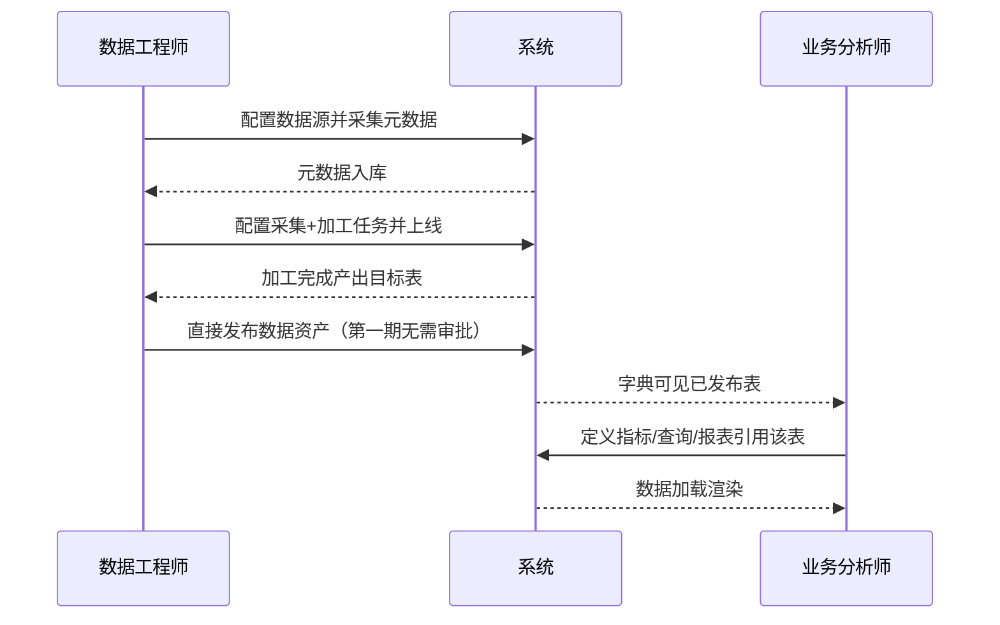

#### 场景 2：业务分析师发现数据异常如何反馈给数据工程师排查

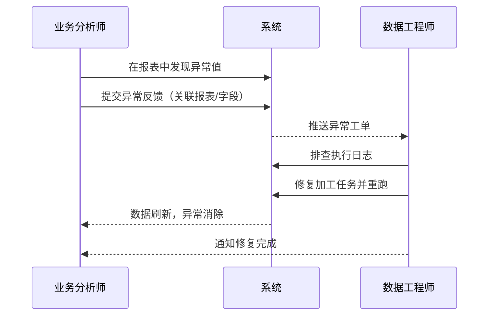

#### 场景 3：业务分析师搭建的报表如何分享给团队

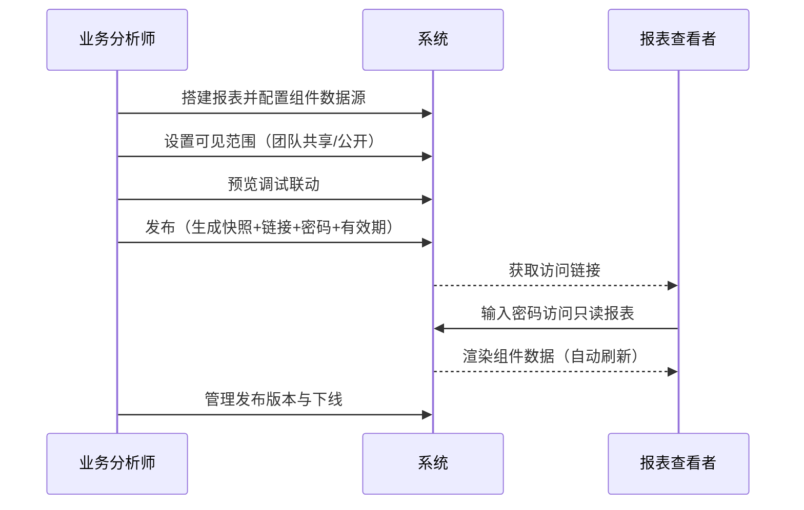

### 3.5 业务闭环大图（第一期）

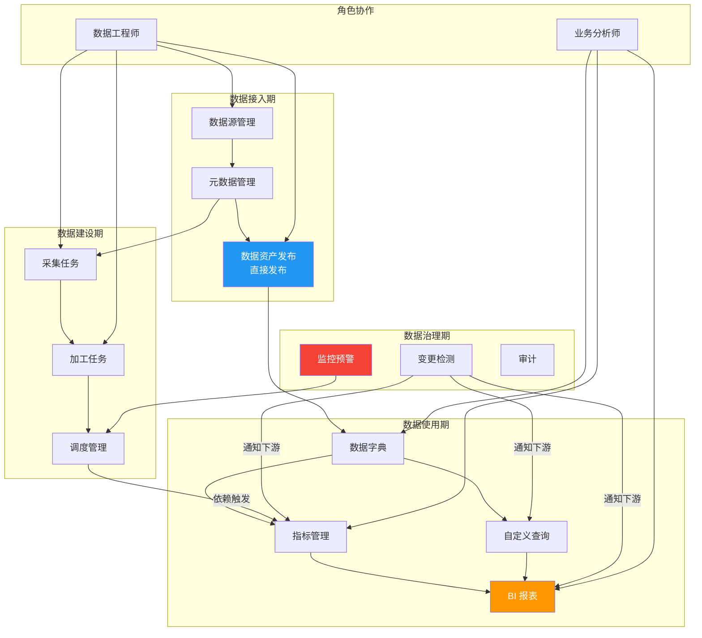

**闭环说明**：四大阶段首尾相接——数据接入期产出"已发布数据资产"作为交接点交付数据使用期；数据建设期产出"加工结果"保障数据使用期数据可信；数据使用期的指标/查询/报表反向对接调度器实现定时计算/执行/刷新；数据治理期的监控与变更检测持续守护前三阶段的稳定与可演进，形成"生产—交付—消费—治理"完整闭环。

---

## 4. 非功能需求

### 4.1 性能需求

| 指标 | 要求 |
|------|------|
| 单任务抽取行数上限 | 1000 万行/任务 |
| 单批次写入 | 1000 行/批（可配） |
| API 响应时间 | 列表查询 < 500ms，详情 < 200ms |
| 并发任务数 | 同时运行任务 ≤ 10（单机 4C8G） |
| 元数据字典查询 | 10 万字段量级下 < 1s |
| 采集吞吐 | MySQL→SQL Server 单机 1 万行/秒（同机房） |
| 指标计算执行 | 单指标计算 < 10s，实时指标查询 < 30s |
| 自定义查询执行 | 查询执行 < 60s，结果限制 ≤ 10 万行 |
| BI 报表组件加载 | 单组件数据加载 < 5s，整报表渲染 < 15s |
| BI 大屏自动刷新 | 最小间隔 30 秒，50 组件大屏刷新 < 20s |
| BI 大屏并发访问 | 同一发布大屏并发查看者 ≤ 100 |

### 4.2 安全需求

| 项 | 要求 |
|----|------|
| 认证 | JWT Token，有效期 2h，刷新机制 |
| 密码存储 | bcrypt 加盐 |
| 凭据加密 | Fernet 对称加密，密钥环境变量 |
| SQL 注入防护 | SQLAlchemy 参数化查询，禁止字符串拼接；自定义 SQL 组件查询走只读连接 + SQL 白名单（禁止 DDL，仅允许 SELECT，限制执行时长 60s，结果行数上限 10 万） |
| 越权防护 | 接口级 RBAC 校验（数据级 RBAC 第二期实现） |
| 审计 | 关键操作全记录 |
| HTTPS | 生产环境强制 HTTPS（反向代理层） |
| BI 报表发布链接 | 访问令牌 + 密码 + 有效期，发布链接不可枚举 |

> 注：多团队数据隔离、行级/列级数据权限在第二期实现。第一期所有登录用户可访问已发布数据资产。

### 4.3 可用性需求

| 项 | 要求 |
|----|------|
| 系统可用性 | 99%（单机部署，允许计划停机） |
| 故障恢复 | 任务失败不丢数据，支持重试与断点续传 |
| 数据一致性 | 事务保证，加工任务全成功或全回滚 |
| 备份 | SQL Server 每日全量备份，事务日志保留 7 天；ERP 从库不在备份范围（由 ERP 侧自行保障） |

### 4.4 部署需求

| 项 | 要求 |
|----|------|
| 部署方式 | Docker Compose 一键部署 |
| 最低配置 | 4C 8G 100GB（第一期） |
| 推荐配置 | 8C 16G 500GB SSD（生产） |
| 操作系统 | CentOS 7+ / Ubuntu 20.04+ |
| 依赖 | Docker 20+ / Docker Compose 1.29+ |
| 网络 | 纯内网部署，无需外网访问 |
| 启动 | `docker-compose up -d` 启动 app + mssql（或复用现有 SQL Server 实例） |
| 升级 | 镜像版本替换 + 数据库迁移脚本 |

---

## 5. 数据需求

### 5.1 核心数据实体 ER 图（第一期）

```mermaid
erDiagram
    DATASOURCE ||--o{ METADATA_TABLE : has
    DATASOURCE }o--o{ DATASOURCE_GROUP : belongs_to
    DATASOURCE }o--o{ DATASOURCE_TAG : tagged

    METADATA_TABLE ||--o{ METADATA_FIELD : has
    METADATA_TABLE ||--o{ DATA_ASSET_PUBLISH : published_as

    COLLECT_TASK ||--|| METADATA_TABLE : targets
    COLLECT_TASK ||--o{ TASK_EXECUTION : runs
    COLLECT_TASK ||--o{ TASK_SCHEDULE : scheduled
    COLLECT_TASK }o--o{ TASK_DEPENDENCY : depends

    TRANSFORM_TASK ||--o{ TRANSFORM_RULE : has
    TRANSFORM_TASK ||--o{ TASK_EXECUTION : runs
    TRANSFORM_TASK ||--o{ TASK_SCHEDULE : scheduled
    TRANSFORM_TASK }o--o{ TASK_DEPENDENCY : depends

    TASK_EXECUTION ||--o{ TASK_LOG : logs
    TASK_EXECUTION ||--o{ ALERT_RECORD : triggers

    ALERT_RULE ||--o{ ALERT_RECORD : generates

    METRIC_DEFINITION ||--o{ METRIC_RESULT : computes
    METRIC_DEFINITION }o--o{ METRIC_CATEGORY : categorized
    METRIC_DEFINITION }o--|| METADATA_TABLE : references

    QUERY_TEMPLATE ||--o{ QUERY_SCHEDULE : scheduled
    QUERY_TEMPLATE }o--|| METADATA_TABLE : queries

    REPORT ||--o{ REPORT_COMPONENT : contains
    REPORT ||--o{ REPORT_PUBLISH : published
    REPORT_COMPONENT ||--o{ REPORT_COMPONENT_PARAM : has_params
    REPORT_COMPONENT }o--o{ REPORT_COMPONENT : linked_by

    DATASOURCE {
        bigint id PK
        varchar name UK
        varchar type
        varchar host
        int port
        varchar database_name
        varchar username
        text encrypted_password
        varchar charset
        int group_id
        tinyint data_ownership
        tinyint status
        datetime created_at
    }

    METADATA_TABLE {
        bigint id PK
        bigint datasource_id FK
        varchar table_name
        varchar comment
        int field_count
        bigint row_count
        varchar layer "ODS/DWD/DWS/ADS"
        datetime last_sync_at
    }

    METADATA_FIELD {
        bigint id PK
        bigint table_id FK
        varchar field_name
        varchar source_field_name
        varchar standard_type
        varchar source_type
        varchar alias
        text description
        tinyint is_primary
        varchar sample_value
    }

    COLLECT_TASK {
        bigint id PK
        varchar name UK
        bigint source_datasource_id FK
        varchar source_table
        bigint target_datasource_id FK
        varchar target_table
        text field_mapping "JSON"
        varchar collect_mode "full/incremental"
        varchar incremental_field
        int batch_size
        int retry_count
        tinyint status
        text last_sync_value
        int version
        datetime created_at
    }

    TRANSFORM_TASK {
        bigint id PK
        varchar name UK
        bigint source_datasource_id FK
        bigint target_datasource_id FK
        varchar target_table
        int retry_count
        tinyint status
        int version
        datetime created_at
    }

    TRANSFORM_RULE {
        bigint id PK
        bigint task_id FK
        int seq
        varchar rule_type "sql/field_calc/clean/aggregate/join"
        text rule_config "JSON"
    }

    TASK_DEPENDENCY {
        bigint id PK
        bigint task_id FK
        bigint upstream_task_id FK
        varchar dependency_type "success/complete"
    }

    TASK_SCHEDULE {
        bigint id PK
        bigint task_id FK
        varchar task_type "collect/transform"
        varchar trigger_type "cron/manual/dependency"
        varchar cron_expr
        varchar time_window
        tinyint status
    }

    TASK_EXECUTION {
        bigint id PK
        bigint task_id FK
        varchar task_type
        varchar trigger_type
        varchar status "pending/running/success/failed/canceled"
        datetime start_at
        datetime end_at
        int duration_sec
        bigint extract_rows
        bigint load_rows
        int error_count
        int retry_seq
        int version
        text params "JSON"
    }

    TASK_LOG {
        bigint id PK
        bigint execution_id FK
        datetime log_time
        varchar level
        varchar step
        text content
    }

    ALERT_RULE {
        bigint id PK
        varchar name UK
        varchar alert_type "failure/timeout/data_anomaly"
        bigint task_id FK "nullable, null=全局"
        text threshold_config "JSON"
        varchar notify_type "inapp/email/webhook"
        tinyint status
    }

    ALERT_RECORD {
        bigint id PK
        bigint rule_id FK
        bigint execution_id FK
        varchar level
        text message
        varchar notify_status
        datetime triggered_at
    }

    METRIC_DEFINITION {
        bigint id PK
        varchar code UK
        varchar name
        bigint category_id FK
        bigint source_table_id FK "METADATA_TABLE"
        text dimension_fields "JSON"
        text formula
        varchar calc_frequency "realtime/hourly/daily/weekly/monthly"
        varchar unit
        tinyint status
        int version
        bigint created_by FK
        datetime created_at
    }

    METRIC_RESULT {
        bigint id PK
        bigint metric_id FK
        text dimension_values "JSON"
        decimal metric_value
        varchar calc_batch
        int version
        datetime calc_at
    }

    METRIC_CATEGORY {
        bigint id PK
        varchar name
        bigint parent_id FK
        int sort_order
    }

    QUERY_TEMPLATE {
        bigint id PK
        varchar name UK
        bigint source_table_id FK "METADATA_TABLE"
        text query_config "JSON"
        varchar visibility "private/public"
        int version
        bigint created_by FK
        datetime created_at
    }

    QUERY_SCHEDULE {
        bigint id PK
        bigint template_id FK
        varchar cron_expr
        text recipients "JSON email list"
        text notify_template
        tinyint status
    }

    REPORT {
        bigint id PK
        varchar name UK
        varchar type "report/dashboard"
        varchar layout_mode "grid/free"
        text config "JSON layout+components"
        varchar visibility "private/team/public"
        varchar category
        varchar tags "JSON"
        varchar thumbnail
        int version
        bigint created_by FK
        datetime created_at
    }

    REPORT_COMPONENT {
        bigint id PK
        bigint report_id FK
        varchar component_type "chart/filter/container/interactive"
        varchar component_subtype "line/bar/pie/date_picker/tab/button..."
        text position "JSON x/y/w/h"
        text style "JSON"
        text datasource_config "JSON"
        text output_params "JSON"
        text interaction_config "JSON"
        int sort_order
    }

    REPORT_COMPONENT_PARAM {
        bigint id PK
        bigint component_id FK
        varchar param_name
        varchar param_type "static/dynamic"
        text param_value "static value or ${component_id.field}"
        bigint source_component_id FK "nullable, for dynamic"
    }

    REPORT_PUBLISH {
        bigint id PK
        bigint report_id FK
        varchar access_token UK
        varchar password
        datetime valid_until
        int snapshot_version
        tinyint status
        datetime published_at
    }

    DATA_ASSET_PUBLISH {
        bigint id PK
        bigint table_id FK
        varchar publish_status "published/offline"
        text publish_note
        varchar target_audience
        varchar doc_link
        json table_snapshot
        bigint published_by
        datetime published_at
    }
```

> **第一期 ER 图说明**：
> - 不包含 `FIELD_LINEAGE`（字段级血缘，第二期）
> - 不包含 `QUALITY_RULE` / `QUALITY_RESULT`（独立质量规则，第二期）
> - 不包含数据权限相关实体（由现有业务系统实现，第二期对接）
> - `DATA_ASSET_PUBLISH` 表简化：无 `approved_by`/`approved_at` 字段（直接发布，无需审批）；无 `team_id` 字段（多团队隔离第二期）

### 5.2 关键表结构草案

#### 5.2.1 dw_datasource（数据源表）

| 字段 | 类型 | 说明 |
|------|------|------|
| id | BIGINT PK AUTO | 主键 |
| name | VARCHAR(100) UK | 数据源名称 |
| type | VARCHAR(20) | sqlserver/mysql/postgresql/excel/csv/api/file |
| access_mode | VARCHAR(20) | collect=采集型（默认）/ mapping=映射型（ERP 从库免采集） |
| host | VARCHAR(100) | 主机 |
| port | INT | 端口 |
| database_name | VARCHAR(100) | 库名 |
| username | VARCHAR(100) | 账号 |
| encrypted_password | TEXT | 加密密码 |
| file_path | VARCHAR(500) | 文件路径（Excel/CSV） |
| api_url | VARCHAR(500) | API 地址 |
| api_method | VARCHAR(10) | API 方法 |
| charset | VARCHAR(20) | 字符集 |
| group_id | BIGINT | 分组 ID |
| data_ownership | TINYINT | 1=内部 2=外部 |
| status | TINYINT | 0=禁用 1=启用 |
| created_at | DATETIME | 创建时间 |
| updated_at | DATETIME | 更新时间 |

> 映射型数据源（access_mode=mapping）业务规则：仅允许 type=sqlserver；账号必须为只读（db_datareader，保存前校验）；连接目标必须为从库/只读副本（登记时人工确认 + 定期校验）。

#### 5.2.2 dw_metadata_table（元数据-表）

| 字段 | 类型 | 说明 |
|------|------|------|
| id | BIGINT PK AUTO | 主键 |
| datasource_id | BIGINT FK | 数据源 ID |
| table_name | VARCHAR(200) | 表名 |
| source_table_name | VARCHAR(200) | 源表名 |
| source_type | VARCHAR(20) | dw_table=DW 加工表 / replica_mapping=ERP 从库映射 / collect=采集产出 |
| mapping_object | VARCHAR(500) | 映射对象定义（视图/同义词 DDL 或引用，映射表专用） |
| data_timeliness | VARCHAR(20) | realtime=准实时（映射表）/ t+1（加工表），字典与组件配置展示 |
| comment | VARCHAR(500) | 表注释 |
| field_count | INT | 字段数 |
| row_count | BIGINT | 行数估算 |
| layer | VARCHAR(10) | ODS/DWD/DWS/ADS |
| status | TINYINT | 0=失效 1=有效 |
| last_sync_at | DATETIME | 最近同步时间 |
| created_at | DATETIME | 创建时间 |

#### 5.2.3 dw_metadata_field（元数据-字段）

| 字段 | 类型 | 说明 |
|------|------|------|
| id | BIGINT PK AUTO | 主键 |
| table_id | BIGINT FK | 表 ID |
| field_name | VARCHAR(100) | 目标字段名 |
| source_field_name | VARCHAR(100) | 源字段名 |
| standard_type | VARCHAR(20) | 标准类型 |
| source_type | VARCHAR(50) | 源类型 |
| alias | VARCHAR(100) | 别名 |
| description | TEXT | 描述 |
| is_primary | TINYINT | 是否主键 |
| sample_value | VARCHAR(500) | 示例值 |
| seq | INT | 字段顺序 |

#### 5.2.4 dw_collect_task（采集任务表）

| 字段 | 类型 | 说明 |
|------|------|------|
| id | BIGINT PK AUTO | 主键 |
| name | VARCHAR(100) UK | 任务名 |
| source_datasource_id | BIGINT FK | 源数据源 |
| source_table | VARCHAR(200) | 源表 |
| target_datasource_id | BIGINT FK | 目标数据源 |
| target_table | VARCHAR(200) | 目标表 |
| field_mapping | JSON | 字段映射 |
| collect_mode | VARCHAR(10) | full/incremental |
| incremental_field | VARCHAR(100) | 增量字段 |
| batch_size | INT | 批次大小 |
| retry_count | INT | 重试次数 |
| last_sync_value | TEXT | 水位点 |
| status | TINYINT | 0=禁用 1=启用 |
| version | INT | 版本号 |
| created_by | BIGINT | 创建人 |
| created_at | DATETIME | 创建时间 |
| updated_at | DATETIME | 更新时间 |

#### 5.2.5 dw_transform_task（加工任务表）

| 字段 | 类型 | 说明 |
|------|------|------|
| id | BIGINT PK AUTO | 主键 |
| name | VARCHAR(100) UK | 任务名 |
| source_datasource_id | BIGINT FK | 源数据源 |
| target_datasource_id | BIGINT FK | 目标数据源 |
| target_table | VARCHAR(200) | 目标表 |
| retry_count | INT | 重试次数 |
| status | TINYINT | 0=禁用 1=启用 |
| version | INT | 版本号 |
| created_by | BIGINT | 创建人 |
| created_at | DATETIME | 创建时间 |
| updated_at | DATETIME | 更新时间 |

#### 5.2.6 dw_task_dependency（任务依赖表）

| 字段 | 类型 | 说明 |
|------|------|------|
| id | BIGINT PK AUTO | 主键 |
| task_id | BIGINT FK | 当前任务 |
| task_type | VARCHAR(10) | collect/transform |
| upstream_task_id | BIGINT FK | 上游任务 |
| upstream_task_type | VARCHAR(10) | collect/transform |
| dependency_type | VARCHAR(10) | success/complete |

#### 5.2.7 dw_task_schedule（调度配置表）

| 字段 | 类型 | 说明 |
|------|------|------|
| id | BIGINT PK AUTO | 主键 |
| task_id | BIGINT FK | 任务 ID |
| task_type | VARCHAR(10) | collect/transform |
| trigger_type | VARCHAR(15) | cron/manual/dependency |
| cron_expr | VARCHAR(50) | Cron 表达式 |
| time_window | VARCHAR(100) | 时间窗口 |
| status | TINYINT | 0=禁用 1=启用 |
| created_at | DATETIME | 创建时间 |

#### 5.2.8 dw_task_execution（任务执行记录表）

| 字段 | 类型 | 说明 |
|------|------|------|
| id | BIGINT PK AUTO | 主键 |
| task_id | BIGINT FK | 任务 ID |
| task_type | VARCHAR(10) | collect/transform |
| trigger_type | VARCHAR(15) | 手动/定时/依赖 |
| status | VARCHAR(10) | pending/running/success/failed/canceled |
| start_at | DATETIME | 开始时间 |
| end_at | DATETIME | 结束时间 |
| duration_sec | INT | 耗时秒 |
| extract_rows | BIGINT | 抽取行数 |
| load_rows | BIGINT | 写入行数 |
| error_count | INT | 错误数 |
| retry_seq | INT | 重试序号 |
| version | INT | 任务版本 |
| params | JSON | 执行参数 |
| error_msg | TEXT | 错误摘要 |

#### 5.2.9 dw_task_log（任务日志表）

| 字段 | 类型 | 说明 |
|------|------|------|
| id | BIGINT PK AUTO | 主键 |
| execution_id | BIGINT FK | 执行记录 ID |
| log_time | DATETIME | 日志时间 |
| level | VARCHAR(10) | DEBUG/INFO/WARN/ERROR |
| step | VARCHAR(50) | 步骤名 |
| content | TEXT | 日志内容 |

#### 5.2.10 dw_alert_rule（预警规则表）

| 字段 | 类型 | 说明 |
|------|------|------|
| id | BIGINT PK AUTO | 主键 |
| name | VARCHAR(100) UK | 规则名 |
| alert_type | VARCHAR(20) | failure/timeout/data_anomaly |
| task_id | BIGINT | 任务 ID（null=全局） |
| threshold_config | JSON | 阈值配置 |
| notify_type | VARCHAR(50) | inapp/email/webhook 组合 |
| status | TINYINT | 0=禁用 1=启用 |
| created_at | DATETIME | 创建时间 |

> 注：第一期 `alert_type` 不含 `quality`（质量规则预警，第二期实现）

#### 5.2.11 dw_alert_record（预警记录表）

| 字段 | 类型 | 说明 |
|------|------|------|
| id | BIGINT PK AUTO | 主键 |
| rule_id | BIGINT FK | 规则 ID |
| execution_id | BIGINT FK | 执行记录 ID |
| level | VARCHAR(10) | info/warn/critical |
| message | TEXT | 预警内容 |
| notify_status | VARCHAR(20) | pending/sent/failed |
| triggered_at | DATETIME | 触发时间 |
| notified_at | DATETIME | 通知时间 |

#### 5.2.12 dw_metric_definition（指标定义表）

| 字段 | 类型 | 说明 |
|------|------|------|
| id | BIGINT PK AUTO | 主键 |
| code | VARCHAR(50) UK | 指标编码 |
| name | VARCHAR(100) | 指标名称 |
| category_id | BIGINT FK | 分类 ID |
| source_table_id | BIGINT FK | 数据源表 ID |
| dimension_fields | JSON | 维度字段列表 |
| formula | TEXT | 公式表达式 |
| calc_frequency | VARCHAR(10) | realtime/hourly/daily/weekly/monthly |
| unit | VARCHAR(20) | 单位 |
| status | TINYINT | 0=禁用 1=启用 |
| version | INT | 版本号 |
| created_by | BIGINT | 创建人 |
| created_at | DATETIME | 创建时间 |
| updated_at | DATETIME | 更新时间 |

#### 5.2.13 dw_metric_result（指标结果表）

| 字段 | 类型 | 说明 |
|------|------|------|
| id | BIGINT PK AUTO | 主键 |
| metric_id | BIGINT FK | 指标 ID |
| dimension_values | JSON | 维度组合值 |
| metric_value | DECIMAL(20,4) | 指标计算值 |
| calc_batch | VARCHAR(50) | 计算批次（时间戳） |
| version | INT | 指标版本号 |
| calc_at | DATETIME | 计算时间 |
| created_at | DATETIME | 创建时间 |

#### 5.2.14 dw_metric_category（指标分类表）

| 字段 | 类型 | 说明 |
|------|------|------|
| id | BIGINT PK AUTO | 主键 |
| name | VARCHAR(100) | 分类名称 |
| parent_id | BIGINT FK | 父分类 ID（0=根） |
| sort_order | INT | 排序 |
| created_at | DATETIME | 创建时间 |

#### 5.2.15 dw_query_template（查询模板表）

| 字段 | 类型 | 说明 |
|------|------|------|
| id | BIGINT PK AUTO | 主键 |
| name | VARCHAR(100) | 模板名称 |
| source_table_id | BIGINT FK | 数据源表 ID |
| query_config | JSON | 查询配置 |
| visibility | VARCHAR(10) | private/public |
| tags | JSON | 标签列表 |
| version | INT | 版本号 |
| created_by | BIGINT | 创建人 |
| created_at | DATETIME | 创建时间 |
| updated_at | DATETIME | 更新时间 |

#### 5.2.16 dw_report（报表/大屏表）

| 字段 | 类型 | 说明 |
|------|------|------|
| id | BIGINT PK AUTO | 主键 |
| name | VARCHAR(100) UK | 报表名称 |
| type | VARCHAR(10) | report/dashboard |
| layout_mode | VARCHAR(10) | grid/free |
| config | JSON | 布局配置+组件配置 |
| visibility | VARCHAR(10) | private/team/public |
| category | VARCHAR(100) | 分类 |
| tags | JSON | 标签列表 |
| thumbnail | VARCHAR(500) | 缩略图路径 |
| version | INT | 版本号 |
| created_by | BIGINT | 创建人 |
| created_at | DATETIME | 创建时间 |
| updated_at | DATETIME | 更新时间 |

#### 5.2.17 dw_report_component（报表组件表）

| 字段 | 类型 | 说明 |
|------|------|------|
| id | BIGINT PK AUTO | 主键 |
| report_id | BIGINT FK | 所属报表 ID |
| component_type | VARCHAR(20) | chart/filter/container/interactive |
| component_subtype | VARCHAR(50) | line/bar/pie/date_picker/tab/button... |
| position | JSON | 位置与尺寸 x/y/w/h |
| style | JSON | 样式配置 |
| datasource_config | JSON | 数据源配置 |
| output_params | JSON | 声明的输出参数列表 |
| interaction_config | JSON | 联动与跳转配置 |
| sort_order | INT | 排序 |

#### 5.2.18 dw_report_component_param（组件参数引用关系表）

| 字段 | 类型 | 说明 |
|------|------|------|
| id | BIGINT PK AUTO | 主键 |
| component_id | BIGINT FK | 当前组件 ID |
| param_name | VARCHAR(100) | 参数名 |
| param_type | VARCHAR(10) | static/dynamic |
| param_value | TEXT | 静态值或 `${component_id.field}` 引用 |
| source_component_id | BIGINT FK | 源组件 ID（dynamic 类型时必填） |
| source_param_field | VARCHAR(100) | 源组件输出参数字段名 |

#### 5.2.19 dw_report_publish（报表发布记录表）

| 字段 | 类型 | 说明 |
|------|------|------|
| id | BIGINT PK AUTO | 主键 |
| report_id | BIGINT FK | 报表 ID |
| access_token | VARCHAR(64) UK | 访问令牌 |
| password | VARCHAR(100) | 访问密码（加密） |
| valid_until | DATETIME | 有效期截止 |
| snapshot_version | INT | 发布快照版本号 |
| status | TINYINT | 0=已下线 1=已发布 |
| published_at | DATETIME | 发布时间 |
| published_by | BIGINT | 发布人 |

#### 5.2.20 dw_data_asset_publish（数据资产发布表，第一期简化版）

| 字段 | 类型 | 说明 |
|------|------|------|
| id | BIGINT PK AUTO | 主键 |
| table_id | BIGINT FK | 元数据表 ID |
| publish_status | VARCHAR(15) | published/offline（第一期无 pending_approval） |
| publish_note | TEXT | 发布说明（业务含义/更新频率） |
| target_audience | VARCHAR(20) | all |
| doc_link | VARCHAR(500) | 关联文档链接 |
| table_snapshot | JSON | 发布时表结构快照 |
| published_by | BIGINT | 发布人 |
| published_at | DATETIME | 发布时间 |
| offline_by | BIGINT | 下线人 |
| offline_at | DATETIME | 下线时间 |
| created_at | DATETIME | 创建时间 |

> **第一期简化说明**：无 `approved_by`/`approved_at` 字段（直接发布，无需审批）；无 `team_id` 字段（多团队隔离第二期实现）；`publish_status` 仅含 `published`/`offline` 两个状态。

---

## 6. 接口需求

### 6.1 前端-后端 RESTful API 列表

| 分类 | 路径 | 方法 | 说明 |
|------|------|------|------|
| 认证 | /api/auth/login | POST | 登录 |
| 认证 | /api/auth/refresh | POST | 刷新 Token |
| 认证 | /api/auth/logout | POST | 登出 |
| 数据源 | /api/datasources | GET | 数据源列表 |
| 数据源 | /api/datasources | POST | 新增数据源 |
| 数据源 | /api/datasources/{id} | GET | 数据源详情 |
| 数据源 | /api/datasources/{id} | PUT | 编辑数据源 |
| 数据源 | /api/datasources/{id} | DELETE | 删除数据源 |
| 数据源 | /api/datasources/{id}/test | POST | 测试连接 |
| 数据源 | /api/datasources/{id}/tables | GET | 获取源表列表 |
| 数据源 | /api/datasources/groups | GET/POST | 分组管理 |
| 元数据 | /api/metadata/tables | GET | 元数据表列表 |
| 元数据 | /api/metadata/tables/{id} | GET | 表详情含字段 |
| 元数据 | /api/metadata/collect | POST | 触发元数据采集 |
| 元数据 | /api/metadata/fields/mapping | PUT | 更新字段映射 |
| 元数据 | /api/metadata/lineage | GET | 表级血缘查询 |
| 元数据 | /api/metadata/change-detect | POST | 变更检测 |
| 元数据 | /api/metadata/asset-publish | GET/POST | 数据资产发布管理（直接发布） |
| 元数据 | /api/metadata/asset-publish/{id}/offline | POST | 下线资产 |
| 采集任务 | /api/collect-tasks | GET/POST | 采集任务列表/新增 |
| 采集任务 | /api/collect-tasks/{id} | GET/PUT/DELETE | 任务 CRUD |
| 采集任务 | /api/collect-tasks/{id}/run | POST | 手动执行 |
| 采集任务 | /api/collect-tasks/{id}/dry-run | POST | 测试运行 |
| 采集任务 | /api/collect-tasks/{id}/executions | GET | 执行历史 |
| 加工任务 | /api/transform-tasks | GET/POST | 加工任务列表/新增 |
| 加工任务 | /api/transform-tasks/{id} | GET/PUT/DELETE | 任务 CRUD |
| 加工任务 | /api/transform-tasks/{id}/rules | GET/POST | 规则管理 |
| 加工任务 | /api/transform-tasks/{id}/run | POST | 手动执行 |
| 加工任务 | /api/transform-tasks/{id}/dry-run | POST | 测试运行 |
| 加工任务 | /api/transform-tasks/{id}/versions | GET | 版本列表 |
| 加工任务 | /api/transform-tasks/{id}/rollback | POST | 回滚版本 |
| 调度 | /api/schedules | GET/POST | 调度配置 |
| 调度 | /api/schedules/{id} | PUT/DELETE | 调度编辑删除 |
| 调度 | /api/dag/{task_id} | GET | DAG 图谱 |
| 调度 | /api/dag/validate | POST | DAG 校验 |
| 执行 | /api/executions | GET | 执行记录列表 |
| 执行 | /api/executions/{id} | GET | 执行详情 |
| 执行 | /api/executions/{id}/cancel | POST | 取消执行 |
| 执行 | /api/executions/{id}/retry | POST | 重试 |
| 执行 | /api/executions/{id}/logs | GET | 日志查询 |
| 监控 | /api/monitor/dashboard | GET | 监控大盘 |
| 监控 | /api/monitor/running | GET | 运行中任务 |
| 预警 | /api/alert/rules | GET/POST | 预警规则 |
| 预警 | /api/alert/rules/{id} | PUT/DELETE | 规则编辑删除 |
| 预警 | /api/alert/records | GET | 预警记录 |
| 审计 | /api/audit/logs | GET | 审计日志 |
| 指标 | /api/metrics | GET/POST | 指标列表/新增 |
| 指标 | /api/metrics/{id} | GET/PUT/DELETE | 指标 CRUD |
| 指标 | /api/metrics/{id}/calculate | POST | 手动触发计算 |
| 指标 | /api/metrics/{id}/results | GET | 指标结果查询 |
| 指标 | /api/metrics/{id}/versions | GET | 指标版本列表 |
| 指标 | /api/metrics/categories | GET/POST | 指标分类管理 |
| 指标 | /api/metrics/categories/{id} | PUT/DELETE | 分类编辑删除 |
| 指标 | /api/metrics/{id}/validate-formula | POST | 公式校验 |
| 查询 | /api/queries | GET/POST | 查询配置列表/新增 |
| 查询 | /api/queries/{id} | GET/PUT/DELETE | 查询配置 CRUD |
| 查询 | /api/queries/{id}/execute | POST | 执行查询 |
| 查询 | /api/queries/preview-sql | POST | 预览生成 SQL |
| 查询 | /api/queries/templates | GET/POST | 查询模板管理 |
| 查询 | /api/queries/templates/{id} | GET/PUT/DELETE | 模板 CRUD |
| 查询 | /api/queries/templates/{id}/copy | POST | 复制模板 |
| 查询 | /api/queries/schedules | GET/POST | 定时查询计划 |
| 查询 | /api/queries/schedules/{id} | PUT/DELETE | 计划编辑删除 |
| 报表 | /api/reports | GET/POST | 报表列表/新增 |
| 报表 | /api/reports/{id} | GET/PUT/DELETE | 报表 CRUD |
| 报表 | /api/reports/{id}/config | GET/PUT | 报表配置 |
| 报表 | /api/reports/{id}/components | GET/POST | 组件列表/新增 |
| 报表 | /api/reports/{id}/components/{cid} | GET/PUT/DELETE | 组件 CRUD |
| 报表 | /api/reports/{id}/components/{cid}/datasource | PUT | 组件数据源配置 |
| 报表 | /api/reports/{id}/components/{cid}/interaction | PUT | 组件联动配置 |
| 报表 | /api/reports/{id}/preview | GET | 预览（渲染数据） |
| 报表 | /api/reports/{id}/publish | POST | 发布报表 |
| 报表 | /api/reports/{id}/unpublish | POST | 下线报表 |
| 报表 | /api/reports/published/{token} | GET | 已发布报表访问 |
| 报表 | /api/reports/{id}/export | GET | 导出 JSON 模板 |
| 报表 | /api/reports/import | POST | 导入 JSON 模板 |
| 报表 | /api/reports/{id}/thumbnail | POST | 更新缩略图 |
| 报表 | /api/reports/{id}/validate-params | POST | 校验参数引用循环依赖 |
| 基座对接 | /api/auth/verify | POST | 校验现有业务系统签发的 Token 并返回权限上下文 |
| 基座对接 | /api/auth/permissions | GET | 获取当前用户功能权限（从现有业务系统读取） |

> **第一期接口说明**：
> - 不包含 `/api/auth/data-permissions`（数据权限上下文接口，第二期实现）
> - 不包含 `/api/metadata/asset-publish/{id}/approve`（资产发布审批，第二期实现）
> - 不包含 `/api/metadata/field-lineage`（字段级血缘查询，第二期实现）
> - 不包含 `/api/metadata/impact-analysis`（字段级影响分析，第二期实现）
> - 不包含 `/api/quality/*`（质量规则管理接口，第二期实现）
> - 不包含 `/api/metadata/change-notify`（变更通知内部接口，第二期实现）

### 6.2 内部接口

| 接口 | 调用方 | 被调方 | 说明 |
|------|--------|--------|------|
| 任务执行引擎接口 | 调度器 | 采集/加工引擎 | `execute_task(task_id, params) -> execution_id` |
| 调度器接口 | API 层 | 调度器 | `add_job/remove_job/list_jobs` |
| 预警触发接口 | 执行引擎 | 预警服务 | `trigger_alert(rule_id, execution_id)` |
| 通知发送接口 | 预警服务 | 通知通道 | `send_inapp/send_email/send_webhook` |
| 元数据读取接口 | 采集/加工引擎 | 元数据服务 | `get_table_schema(datasource, table)` |
| 指标计算接口 | 调度器/查询引擎 | 指标计算引擎 | `calculate_metric(metric_id, params) -> result` |
| 指标结果查询接口 | BI 渲染引擎 | 指标计算引擎 | `get_metric_result(metric_id, dimensions, time_range) -> data` |
| 查询执行接口 | BI 渲染引擎/调度器 | 查询执行引擎 | `execute_query(query_config, params) -> result_set` |
| 报表渲染接口 | 前端 | BI 渲染引擎 | `render_report(report_id, params) -> component_data_map` |
| 组件数据加载接口 | 前端 | BI 渲染引擎 | `load_component_data(component_id, params) -> data` |
| 参数依赖解析接口 | BI 渲染引擎 | 参数解析服务 | `resolve_params(component_id, runtime_context) -> param_values` |

---

## 7. 关键设计决策

### 7.1 ETL 配置化实现

**决策**：采用 **JSON/YAML 配置 + SQL 模板 + Python 转换函数注册** 的混合模式。

**方案细节**：
- **采集任务配置**：JSON 描述源表→目标表映射、字段映射、增量字段、增量策略
- **加工任务配置**：
  - SQL 脚本类型：用户填写参数化 SQL 模板（支持 `{{变量}}` 占位符），系统渲染后执行
  - 字段计算类型：配置"源字段 → 转换函数 → 目标字段"，转换函数从预置函数库选择（如 `DATE_FORMAT`、`COALESCE`、`SUBSTRING`、`HASH`）
  - 清洗规则类型：配置规则（去空、去重、格式校验、枚举值校验），系统生成清洗 SQL
  - 聚合规则类型：配置 GROUP BY 字段 + 聚合函数（SUM/AVG/COUNT/MAX/MIN）+ 目标字段
  - JOIN 规则类型：配置左表/右表/JOIN 类型/ON 条件/输出字段
- **转换函数库**：预置常用转换函数，支持后续扩展注册自定义 Python 函数（第二期）

**理由**：纯配置无法覆盖复杂加工逻辑，纯 SQL 又要求用户写代码。混合模式在"零代码"与"灵活性"间取平衡，SQL 模板满足 80% 场景，Python 函数注册兜底 20% 复杂场景。

### 7.2 元数据存储策略

**决策**：**SQL Server 系统表 + sys.columns/INFORMATION_SCHEMA 读取** 双轨制。

- **结构化元数据**（数据源、表、字段、映射）：存储在 `dw_metadata_*` 系统表
- **实时结构信息**（字段类型、索引、注释）：按需从源库系统视图实时读取（SQL Server：`sys.columns`/`INFORMATION_SCHEMA.COLUMNS`；MySQL：`information_schema.columns`），用于变更检测对比
- **变更检测**：定期（或手动触发）对比系统表快照与实时结构，差异生成变更提示；ERP 从库映射表同样纳入变更检测范围（每日比对从库结构快照）

**理由**：不引入独立的元数据服务（如 Apache Atlas），降低部署复杂度；系统表保证查询性能，系统视图读取保证数据实时性。

### 7.3 调度策略

**决策**：第一期采用 **APScheduler**，二期评估迁移 **Celery Beat + Redis**。

| 方案 | 优点 | 缺点 | 适用阶段 |
|------|------|------|----------|
| APScheduler | 轻量、纯 Python、内嵌进程、无需额外组件 | 单机、无分布式、任务量大时性能瓶颈 | **第一期** |
| Celery Beat + Redis | 分布式、高可用、可扩展 | 需 Redis、部署复杂度高 | 二期（任务数 >500） |

**推荐**：APScheduler（ProcessScheduler + ThreadPoolExecutor），Cron 触发 + 手动触发 + 依赖触发三种方式，配合自研 DAG 引擎管理任务依赖。

### 7.4 增量采集策略

**决策**：第一期主推**基于时间字段增量**，预留版本号增量扩展。

| 策略 | 实现方式 | 优点 | 缺点 | 推荐 |
|------|----------|------|------|------|
| 时间字段增量 | 基于 `update_time`/`modify_time` 字段，记录上次同步水位点 | 实现简单、通用性高 | 依赖源表有时间字段、软删除无法捕获 | **第一期主推** |
| 版本号增量 | 基于自增 ID 或版本号字段 | 简单、性能好 | 无法捕获更新、仅适用追加表 | 备选 |
| 触发器增量 | 源库建触发器记录变更 | 精准捕获增删改 | 侵入源库、需 DBA 配合 | 不推荐 |
| Log/CDC | 解析 binlog/WAL | 实时、精准、无侵入 | 实现复杂、需特权账号 | 远期 P2 |

**推荐**：时间字段增量为主，记录 `last_sync_time` 水位点，每次同步 `WHERE update_time > last_sync_time`。对于无时间字段的表，降级为全量覆盖。

### 7.5 数据资产直接发布策略（第一期决策）

**决策**：第一期数据资产发布采用**直接发布模式**，无需审批。

**方案细节**：
- 数据工程师完成加工后，填写发布说明（业务含义/更新频率），直接发布
- 发布后资产立即在业务分析师字典中可见
- 不设审批流，降低流程摩擦，适合中小团队快速迭代

**理由**：中小团队（10-200 人）数据工程师人数少（1-3 人），审批流增加流程摩擦而无实质管控收益。第二期再视团队规模需求引入审批流（管理员审批）。

### 7.6 ERP 从库直接映射 ODS 策略（Phase-1.1 新增决策）

**决策**：ERP 业务数据从库采用**视图/同义词直接映射 ODS**（免采集），指标/查询/BI 可经元数据直接消费映射表。

**方案细节**：
- **映射实现**：在 DW 库中为 ERP 从库表创建视图（`CREATE VIEW ods.erp_xxx AS SELECT ... FROM ERPRep.dbo.xxx`）或同义词（SYNONYM），查询下推到从库执行，零数据复制
- **只读保障**：应用连接从库的账号仅授予 `db_datareader`，保存映射型数据源时强制校验账号只读权限；映射表标记 `access_mode=readonly`，加工任务不得以其为目标表
- **负载隔离**：建议 DBA 对 DW 只读账号配置资源调控器（Resource Governor）限制 CPU/内存上限，避免分析查询影响从库同步延迟；直连查询强制超时（30-60s）+ 行数上限（10 万）
- **消费直连**：映射表与 DW 加工表统一注册到 `dw_metadata_table`（`source_type=replica_mapping` 区分），下游指标/查询/BI"数据表来源限定为元数据已注册的表"规则天然覆盖，消费端无需改造
- **时效标识**：映射表数据时效为"准实时"（受从库同步延迟影响），加工表为 T+1；字典与组件配置展示时效标识，避免口径混用
- **变更透传**：从库表结构变更自动透传到映射视图，变更检测每日比对从库结构快照，critical 变更（字段删除/类型变更）预警并通知下游引用方

**理由**：公司 ERP 业务数据已具备 SQL Server 只读从库，直接映射免除采集链路建设与数据双份存储，ERP 数据交付周期从"天"级降至"小时"级，且查询负载全部落在从库不影响 ERP 主库业务。相比物理同步（发布订阅再复制一份），映射方案零复制、结构变更自动透传、维护成本最低。

**备选方案对比**：

| 方案 | 说明 | 结论 |
|------|------|------|
| 视图/同义词映射 | DW 库内创建映射对象，查询下推从库 | **采纳** |
| 跨库三段式直查 | 消费端直接 `ERPRep.dbo.xxx` | 否决：元数据登记与权限边界混乱 |
| 链接服务器 | Linked Server 跨实例访问 | 备选：仅跨实例场景 |
| 物理同步（发布订阅） | 从库数据再复制一份到 DW | 否决：违背免采集初衷 |

---

## 8. 开发优先级与路线图

### 8.1 第一期优先级划分

#### P0（第一期 MVP 必做）

| 模块 | P0 范围 |
|------|---------|
| 数据源管理 | SQL Server（含 ERP 从库映射型）/MySQL/PostgreSQL/Excel/CSV 配置 + 连接测试 + 凭据加密 + 映射型只读校验 |
| 元数据管理 | 元数据采集（含 ERP 从库映射表注册）+ 字段映射 + 数据字典（表级，含数据时效标识）+ 数据资产发布（直接发布） |
| 采集任务 | 任务配置（全量/增量）+ 手动/定时执行 + 执行历史 |
| 加工任务 | SQL 脚本类型加工规则 + 字段计算 + 手动执行 |
| 任务调度 | Cron 定时 + 手动触发 + 线性依赖 + 状态管理 + 重试 + 重试成功级联触发 |
| 监控日志 | 运行监控大盘 + 失败预警（站内）+ 日志查询 |
| 基座对接 | 对接现有业务系统的用户/角色/权限体系（SSO + 权限上下文读取） |

#### P1（第一期增强）

| 模块 | P1 范围 |
|------|---------|
| 任务调度 | 完整 DAG 可视化编排 + 并行执行 + 补数 |
| 监控预警 | 超时/数据量异常预警 + 邮件/Webhook 通知 |
| 加工任务 | 清洗/聚合/JOIN 规则 + 版本管理 |
| 采集任务 | 参数化 + dry-run |
| 指标管理 | 指标定义（公式引擎四则+聚合+条件，数据源含 ERP 从库映射表）+ 分类管理 + 手动触发计算 + 结果落库 |
| 自定义查询 | 查询配置（多条件筛选+聚合+分组，数据表来源含映射表）+ 查询执行（表格+基础图表）+ 个人查询模板 |
| BI 报表 | 拖拽设计器（栅格布局）+ 基础图表组件 + 数据源配置 + 报表管理（私有/团队共享）+ 预览 |

#### P2（第一期远期）

| 模块 | P2 范围 |
|------|---------|
| 加工任务 | Python 转换函数注册 |
| 审计 | 操作审计日志 |
| 指标管理 | 指标定时计算调度 + 依赖触发 + 嵌套指标 + 历史版本对比 |
| 自定义查询 | 定时执行 + 邮件通知 + 公共模板 + 查询模板版本管理 |
| BI 报表 | 组件联动与交互 + 全局参数 + 自由布局 + 大屏全屏发布 + 多终端适配 + 外部 API 数据源 + 组件跳转下钻 + 访问统计 |

---

## 9. 功能需求详述

> 本章节为第一期产品各模块的详细功能需求定义。因产品定位为集成到现有业务系统的数据仓库模块，系统管理（用户/角色/权限/系统设置）由现有业务系统提供，本章不单列系统管理模块。

### 9.1 数据源管理

#### 9.1.1 数据源配置

| 项 | 内容 |
|----|------|
| **功能名称** | 数据源配置 |
| **功能描述** | 新增/编辑/删除数据源，支持 SQL Server、MySQL、PostgreSQL、Excel、CSV、REST API、本地文件七种类型；SQL Server 支持"采集型"与"映射型（ERP 从库免采集）"两种接入模式 |
| **用户角色** | 数据工程师 |
| **输入** | 数据源名称、类型、接入模式（采集/映射）、连接信息、字符集、分组、标签、数据归属（内部/外部）、映射表范围（映射型） |
| **输出** | 数据源记录保存成功，返回数据源 ID |
| **业务规则** | 1.数据源名称全局唯一 2.密码字段加密存储 3.SQL Server/MySQL/PG 必填主机端口库账号 4.Excel/CSV 必填文件路径 5.API 必填 URL 与请求方式 6.支持启用/禁用 7.删除时校验是否被任务引用，被引用则禁止删除 8.映射型仅限 SQL Server 类型，账号必须只读（db_datareader），保存前自动校验权限，非只读账号阻断保存 9.映射型数据源需登记映射表范围（库.表清单），保存后自动生成视图/同义词映射并注册元数据 10.映射型连接目标必须为从库/只读副本 |
| **异常处理** | 连接信息格式校验失败返回字段级错误；加密失败回滚事务；映射型账号权限校验失败阻断保存并提示权限清单 |

#### 9.1.2 数据源连接测试

| 项 | 内容 |
|----|------|
| **功能名称** | 数据源连接测试 |
| **功能描述** | 保存前或手动触发测试数据源连通性 |
| **用户角色** | 数据工程师 |
| **输入** | 数据源 ID 或连接配置 |
| **输出** | 测试结果（成功/失败 + 错误信息 + 延迟 ms） |
| **业务规则** | 1.数据库类型执行 `SELECT 1` 2.Excel/CSV 校验文件存在且可读 3.API 发起测试请求校验响应码 4.超时阈值 10s |
| **异常处理** | 超时返回"连接超时"；认证失败返回"认证失败"；网络不通返回"无法连接" |

#### 9.1.3 数据源凭据管理

| 项 | 内容 |
|----|------|
| **功能名称** | 数据源凭据管理 |
| **功能描述** | 密码/Token 等敏感凭据加密存储，支持凭据轮换 |
| **用户角色** | 数据工程师 |
| **输入** | 凭据明文（仅写入时）、加密密钥（系统级） |
| **输出** | 凭据密文存储，查询时脱敏显示 `****` |
| **业务规则** | 1.采用 Fernet 对称加密 2.密钥从环境变量读取，不落库 3.凭据更新时联动更新引用任务 4.明文不可逆向导出 |
| **异常处理** | 密钥缺失阻止启动；解密失败记录告警日志 |

#### 9.1.4 数据源分组与标签

| 项 | 内容 |
|----|------|
| **功能名称** | 数据源分组与标签 |
| **功能描述** | 按业务域/环境分组，支持多标签标记 |
| **用户角色** | 数据工程师 |
| **输入** | 分组名称、标签列表 |
| **输出** | 数据源按分组/标签筛选列表 |
| **业务规则** | 1.分组支持树形（最多 2 级）2.标签自由命名 3.一个数据源可挂多个标签 4.支持按分组/标签联合筛选 |

### 9.2 元数据管理

#### 9.2.1 元数据采集

| 项 | 内容 |
|----|------|
| **功能名称** | 元数据采集 |
| **功能描述** | 自动读取源表结构、字段类型、字段注释，入库到元数据系统表 |
| **用户角色** | 数据工程师 |
| **输入** | 数据源 ID、表名（或全量采集） |
| **输出** | 元数据表记录 + 字段记录列表 |
| **业务规则** | 1.数据库类型读系统视图（SQL Server：`sys.columns`/`INFORMATION_SCHEMA.COLUMNS`；MySQL/PG：`information_schema.columns`）2.映射型数据源保存时自动读取从库表结构注册元数据（`source_type=replica_mapping`），并生成映射视图/同义词 3.Excel/CSV 读首行表头推断字段 4.API 读响应 JSON 字段 5.字段类型自动映射到标准类型 6.首次采集为新增，后续为更新 7.保留字段历史快照用于变更检测（映射表同样纳入每日变更检测） |
| **异常处理** | 源表不存在跳过并记录；读取超时 30s 终止 |

#### 9.2.2 字段映射与别名

| 项 | 内容 |
|----|------|
| **功能名称** | 字段映射与别名 |
| **功能描述** | 为源字段配置目标字段名、类型、别名、描述 |
| **用户角色** | 数据工程师 |
| **输入** | 源字段列表、目标字段映射配置 |
| **输出** | 字段映射记录 |
| **业务规则** | 1.支持自动生成默认映射 2.目标字段名需符合命名规范 3.类型映射可手工调整 4.别名用于数据字典展示 5.映射变更不影响历史执行记录 |

#### 9.2.3 元数据字典（数据资产目录）

| 项 | 内容 |
|----|------|
| **功能名称** | 元数据字典 |
| **功能描述** | 浏览所有表/字段信息，支持搜索筛选 |
| **用户角色** | 数据工程师、业务分析师 |
| **输入** | 关键词、数据源、分组、标签筛选条件 |
| **输出** | 表列表（表名/注释/字段数/记录数/更新时间）+ 字段详情 |
| **业务规则** | 1.支持模糊搜索表名/字段名/注释 2.支持按数据源/分组/标签筛选 3.字段详情展示类型/别名/描述/是否主键/示例值 4.支持收藏常用表 5.仅展示已发布资产 6.表详情展示"接入方式"（采集/映射/加工）与"数据时效"（准实时/T+1）标识 |

#### 9.2.4 表级血缘关系

| 项 | 内容 |
|----|------|
| **功能名称** | 表级血缘关系 |
| **功能描述** | 展示表级血缘，追溯数据来源链路与影响范围 |
| **用户角色** | 数据工程师、业务分析师 |
| **输入** | 表名 |
| **输出** | 血缘图谱（上游来源 + 下游消费） |
| **业务规则** | 1.表级血缘：基于采集任务（源表→ODS 表）与加工任务（源表→目标表）自动构建 2.支持向上追溯（找源头）与向下追溯（找消费方）3.图谱可展开/折叠 4.血缘随任务配置变更自动更新 |
| **异常处理** | 血缘解析失败不影响任务执行，记录警告 |

> 注：字段级血缘在第二期实现（§9.2.7 字段级血缘）。

#### 9.2.5 元数据变更检测

| 项 | 内容 |
|----|------|
| **功能名称** | 元数据变更检测 |
| **功能描述** | 检测源表结构变更（字段增删改、类型变更），生成变更提示 |
| **用户角色** | 数据工程师 |
| **输入** | 数据源 ID、检测范围 |
| **输出** | 变更记录列表（新增字段/删除字段/类型变更） |
| **业务规则** | 1.手动触发或定时（每日）执行 2.对比系统表快照与实时 information_schema 3.变更记录含变更前后值 4.严重变更（字段删除/类型变更）生成预警 5.变更未处理时关联任务标记"需确认" 6.变更处理后自动通知受影响的下游加工任务负责人与引用该表的 BI 报表/指标/查询模板创建者 |
| **异常处理** | - |

#### 9.2.6 数据资产发布（第一期直接发布模式）

| 项 | 内容 |
|----|------|
| **功能名称** | 数据资产发布 |
| **功能描述** | 数据工程师将加工完成的目标表（DWD/DWS/ADS）发布为"已交付数据资产"，使其在元数据字典中对业务分析师可见可用 |
| **用户角色** | 数据工程师（发布）、业务分析师（消费） |
| **输入** | 表 ID、发布说明、关联文档链接 |
| **输出** | 数据资产发布记录（状态：已发布/已下线） |
| **业务规则** | 1.只有"已发布"状态的表才在业务分析师的元数据字典中可见 2.发布时填写数据说明（业务含义、更新频率）3.**第一期采用直接发布模式，无需审批** 4.已发布的表结构变更需重新确认发布状态（联动变更检测）5.支持下线已发布资产，下线时校验是否被指标/查询/报表引用，被引用则阻止下线或标记"待迁移" 6.发布记录关联表版本快照 |
| **异常处理** | 下线被引用资产阻止并提示引用清单 |

> **第一期说明**：不含审批流（`pending_approval` 状态），数据工程师直接发布。审批流在第二期实现。

### 9.3 采集任务（Extract）

#### 9.3.1 采集任务配置

| 项 | 内容 |
|----|------|
| **功能名称** | 采集任务配置 |
| **功能描述** | 配置源表到目标表的采集映射，支持全量/增量模式；ERP 从库映射表免采集（在数据源管理配置映射后自动进入 ODS，无需创建采集任务） |
| **用户角色** | 数据工程师 |
| **输入** | 任务名称、源数据源、源表、目标数据源、目标表（ODS）、字段映射、采集模式（全量/增量）、增量字段、调度频率、重试次数 |
| **输出** | 采集任务记录 |
| **业务规则** | 1.全量模式：每次清空目标表后全量抽取写入 2.增量模式：记录 `last_sync_value` 水位点，按增量字段 `WHERE > 水位点` 抽取 3.目标表自动建表（依据字段映射）或选择已有表 4.字段映射必填 5.增量模式增量字段必填且必须有时间类型 6.支持批次大小配置（默认 1000 行/批）7.任务名称全局唯一 8.映射型数据源的表不创建采集任务（列表中标记"映射免采集"，引导至数据源管理配置映射）9.采集任务的源表可选映射表（从映射表采集物化到 DW 本地表的场景），目标表不可为映射表（只读） |
| **异常处理** | 字段映射不完整阻止保存；增量字段类型不符阻止保存 |

#### 9.3.2 采集任务执行

| 项 | 内容 |
|----|------|
| **功能名称** | 采集任务执行 |
| **功能描述** | 手动触发或定时调度执行采集 |
| **用户角色** | 数据工程师、调度系统 |
| **输入** | 任务 ID、触发方式（手动/定时/依赖）、执行参数 |
| **输出** | 执行记录（状态、开始/结束时间、抽取行数、写入行数、错误数） |
| **业务规则** | 1.执行前校验数据源连通性 2.全量模式先 DELETE/TRUNCATE 目标表 3.增量模式先查询水位点 4.分批抽取写入，每批提交 5.执行中记录进度 6.成功后更新水位点 7.并发执行同一任务互斥（锁）8.超时阈值可配（默认 1h） |
| **异常处理** | 连接失败重试 N 次（可配，默认 3）；数据结构变更暂停采集并预警；写入失败回滚当前批次并记录错误行 |

#### 9.3.3 采集任务测试运行

| 项 | 内容 |
|----|------|
| **功能名称** | 采集任务测试运行（dry-run） |
| **功能描述** | 试运行采集任务，仅抽取少量数据验证，不写入目标表 |
| **用户角色** | 数据工程师 |
| **输入** | 任务 ID、限制行数（默认 100） |
| **输出** | 抽取的数据预览（前 N 行）+ 字段类型校验结果 |
| **业务规则** | 1.只读不写 2.校验字段映射类型兼容性 3.输出转换后数据预览 4.不更新水位点 5.不影响调度历史 |

#### 9.3.4 采集任务参数化

| 项 | 内容 |
|----|------|
| **功能名称** | 采集任务参数化 |
| **功能描述** | 任务支持变量参数，便于复用与补数 |
| **用户角色** | 数据工程师 |
| **输入** | 参数定义（名称/类型/默认值）、参数值 |
| **输出** | 参数化任务模板 |
| **业务规则** | 1.支持参数：日期范围、水位点覆盖、批次大小 2.参数在 SQL/配置中以 `{{param}}` 引用 3.手动触发可传参 4.补数场景按日期批量传参 |

### 9.4 加工任务（Transform & Load）

#### 9.4.1 加工任务配置

| 项 | 内容 |
|----|------|
| **功能名称** | 加工任务配置 |
| **功能描述** | 配置来源数据库→目标数据库的加工任务，定义加工规则 |
| **用户角色** | 数据工程师 |
| **输入** | 任务名称、来源数据源/库、目标数据源/库、目标表、加工规则列表、调度频率、重试次数 |
| **输出** | 加工任务记录 |
| **业务规则** | 1.来源与目标可为同库不同 schema 或跨库 2.目标表自动建表或选已有 3.一个任务可含多条加工规则 4.规则按顺序执行 5.支持事务（全成功或全回滚）6.任务名称全局唯一 |

#### 9.4.2 加工规则类型

| 项 | 内容 |
|----|------|
| **功能名称** | 加工规则类型 |
| **功能描述** | 五种加工规则：SQL 脚本 / 字段计算 / 清洗规则 / 聚合规则 / JOIN 规则 |
| **用户角色** | 数据工程师 |
| **输入** | 规则类型 + 类型特定配置 |
| **输出** | 加工后的目标表数据 |
| **业务规则** | **SQL 脚本**：用户填写参数化 SQL（`{{变量}}`），系统渲染执行；**字段计算**：配置"源字段→转换函数→目标字段"；**清洗规则**：去空、去重、格式校验、枚举值校验、范围校验；**聚合规则**：GROUP BY 字段 + 聚合函数（SUM/AVG/COUNT/MAX/MIN）+ 目标字段；**JOIN 规则**：左表/右表/JOIN 类型/ON 条件/输出字段映射 |
| **异常处理** | SQL 执行失败回滚事务并记录错误堆栈；类型不兼容报错 |

#### 9.4.3 加工任务依赖管理

| 项 | 内容 |
|----|------|
| **功能名称** | 加工任务依赖管理 |
| **功能描述** | 配置任务间前置依赖，支持串行/并行 |
| **用户角色** | 数据工程师 |
| **输入** | 任务 ID、前置任务列表、依赖类型（成功后/完成后） |
| **输出** | 依赖关系记录 |
| **业务规则** | 1.依赖类型：成功后（前置成功才执行）/完成后（前置结束即执行）2.支持多前置（AND 关系）3.禁止循环依赖（DAG 校验）4.依赖可跨采集/加工任务 5.P0 支持串行，并行 P1 |

#### 9.4.4 加工任务版本管理

| 项 | 内容 |
|----|------|
| **功能名称** | 加工任务版本管理 |
| **功能描述** | 任务配置变更保留历史版本，支持回滚 |
| **用户角色** | 数据工程师 |
| **输入** | 任务 ID、版本号 |
| **输出** | 版本快照 |
| **业务规则** | 1.每次保存生成新版本 2.版本含完整配置快照 3.支持查看版本差异 4.支持回滚到历史版本 5.版本保留策略：默认保留最近 20 版 6.执行记录关联版本号 |

#### 9.4.5 加工任务测试运行

| 项 | 内容 |
|----|------|
| **功能名称** | 加工任务测试运行 |
| **功能描述** | 试运行加工任务，验证规则正确性 |
| **用户角色** | 数据工程师 |
| **输入** | 任务 ID、限制行数 |
| **输出** | 加工后数据预览 + 规则校验结果 |
| **业务规则** | 1.在临时表/事务中执行，不污染目标表 2.输出前 N 行预览 3.校验规则输出字段类型 4.不影响调度历史 5.不更新版本 |

### 9.5 任务调度与管理

#### 9.5.1 任务编排

| 项 | 内容 |
|----|------|
| **功能名称** | 任务编排（DAG） |
| **功能描述** | 可视化编排采集/加工任务依赖关系，形成 DAG |
| **用户角色** | 数据工程师 |
| **输入** | 任务节点、依赖边 |
| **输出** | DAG 图谱 |
| **业务规则** | 1.支持可视化拖拽编排 2.DAG 校验：无环、无孤立节点警告 3.支持子图（子 DAG 复用）4.支持参数传递 5.P0 支持线性链式，P1 支持完整 DAG 可视化编排 |

#### 9.5.2 调度策略

| 项 | 内容 |
|----|------|
| **功能名称** | 调度策略 |
| **功能描述** | 配置任务触发方式：Cron 定时、手动、依赖触发、补数 |
| **用户角色** | 数据工程师 |
| **输入** | Cron 表达式、触发方式、补数日期范围 |
| **输出** | 调度配置 |
| **业务规则** | 1.Cron 表达式标准 5/6 段格式 2.支持频率快捷选项 3.手动触发优先级最高 4.补数：按日期范围批量生成执行实例 5.调度时间窗口可配 6.同一任务同时只允许一个执行实例 |

#### 9.5.3 任务执行历史

| 项 | 内容 |
|----|------|
| **功能名称** | 任务执行历史 |
| **功能描述** | 查询任务历史执行记录 |
| **用户角色** | 数据工程师、业务分析师 |
| **输入** | 任务 ID、时间范围、状态筛选 |
| **输出** | 执行记录列表（时间/状态/耗时/行数/触发方式） |
| **业务规则** | 1.默认保留 90 天 2.支持按状态筛选 3.支持导出 CSV 4.每条记录可下钻查看日志 |

#### 9.5.4 任务状态管理

| 项 | 内容 |
|----|------|
| **功能名称** | 任务状态管理 |
| **功能描述** | 管理任务执行状态流转 |
| **用户角色** | 系统、数据工程师 |
| **输入** | 执行记录 ID、操作（取消/重试） |
| **输出** | 状态变更 |
| **业务规则** | 状态机：待执行→执行中→成功/失败/取消。1.执行中可手动取消 2.失败可手动重试 3.成功不可重试 4.状态变更记录操作人与时间 |

#### 9.5.5 任务重试与失败恢复

| 项 | 内容 |
|----|------|
| **功能名称** | 任务重试与失败恢复 |
| **功能描述** | 失败任务自动重试，支持断点续传 |
| **用户角色** | 系统 |
| **输入** | 重试次数、重试间隔 |
| **输出** | 重试执行记录 |
| **业务规则** | 1.最大重试次数可配（默认 3）2.重试间隔指数退避（10s/30s/90s）3.增量任务支持从水位点续传 4.重试达上限标记最终失败并预警 5.手动重试不消耗自动重试次数 6.重试成功后自动触发依赖本任务的下游任务执行（按"成功后"依赖类型） |

#### 9.5.6 任务参数管理

| 项 | 内容 |
|----|------|
| **功能名称** | 任务参数管理 |
| **功能描述** | 管理任务级全局参数与环境参数 |
| **用户角色** | 数据工程师 |
| **输入** | 参数名/值/作用域 |
| **输出** | 参数配置 |
| **业务规则** | 1.参数作用域：全局/任务级 2.任务级覆盖全局 3.敏感参数加密 4.参数变更生成版本 5.支持参数引用 |

### 9.6 监控预警与日志

#### 9.6.1 任务运行监控

| 项 | 内容 |
|----|------|
| **功能名称** | 任务运行监控 |
| **功能描述** | 实时展示任务运行状态、运行时长、吞吐量 |
| **用户角色** | 数据工程师、业务分析师 |
| **输入** | 时间范围、任务筛选 |
| **输出** | 监控大盘（成功率/失败数/运行中/平均耗时/吞吐行数） |
| **业务规则** | 1.大盘展示今日/近 7 日汇总 2.运行中任务实时刷新（5s）3.支持按任务/数据源维度聚合 4.失败任务高亮 |

#### 9.6.2 预警规则配置

| 项 | 内容 |
|----|------|
| **功能名称** | 预警规则配置 |
| **功能描述** | 配置任务失败/超时/数据量异常预警规则 |
| **用户角色** | 数据工程师 |
| **输入** | 规则名称、预警类型、阈值条件、通知方式、启用/禁用 |
| **输出** | 预警规则记录 |
| **业务规则** | **失败预警**：任务失败立即触发；**超时预警**：执行时长超阈值；**数据量异常预警**：抽取行数环比变化超阈值。支持多规则叠加。通知方式：站内消息/邮件/Webhook |
| **异常处理** | - |

> 注：第一期 `alert_type` 不含 `quality`（质量规则预警，第二期实现）。

#### 9.6.3 预警通知

| 项 | 内容 |
|----|------|
| **功能名称** | 预警通知 |
| **功能描述** | 触发预警时推送通知 |
| **用户角色** | 数据工程师、业务分析师 |
| **输入** | 预警记录 |
| **输出** | 站内消息 / 邮件 / Webhook 推送 |
| **业务规则** | 1.站内消息必选 2.邮件需配置 SMTP 3.Webhook 需配置 URL 4.通知去重（同一规则同任务 30 分钟内合并）5.通知含任务名/时间/错误摘要/详情链接 |

#### 9.6.4 运行日志查询

| 项 | 内容 |
|----|------|
| **功能名称** | 运行日志查询 |
| **功能描述** | 查询任务级与步骤级日志，含错误堆栈 |
| **用户角色** | 数据工程师 |
| **输入** | 执行记录 ID、日志级别 |
| **输出** | 日志列表（时间/级别/步骤/内容） |
| **业务规则** | 1.日志级别：DEBUG/INFO/WARN/ERROR 2.按步骤分组展示 3.ERROR 日志含完整堆栈 4.支持关键词搜索 5.日志保留 30 天 6.支持下载 |

#### 9.6.5 操作审计日志

| 项 | 内容 |
|----|------|
| **功能名称** | 操作审计日志 |
| **功能描述** | 记录用户关键操作（增删改配置） |
| **用户角色** | 数据工程师（由现有业务系统权限体系授权） |
| **输入** | 时间范围、用户、操作类型 |
| **输出** | 审计日志列表 |
| **业务规则** | 1.记录操作人/时间/IP/操作对象/操作前/操作后 2.只读不可删 3.保留 180 天 4.支持按对象类型筛选 |

#### 9.6.6 数据质量监控（基础版）

| 项 | 内容 |
|----|------|
| **功能名称** | 数据质量监控（基础版） |
| **功能描述** | 对目标表配置质量校验规则，执行后产出质量报告（作为任务后置步骤） |
| **用户角色** | 数据工程师 |
| **输入** | 目标表、校验规则（必填/唯一性/范围/空值率） |
| **输出** | 质量校验报告（通过/失败 + 不合格记录数） |
| **业务规则** | **必填校验**：字段 NULL 数 = 0；**唯一性校验**：字段重复数 = 0；**范围校验**：字段值在 [min,max] 内；**空值率**：NULL 占比 ≤ 阈值。校验可作为任务后置步骤。校验失败触发预警。产出质量报告含不合格样例 |
| **异常处理** | - |

> 注：第一期数据质量仅作为任务后置步骤的简单校验，独立质量规则管理、质量趋势、阻断下游等在第二期实现（§9.6.7 独立质量规则管理）。

### 9.7 指标管理

#### 9.7.1 指标定义

| 项 | 内容 |
|----|------|
| **功能名称** | 指标定义 |
| **功能描述** | 基于 DW 加工后的目标表/元数据表定义业务指标，配置指标公式、数据源、维度与频率 |
| **用户角色** | 业务分析师、数据工程师 |
| **输入** | 指标名称、指标编码、分类、数据源表、度量字段、维度字段、公式表达式、计算频率、单位、描述 |
| **输出** | 指标定义记录（含版本号） |
| **业务规则** | 1.指标编码全局唯一 2.数据源表必须为元数据管理模块已注册的表（含 ERP 从库映射表与 DW 加工表，映射表标注数据时效"准实时"）3.公式表达式支持四则运算、聚合函数、条件判断 4.公式引用字段以 `{{field_name}}` 引用 5.指标可引用其他已定义指标（嵌套指标，最多 2 层）6.维度字段用于分组计算 7.每次保存生成新版本 8.指标分类支持自定义多级树（最多 3 级）9.指标可关联加工任务 10.支持启用/禁用 11.基于映射表的实时指标查询经只读连接直连从库，受超时 30s + 行数上限约束 |
| **异常处理** | 公式语法错误返回定位信息；引用字段不存在阻止保存；嵌套层级超限阻止保存 |

#### 9.7.2 指标计算与调度

| 项 | 内容 |
|----|------|
| **功能名称** | 指标计算与调度 |
| **功能描述** | 按配置的频率执行指标公式计算，结果落库到指标结果表 |
| **用户角色** | 系统、业务分析师 |
| **输入** | 指标 ID、计算频率、触发方式（手动/定时/依赖触发） |
| **输出** | 指标计算结果记录 |
| **业务规则** | 1.计算频率：实时/每小时/每日/每周/每月 2.定时计算对接 DW 调度器 3.依赖触发：上游加工任务成功后触发指标计算 4.计算前校验数据源表是否有最新数据 5.计算结果写入 `dw_metric_result` 6.计算失败记录错误并预警 7.支持手动触发计算 8.并发计算同一指标互斥 9.实时指标：前端请求时即时执行公式查询，不落库，超时 30s |
| **异常处理** | 数据源表不存在阻止计算；公式执行失败记录错误堆栈并预警；超时终止并标记失败 |

#### 9.7.3 指标结果查询

| 项 | 内容 |
|----|------|
| **功能名称** | 指标结果查询 |
| **功能描述** | 查询指标历史计算结果，支持多维度筛选与趋势对比 |
| **用户角色** | 业务分析师、数据工程师 |
| **输入** | 指标 ID、维度筛选、时间范围、版本 |
| **输出** | 指标结果列表 + 趋势数据 |
| **业务规则** | 1.支持按维度组合筛选 2.支持时间范围查询历史结果 3.支持版本对比 4.结果可导出 CSV 5.结果可被自定义查询引用 6.结果可被 BI 报表组件引用 7.实时指标查询即时返回不查历史表 |

#### 9.7.4 指标分类管理

| 项 | 内容 |
|----|------|
| **功能名称** | 指标分类管理 |
| **功能描述** | 管理指标的自定义分类树 |
| **用户角色** | 业务分析师 |
| **输入** | 分类名称、父分类 ID、排序 |
| **输出** | 分类树结构 |
| **业务规则** | 1.分类支持多级树（最多 3 级）2.分类名称同级唯一 3.删除分类时校验关联指标 4.支持拖拽调整 5.指标可挂多个分类标签 |

### 9.8 自定义查询分析

#### 9.8.1 查询配置

| 项 | 内容 |
|----|------|
| **功能名称** | 查询配置 |
| **功能描述** | 面向业务分析师的可视化查询构建器，选择数据表、字段、筛选条件、聚合、分组、排序 |
| **用户角色** | 业务分析师 |
| **输入** | 数据表、查询字段列表、筛选条件、聚合函数、分组字段、排序字段、结果限制行数 |
| **输出** | 查询配置记录（JSON） |
| **业务规则** | 1.数据表来源限定为元数据管理模块已注册的表（含 ERP 从库映射表，选择时展示数据时效标识；映射表查询走只读连接，超时 30s、行数上限 10 万）2.字段列表从元数据字段表加载 3.筛选条件支持 AND/OR 任意组合嵌套（最多 3 级）4.操作符支持：=、!=、>、<、>=、<=、IN、NOT IN、LIKE、IS NULL、IS NOT NULL、BETWEEN 5.聚合函数与分组字段配合使用 6.排序支持多字段 7.结果限制默认 1000 行，最大 10 万行 8.配置实时预览生成的 SQL（T-SQL 方言） |
| **异常处理** | 字段不存在于表阻止保存；聚合未配分组字段提示警告 |

#### 9.8.2 查询执行

| 项 | 内容 |
|----|------|
| **功能名称** | 查询执行 |
| **功能描述** | 执行查询配置，返回结果数据与图表展现 |
| **用户角色** | 业务分析师 |
| **输入** | 查询配置 ID 或临时配置、参数值 |
| **输出** | 查询结果（数据表格 + 图表渲染） |
| **业务规则** | 1.执行前渲染最终 SQL 并参数化绑定 2.结果以表格展示 3.支持图表展现：报表/饼图/柱状图/折线图/散点图/雷达图 4.图表类型自动推荐 5.执行超时 60s 6.结果支持导出 CSV/Excel 7.执行记录保留 30 天 8.查询结果可作为 BI 报表组件的数据源 |
| **异常处理** | 执行超时返回部分结果并标记；SQL 错误返回数据库错误信息；权限不足返回 403 |

#### 9.8.3 查询模板管理

| 项 | 内容 |
|----|------|
| **功能名称** | 查询模板管理 |
| **功能描述** | 将查询配置保存为模板，支持个人/公共模板管理与复用 |
| **用户角色** | 业务分析师 |
| **输入** | 模板名称、查询配置、可见范围（个人/公共）、分类标签 |
| **输出** | 查询模板记录 |
| **业务规则** | 1.个人模板仅创建者可见 2.公共模板有编辑权限的角色可见 3.模板支持复制为副本 4.模板支持版本管理（保留最近 10 版）5.模板可被 BI 报表组件引用为数据源 6.模板名称在可见范围内唯一 7.支持按分类/标签筛选 |

#### 9.8.4 定时查询与通知

| 项 | 内容 |
|----|------|
| **功能名称** | 定时查询与通知 |
| **功能描述** | 将查询模板配置定时执行计划，执行后通过邮件推送结果 |
| **用户角色** | 业务分析师 |
| **输入** | 模板 ID、Cron 表达式、邮件收件人列表、通知内容模板 |
| **输出** | 定时查询计划记录 + 执行结果邮件 |
| **业务规则** | 1.定时执行对接 DW 调度器 2.Cron 表达式标准格式 3.邮件含查询结果摘要 + CSV 附件 + 详情链接 4.邮件 SMTP 配置来自现有业务系统系统设置 5.执行失败也发送告警邮件 6.支持启用/禁用计划 7.同一模板可配置多个定时计划 8.通知去重：同一模板同日同收件人只发一次 |
| **异常处理** | SMTP 配置失败阻止保存计划；邮件发送失败重试 3 次后标记失败；查询执行超时不发结果邮件只发告警邮件 |

### 9.9 BI 报表与数据大屏

#### 9.9.1 报表管理

| 项 | 内容 |
|----|------|
| **功能名称** | 报表管理 |
| **功能描述** | 新建/编辑/删除报表与数据大屏，管理分类、标签、缩略图预览、权限 |
| **用户角色** | 业务分析师、数据工程师 |
| **输入** | 报表名称、类型（普通报表/数据大屏）、分类、标签、布局模式（栅格/自由）、可见范围（私有/团队共享/公开） |
| **输出** | 报表记录（含配置 JSON） |
| **业务规则** | 1.报表类型：普通报表/数据大屏 2.报表名称在可见范围内唯一 3.权限：私有（仅创建者）/ 团队共享（指定角色）/ 公开（登录用户）4.支持复制报表 5.支持导入/导出 JSON 模板 6.系统自动生成缩略图 7.支持分类树与标签管理 8.报表配置 JSON 存储组件布局、属性、数据源、联动配置 |
| **异常处理** | 导入 JSON 模板格式校验失败返回字段级错误；删除被仪表盘引用的报表阻止并提示 |

#### 9.9.2 拖拽设计器

| 项 | 内容 |
|----|------|
| **功能名称** | 拖拽式设计器（核心） |
| **功能描述** | 可视化拖拽布局报表组件，配置组件属性、数据源、交互行为 |
| **用户角色** | 业务分析师 |
| **输入** | 组件库选择、画布布局操作、组件属性配置 |
| **输出** | 报表设计配置（JSON） |
| **业务规则** | **画布**：支持栅格布局与自由布局两种模式；**组件库**：图表组件（折线图/柱状图/饼图/散点图/雷达图/漏斗图/地图/数据表/KPI 指标卡/文字/图片）、查询条件组件（日期选择器/下拉框/文本输入/级联选择/范围滑块）、容器组件（Tab 页签/分组容器/轮播容器）、交互组件（按钮/超链接/跳转）；**属性面板**：基础属性/数据源配置/交互属性；**布局规则**：组件最小尺寸 80×80px；**保存**：实时保存草稿，手动发布正式版 |
| **异常处理** | 组件加载失败显示占位符；画布渲染异常回退到上次保存状态 |

#### 9.9.3 组件数据源配置

| 项 | 内容 |
|----|------|
| **功能名称** | 组件数据源配置（关键设计） |
| **功能描述** | 每个组件可独立配置数据源，支持多种来源类型、查询条件、输出参数定义、刷新策略 |
| **用户角色** | 业务分析师 |
| **输入** | 数据来源类型、数据源配置、查询条件、输出参数声明、刷新策略 |
| **输出** | 组件数据源配置（JSON） |
| **业务规则** | **数据来源类型**：1.元数据表（含 ERP 从库映射表，选择时展示数据时效标识；映射表查询走只读连接）2.自定义查询模板 3.指标计算结果 4.自定义 SQL 5.外部 API；**查询条件配置**：静态条件 + 动态参数（引用其他组件输出参数，语法 `${component_id.field_name}`）；**输出参数定义**：每个组件可声明输出参数；**数据刷新策略**：加载时刷新/定时刷新（最小 30 秒）/依赖参数变更时自动刷新/手动刷新按钮 |
| **异常处理** | 参数引用组件不存在标记警告；参数引用循环依赖检测并阻止保存；数据源查询失败组件显示错误状态 |

#### 9.9.4 组件联动与交互

| 项 | 内容 |
|----|------|
| **功能名称** | 组件联动与交互 |
| **功能描述** | 配置组件间联动关系，实现点击/选择/范围联动的参数传递与数据刷新 |
| **用户角色** | 业务分析师 |
| **输入** | 联动类型、源组件、源输出参数、目标组件、目标查询条件参数 |
| **输出** | 联动配置记录 |
| **业务规则** | **联动类型**：点击联动/选择联动/范围联动；**参数传递**：源组件输出参数 → 目标组件查询条件参数；**全局参数**：报表级参数；**跳转**：组件点击跳转到其他报表或下钻详情页；**联动链路**：A→B→C 链式联动，系统自动检测循环依赖并阻止；**多对多**：一个组件的输出可被多个组件引用 |
| **异常处理** | 循环依赖检测失败阻止保存并标注链路；联动执行超时目标组件显示加载状态 |

#### 9.9.5 大屏展示与发布

| 项 | 内容 |
|----|------|
| **功能名称** | 大屏展示与发布 |
| **功能描述** | 报表/大屏的预览、发布、全屏展示与多终端适配 |
| **用户角色** | 业务分析师、报表查看者 |
| **输入** | 报表 ID、展示模式、刷新间隔 |
| **输出** | 预览页面 / 发布链接 / 全屏展示 |
| **业务规则** | **预览模式**：编辑时实时预览；**发布模式**：生成只读访问链接，支持设置访问密码与有效期；**全屏展示**：数据大屏专用，浏览器全屏，隐藏导航栏；**自动刷新**：可配置刷新间隔，最小 30 秒，全屏模式强制自动刷新；**多终端适配**：PC（1920×1080）/ 大屏 TV（4K 自动缩放）/ 移动端（响应式）；**发布版本管理**：每次发布生成快照版本，支持回滚；**访问统计**：记录发布链接访问次数/访问者/时长（P2） |
| **异常处理** | 发布链接过期返回提示页面；全屏渲染超时降级为静态截图展示；移动端适配失败回退到 PC 版 |

---

## 10. 待确认问题

### 10.1 第一期待确认问题

1. **数据仓库存储选型**（Phase-1.1 已决策改为 SQL Server 2019+）：采用容器化部署（mssql 镜像，内存 ≥2GB）还是复用现有 SQL Server 实例（独立 schema 隔离）？单表最大数据量级预估？若超千万行是否启用列存储索引/分区表？

2. **数据源类型优先级**：第一期需支持的数据源类型中，除 SQL Server（含 ERP 从库映射）外，MySQL/PostgreSQL/Excel/CSV/API/本地文件哪些是必须包含的？

3. **调度引擎最终选型**：APScheduler 单机调度在任务量增长后可能成为瓶颈，预计上线后任务规模总数？是否在第二期直接上 Celery Beat + Redis？

4. **增量采集的水位点存储**：水位点存储在任务表还是独立的"水位点表"？多任务共享同一源表时水位点如何隔离？

5. **加工规则的灵活性边界**：SQL 脚本类型是否允许执行 DDL（CREATE/ALTER/DROP）？还是仅允许 DML？是否需要 SQL 预检/白名单机制？

6. **部署环境**：目标部署服务器的操作系统与资源规格？是否已具备 Docker 环境？

7. **通知通道**：预警通知中 Webhook 的目标系统是什么（钉钉/飞书/企业微信/自研）？是否需要内置常见 IM 的 Webhook 模板？

8. **数据保留策略**：执行记录保留 90 天、日志 30 天、审计 180 天是否符合合规要求？

9. **拖拽设计器底层选型**：BI 报表拖拽设计器的前端底层框架选型——`vue-draggable` 还是 `form-create` 还是评估引入专业 BI 可视化库？

10. **指标计算引擎选型**：指标公式引擎是否引入 Apache Calcite？还是基于自研的简单表达式解析器？

11. **大屏性能上限**：单个数据大屏最多承载多少组件？是否需要引入查询结果缓存？

12. **参数引用循环依赖处理**：BI 报表组件间的动态参数引用可能形成循环依赖，间接循环如何高效检测？

13. **指标计算与加工任务依赖触发的粒度**：依赖触发的粒度是"任务级"还是"表级"？

14. **数据资产直接发布的安全性**：第一期采用直接发布模式（无审批），是否需要支持"敏感表强制审批"的策略作为可选配置？

15. **ERP 从库同步机制与容量**（Phase-1.1 新增）：ERP 从库的同步机制是什么（日志传送/Always On 可读副本/发布订阅）？同步延迟容忍阈值多少？从库可预留给分析负载的资源（CPU/内存）上限？是否已具备资源调控器（Resource Governor）配置能力？

16. **ERP 从库映射范围**（Phase-1.1 新增）：第一期映射到 ODS 的 ERP 表范围清单？映射对象采用视图还是同义词？是否需要对敏感表（如薪酬/成本）排除在映射范围外？

---

> **文档结束**
> 本文档为第一期 PRD（Phase-1.1）。聚焦 9 个核心模块的数据建设与自助分析能力；数据仓库存储采用 SQL Server 2019+，支持 ERP 业务数据从库直接映射 ODS 免采集模式，指标/查询/BI 可经元数据直接消费映射表。数据权限、字段级血缘、数据质量规则、多团队隔离等数据治理增强能力见第二期 PRD（DW-PRD-Phase2.md）。待用户确认 §10 全部 16 条待确认问题后修订为正式版。
