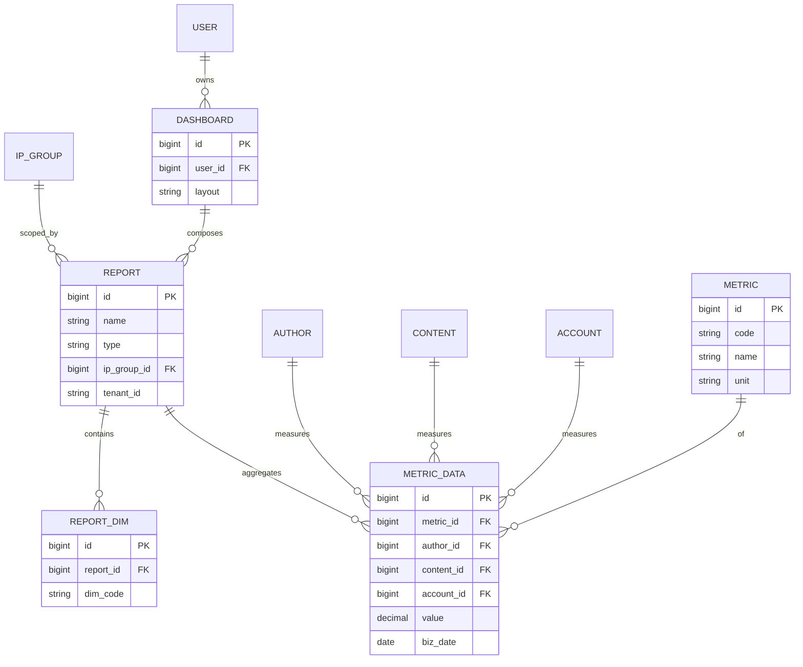

# PRD-M6-数据分析

> **业务域**：M6 数据分析
> **功能模块**：指标管理 + 8 张报表 + 漏斗 + 自定义查询 + 大屏
> **详细设计章节**：5.25、5.26、5.27、5.28、5.29、5.30、5.31
> **版本**：v1.8 | 2026-10-03
> **状态**：Draft（报表/漏斗/自定义查询实现已对齐；直播时长 S-tier 2026-08-26）
> **关联 UX**：[`UX-M6-数据分析.md`](./UX-M6-数据分析.md)（v1.6 · 2026-10-02）
> **关联 API**：[`API-M6-数据分析.md`](../engineering/API-M6-数据分析.md)
> **全局规范**：[`docs/engineering/GLOBAL-CONVENTIONS.md`](./../engineering/GLOBAL-CONVENTIONS.md)

---

## 0. 元信息

| 字段 | 值 |
|------|---|
| 模块 | M6 数据分析 |
| 业务域 | 数据分析（ANALYSIS） |
| 详细设计 | `## 5.25~5.31` |

---

## 1. 概述

### 1.1 一句话描述

平台**数据中心**：统一管理指标定义、提供 8+ 张预置报表、漏斗分析、自定义查询、可视化大屏，覆盖运营/财务/管理决策需求。

### 1.2 目标

| 维度 | 目标 |
|------|------|
| 替代 Excel | 8 张报表替代 8 个 Excel |
| 灵活分析 | 漏斗 + 自定义查询 |
| 可视化 | 大屏实时呈现 |

### 1.3 术语表

| 术语 | 定义 |
|------|------|
| **基础指标**（BASIC） | 由 MetricBuilder 可视化构建（数据源/计算/汇总/关联表/过滤 → 自动生成 SQL） |
| **复合指标**（COMPOSITE） | 引用已创建指标的 `metric_code` 做四则运算，**手动输入** `metric_formula`（无 MetricBuilder） |
| **漏斗** | 多步骤转化分析（如关注→阅读→互动→订单） |
| **预置漏斗** | 系统提供 4 个（关注/阅读/互动/订单） |
| **自定义漏斗** | 用户自行配置步骤 |
| **自定义查询** | 自由拼接 SQL 或可视化查询 |
| **大屏** | 数据可视化展示（实时/业务/汇报/监控） |

> **2026-10-03 订正**：原术语表记「基础指标 BASIC / 计算指标 CALCULATED / 派生指标 DERIVED」三分，与现网 `dict_perf_metric_type`（仅 BASIC/COMPOSITE 两项）及 `MetricManage.vue`（`metricType !== 'COMPOSITE'` 单分支）不符 —— 现网为**二分**。CALCULATED/DERIVED 仅存在于 M3 绩效执行域（`types/ops/perfExecution.ts`），非 M6 指标类型。

---

## 2. 范围

### 3.1 In Scope（7 个 FR 模块）

| FR 编号 | 名称 | 优先级 | 详细设计 |
|---------|------|--------|---------|
| FR-M6-001 | 指标管理 | P0 | 5.25 |
| FR-M6-002 | 数据报表（8 张：账号统一视图/状态监控/短视频产出/直播时长/成本分摊/ROI/IP 团队/异常预警） | P0 | 5.26 |
| FR-M6-003 | 财务概览 | P0 | 5.27 |
| FR-M6-004 | 漏斗分析（预置 + 自定义） | P0 | 5.28 |
| FR-M6-005 | 自定义查询 | P0 | 5.29 |
| FR-M6-006 | 数据大屏 | P0 | 5.30 |
| FR-M6-007 | 大屏配置 | P1 | 5.31 |

---

## 3. 关键 FR 详述（节选）

### FR-M6-001 指标管理（5.25）

#### 数据项

| 字段 | 控件 | 字典 |
|------|------|------|
| `metric_name` | `<Input />` | - |
| `metric_code` | `<Input />` | -（英文+下划线+唯一） |
| `metric_formula` | `<MetricBuilder />` 生成 SQL 或 `<CodeEditor />` 手输 | - |
| `data_source` | `<MetricBuilder />` 数据源下拉 | 预定义表（`metricSchema.ts`） |
| `metric_type` | `<DictSelect dict-type="dict_perf_metric_type" />` | 字典 |
| `unit` | `<Input />` | - |
| `description` | `<TextArea />` | 可选；**后端未持久化**（仅前端表单） |

#### 业务规则

- 指标编码全局唯一
- 基础（BASIC）/ 复合（COMPOSITE）**两种类型**（现网 `dict_perf_metric_type` 二分；原「计算/派生」表述已于 2026-10-03 订正）
- 被引用时不可删除（错误码 1502）
- **V40 迁移**：`oa_metric` 新增 `metric_formula`、`data_source` 列
- **可视化构建**（`metricType ≠ COMPOSITE`）：数据源、计算方式、汇总字段、关联表、过滤条件 → 自动生成 SQL
- **COMPOSITE**：仍用手动输入 `metric_formula`（无 MetricBuilder）
- **预览**：保存前可调用 `POST /oa/metric/preview` 校验 SQL 并返回样例结果

#### 验收

**AC-M6-001-1**（创建指标）
**AC-M6-001-2**（指标类型字典）
**AC-M6-001-3**（被引用不可删）

---

### FR-M6-002 数据报表（5.26，8 张）

8 张报表：全平台账号视图、账号状态监控、短视频产出、直播时长、账号成本分摊、ROI 分析、IP 团队人员配置、账号异常预警。

通用模式：

| 控件 | 类型 |
|------|------|
| `ipGroupId` | `<IpGroupTreeSelect />` |
| `accountId` | `<AccountSelect />` |
| `platformType` | `<DictSelect dict-type="dict_platform_type" />` |
| `dateRange` | `<DateRangePicker />` |
| `timeDimension` | `<Select />`（DAY/WEEK/MONTH） |
| 表格/图表/导出 | - |

详细字段见 5.26.x 子章节。

#### 实现补充（2026-06-11）

- 列表/统计 API 响应字段为 **snake_case**（`ReportServiceImpl.reportField()` 映射）
- 枚举列前端用 `<DictLabel />` 展示（如 `dict_platform_type`、`dict_roi_dimension`）
- ROI 维度字典：`dict_roi_dimension`（V42 迁移）
- 种子指标：V44 `seed_metrics`；漏斗步骤种子：V45

#### 2.4 直播时长报表（5.26.4 · S-tier 2026-08-26）

**维度**：按 **作者**（`oa_ip_group_anchor_rel.anchor_user_id` → member 作者昵称），可选 IP 组筛选；**非**账号维度 stub。

**数据源**：`LiveRoomApi.getLiveRoomCount(authorId, dateTime[])`（Feign → live-server）；Ops 侧 `LiveRoomReadService` 封装 RPC。

| 字段 | 说明 |
|------|------|
| `author_id` / `author_name` | 作者 ID / 昵称 |
| `session_count` | 直播场次（`liveCount`） |
| `total_duration` | 总时长，**小时**，保留 1 位小数（RPC 返回分钟，后端 ÷60） |
| `avg_duration` | 均时长 = 总时长 ÷ 场次，**小时** |
| `date` / `stat_date` | 列表行取查询区间 `endDate`；趋势按日 |

**Out of Scope（v1）**：

- `peak_viewers`（峰值在线）— API 可占位 `"-"`，**前端不展示**
- 按账号 / 平台拆分明细 — 后续迭代
- 导出 — 前端 Excel 客户端导出；后端 `export` 仍为 stub job

**趋势图**：双轴 — 柱状「场次」+ 折线「总时长(小时)」；按日聚合 IP 组下全部作者。

#### 验收（直播时长）

**AC-M6-002-4**（直播时长 · 作者汇总）
- Given IP 组下存在 `oa_ip_group_anchor_rel` 绑定作者，且 live-server 有场次数据
- When 查询 `/ops/report/live-duration/list` 与 `/trend`
- Then 列表按作者分页，含场次与时长（小时）；趋势按日汇总；**无** peak_viewers 列

**AC-M6-002-5**（直播时长 · 空 IP 组）
- Given 未选 IP 组
- When 查询列表
- Then 租户下全部 anchor 作者参与汇总（与 `resolveAnchorAuthorIds` 一致）

---

### FR-M6-004 漏斗分析（5.28）

#### 预置漏斗

| 漏斗 | 步骤 |
|------|------|
| 关注转化 | 曝光 → 关注 → 二次访问 |
| 阅读转化 | 推送 → 阅读 → 完读 |
| 互动转化 | 阅读 → 点赞 → 评论 → 转发 |
| 订单转化 | 加购 → 提交订单 → 支付 |

#### 自定义漏斗

- 用户配置步骤；**每步选择一个已定义指标**（`GET /oa/metric/list`，非预设 eventCode）
- 步骤保存 `metricId` / `metricCode`；计算每步转化率
- 前端 `FunnelAnalysis.vue` 自定义 Tab：指标下拉 + 步骤排序

#### 验收

**AC-M6-004-1**（预置漏斗查看）
**AC-M6-004-2**（自定义漏斗）
**AC-M6-004-3**（漏斗类型字典）
- 字段：`funnelType` 用 `<DictSelect dict-type="dict_funnel_type" />`

---

### FR-M6-005 自定义查询（5.29）

#### 描述

可视化查询构建 + SQL 预览；支持保存草稿/发布。

#### 页面结构（实现）

| 层级 | 内容 |
|------|------|
| 页级 Tab | **自定义查询** \| **我的查询** |
| 自定义查询 | 可折叠「查询配置」+ `QueryBuilder`（表/字段/条件/聚合） |
| 结果区 | `QueryResultPanel`：条件摘要 + Tab「结果列表」\|「图表展示」 |
| 我的查询 | 已保存查询列表；执行/编辑/删除 |

#### 交互

- 表头中文映射（字段 label）
- 查询配置/查询条件区块可展开收起
- 图表展示基于当前结果集（配置未持久化）

#### API

- `POST /oa/query/preview` — 试跑（不落库）
- `POST /oa/query/create` / `PUT /oa/query/update` — `paramsJson` 存 QueryBuilder 配置
- `POST /oa/query/{id}/execute` — 执行已保存查询

#### 验收

**AC-M6-005-1**（SQL 查询）
**AC-M6-005-2**（保存查询）
**AC-M6-005-3**（查询状态）
- 字段：`status` 现网 **硬编码** `DRAFT`（草稿）/ `PUBLISHED`（已发布）两值（见 UX §6.4）
- **2026-10-03 订正**：原表述「用 `<DictSelect dict-type="dict_query_status" />`」与现网实现不符。`dict_query_status` 虽在 `GLOBAL-CONVENTIONS` 登记（草稿/已发布/已停用三值），但 `CustomQuery.vue` 保存/编辑弹窗内为**硬编码 el-option**，`oa_query.status` 的字典映射尚未落地。IMS 并入时**以现网 DRAFT/PUBLISHED 实现为准**；若需「已停用」态或字典化，须另开 FR。

---

### FR-M6-006 数据大屏（5.30）

#### 描述

全屏可视化展示运营/竞品数据；支持模板切换、内部/外部数据范围、全局筛选与自动刷新。

#### 全局筛选（顶栏）

| 控件 | 说明 |
|------|------|
| 日期范围 | 今日 / 近 7 天 / 近 30 天（默认近 7 天） |
| IP 组 | 可选；未选表示全部 |
| 平台 | 可选；`dict_platform_type`；未选表示全部 |

- 变更任一筛选项后重新请求 `GET /oa/dashboard/{id}/data`
- **内置组件（BUILTIN）**：后端按全局筛选直接过滤业务查询
- **自定义指标/查询（METRIC/QUERY）**：日期、IP 组通过 layout `globalFilter` 映射注入（见 FR-M6-007）；平台对内置组件自动生效，自定义 SQL 需自行处理（见 ADR-015）

#### 组件类型

| type | 说明 |
|------|------|
| `KPI` | 指标卡；受全局日期/IP 组/平台影响 |
| `STAT` | 今日统计；**始终按当天统计，不受全局日期范围影响**；仍受 IP 组/平台影响 |
| `CHART` | 图表（折线/柱状/饼图） |
| `LIST` | 排行榜/明细列表 |

#### 布局

- 指标卡区：最多 6 个，自适应列数
- 今日统计区：内部 scope 显示「今日工作概览」标题
- 图表区：两列网格；末行仅剩 1 个图表时与列表并排
- 列表区：剩余列表通栏展示

#### 其他

- 暗色主题；ECharts 渲染图表
- 刷新间隔取自 layout `refreshSeconds`（30s / 60s / 300s / 0=不刷新）
- 预置模板：98601 内部运营大屏、98602 外部竞品大屏（V59/V61 seed）

#### 验收

**AC-M6-006-1**（大屏展示：KPI/图表/列表有数据）
**AC-M6-006-2**（大屏类型字典：`dashboardType` → `dict_dashboard_type`）
**AC-M6-006-3**（全局筛选：日期/IP 组/平台变更后组件数据联动刷新）
**AC-M6-006-4**（STAT 组件不受全局日期范围影响，仅统计当天）

---

### FR-M6-007 大屏配置（5.31）

#### 描述

管理员配置大屏模板：组件编排、数据源、全局筛选映射与实时预览。

#### 页面结构

| 区域 | 内容 |
|------|------|
| 左栏 | 模板信息、指标卡/今日统计/图表/列表组件列表与编辑 |
| 右栏 | 实时预览（与全屏共用全局筛选条）+ 配置说明 |

#### 模板信息

| 字段 | 控件 |
|------|------|
| `dashboardName` | `<Input />` |
| `scope` | 单选：INTERNAL / EXTERNAL |
| `refreshSeconds` | `<Select />` |
| `status` | `<Switch />` |

#### 组件配置

- **数据源**：BUILTIN / METRIC / QUERY
- **指标卡**：最多 6 个
- **今日统计（STAT）**：独立区块
- **图表**：最多 4 个；METRIC/QUERY 可配置 `chartType`、`xKey`、`yKey`、`groupKey`、`yAgg`
- **列表**：METRIC/QUERY/BUILTIN 可勾选展示列；支持 `sortKey` / `sortOrder` / `limit`

#### 全局筛选映射（METRIC / QUERY）

编辑自定义指标或查询组件时，配置 **业务字段级映射**（写入 layout `globalFilter`）：

| 映射项 | 说明 |
|--------|------|
| 日期字段 | 来自 `metricSchema.ts` 可过滤日期字段；后端注入 `dateColumn` WHERE |
| IP 组字段 | 来自 `metricSchema.ts` 可过滤 IP 组字段；选中 IP 组后注入；未选不注入 |

- 选「不绑定」则不注入对应全局条件
- 前端保存时解析 `dateColumn` / `ipGroupColumn` / `dateFieldType`（date | datetime）
- **旧版 `filterBind`**（SQL 占位符 → 全局来源）仍被后端兼容，新配置不再写入

#### SQL 与租户

- 指标/查询 SQL 中 `:tenantId` **始终由后端自动绑定**当前租户，无需配置
- 未配置 `globalFilter` 且无 `filterBind` 时，标准占位符（`:startDate` 等）按 legacy 规则绑定

#### 验收

**AC-M6-007-1**（配置页可编辑 METRIC/QUERY 的全局筛选映射并保存到 layout）
**AC-M6-007-2**（预览区全局筛选与全屏页行为一致）
**AC-M6-007-3**（BUILTIN 图表轴字段只读；METRIC/QUERY 图表 X/Y 下拉可选）

---

## 3.0 用户与权限（2026-10-02 · 对齐 UX v1.6）

| 角色 | 典型能力 |
|------|----------|
| 系统管理员 / 运营管理者 | 指标 CRUD、全部报表、漏斗/查询发布、大屏配置 |
| 数据分析师 | 指标只读 + 指标分析消费 + 报表/漏斗/查询执行；**无**大屏模板编辑 |
| 财务 / 数据·财务 | P-M6-010 财务分析 + 成本/ROI 相关报表 |
| 运营组长 / 运营 | 本 IP 组数据范围内的报表与大屏查看 |

| 页面簇 | permission（菜单/API 锚点） |
|--------|---------------------------|
| P-M6-001 指标管理 | `oa:metric:list` |
| P-M6-002~009 报表 | `oa:report:list`（各 Tab 共用菜单） |
| P-M6-010 财务 | `oa:financial-analysis:list` |
| P-M6-011~012 漏斗 | `oa:funnel:list` |
| P-M6-013 自定义查询 | `oa:query:list` |
| P-M6-014~015 大屏 | `oa:dashboard:view` · 配置 `oa:dashboard:config` |
| P-M6-016 指标分析 | `oa:metric-analysis:list` |

**HTTP 前缀 SSOT**：`/admin-api/ops/analysis/**`（见 [`API-M6-数据分析.md`](../engineering/API-M6-数据分析.md) §0）。

---

## 3.1 页面清单与 UX 交叉引用（对齐 UX-M6 v1.6）

> **路由 SSOT**：[`OPS-MENU-ROUTE-INDEX.md`](../delivery/OPS-MENU-ROUTE-INDEX.md) · 字段/图表见 UX 各 §；本节 **P-M6-* + 可测 AC**。

| 页面 ID | 名称 | Football 路由 | FR | UX 规格 |
|---------|------|---------------|-----|---------|
| P-M6-001 | 指标管理 | `/ops/analysis/metric` | FR-M6-001 | UX §3 |
| P-M6-002 | 全平台账号视图 | `/ops/analysis/data-report`（Tab/独立视图） | FR-M6-002 | UX §4.1 |
| P-M6-003 | 账号状态监控 | 同上 | FR-M6-002 | UX §4.2 |
| P-M6-004 | 短视频产出 | 同上 | FR-M6-002 | UX §4.3 |
| P-M6-005 | 直播时长 | 同上 | FR-M6-002 | UX §4.4 |
| P-M6-006 | 账号成本分摊 | 同上 | FR-M6-002 | UX §4.5 |
| P-M6-007 | ROI 分析报表 | 同上 | FR-M6-002 | UX §4.6 |
| P-M6-008 | IP 团队人员配置 | 同上 | FR-M6-002 | UX §4.7 |
| P-M6-009 | 账号异常预警 | 同上 | FR-M6-002 | UX §4.8 |
| P-M6-010 | 总体财务分析 | `/ops/analysis/financial-analysis` | FR-M6-003 | UX §4.10 |
| P-M6-011 | 预设漏斗 | `/ops/analysis/funnel-analysis` | FR-M6-004 | UX §5.1 |
| P-M6-012 | 自定义漏斗 | 同上 | FR-M6-004 | UX §5.2 |
| P-M6-013 | 自定义查询 | `/ops/analysis/custom-query` | FR-M6-005 | UX §6 |
| P-M6-014 | 数据大屏 | `/ops/analysis/screen` | FR-M6-006 | UX §7 |
| P-M6-015 | 大屏配置 | `/ops/analysis/screen-config` | FR-M6-007 | UX §8 |
| P-M6-016 | 指标分析 | `/ops/analysis/metric-analysis` | FR-M6-001（消费） | UX §3.2 |

### 3.1.1 页级验收（Given/When/Then）

**AC-M6-001-P001**（P-M6-001 指标 CRUD）
- Given `oa:metric:list` 写权限
- When 新建指标并调用预览 `POST /admin-api/ops/metric/preview` 通过后保存
- Then 指标编码租户内唯一；被引用指标删除返回 **1502**（**AC-M6-001-3**）

**AC-M6-001-P016**（P-M6-016 指标分析 · 只读）
- Given 租户内 ≥1 启用指标
- When 在 `/ops/analysis/metric-analysis` 选指标 + 日期 + 可选 IP 组/平台
- Then 展示趋势/对比与明细；**无**指标 CRUD 入口（UX §3.2）

**AC-M6-002-P002**（P-M6-002 全平台账号视图）
- When 在报表页选 IP 组/平台/日期并查询
- Then `GET /admin-api/ops/report/unified-account/list`（或 UX §4.1 等价路径）；表格 snake_case + `<DictLabel />` 枚举列

**AC-M6-002-P003**（P-M6-003 账号状态监控）
- When 查询账号状态报表
- Then 列表含状态/平台/账号维度字段；筛选变更后表格与汇总卡同步刷新（UX §4.2）

**AC-M6-002-P004**（P-M6-004 短视频产出）
- When 切换 `timeDimension` DAY/WEEK/MONTH 并查询
- Then 产出统计与趋势图按维度聚合（UX §4.3）

**AC-M6-002-P005**（P-M6-005 直播时长）
- When 查询直播时长报表
- Then 行为以 **AC-M6-002-4/5** 为准（作者维度 · 小时 · 无 peak_viewers 列）

**AC-M6-002-P006**（P-M6-006 成本分摊）
- When 选 IP 组 + 账期查询
- Then 分摊列表与图表非空或展示规范空态；导出若启用则客户端 Excel（UX §4.5）

**AC-M6-002-P007**（P-M6-007 ROI 报表）
- When 选 `dict_roi_dimension` 维度查询
- Then ROI 列表/趋势与 M5 公式一致（`pay_amount / cost`）；维度字典展示正确（UX §4.6）

**AC-M6-002-P008**（P-M6-008 IP 团队配置）
- When 查询团队配置报表
- Then 展示 IP 组—人员/岗位配置矩阵；IP 组筛选生效（UX §4.7）

**AC-M6-002-P009**（P-M6-009 异常预警）
- When 打开预警 Tab 并筛选告警级别/状态
- Then 列表字段含 `dict_alert_type` / `dict_alert_level` / `dict_alert_status`；行可跳转关联账号（UX §4.8）

**AC-M6-002-P009b**（DataReport 8 Tab 兜底）
- Given 进入 `/ops/analysis/data-report` 卡片导航或 8 Tab 老 URL
- When 切换 Tab name（`unified-account` … `account-alert`）
- Then 字段与 §4.1–4.8 独立视图一致（UX §4.9；新开发以独立 `Report*.vue` 为准）

**AC-M6-003-P010**（P-M6-010 总体财务分析）
- Given 财务分析菜单权限
- When 打开 `/ops/analysis/financial-analysis` 并切换时间维度/账期
- Then KPI 卡 + 图表与 `GET /admin-api/ops/financial/**` 一致（UX §4.10）

**AC-M6-004-P011**（P-M6-011 预设漏斗）
- Given 漏斗页 Tab=`preset`
- When 选择预置漏斗类型（`dict_funnel_type`）并查询
- Then 展示步骤转化率；4 组预置漏斗步骤与 FR-M6-004 表一致（UX §5.1 · **AC-M6-004-1**）

**AC-M6-004-P012**（P-M6-012 自定义漏斗）
- When 在 custom Tab 为每步选择已定义指标并保存漏斗
- Then 步骤存 `metricId`；计算转化率；删除/停用需 confirm（UX §5.2 · **AC-M6-004-2**）

**AC-M6-005-P013**（P-M6-013 自定义查询）
- Given 页级 Tab「自定义查询」
- When 配置 QueryBuilder 并 [试跑]
- Then `POST /admin-api/ops/query/preview` 返回动态中文表头结果；保存后出现在「我的查询」Tab 并可 execute（UX §6 · **AC-M6-005-1/2**）

**AC-M6-006-P014**（P-M6-014 数据大屏）
- When 打开全屏大屏并变更顶栏日期/IP 组/平台
- Then `GET /admin-api/ops/dashboard/{id}/data` 刷新；STAT 组件仅统计当天（**AC-M6-006-4**）；暗色主题 ECharts（UX §7）

**AC-M6-007-P015**（P-M6-015 大屏配置）
- Given `oa:dashboard:config`
- When 编辑 METRIC/QUERY 组件并配置 layout `globalFilter` 日期/IP 组映射后保存
- Then 右侧预览区筛选行为与 P-M6-014 全屏一致（**AC-M6-007-1/2** · UX §8）

### 3.1.2 二级面锚点（2026-10-03）

| 面 ID | 名称 | 入口 | PRD 锚点类型 |
|-------|------|------|--------------|
| S-M6-001 | 数据报表 8 Tab 子视图 | `/ops/analysis/data-report` | **AC-M6-002-P009b** |
| D-M6-001 | 自定义漏斗编辑器 dialog | 漏斗页 custom Tab | 可测 AC · 步骤字段 **UX SSOT** §5.2 |

**AC-M6-004-P012-D**（D-M6-001 漏斗编辑弹窗）
- When 在自定义漏斗 Tab 点击 [新增漏斗] 或 [编辑]
- Then dialog 内为每步选择已发布指标；保存后列表可见；无步骤拖拽 **不** 阻塞 P0（UX §5.2 · OPS-UX §5.4）

---

## 4. 关联属性（🔴 必查）

| 字段 | 选择器 |
|------|--------|
| `ipGroupId` | `<IpGroupTreeSelect />` |
| `accountId` | `<AccountSelect />` |
| `platformType` | `<DictSelect dict-type="dict_platform_type" />` |
| `contentType` | `<DictSelect dict-type="dict_content_type" />` |
| `reportType` | `<DictSelect dict-type="dict_report_type" />` |
| `reportPeriod` | `<DictSelect dict-type="dict_report_period" />` |
| `funnelType` | `<DictSelect dict-type="dict_funnel_type" />` |
| `queryStatus` | `<DictSelect dict-type="dict_query_status" />` |
| `dashboardType` | `<DictSelect dict-type="dict_dashboard_type" />` |
| `metricType` | `<DictSelect dict-type="dict_perf_metric_type" />` |
| `alertType` | `<DictSelect dict-type="dict_alert_type" />` |
| `alertLevel` | `<DictSelect dict-type="dict_alert_level" />` |
| `alertStatus` | `<DictSelect dict-type="dict_alert_status" />` |

---

## CHANGELOG

| 日期 | 版本 | 说明 |
|------|------|------|
| 2026-10-03 | v1.8 | 订正 **AC-M6-005-3** 查询状态：现网硬编码 DRAFT/PUBLISHED（非 dict_query_status）；§3.1.2 二级面（D-M6-001 漏斗 dialog · S-M6-001 报表 Tab） |
| 2026-10-02 | v1.6 | §3.0 用户与权限 · §3.1.1 P-M6-001~016 页级可测 AC（报表 Tab/财务/漏斗/查询/大屏） |
| 2026-10-02 | v1.5 | §3.1 UX v1.6 页面对照；P-M6-016 指标分析 AC；P-M6-010 财务 AC 交叉引用 |
| 2026-08-26 | v1.4 | 直播时长 S-tier · 作者维度 |

*下一步：STATE / CHECKLIST / TESTCASES（与 §3.1.1 P-M6-* 对齐）。*

---

## 核心 ER 图

详见 [`GLOBAL-CONVENTIONS.md § 1`](../engineering/GLOBAL-CONVENTIONS.md) (铁律)
