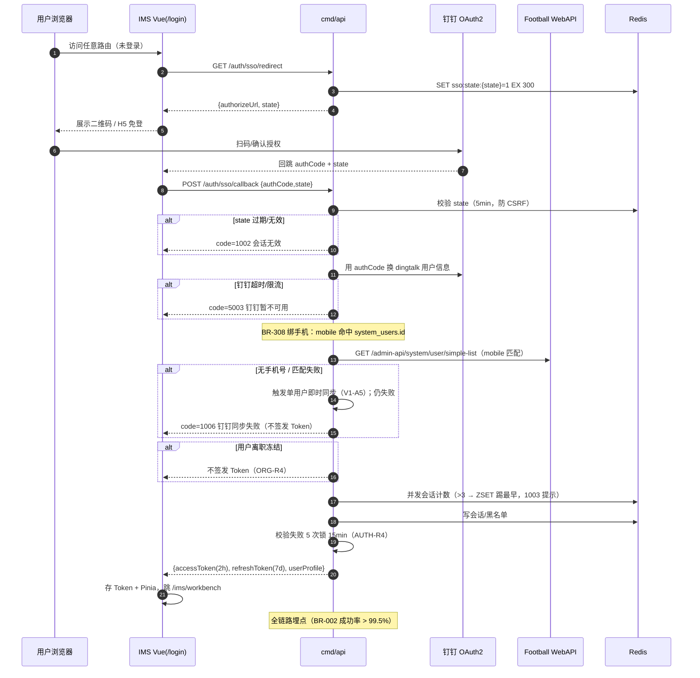
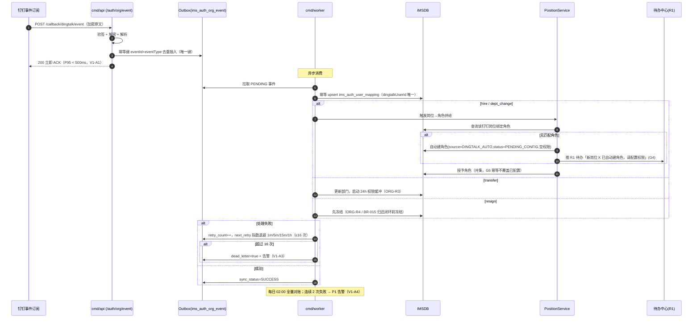
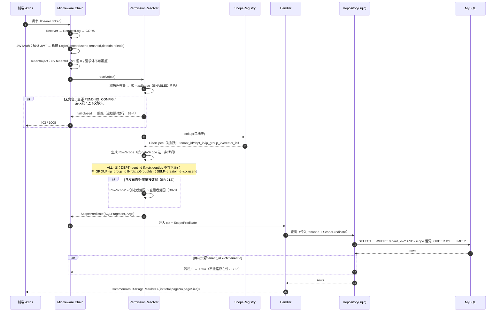

# IMS 架构设计 —— Sprint 0 收尾 + AUTH/SYS 首批（仓库就位即可开工）

> **文档类型**：系统设计 + 任务分解（方案级；**不建仓、不落工程文件、不写业务代码**）
> **日期**：2026-10-05
> **作者**：高见远（架构师）
> **上游输入**：《开发方案/IMS-增量PRD-Sprint0收尾与AUTHSYS首批-20261005.md》
> **需求 SSOT**：《产品PRD/IMS完整产品需求文档.md》v2.6.34（第 117 行 BR-305 为数据范围权威口径）
> **关联冻结**：ADR-IMS-001 / 002 / 006 / 007 / 008 · IR-01~IR-06 · B5（§7A）/ B9（§P2A）
> **2026-10-05 起本文不再作为实现事实源。** 后端与用户主数据以 ADR-IMS-009 和《IMS-Python完整开发计划-20261005.md》为准。下文 Go、sqlc、Football 读用户均为历史记录。  
> **裁决纪律**：冲突时 **ADR-IMS-009 > ADR-IMS-002（前端）> 完整 PRD > 全局开发规范 > 完整版补充 > 页面规格**。

---

## 0. TL;DR（四个真实冲突的裁决）

| # | 冲突 | 裁决（权威口径） | 后果 |
|---|------|------------------|------|
| **①** | BR-305 数据范围枚举被写错 | 枚举 = **`ALL` / `DEPT` / `IP_GROUP` / `SELF`**（=全部 / 本部门 / IP 组 / 仅本人）；**删除旧三级口径「本部门及下级」**（「本部门」不含下级）；**`IP_GROUP` 进入枚举**（是 BR-305 四级之一，非「独立轴」）。中间件按角色 `dataScope` 选**一条**谓词执行；`tenant_id` 为**正交强制轴** | 订正 `SYS-系统管理-页面规格.md` §P2A 第 2 条 + §P2 功能点 3 等 7 处下游文档（**已于 2026-10-05 落地**） |
| **②** | 角色/权限表两套命名并存 | 以 **ADR-IMS-008 §5 + 完整版补充 §2（`ims_sys_*`）为准**；**作废** `ims_auth_role_matrix` / `ims_auth_data_scope`（不建表） | 订正共享技术规范 §7.1/§7.2 + V1/V2/V3 PRD 共 6 行 |
| **③** | `system_users` 读取路径 | 归属 **Football `shenyu-system`**；读取 = **Football HTTP**（`GET /admin-api/system/user/simple-list`，白名单）；IMS **不回写用户主表**；IMS 仅写自管表 `ims_auth_user_mapping` / `ims_sys_user_role` | IR-06「共用运营用户表」措辞需精确为「共用主键口径，物理表在 Football system」 |
| **④** | SYS-003 菜单 SSOT | **IMS 自建 `ims_sys_menu`**（IR-06 + ADR-IMS-002 §4），**`id` 与 `system_menu.id` 对齐**（ADR-IMS-007 §3）；套餐门控仍读 Football `system_tenant_package_menu`（只读）。**采纳**产品经理方案 | 明确 SYS-003 `GET /system/menu/tree` 的 SSOT=`ims_sys_menu`；menuId 对账列为上线前硬门槛 |

**任务列表**：5 个顶层任务（T01–T05，均含子任务，映射 9 个 Slice）· **登记册 20 行**（覆盖 AUTH/SYS ≥18 行要求）。

---

# Part A：系统设计

## 1. 实现方案与框架选型确认

### 1.1 核心难点

| # | 难点 | 应对 |
|---|------|------|
| D-1 | **双数据源与"停 OPS"纪律**：OPS 业务库（同库直连 `oa_*`）+ Football（仅 HTTP）+ IMS 自管表 | 三层数据访问抽象：`OPSDB`（sqlc 直连）/ `IMSDB`（sqlc）/ `FootballWebApiClient`（HTTP）。**不存在** OPS HTTP 通道（§7A 门禁） |
| D-2 | **角色=权限唯一载体 + 失败关闭**：一套模型要同时承载"菜单权限码 + 功能点 R/W/D + 数据范围 + 钉钉岗位"，且空权限必须拒绝 | 单一 `Role` 聚合（`ims_sys_role` + `ims_sys_role_menu` + `ims_role_perm_detail`），中间件按角色并集求权限、**默认拒绝** |
| D-3 | **统一权限中间件（B9）一处执行**：tenant + dataScope + BR-212 交集 + 1504 + fail-closed，各模块禁自实现 | 中间件链 + **过滤规则注册表**（登记册第 10 列）+ 「模块禁自写过滤」静态扫描（与 §7A 同法） |
| D-4 | **钉钉事件异步化与幂等**：回调 P95 < 500ms、重试退避、死信、幂等键 | 回调**只验签入队**（DB outbox），`cmd/worker` 消费；幂等键 `dingtalkEventId + eventType` |
| D-5 | **现网表零破坏**：只加列、可空/默认、OPS 运行期兼容 | IMS 自有表用 migration；OPS 表加列用独立 `db/compat/*.sql`（人工运维窗口执行，幂等 `IF NOT EXISTS` 风格） |
| D-6 | **无芋道、无 ORM 魔法**：sqlc + 显式 SQL | 手写 SQL 对现网字段，避免推断表结构；禁止 GORM AutoMigrate |

### 1.2 框架与库选型（对齐 ADR-IMS-002）

| 层 | 冻结项（ADR-IMS-002） | 落地选型 | 理由 |
|----|----------------------|----------|------|
| 后端语言 | Go 1.23+ | **Go 1.23** | ADR 决策 |
| 后端进程 | `cmd/api` + `cmd/worker` 分离 | `net/http` + 路由 `chi v5` | chi 轻量、贴近 stdlib、中间件链清晰（B9 强依赖中间件） **不引入重框架魔法** |
| 数据访问 | **sqlc + 显式 SQL** | `sqlc v1.27` + `database/sql` + `go-sql-driver/mysql` | ADR 决策；**禁 GORM AutoMigrate**；两套连接池（OPSDB / IMSDB） |
| 缓存/会话 | Redis | `redis/go-redis v9` | Token 黑名单、幂等 `clientToken`、SSO `state`、序列号、并发会话计数 |
| 认证 | 钉钉 SSO → IMS JWT | OAuth2 授权码 + `golang-jwt/jwt v5` | ADR 决策；**不走** Football social-login |
| Football | **仅 HTTP Client** | 自封装 `pkg/football`（`FootballWebApiClient`） | IR-02；集中封装，外部 HTTP 白名单三类之一（另见钉钉 / ComfyUI·jingcai，§7A.1） |
| 钉钉 SDK | 轻量 | 自封装 `pkg/dingtalk`（HTTP + 验签/加解密） | 避免重 SDK；事件验签 + oapi 调用 |
| 配置 | 文件/环境变量 | `spf13/viper` | 配置键 `football.webapi.*` / `ims.file.storage.root` 等 |
| 日志 | — | `go.uber.org/zap` | 结构化日志 |
| 校验 | — | `go-playground/validator v10` | DTO 校验 |
| ID | Snowflake BIGINT | `bwmarrin/snowflake` | 全局规范 §7.4 |
| 定时/调度 | Worker | `robfig/cron v3` | 每日 02:00 对账、退避重试 |
| 迁移 | 只加列 | `golang-migrate/migrate v4`（IMS 表）+ `db/compat/*.sql`（OPS 表） | IR-04 |
| 前端 | Vue3+TS+Vite+Element Plus+Pinia+Router+Axios+ECharts | 见 §7 | ADR-IMS-002；**禁 Vben 全家桶** |
| 加密 | AES-256 应用层 | stdlib `crypto/aes`（GCM） | IR-06 / BR-306 |

### 1.3 架构模式

- **分层**：`handler（HTTP/DTO）→ service（业务/事务）→ repository（sqlc 查询）`，按**域分包**（auth / sys）。
- **中间件链（横切）**：`Recover → RequestLog → CORS → JWTAuth → TenantInject → RowScope(B9) → Handler`。
- **BFF 前缀**：`/admin-api/ims/`（网关），模块路由 `auth/*`、`sys/*`（即 `/admin-api/ims/auth/**`、`/admin-api/ims/system/**`）。
- **出参风格**：struct `json` tag camelCase；库列 snake_case（sqlc）；**接口永不透出 snake_case**。

---

## 2. 工程骨架（目录结构与文件清单）

> 后端按域分包、`cmd/api`/`cmd/worker` 分离、sqlc 目录布局；前端 `src/{api,enums,components,views,stores,utils}`。**本轮仅给骨架。**

### 2.1 后端（`/`，Go module `github.com/shenyu/ims`）

```
ims-backend/
├── go.mod / go.sum
├── Makefile                         # make api / make worker / make sqlc / make migrate / make ci
├── sqlc.yaml                        # sqlc 配置（见 §2.3）
├── cmd/
│   ├── api/main.go                  # HTTP 进程：加载配置→连库/Redis→装配路由→中间件链→listen
│   └── worker/main.go               # 后台进程：钉钉事件消费、对账 cron、退避重试、Football 补偿
├── internal/
│   ├── config/config.go             # viper 配置结构体（§8 关键键）
│   ├── bootstrap/
│   │   ├── db.go                    # OPSDB + IMSDB 两个 *sql.DB（sqlc.New 两套 Queries）
│   │   ├── redis.go
│   │   └── router.go                # chi 路由 + 中间件链装配
│   ├── middleware/
│   │   ├── recover.go  requestlog.go  cors.go
│   │   ├── auth.go                  # JWT 校验 → 注入 ctx（userId/tenantId/deptIds/roles）
│   │   ├── tenant.go                # B9-1：注入 tenant_id（V1 恒 0，接口不透出）
│   │   ├── rowscope.go              # B9-2/3/4/5：dataScope 谓词、BR-212 交集、fail-closed、1504
│   │   └── scope_registry.go        # B9-6：过滤规则注册表（表→过滤键/列映射）
│   ├── ctxutil/context.go           # LoginContext 读写（tenantId/userId/deptIds/roleIds/ipGroupIds）
│   ├── errcode/errcode.go           # 错误码常量（1001~1010 / 1211~1220 / 1500~1504 / 5001~5006）
│   ├── pkg/
│   │   ├── response/result.go       # CommonResult<T>{code,msg,data}
│   │   ├── pagination/page.go       # PageParam{pageNo,pageSize} + PageResult<T>
│   │   ├── crypto/aes.go            # AES-256-GCM + 脱敏工具
│   │   ├── snowflake/snowflake.go
│   │   ├── dingtalk/{client.go,event.go,verify.go}   # oapi 调用 + 回调验签/解密（白名单②）
│   │   ├── jingcai/client.go                        # jingcai 内容生成/润色（白名单③·旁路）
│   │   ├── comfyui/client.go                        # ComfyUI 工作流（白名单③·旁路）
│   │   └── football/client.go       # FootballWebApiClient（白名单①，三类见 §7A.1）
│   ├── domain/
│   │   ├── auth/
│   │   │   ├── handler.go  dto.go  service.go  repository.go
│   │   │   ├── sso.go               # AUTH-001 登录/刷新/注销（state/锁定/并发会话）
│   │   │   ├── org.go               # AUTH-002 组织同步（事件/对账/指标）
│   │   │   ├── position.go          # AUTH-003 岗位-角色供给规则
│   │   │   └── workbench.go         # AUTH-004 工作台（dashboard/todos/messages）
│   │   └── sys/
│   │       ├── handler.go  dto.go  service.go  repository.go
│   │       ├── user.go              # SYS-001 用户（Football 读 + IMS 角色分配）
│   │       ├── role.go              # SYS-002 角色=权限唯一载体（含 perm-detail/data-scope/dingtalk-position/preview/from-position）
│   │       ├── menu.go              # SYS-003 菜单（ims_sys_menu）
│   │       ├── dict.go              # SYS-004 字典
│   │       └── param.go             # SYS-005 参数
│   ├── worker/
│   │   ├── dingtalk_event.go        # 消费 outbox：hire/transfer/resign/dept_change + 幂等 upsert
│   │   ├── reconcile.go             # 每日全量对账 + 差异修正
│   │   ├── retrofit.go              # 指数退避 1m/5m/15m/1h ≤16 次 → 死信
│   │   └── role_provision.go        # G1~G8：无角色岗位 → 自动建 PENDING_CONFIG 空权限角色 + R1 待办
│   └── db/
│       └── sqlcgen/                 # sqlc 生成代码（OPSDB 与 IMSDB 分目录）
│           ├── opsdb/               # 生成自 db/query/ops/**
│           └── imsdb/               # 生成自 db/query/ims/**
├── db/
│   ├── query/
│   │   ├── ops/                     # 对现网 oa_*/system_users(FB) 的只读 SQL
│   │   └── ims/                     # 对 ims_* 的 CRUD SQL（auth/*.sql, sys/*.sql）
│   ├── migration/                   # golang-migrate：IMS 自建表（ims_sys_* / ims_auth_* / ims_role_*）
│   │   ├── 0001_init_auth.up.sql / .down.sql
│   │   ├── 0002_init_sys.up.sql / .down.sql
│   │   └── 0003_init_menu_seed.up.sql / .down.sql
│   ├── compat/                      # 现网 OPS 表「只加列」脚本（人工运维窗口执行）
│   │   ├── 20261005_oa_ip_group_add_ding_dept_id.sql
│   │   ├── 20261005_oa_ip_group_anchor_rel_add_is_primary.sql
│   │   └── 20261005_oa_platform_account_add_author_user_id.sql
│   └── seed/                        # 菜单 seed / 字典 seed / 参数 seed（幂等 upsert）
├── deploy/
│   ├── Dockerfile.api  Dockerfile.worker  docker-compose.dev.yml
│   └── nginx/ims.conf               # 前端静态 + /admin-api/ims 反代
└── scripts/
    └── ci/forbid_ops_http.sh        # §7A CI 门禁脚本（见 §9）
```

### 2.2 前端（`ims-web/`，Vue3 + TS + Vite）

```
ims-web/
├── package.json  vite.config.ts  tsconfig.json  .eslintrc.cjs  .prettierrc
├── index.html
├── src/
│   ├── main.ts                      # createApp + Pinia + Router + ElementPlus
│   ├── App.vue
│   ├── router/index.ts              # 路由 + 权限守卫（未登录 → /login）
│   ├── layouts/{BasicLayout.vue,BlankLayout.vue}
│   ├── stores/{user.ts,permission.ts,app.ts}   # user: token/profile/roles；permission: 菜单树/权限码
│   ├── api/
│   │   ├── auth.ts                  # SSO/组织/岗位/工作台
│   │   ├── sys.ts                   # 用户/角色/菜单/字典/参数
│   │   └── types/{auth.ts,sys.ts,common.ts}
│   ├── enums/index.ts               # 全局权威枚举（含 DataScope）
│   ├── utils/{request.ts,auth.ts,formRule.ts,days.ts,desensitize.ts}
│   ├── components/                  # ConfirmDialog/FileUpload/QueryBar/DetailDrawer/StatusTag/...
│   └── views/
│       ├── login/index.vue                       # AUTH-001 P1
│       ├── auth/org/index.vue                    # AUTH-002 P2
│       ├── auth/position/index.vue               # AUTH-003 P3
│       ├── workbench/{index.vue,todos.vue,messages.vue}   # AUTH-004 P4/P4a/P4b
│       └── system/{user,role,menu,dict,param}/index.vue   # SYS-001~005
└── public/
```

### 2.3 sqlc 目录布局（`sqlc.yaml` 要点）

```yaml
version: "2"
sql:
  - engine: "mysql"
    schema: "db/migration"                   # 仅 IMS 自建表 DDL（现网表不解析）
    queries: "db/query/ims"
    gen:
      go:
        package: "imsdb"
        out: "internal/db/sqlcgen/imsdb"
        emit_json_tags: true
        json_tags_case_style: "camel"
  - engine: "mysql"
    schema: "db/schema/ops"                  # 现网 oa_* 表的只读 schema 快照（人工维护）
    queries: "db/query/ops"
    gen:
      go:
        package: "opsdb"
        out: "internal/db/sqlcgen/opsdb"
```

> **约定**：IMS 自建表 DDL 走 `db/migration`（migrate 管理）；现网表**不**migrate（只加列走 `db/compat`），其 schema 以 `db/schema/ops/*.sql` 快照供 sqlc 生成只读查询。

---

## 3. 数据模型 + 表映射登记册技术方案

### 3.1 核心类图（Mermaid `classDiagram`）

```mermaid
classDiagram
    class LoginContext {
        +int64 userId
        +int64 tenantId
        +int64[] deptIds
        +string[] roleCodes
        +int64[] ipGroupIds
        +DataScope maxScope
        +bool authenticated
        +failClosed() bool
    }
    class DataScope {
        <<enumeration>>
        ALL
        DEPT
        IP_GROUP
        SELF
    }
    class PermissionResolver {
        +resolve(ctx LoginContext) RowScope
        -unionScopes(roleIds) DataScope
    }
    class RowScope {
        +bool all
        +int64[] deptIds
        +int64[] ipGroupIds
        +int64 selfUserId
        +sqlFragment(table) ScopePredicate
        +intersect(other RowScope) RowScope
    }
    class ScopeRegistry {
        +register(table, filterKeys)
        +lookup(table) FilterSpec
    }
    class Role {
        +int64 id
        +string roleName
        +string roleKey
        +DataScope dataScope
        +string dingtalkPosition
        +RoleSource source
        +RoleStatus status
        +int[] menuIds
        +map~string,PermLevel~ permDetail
    }
    class RoleSource {
        <<enumeration>>
        MANUAL
        DINGTALK_AUTO
    }
    class RoleStatus {
        <<enumeration>>
        ENABLED
        PENDING_CONFIG
    }
    class PositionRule {
        +int64 id
        +string ruleName
        +string dingtalkPosition
        +int[] grantRoleIds
        +int version
        +EnableStatus status
        +int appliedUserCount
    }
    class DingtalkUserMapping {
        +int64 userId
        +string dingtalkUserId
        +string unionId
        +int[] deptIds
        +SyncStatus syncStatus
        +datetime lastSyncTime
    }
    class OrgSyncEvent {
        +int64 id
        +string dingtalkEventId
        +OrgEventType eventType
        +string idempotencyKey
        +json payloadJson
        +SyncStatus syncStatus
        +int retryCount
    }
    class OperationLog {
        +int64 id
        +string module
        +string action
        +int64 operatorId
        +json detail
    }
    class AuthService {
        +ssoRedirect() SsoRedirectResp
        +ssoCallback(req) SsoCallbackResp
        +refresh(token) SsoCallbackResp
        +logout(ctx) void
    }
    class OrgService {
        +receiveEvent(req) void
        +pageUsers(q) PageResult
        +reconcile() ReconcileResp
        +syncMetrics() SyncMetricsResp
    }
    class PositionService {
        +pageRules(q) PageResult
        +saveRule(req) PositionRule
        +deleteRule(id) void
        +autoCreateRole(position) RoleAutoCreateResp
    }
    class WorkbenchService {
        +dashboard(ctx) WorkbenchDashboardResp
        +pageTodos(q) PageResult
        +pageMessages(q) PageResult
    }
    class SysUserService {
        +pageUsers(q) PageResult
        +assignRoles(req) void
    }
    class SysRoleService {
        +listRoles() Role[]
        +saveRoleMenus(id, menuIds) void
        +savePermDetail(id, detail) void
        +saveDataScope(id, scope) void
        +bindDingtalkPosition(id, pos) void
        +preview(id, userId) PermDiff
        +fromPosition(req) Role
    }
    class SysMenuService {
        +tree(tenantId) MenuNode[]
    }
    class SysDictService {
        +listTypes() DictType[]
        +listData(dictType) DictData[]
    }
    class SysParamService {
        +list() Param[]
        +updateByKey(key, value) void
    }
    class FootballWebApiClient {
        +listSystemUsers(keyword) UserSimple[]
        +createArticle(dto) string
        +pageOrdersForOps(req) Page
        +listJcMatchesByDate(date) MatchBrief[]
    }
    class DingtalkClient {
        +getUserByCode(authCode) DingUser
        +getDepartmentList() Dept[]
        +getUserDetail(userId) DingUser
    }

    AuthService --> LoginContext : issues
    AuthService --> DingtalkClient
    AuthService --> FootballWebApiClient : resolveUserId
    OrgService --> DingtalkClient
    OrgService --> PositionService : trigger provision
    PositionService --> Role : auto-create (empty perms)
    PermissionResolver --> DataScope
    PermissionResolver --> Role
    PermissionResolver --> RowScope
    RowScope --> ScopeRegistry
    SysRoleService --> Role
    SysRoleService --> DataScope
    SysUserService --> FootballWebApiClient
    SysMenuService --> ScopeRegistry : menu tree (ims_sys_menu)
    DingtalkUserMapping --> OrgSyncEvent : produced by
```



### 3.2 表映射登记册（AUTH/SYS 域 · 指针引用）

> **单一事实源（2026-10-05）**：AUTH/SYS 域表映射登记册以 **`产品规划/IMS-表映射登记册-20261005.md` 为唯一事实源**。本架构文档**不再复制该表**，改为指针引用，避免两处漂移。
> - **覆盖**：**22 行**（18 张 AUTH/SYS 承载表 + 2 张 D-13/BR-212 支撑表 #21/#22 + 2 张作废行 #15/#16） + **3 处 OPS 现网「只加列」**（G1~G3）。
> - **关键结论（详见登记册）**：`system_users` = **Football HTTP 只读**（#1）；角色/权限表 = `ims_sys_role`/`ims_sys_role_menu`/`ims_role_perm_detail`（#2/#10/#11），`ims_auth_role_matrix`/`ims_auth_data_scope` **作废不建表**（#15/#16）；菜单 = `ims_sys_menu` 且 id 对齐 `system_menu.id`（#3）；字典/参数 = `ims_sys_dict_*`/`ims_sys_param`（#4/#5/#18）；钉钉映射 = `ims_auth_user_mapping`（#9）；新增支撑表 **`ims_auth_user_dept`**（#21，D-13）/ **`ims_user_scope`**（#22，BR-212）。
> - **加列清单**可直接生成 `ALTER TABLE ... ADD COLUMN`（可空/有默认，保证 OPS 运行期兼容）；**写入路径禁 OPS HTTP**（§7A）。
> - **OPS「只加列」登记（G1~G3）**：`oa_ip_group.ding_dept_id`、`oa_ip_group_anchor_rel.is_primary`、`oa_platform_account.author_user_id` —— 详见登记册 §4。

---

## 4. 接口清单（对齐 AUTH/SYS API 契约）

### 4.1 AUTH 域（前缀 `/admin-api/ims`）

| # | 方法 | 路径 | 功能点 | 说明 |
|---|------|------|--------|------|
| 1 | GET | `/auth/sso/redirect` | AUTH-001 | 钉钉授权 URL + state |
| 2 | POST | `/auth/sso/callback` | AUTH-001 | 授权码换 JWT（2h / refresh 7d） |
| 3 | POST | `/auth/sso/refresh` | AUTH-001 | 刷新 Token |
| 4 | POST | `/auth/sso/logout` | AUTH-001 | 注销会话 |
| D1 | GET | `/sso/dingtalk/callback` | AUTH-001 | 钉钉 SSO 回调（须绑 mobile 命中 `system_users.id`） |
| 5 | POST | `/auth/org/event` | AUTH-002 | 钉钉事件回调（验签入队，P95<500ms ACK） |
| D2 | POST | `/callback/dingtalk/event` | AUTH-002 | 钉钉事件订阅回调（echo 校验 + 入队） |
| 6 | GET | `/auth/org/users` | AUTH-002 | 组织人员列表（分页） |
| 7 | POST | `/auth/org/reconcile` | AUTH-002 | 手动全量对账 |
| D3 | POST | `/callback/dingtalk/reconcile` | AUTH-002 | 对账补偿（手动/每日 02:00） |
| D4 | GET | `/callback/dingtalk/reconcile/report` | AUTH-002 | 最近对账结果 |
| D5 | POST | `/callback/dingtalk/retry-queue/replay` | AUTH-002 | 重放失败事件（时间区间） |
| 8 | GET | `/auth/org/events` | AUTH-002 | 同步事件查询（分页） |
| 9 | GET | `/auth/org/sync-metrics` | AUTH-002 | BR-001 同步延迟指标 |
| 10 | GET | `/auth/position/rules` | AUTH-003 | 供给规则列表（分页） |
| 11 | POST | `/auth/position/rule` | AUTH-003 | 新建（version=1，POS-R1 唯一） |
| 12 | PUT | `/auth/position/rule/{id}` | AUTH-003 | 编辑（新版本，POS-R2） |
| 13 | DELETE | `/auth/position/rule/{id}` | AUTH-003 | 逻辑删除（POS-R3 在用拒删） |
| 14 | POST | `/auth/position/role-auto-create` | AUTH-003 | 自动建角色（PENDING_CONFIG 空权限，G1~G8 幂等） |
| 15 | GET | `/auth/workbench/dashboard` | AUTH-004 | 工作台聚合 |
| 16 | GET | `/auth/workbench/todos` | AUTH-004 | 待办列表（分页） |
| 17 | PUT | `/auth/workbench/todos/{id}` | AUTH-004 | 处理/关闭待办 |
| 18 | GET | `/auth/workbench/messages` | AUTH-004 | 消息列表（分页） |
| 19 | PUT | `/auth/workbench/messages/{id}/read` | AUTH-004 | 单条已读（幂等） |
| 20 | PUT | `/auth/workbench/messages/read-all` | AUTH-004 | 全部已读 |

### 4.2 SYS 域（前缀 `/admin-api/ims`）

| # | 方法 | 路径 | 功能点 | 说明 |
|---|------|------|--------|------|
| 1 | GET | `/system/user/page` | SYS-001 | 用户分页（Football HTTP 读 + IMS 角色） |
| 2 | POST/PUT | `/system/user` | SYS-001 | 创建/更新（**不可改 id**，1211） |
| 3 | GET | `/system/role/list` | SYS-002 | 角色列表 |
| 4 | PUT | `/system/role/{id}/menus` | SYS-002 | 角色菜单权限码（兼容 `ops:*`） |
| **4a** | PUT | `/system/role/{id}/perm-detail` | SYS-002 | **角色功能点 R/W/D 明细** |
| **4b** | PUT | `/system/role/{id}/data-scope` | SYS-002 | **角色数据范围**（`ALL`/`DEPT`/`IP_GROUP`/`SELF`，见冲突①） |
| **4c** | PUT | `/system/role/{id}/dingtalk-position` | SYS-002 | **角色绑定钉钉岗位**（可空唯一） |
| **4d** | POST | `/system/role/{id}/preview` | SYS-002 | **角色权限 Diff 预览**（模拟用户） |
| **4e** | POST | `/system/role/from-position` | SYS-002 | **从岗位自动建角色**（PENDING_CONFIG 空权限） |
| 5 | GET | `/system/menu/tree` | SYS-003 | 菜单树（SSOT=`ims_sys_menu`，见冲突④） |
| 6 | GET | `/system/dict-type/list` | SYS-004 | 字典类型 |
| 7 | GET | `/system/dict-data/list` | SYS-004 | 字典数据（`dictType`） |
| 8 | GET/PUT | `/system/param` | SYS-005 | 参数列表/更新 by key（1213） |

> **4a~4e 五端点**即本轮 AUTH/SYS 首批的「角色=权限唯一载体」落地面；`/auth/position/preview`、`/auth/position/template(s)` **保留兼容别名 1 个版本**后下线。

---

## 5. 关键流程时序图（Mermaid）

### 5.1 钉钉 SSO 登录链路（AUTH-001）



### 5.2 组织架构同步（幂等 upsert · AUTH-002）



### 5.3 权限中间件执行链（B9 · tenant_id → dataScope → BR-212 → fail-closed → 1504）



> **B9-6 强制**：各模块 handler/service **不得**手写 `tenant_id`/`dataScope`；新数据源须在 `scope_registry.go` 注册过滤规则（登记册第 10 列）。由 §9 静态扫描（与 §7A 同法）校验。

---

## 6. 任务列表（有序 · 含依赖 · 可作排期输入）

> **顶层 5 个任务**（体积按「层/模块」分组，非按单文件拆分；子任务映射 delivery 的 9 个 Slice）。

| Task | 名称 | 依赖 | 优先级 | 覆盖（前端/后端） | 出口判据 |
|------|------|------|--------|-------------------|----------|
| **T01** | **工程骨架与横切基座** | — | P0 | 后端 `cmd/api`+`cmd/worker` 骨架、config、OPSDB/IMSDB/Redis、sqlc 布局、`CommonResult`/`PageParam`/`PageResult`/errcode、JWT、chi 中间件链空壳、migration+compat+seed、§7A CI 脚本；前端 Vite 壳 + `request.ts` + `enums` + router + BasicLayout + Pinia | `make api`/`make worker` 起得来；`curl` 健康检查返回 `{code:0}`；§7A 脚本可跑 |
| **T02** | **AUTH-001 SSO 登录 + B9 中间件骨架** | T01 | P0 | 后端 `auth/sso`（redirect/callback/refresh/logout + D1）+ middleware `auth/tenant/rowscope/scope_registry`（骨架 + fail-closed + 1504）；前端 `login/index.vue` + 路由守卫 + `user`/`permission` store | 未登录重定向；换 JWT/profile；refresh/logout；跨租户 1504；空权限被拒 |
| **T03** | **SYS 域（用户/角色-菜单/字典/参数）** | T01, T02 | P0 | 后端 `sys/{user,role,menu,dict,param}`（含 4a~4e 五端点、`ims_sys_menu` seed 对齐）；前端 `views/system/{user,role,menu,dict,param}` | 1211/1212/1213 生效；角色含 R/W/D+dataScope+钉钉岗位；menuId 对账通过；字典含 OPS 并入项 |
| **T04** | **AUTH 域（组织同步/岗位供给/工作台）** | T01, T02, T03 | P0 | 后端 `auth/{org,position,workbench}` + worker（outbox 消费/对账/退避/死信/自动建角色 G1~G8）；前端 `auth/org`、`auth/position`、`workbench/*` | BR-001<5min；事件幂等；死信告警；G1~G8；工作台 10 条预览/逾期置顶/外协仅指派 |
| **T05** | **B9 全链加固 + 集成回归 + Sprint 0 口径落地** | T02, T03, T04 | P0 | 补齐 BR-212 交集、fail-closed 全覆盖、`scope_registry` 全表登记、§7A+§B9 双扫描；订正 7 处下游文档（冲突①）+ 6 行（冲突②）；登记册定稿 | 四硬指标：1504 / 不同角色不同行数 / BR-212 他人链接被过滤 / 空权限被拒；V1 PRD 订正 grep 命中 0；登记册 ≥18 行 |

### 6.1 子任务（映射 Slice · 供细排期）

| 子任务 | Slice | 归属 | 依赖 |
|--------|-------|------|------|
| T01.1 后端骨架 + 配置 + 双 DB/Redis + sqlc | — | T01 | — |
| T01.2 横切基座（响应/分页/错误码/JWT/中间件链空壳） | — | T01 | — |
| T01.3 前端 Vite 壳（request/enums/router/layout/store） | — | T01 | — |
| T01.4 migration + compat + seed 骨架；§7A CI 脚本 | — | T01 | — |
| T02.1 SSO 登录会话 | S-IMS-A-01 | T02 | T01 |
| T02.2 B9 中间件骨架（tenant/dataScope/fail-closed/1504） | B9 | T02 | T01 |
| T03.1 用户 | S-IMS-S-01 | T03 | T02 |
| T03.2 角色与菜单（含 4a~4e） | S-IMS-S-02 | T03 | T03.1 |
| T03.3 字典 | S-IMS-S-03 | T03 | T01 |
| T03.4 参数 | S-IMS-S-04 | T03 | T01 |
| T04.1 组织架构同步 | S-IMS-A-02 | T04 | T02, T03.1 |
| T04.2 岗位-角色供给规则（+自动建角色） | S-IMS-A-03 | T04 | T03.2 |
| T04.3 工作台（P4/P4a/P4b） | S-IMS-A-04 | T04 | T02 |
| T05.1 BR-212 交集 + 注册表全登记 + 双扫描 | B9 | T05 | T02, T03, T04 |
| T05.2 下游文档订正 + 登记册定稿 | Sprint 0 | T05 | T05.1 |

> **批次外**（不排入本轮）：SYS-006 日志 / SYS-007 通知 / SYS-008 租户套餐（待 menuId 对账）；见 ADR-IMS-006 §3。

---

## 7. 依赖包列表（含版本号）

**后端（Go）**

```
go 1.23
github.com/go-chi/chi/v5              v5.1.0    # 路由 + 中间件链
github.com/go-sql-driver/mysql        v1.8.1    # MySQL 驱动
github.com/redis/go-redis/v9          v9.6.1    # 会话/幂等/state/序列号
github.com/golang-jwt/jwt/v5          v5.2.1    # IMS JWT
github.com/spf13/viper                v1.19.0   # 配置
go.uber.org/zap                       v1.27.0   # 结构化日志
github.com/go-playground/validator/v10 v10.22.0 # DTO 校验
github.com/bwmarrin/snowflake         v0.3.0    # Snowflake ID
github.com/robfig/cron/v3             v3.0.1    # Worker 定时
github.com/golang-migrate/migrate/v4  v4.17.1   # IMS 表迁移（工具）
github.com/stretchr/testify           v1.9.0    # 测试断言
# codegen/工具链路（非 go.mod 运行时依赖）
sqlc                                  v1.27.0   # sqlc.dev
```

**前端（npm）**

```
vue@^3.4.38              vue-router@^4.4.5      pinia@^2.2.4
element-plus@^2.8.4      @element-plus/icons-vue@^2.3.1
axios@^1.7.7             echarts@^5.5.1         dayjs@^1.11.13
typescript@^5.5.4        vite@^5.4.8            @vitejs/plugin-vue@^5.1.4
vue-tsc@^2.1.6           unplugin-auto-import@^0.18.3
unplugin-vue-components@^0.27.4                 sass@^1.79.4
eslint@^9.11.1           prettier@^3.3.3
```

---

## 8. 共享知识（跨文件约定）

| 主题 | 约定 | SSOT |
|------|------|------|
| **统一响应** | `CommonResult<T>{ code:number, msg:string, data:T\|null }`；`code=0` 成功；前端拦截 `code!==0` 抛业务异常提示 `msg` | 全局规范 §2.3 |
| **分页** | 请求 `PageParam{ pageNo:number(默认1), pageSize:number(默认10,上限100) }`；响应 `PageResult<T>{ list,total,pageNo,pageSize }`；**禁** `page/size/pageNum/limit/offset` | 全局规范 §2.1/§2.5 |
| **命名** | 接口字段 **camelCase**；库列 **snake_case**；表 `ims_` 前缀 + snake_case；Go struct `json` tag 做映射；**接口不透出 snake_case / tenantId** | 全局规范 §1 |
| **错误码** | AUTH `1001~1010`（1002 会话无效/state 过期、1003 并发超限、1006 钉钉同步失败）；SYS `1211` 禁改主键 / `1212` 权限码不存在 / `1213` key 未知；通用 `1500` 不存在 / `1501` 停用 / `1502` 已被引用 / `1503` 字典非法 / **`1504` 跨租户**；系统 `5001~5006`（**5005=文件上传/落盘失败**；5007/5008 作废） | 全局规范 §3 + 完整版补充 §4 + 错误码附录 |
| **枚举** | 一律**字符串枚举**，`src/enums/index.ts` 单源；**新增 `DataScope = 'ALL'\|'DEPT'\|'IP_GROUP'\|'SELF'`**（本轮订正，见冲突①）；禁数字/魔法值 | 全局规范 §4（待补 DataScope） |
| **数据范围（B9）** | 枚举 4 值单轴，按角色 `dataScope` 选一条谓词；`tenant_id` 为**正交强制轴**；BR-212 为发布/分享**额外交集**；**fail-closed**（空权限≠放行） | §P2A + 冲突①裁决 |
| **认证** | 钉钉 SSO → IMS JWT（access 2h / refresh 7d）；`Authorization: Bearer`；401 跳 `/auth/sso/redirect`；并发会话 ≤3 踢最早；连续失败 5 次锁 15min | AUTH-001 / AUTH-R2~R4 |
| **幂等** | 关键写接口请求头 `clientToken`（UUID，重试复用），后端按 token 去重 | 全局规范 §7.2 |
| **时间/金额** | 时间 ISO 8601（`yyyy-MM-dd'T'HH:mm:ssXXX`）；日期 `yyyy-MM-dd`；金额 `number` 单位元两位小数；库 `DATETIME` / `DECIMAL(12,2)` | 全局规范 §5.3/§7.4 |
| **敏感字段** | idCard/phone/Cookie/采集密码 **AES-256 应用层**；后端按角色脱敏（`138****5678`），前端不假脱敏 | IR-06 / BR-306 / §5.2 |
| **文件存储** | **本期不上对象存储**：落 `ims.file.storage.root`（`{scene}/{tenantId}/{yyyyMM}/{uuid}.{ext}`）；DB 存 `fileKey` 相对路径；读链 `GET /admin-api/ims/file/{fileKey}`；`StorageProvider`+`LocalStorageProvider` 抽象 | 全局规范 §6.3 |
| **用户 FK** | 人员 FK = `system_users.id`（字符串传 id，snowflake 精度）；UserSelect → Football HTTP；写入前 `resolveStorableUserId` | ADR-056 摘要 |
| **Football** | **仅** `FootballWebApiClient`（HTTP）；禁 Feign/RPC/JDBC/`@DS`；唯一例外 `live_room` 只读 | IR-02 / §7A |
| **提交规范** | 分支 `feature/{module}-{task}`；`main` 受保护；MR 评审合并；前端 ESLint+Prettier；后端 `gofmt`/`go test` | 全局规范 §7.3 |

---

## 9. CI 禁 OPS HTTP 门禁落地方案（§7A 工程实现）

| 维度 | 落地 |
|------|------|
| **扫描对象** | ① 后端全部 Go 源码（`cmd/**`, `internal/**`）；② 前端 `src/**`；③ 配置文件与模板 `*.yml`/`*.yaml`/`*.properties`/`.env*`/`config/*`；④ 部署脚本 `deploy/**` |
| **禁项一 · OPS host** | 源码/配置**不得**出现 OPS host/域名/IP（`ops.` 前缀域名、OPS 网关地址、OPS 服务名） |
| **禁项二 · `ops.` base-url** | **不得**出现任何指向 OPS 的 base-url/前缀配置（`ops.base-url`、`*.ops.*` 端点、OPS HTTP Client 依赖） |
| **禁项三 · OPS HTTP 调用** | 禁止新增 OPS HTTP Client / OpenFeign / RPC；并入域必须走**同库 `oa_*` 直连**（IR-01/IR-03） |
| **外部 HTTP 白名单（三类 · 2026-10-05 修订）** | 仅下列三类宿主目录可发起外部 HTTP（白名单制，其余一律阻断）：① **Football WebAPI** — `FootballWebApiClient`，配置键 `football.webapi.*`，仅 `internal/pkg/football/**`；② **钉钉开放平台** — `internal/pkg/dingtalk/**`，配置键 `dingtalk.*`（SSO 换票 + 事件订阅/同步，AUTH-001/002 必需）；③ **ComfyUI / jingcai** — `internal/pkg/comfyui/**`、`internal/pkg/jingcai/**`，配置键 `comfy.*` / `jingcai.*`（旁路进程，§7.1 已列）。**变更注记（2026-10-05）**：原「仅 Football WebAPI 一个外部 HTTP 依赖」不准确（§7.1 含 ComfyUI/jingcai，AUTH 依赖钉钉），据 B5 扩为三类；规范侧同改见《全局开发规范.md》§7A.1 |
| **阻断方式** | CI job **红灯阻断 MR 合并**；不允许 `--no-verify`/跳过扫描/豁免注释绕过；例外须经 ADR 评审登记后加入白名单 |
| **实现** | ① `scripts/ci/forbid_ops_http.sh`：ripgrep 扫描 deny 正则（`ops[.-]|opsBaseUrl|ops\.base-url|FeignClient|@DS\(|/rpc-api/ops` 等），命中非白名单行 → `exit 1`；② 架构测试 `internal/architecture/forbid_ops_http_test.go`：`go test` 内遍历源码断言无违规 import/字面量；③ 流水线 `.ci/pipeline.yml` 两步必跑 |
| **配套（B9-6）** | 同法新增「模块禁自写 dataScope/tenant_id」扫描：在 `internal/domain/**` 检 `tenant_id =` / `dataScope` 手写谓词（白名单=`internal/middleware/**` 与 `db/query/**`） |
| **切流纪律（IR-03）** | 扫描/联调发现的 OPS 依赖点登记为「切流前必修项」，清零后方可停 OPS |

---

## 10. 待明确事项（含 Q1~Q7 裁决 + 建议拍板项）

### 10.1 对增量 PRD Q1~Q7 的裁决

| # | 裁决结论 | 依据 |
|---|----------|------|
| **Q1** | **`IP_GROUP` 进入枚举**（非「独立轴」）；枚举 = `ALL`/`DEPT`/`IP_GROUP`/`SELF`；**删除旧三级口径「本部门及下级」**（本部门不含下级）。与 Q1 建议不同——BR-305 的「IP 组」是与部门**并列的四级之一**（OPS BR-006 = 角色+部门+IP组+人员 4 级），故应入枚举；`tenant_id` 才是正交轴 | PRD:117 · OPS `PRD-M0-首页.md:63` · MEMORY §二·补 |
| **Q2** | **以 ADR-IMS-008 §5 + 完整版补充 §2 为准**；`ims_auth_role_matrix`/`ims_auth_data_scope` **作废（不建表）** | ADR-IMS-008 §5 |
| **Q3** | **Football HTTP 读为主**（IR-02 白名单）；`system_users` 归属 Football `shenyu-system`；IMS **不回写用户主表**；IMS 仅写 `ims_auth_user_mapping` / `ims_sys_user_role` | ADR-056 · ADR-001 §2 |
| **Q4** | **IMS 自建 `ims_sys_menu` 且 id 对齐 `system_menu.id`**（**采纳**产品经理方案）；套餐门控读 Football `system_tenant_package_menu`（只读） | IR-06 · ADR-IMS-002 §4 · ADR-IMS-007 §3 |
| **Q5** | **列为硬前置**：登记册定稿 + V1 PRD 冲突句清零后才开写（与 B5 同法） | 增量 PRD §3.4 Q5 |
| **Q6** | **IMS 自建** `ims_sys_dict_type`/`ims_sys_dict_data`/`ims_sys_param`；`dictValue` 与现网兼容 | ADR-IMS-002 §4 |
| **Q7** | **保留 `ims_auth_user_mapping`**（共享规范已定名，AUTH 域沿用 `ims_auth_*`） | 共享规范 §7.2 |

### 10.2 冲突①下游文档订正结果（**已落地 · 2026-10-05**）

| # | 文件 | 位置 | 订正结果 |
|---|------|------|----------|
| 1 | `产品规格/V1/SYS-系统管理-页面规格.md` | **§P2A 第 2 条** | 四级改为 `ALL` / `DEPT` / `IP_GROUP` / `SELF`（=全部 / 本部门 / IP 组 / 仅本人）；注明「本部门」不含下级（旧三级口径已废弃） ✅ |
| 2 | 同上 | **§P2 功能点 3** | 数据范围改为 `ALL` / `DEPT` / `IP_GROUP` / `SELF` ✅ |
| 3 | `产品规格/V1/SYS-系统管理-API契约.md` | **行 12（4b）/ 行 34（RoleVO.dataScope）** | 类型改为 `'ALL' \| 'DEPT' \| 'IP_GROUP' \| 'SELF'` ✅ |
| 4 | `产品规格/V1/AUTH-权限管理-页面规格.md` | **行 7** | 数据范围枚举同步为 4 值口径 ✅ |
| 5 | `产品规划/ADR-IMS-008-角色与岗位权限模型收敛.md` | **§2（原 line 28）** | `dataScope` 改为 `ALL` / `DEPT` / `IP_GROUP` / `SELF`（与 BR-305 对齐） ✅ |
| 6 | `delivery/CHECKLIST-IMS-SYS.md` | **行 24** | dataScope 同步为 4 值口径 ✅ |
| 7 | `产品规格/全局开发规范.md` | **§4 枚举** | **新增** `type DataScope = 'ALL' \| 'DEPT' \| 'IP_GROUP' \| 'SELF';`（单源） ✅ |
| 8 | `测试方案/{IMS-系统测试用例,IMS-E2E测试用例Checklist,IMS-单元测试Checklist}.md` | ST-SEC-002 / E2E-S1-02 / UT-AUTH-001-03 | Token 口径 `8h/30 天` → **`2h / 刷新 7 天`**（AUTH-R2） ✅ |
| 9 | `测试方案/{IMS-接口与集成测试用例,IMS-单元测试Checklist,IMS-整体测试方案}.md` | AT-GEN-002 / UT-ASSET-002-02 / 权限域 | 数据可见域「三档」→ **四值口径** ✅ |
| 10 | `产品PRD/共享技术规范-分期技术约束.md` | §4.2 安全基线 | Token 口径 + 授权/RBAC 口径同步（去芋道、去三级口径） ✅ |

### 10.3 冲突②需订正的下游文档清单

| # | 文件 | 位置 | 订正 |
|---|------|------|------|
| 1 | `产品PRD/共享技术规范-数据库与API.md` | §7.1 line 16 | 删「字段规范与芋道框架保持一致」（与 C-6 同源） |
| 2 | 同上 | §7.1 表分类表「组织与权限」行 | 说明「角色矩阵/数据权限」→「角色=权限载体 + `ims_role_perm_detail`」 |
| 3 | 同上 | §7.2 line 49/50 | 删 `ims_auth_role_matrix` / `ims_auth_data_scope`，替换为 `ims_sys_role` / `ims_sys_role_menu` / `ims_role_perm_detail` |
| 4 | `产品PRD/IMS第一期PRD-V1.md` | line 2027-2028 | 同上替换 |
| 5 | `产品PRD/IMS第二期PRD-V2.md` | line 1857-1858 | 同上替换 |
| 6 | `产品PRD/IMS第三期PRD-V3.md` | line 1409-1410 | 同上替换 |

### 10.4 开工闸门追加裁决（2026-10-05 · 计划确认即采纳）

| # | 裁决 |
|---|------|
| **U-1** | 表名冻结为 `ims_sys_user_role`（IMS 自建，不回写 Football）。登记册 #14 = 冻结 |
| **D-21** | 按资源 ID 读取时，跨租户与记录不存在对调用方**不可区分**：统一 `code=1504`、`msg=资源不可用`。内部日志写 `reason=cross_tenant` 或 `reason=not_found`。禁止一种 1504、另一种 1500 |
| **R-1 / R-4** | 两档：工作台 `/auth/workbench/**` 为**认证级白名单**（有效 JWT 即可，不注入数据范围谓词）。其余受保护接口 **fail-closed**：空权限、仅 `PENDING_CONFIG`、数据源未登记、非法 `dataScope`、上下文缺失 → **1008**。保存供给规则时若所选角色含 `PENDING_CONFIG` 且未确认，返回 **1002**（前端提醒），与中间件拒绝分开 |
| **D-7** | 权限 Diff 唯一端点：`POST /admin-api/ims/system/role/{id}/preview`。`/auth/position/preview` 不存在 |

### 10.5 原建议默认（U-2～U-5 已由团队记忆采纳，此处归档）

| # | 事项 | 结论 |
|---|------|------|
| U-1 | `ims_sys_user_role` 命名 | **已冻结**，见 §10.4 |
| U-2 | SYS-001 `POST /system/user`「创建用户」语义 | 建议：仅建 IMS 侧映射+角色绑定；Football 建号**不在 IMS 范围**（如确需，须单列 Football 写 API） |
| U-3 | `ims_sys_menu` 新增菜单 id 段规约 | 建议：现网菜单取原 id；IMS 新增用预留段并在 seed 登记；上线前跑 menuId 对账 |
| U-4 | `IP_GROUP` 数据范围解析来源 | 建议：经 `oa_ip_group` 成员关系（`userId → ipGroupIds`）解析，缓存于登录上下文 |
| U-5 | Sprint 0 硬前置的放行方式（Q5） | 建议：登记册定稿 + V1 PRD grep 命中 0 作为开工门禁 |

---

## 附：本文件产物索引

- 主文件：`开发方案/IMS-架构设计-Sprint0与AUTHSYS骨架-20261005.md`（本文件）
- 类图：`开发方案/IMS-class-diagram-Sprint0.mermaid`（§3.1）
- 时序图：`开发方案/IMS-sequence-diagram-Sprint0.mermaid`（§5.1~§5.3 三段合并）

（全文完）
