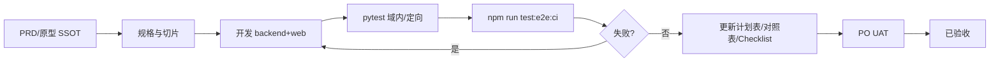

# IMS Agent 交付循环（人类 SSOT）

> **用途**：PO 与 Agent 共认的单切片/回归交付方法论；与 Cursor 规则 [`.cursor/rules/ims-delivery.mdc`](../../.cursor/rules/ims-delivery.mdc) 一致（Agent 侧为精简版，本文档为完整说明）。  
> **最后更新**：2026-10-08

## SSOT 链

| 文档 | 作用 |
|------|------|
| [`IMS-PRD与原型完整性核验-20261001.md`](../产品规划/IMS-PRD与原型完整性核验-20261001.md) | PRD / 菜单 / 原型对齐 |
| [`IMS-Python完整开发计划-20261005.md`](../开发方案/IMS-Python完整开发计划-20261005.md) | 批次与切片序 |
| [`IMS-任务进度计划表.md`](../开发方案/IMS-任务进度计划表.md) | 全局 **#** 看板 |
| [`IMS-Python执行进度-20261006.md`](../开发方案/IMS-Python执行进度-20261006.md) | 模块级做了什么/未做 |
| [`IMS-PRD功能点执行对照表.md`](../开发方案/IMS-PRD功能点执行对照表.md) | 矩阵 · **UAT 建议 / UAT 状态** |
| [`IMS-E2E测试用例Checklist.md`](../测试方案/IMS-E2E测试用例Checklist.md) | Given/When/Then 与 closure 映射 |
| [`IMS-E2E验收策略.md`](../测试方案/IMS-E2E验收策略.md) | smoke vs closure、一键 E2E |
| [`doc/delivery/README.md`](../delivery/README.md) | 模块 Slice Gate（CHECKLIST + TESTCASES） |

## 交付流水线



1. **PRD → 原型**：变更先落 PRD/走查 SSOT，再动代码。  
2. **规范 → 开发**：API 以 `doc/产品规格/**` 为准；后端 Python + 本地 MySQL（ADR-IMS-009）。  
3. **pytest**：新增/变更接口补域内用例；**全量 144 条** 由 PO 在外置单进程环境签收（`ims-backend/scripts/run_pytest_external.bat`），**不在 Cursor 集成终端跑全量并代替 PO 签收**（易被杀、MySQL 1684 并发 DDL）。Agent 可：`collect-only`、单测文件、`_run_targeted_smoke.py` 等。  
4. **E2E**：Agent/CI 跑 `ims-web/scripts/run_e2e.ps1` 或 `npm run test:e2e:ci`（默认 18080 + 6173，`--workers=1`）。  
5. **fix → regress**：失败修复后重跑相关 pytest + **全量 E2E**（或至少受影响 closure + smoke）。  
6. **文档收尾**：计划表 **#**、执行进度、对照表（含 UAT 建议）、Checklist 版本。  
7. **UAT 门禁**：PO 按矩阵 **UAT 建议** 验收，填写 **UAT 状态**；通过后该行才可标 **已验收**。

## 角色分工

| 角色 | 职责 |
|------|------|
| **Agent** | 实现、域内/定向 pytest、跑全量 E2E 并留 `e2e_result.txt` + HTML 报告；更新 SSOT；填对照表 **UAT 建议**（可 UAT / 待补数据 / 仅 API / 阻塞） |
| **PO** | 审 closure 与报告、外置 pytest 全量签收、手工 **UAT**、填 **UAT 状态**（未测 / 通过 / 阻塞）；决定是否提供真实钉钉/Football/生产库等 |
| **开发（同 Agent 或人）** | 新闭环补 Checklist ID，优先扩 `closure-*` |

## 签收定义

### Smoke（不可 PO 签收）

- 文件：`ims-web/e2e/smoke-*.spec.ts`  
- 证明：登录、路由、h1/列表可加载。  
- **不等于** 功能验收。

### Closure（Agent 自动化签收输入）

- 文件：`ims-web/e2e/closure-*.spec.ts`  
- 证明：Checklist 步骤 + **可见 UI**（表格行、tag、toast、下载等）。  
- 映射见 [`IMS-E2E验收策略.md`](../测试方案/IMS-E2E验收策略.md)。
- **纯 UI 门禁（Checklist v2.6.44+ · PO 2026-10-08）**：closure 全链 **禁止 API 种子**（不得 `page.evaluate` 内 `fetch('/admin-api/…')`、不得 Playwright TestClient 直调后端）。前置数据须 **菜单 → 表单/按钮** 创建；UI 点击触发的 `waitForResponse` 读 id/单号 **允许**。见 `ims-web/e2e/closure-helpers.ts` 与 `ims-web/e2e/README.md`。

### 已验收（矩阵级）

同时满足：

1. 对应 Checklist / closure **OK**（若该模块有 closure 要求）；  
2. 最新 **`npm run test:e2e:ci` 全量 PASS**（当前基线见对照表头）；  
3. 对照表 **UAT 状态 = 通过**（PO 填写）。

### UAT（User Acceptance Test）

- **含义**：PO 在真实或约定联调环境下，按 PRD/Checklist 做**业务可接受性**确认（可含：多角色、边界数据、与外部系统联调、390 宽屏等自动化未覆盖项）。  
- **与 E2E 关系**：E2E closure 是 UAT 的**必要非充分**条件；smoke 连必要条件都不算。  
- **Agent 填 UAT 建议**：提示 PO 该模块是否适合立刻 UAT、是否缺数据、是否只能测 API、是否被外部依赖阻塞。  
- **PO 填 UAT 状态**：未测 / 通过 / 阻塞。

## 并行 Subagent

- **允许**：不同模块、无共享 DB compat 顺序、不抢同一计划表 **#** 的独立任务。  
- **禁止**：同一切片「开发未完成就并行写 E2E + 改 compat」；多 Agent 同时外置全量 pytest（1684 风险）。

## 执行前 PO 资源清单

以下依据仓库当前默认（`app/core.py`、`app/dingtalk_crypto.py`、`app/bi_subscribe.py`、`app/football_client.py`、`ims-backend/scripts/init_ims_db.ps1`、`ims-web/playwright.config.ts` 等）整理。**下一切片若不需要真实外部系统，可不问 PO，用默认/桩即可。**

### 已有 / 默认即可（本地闭环）

| 资源 | 说明 |
|------|------|
| **MySQL** | 默认 `127.0.0.1:3306`，用户/密码 `root`/`root`（`IMS_MYSQL_*`）；库 `ims` + `opsbiz`（`IMS_DB` / `IMS_OPS_DB`）。云联调：`IMS_USE_CLOUD_DB=1` 或 `IMS_DATABASE_URL` + PO 本机 `.env`，见 [云MySQL联调](../运维/云MySQL联调.md) |
| **初始化** | `ims-backend/scripts/init_ims_db.ps1`（ORM `create_all` + seed）；已有库升级按需 `db/compat/*.sql` 或 `-ApplyCompat` |
| **API / 前端** | `IMS_PORT` 默认 **18080**；Vite **6173**（PO：5173 占用）；E2E `E2E_BASE_URL` 默认同 6173 |
| **登录** | 种子 **admin / Admin@123**（`main.py` seed；E2E 同）；另 seed **e2e_author**（发布 closure） |
| **JWT** | `IMS_JWT_SECRET` 默认开发值（生产必改） |
| **pytest** | 测试库 `ims_test` / `ims_ops_test`；全量外置 bat，见计划表 **#3 / #7** |
| **Playwright** | `ims-web` 内 `npm run test:e2e:ci`；浏览器可通过项目脚本安装 |

### 可选 / 增强（未配置时的桩行为）

| 资源 | 环境/参数 | 未配置时 |
|------|-----------|----------|
| **BI 钉钉群推送** | 系统参数 **`bi.dingtalk.webhook.url`** > env **`IMS_BI_DINGTALK_WEBHOOK_URL`** | `push-now` **本地桩**：`DING_OK`，`webhookConfigured=false` |
| **组织钉钉回调 / L3** | **主配置**：系统参数 `dingtalk.corpId` / `dingtalk.clientId` / `dingtalk.clientSecret` / `dingtalk.agentId` / `dingtalk.appId` / `dingtalk.callbackToken` / `dingtalk.callbackAesKey` / `dingtalk.l3Enabled`（**系统管理 → 系统参数**，密钥字段 UI 掩码）；**bootstrap**：`ims-backend/.env` 或一次性 `scripts/seed_dingtalk_params_from_env.ps1`（仅 PO 本机，勿提交）> env **`IMS_DINGTALK_*`** | 本地/TestClient 可模拟 `POST /auth/org/event`；**L3 真钉钉** = `dingtalk.l3Enabled=true` 或 `IMS_DINGTALK_L3=1` + 凭证齐全 + `scripts/run_dingtalk_l3.ps1` / `npm run test:e2e:dingtalk` |
| **Football 生产 WebAPI** | 系统参数 **`football.webapiBaseUrl`** > env **`IMS_FOOTBALL_WEBAPI_BASE_URL`**（示例 `https://saas.shenyu.com/`） | 空 → 订单/ROI **桩**、文章 outbox 补偿 |
| **钉钉 SSO** | 参数 `dingtalk.sso.enabled` 默认 false | 走本地用户名密码 |
| **Football 文章同步** | **`IMS_FOOTBALL_WEBAPI_BASE_URL`**；或 **`IMS_FOOTBALL_ARTICLE_STUB`** = success/fail | 未配置 → outbox 补偿、ROI **数据延迟** 提示（见执行进度 W4） |
| **Football 订单/ROI** | 同上 + `IMS_FOOTBALL_TIMEOUT_SEC` | 订单列表 **1232** 类桩行为 |
| **ComfyUI / GPU / 精采 AI** | 批次外或未接 | 内容 AI 生成 **QUEUED 桩**；**ComfyUI/GPU 未做** |
| **生产 DB / 真实 opsbiz 列** | 非本地 | 直播/成本等用本地 ops 表结构；Football/OPS 透传为 P2 |

### 明确问 PO（仅当阻塞下一切片）

在以下情况 **先问 PO**，再承诺「真实联调 E2E / 已验收」：

1. **真实钉钉组织同步（L3）**：在 **系统参数** 填写 **Client ID/Secret**、**corpid**、**AgentId/AppId**、回调 **Token/AES**（勿入 git）；`.env` 仅 bootstrap。组织 **已验收** 需 L3 PASS + PO UAT。若 **Client Secret 曾暴露**，开放平台 **轮换** 后在 UI 更新。**全量通讯录拉取**另需开放平台 **通讯录授权范围**（建议「全部员工」）+ **发布应用**；**50004** = 部门不在授权范围（非接口权限），见 [钉钉通讯录同步说明](../运维/钉钉通讯录同步说明.md)。  
2. **真实 Football member-server**：系统参数 **`football.webapiBaseUrl`**（或 env 回退）→ `https://saas.shenyu.com/`。  
3. **ComfyUI/GPU 生产生成链**：内容 AI 全流程 UAT。  
4. **生产 MySQL/密钥**：非 `root`/默认 JWT 的部署验收。

其余切片（FLOW/PERF/ALERT/S7 closure 等）**默认本地资源即可 UAT**。

---

## 相关命令速查

```powershell
# DB
cd d:\self\sy\IMS系统产品\ims-backend
powershell -NoProfile -File .\scripts\init_ims_db.ps1

# API
powershell -NoProfile -File .\scripts\start_api.ps1 -KillPort

# E2E（推荐）
cd d:\self\sy\IMS系统产品\ims-web
powershell -NoProfile -ExecutionPolicy Bypass -File .\scripts\run_e2e.ps1
# 或
npm run test:e2e:ci

# L3 钉钉组织（需 ims-backend/.env + IMS_DINGTALK_L3=1，不计入 21 spec）
cd d:\self\sy\IMS系统产品\ims-backend
powershell -NoProfile -ExecutionPolicy Bypass -File .\scripts\run_dingtalk_l3.ps1
# 或 ims-web：npm run test:e2e:dingtalk
```

## Agent 自动链（PO 闸口）

- 默认：Agent 按 [计划表](../开发方案/IMS-任务进度计划表.md) **#** 序推进高价值 closure 切片，每切片走完「开发 → pytest 定向 → 全量 E2E → SSOT 收尾」。
- **2026-10-08**：PO（zhang wu）授权 **#53**；#53 收口后曾暂停。**同日续**：**#54+ 自动链已重新启用**（PO 闸口：遇阻塞再问 PO；否则按计划表 **#** 序推进 closure 切片直至 PO 叫停）。
- **2026-10-08（PO）**：**#55 收口后曾暂停自动链**（当时写「不自动链 #56、#57」）。#56 已随同批提交交付。
- **2026-10-08（PO · zhang wu）**：**#57 起自动链恢复**。上述暂停已解除。**#57**（S3 分成审批 → **PAID_OFF** + 台账对账）已合入 main。遇阻塞仍先问 PO。
- **2026-10-08（#58）**：本切片交付 **S4 CORP 冲话费登记 + 凭证门禁**（E2E-S4-05/06）。已合入 main `eb3991d`。**#58 不是**账号流转 / 1021。
- **2026-10-08（#59）**：本切片交付 **S3 FIN 期间结账 → LOCKED + 锁后更正**（E2E-S3-06/07）。已合入 main `6fa2a88`。状态 **开发完成/待 UAT**（PO UAT 未填，不得标已验收）。期间已结账 **1142**（原 1010 已移除）· 成本已核准 **1141** · 锁后更正未批 **1155**。
- **2026-10-08（#60）**：本切片交付 **S4 CORP 账号流转 + 他人领用 1021**（E2E-S4-02/03）。计划表 **开发完成/待UAT**。已合入 main `908bd56`。收回 **1022** 见 **#62**。核对 **1026** 见 **#64**。
- **2026-10-08（#61）**：本切片交付 **S6 证书到期预警**（E2E-S6-02）。T−30 黄 / T−7 红 / T−0 锁定 + 工作台提醒。计划表 **开发完成/待UAT**（PO UAT 未填，不得标已验收）。已合入 main `57169c8`（rebase 自 `908bd56`，含 **#60**）。本片不改账号流转路径。
- **2026-10-08（#62）**：本切片交付 **S4 CORP 收回 → FROZEN**（E2E-S4-04 · 业务码 **1022**）。计划表 **开发完成/待UAT**。已 squash 合入 main `6f59ff6`（基线当时为 `57169c8`，含 **#61**）。种子 `AC-E2E-RECALL`。本片不改 `cert_expire` / 证件到期扫描。解冻回池仍未做。账实核对 **1026** 见 **#64**。
- **2026-10-08（#63）**：本切片交付 **S5 办公设备 领用→使用→归还→报废**（E2E-S5-02）。计划表 **开发完成/待UAT**（PO UAT 未填，不得标已验收）。已合入 main `8f9a224`（rebase 自 `6f59ff6`，含 **#62**）。**#57/#58 已完成**；**#59–#62** 保持开发完成/待UAT。本片不改 `acct_flow` / 账号收回与流转，也不改 `cert_expire`。采购导入与穿透 **1013** 仍未做。
- **2026-10-08（#64）**：本切片交付 **S4 账实核对**（E2E-S4-07 · 业务码 **1026**）。1.99% 通过，2.00% 返回 **1026** 并生成财务核查工单。计划表 **开发完成/待UAT**。已合入 main `a90e6c5`（基线当时 `8f9a224`，含 **#63**）。种子 `AC-E2E-RECON`。**#59–#63** 保持开发完成/待UAT。本片不改 `asset_ledger` / `device.vue`。解冻回池见 **#66**。
- **2026-10-08（#66）**：本切片交付 **S4 管理员解冻回池**（`FROZEN → IN_POOL` · 时间线 **UNFREEZE**）。计划表 **开发完成/待UAT**（PO UAT 未填，不得标已验收）。已合入 main `5357647`（基线当时 `a90e6c5`，含 **#64**）。种子 `AC-E2E-UNFREEZE`。`test_acct_checkout.py` **6 passed** · collect **179** · Checklist **v2.6.75** · 当时 E2E **59/59 PASS**。本片不改 `asset_ledger` / `device.vue` / 穿透路径，也不做 sysTenant。**#59–#64** 保持开发完成/待UAT。
- **2026-10-08（#65）**：本切片交付 **S5 资产穿透**（E2E-S5-03/04 · 5 层内返回链路 · 超出 **1013** · 使用人三态在用/已归还/已报废）。计划表 **开发完成/待UAT**（PO UAT 未填，不得标已验收）。已合入 main `6268cc9`（合并当时的 main `5357647`，含 **#66**）。`test_asset_penetrate.py` **2 passed** · collect **181** · Checklist **v2.6.76** · E2E **61/61 PASS**。**#57/#58 已完成**；**#59–#64/#66** 保持开发完成/待UAT。本片不改 `acct_flow` / 解冻与账实核对，也不做 sysTenant。采购导入仍未做。
- **2026-10-08（#67）**：本切片交付 **S6 证件查看频次锁**（E2E-S6-04 · 同一证件 1 小时第 11 次 **1035**）。计划表 **开发完成/待UAT**（PO UAT 未填，不得标已验收）。rebase 到 main `6268cc9`（含 **#65** 与 **#66**）。种子 `E2E-Cert-Freq`。`test_cert_view_freq.py` **1 passed** · collect **182** · Checklist **v2.6.77** · E2E **62/62 PASS**。本片不改 `asset_penetrate` / `device.vue`，也不改 `acct_flow` / `account.vue`，也不做 sysTenant。换证 / LIVE **1045** 未做。**#59–#66** 保持开发完成/待UAT。父代理继续后续 `#`，除非 PO 再暂停。

## 维护

- 方法论变更：同步改 **本文** + **`.cursor/rules/ims-delivery.mdc`** + 对照表图例。  
- 新 closure：更新 Checklist、[E2E 验收策略](../测试方案/IMS-E2E验收策略.md)、对照表 E2E 列与 UAT 建议。
